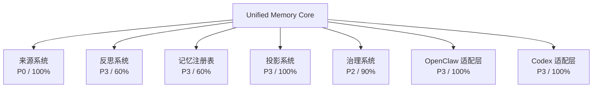

# 项目进展

## 一眼总览
| 问题 | 当前答案 |
| --- | --- |
| 项目 | `Unified Memory Core` |
| 层级 | `大型` |
| 当前判断 | post-stage10-adoption-closeout 已进入执行；当前主战场是 来源系统，正在推进 hold-stage10-adoption-proof-stable。 |
| 当前阶段 | post-stage10-adoption-closeout |
| 当前主战场 | `来源系统` |
| 当前切片 | hold-stage10-adoption-proof-stable |
| 当前执行线 | Stage 7 / 8 / 9 / 10 都已关闭；当前进入维护态，继续保持 Docker 为默认 hermetic A/B 面与 Stage 10 shortest-path/shared-foundation proof 持续为绿 |
| 执行进度 | `0 / 4` |
| 架构信号 | `黄色` |
| 直接价值 | 让输入来源更稳定进入系统，而不是散落在各处。 |
| 当前主要风险 | raw `openclaw memory search` transport 仍是显式 watchlist：`3/8 raw ok`，其余为 `4` 条 `missing_json_payload` 与 `1` 条 `empty_results` |

## 当前定位
| 项目位置 | 当前值 | 说明 | 链接 |
| --- | --- | --- | --- |
| 当前阶段 | post-stage10-adoption-closeout | 当前所处的大阶段 | [路线图当前阶段](/Users/redcreen/Project/unified-memory-core/docs/roadmap.zh-CN.md:7) |
| 当前切片 | hold-stage10-adoption-proof-stable | 当前真正推进的工作单元 | [当前切片对应位置](/Users/redcreen/Project/unified-memory-core/docs/workstreams/project/roadmap.zh-CN.md:23) |
| 当前执行线 | Stage 7 / 8 / 9 / 10 都已关闭；当前进入维护态，继续保持 Docker 为默认 hermetic A/B 面与 Stage 10 shortest-path/shared-foundation proof 持续为绿 | 这一轮长任务的人话说明 | 暂无 |
| 当前模块 | `来源系统` | 当前主战场 | 暂无 |
| 总路线图 | `docs/roadmap` | 项目总阶段和 now/next/later | [docs/roadmap](/Users/redcreen/Project/unified-memory-core/docs/roadmap.zh-CN.md) |
| 工作流路线图 | `project roadmap` | 当前工作流与焦点位置 | [project roadmap](/Users/redcreen/Project/unified-memory-core/docs/workstreams/project/roadmap.zh-CN.md) |

## 全局视角
| 区域 | 当前状态 | 当前焦点 | 退出条件 |
| --- | --- | --- | --- |
| 项目整体 | post-stage10-adoption-closeout | hold-stage10-adoption-proof-stable | 在不丢失模块视角和治理清晰度的前提下推进当前切片 |

## 当前长任务
| 项目 | 当前值 |
| --- | --- |
| 长任务名称 | hold-stage10-adoption-proof-stable |
| 长任务目标 | Stage 7 / 8 / 9 / 10 都已关闭；当前进入维护态，继续保持 Docker 为默认 hermetic A/B 面与 Stage 10 shortest-path/shared-foundation proof 持续为绿 |
| 执行进度 | `0 / 4` |
| 当前结论 | 当前切片已经推进到当前检查点 |
| 是否存在 blocker | raw `openclaw memory search` transport 仍是显式 watchlist：`3/8 raw ok`，其余为 `4` 条 `missing_json_payload` 与 `1` 条 `empty_results` |
| 下一步性质 | 保持 `npm run umc:stage10 -- --format markdown` 持续为绿。 |

## 当前任务板
| 任务 ID | 类型 | 状态 | 任务内容 |
| --- | --- | --- | --- |
| EL-1 | 主线 | 待完成 | shorten install / bootstrap / verify into one clear shortest operator path |
| EL-2 | 主线 | 待完成 | add package / startup / first-run cost to the `light and fast` evidence surface |
| EL-3 | 主线 | 待完成 | publish stronger Codex shared-foundation proof |
| EL-4 | 主线 | 待完成 | publish clearer multi-instance shared-memory operator proof |

## 架构监督
| 项目 | 当前值 |
| --- | --- |
| 信号 | `黄色` |
| 根因假设 | 当前最大的风险不再是“能力没做出来”，而是 Stage 10 已经完成后，如果文档与控制面继续停在 `121-126`，维护者会误以为这条线仍未完成 |
| 正确落层 | roadmap, development plan, architecture docs, runtime experiment boundary, release-preflight evidence, control surface |
| 信号依据 | 当前仍记录着 blocker 或架构风险 |
| 自动触发 | 当前没有自动触发 |
| 升级门 | `提醒后继续` |
| 升级原因 | 当前方向可以继续，但监督状态需要保持可见 |

## 战略视角
| 维度 | 当前值 |
| --- | --- |
| 当前战略方向 | 保持 post-Stage-5 路线图状态对齐 |
| 当前状态 | `活跃` |
| 为什么现在做 | 保持 post-Stage-5 的 operator baseline、project/workstream roadmap 摘要和 canonical-root policy 同时稳定 |
| 系统可自动提出 | roadmap 重排建议；治理 / 架构专项插入建议；... |
| 必须人类审批 | 业务方向变化；兼容性承诺；... |
| 下一战略检查 | 确认 roadmap、development plan、当前切片和 Next 3 仍在同一条主线里。；判断当前 blocker 或重复修补是否已经需要插入治理 / 架构专项。；... |

## 程序编排视角
| 维度 | 当前值 |
| --- | --- |
| 当前程序方向 | 保持 post-Stage-5 路线图状态对齐 |
| 当前状态 | `活跃` |
| 为什么现在做 | 保持 post-Stage-5 的 operator baseline、project/workstream roadmap 摘要和 canonical-root policy 同时稳定 |
| 活跃工作流 | primary delivery line；control truth and docs alignment；... |
| 当前编排序列 | 继续当前 active slice 与当前执行线；保持 plan / status / docs / handoff 同步；... |
| 当前执行器输入 | PTL；delivery worker；... |
| Supporting Backlog | maintainer-facing polish；doc-only tidy-up；... |
| 下一程序检查 | 确认当前 active slice、执行线和 supporting backlog 仍保持同一套排序真相。；判断哪些 sidecar 工作可以并入下个 checkpoint，哪些必须继续留在队列里。；... |

## 程序编排工作流
| 工作流 | 范围 | 状态 | 优先级 | 当前焦点 | 下一检查点 |
| --- | --- | --- | --- | --- | --- |
| primary delivery line | 当前 active slice 与当前执行线 | 活跃 | `P0` | 保持当前主线持续推进 | 到达下一个 checkpoint 并刷新真相 |
| control truth and docs alignment | plan / status / roadmap / development plan / docs | 活跃 | `P1` | 保持控制面、文档与当前执行同步 | 避免恢复真相漂移 |
| validation and release gates | tests / gate / release-facing evidence | 活跃 | `P1` | 保持验证入口与当前主线对齐 | 下一轮变更前保持为绿 |
| supporting backlog routing | 暂不进入主线但需要保留可见性的议题 | 活跃 | `P2` | 记录但不无计划回流主线 | 只有证据充分时才升级 |

## 长期交付视角
| 维度 | 当前值 |
| --- | --- |
| 当前长期交付方向 | 收口阶段 / Stage 5 已完成 |
| 当前状态 | `活跃` |
| 为什么现在做 | 保持 post-Stage-5 的 operator baseline、project/workstream roadmap 摘要和 canonical-root policy 同时稳定 |
| Checkpoint 节奏 | 对齐方向与输入；推进执行线；... |
| 自动继续边界 | 已批准方向内的实现与验证；黄色信号但可在既有方向内收口；... |
| 升级时机 | 开始新一轮长任务前；每轮验证之后；... |
| 执行器监督循环 | PTL；delivery worker；... |
| Backlog 回流规则 | follow-up polish；docs-only tidy-up；... |
| 下一长期交付检查 | 确认每轮 checkpoint 都会刷新 status / progress / continue / handoff，而不是只更新其中一部分。；继续判断当前 gate 是自动继续、提醒后继续，还是已经需要升级给人类。；... |

## 长期交付检查点
| 顺序 | 检查点 | 发生什么 | Owner | 什么时候 |
| --- | --- | --- | --- | --- |
| 1 | 对齐方向与输入 | 读取 strategy / program board / plan / status，确认当前工作流和 checkpoint 目标 | supervisor | 每轮开始前 |
| 2 | 推进执行线 | 执行当前切片，保持任务板、验证入口和控制面一致 | delivery worker | 每轮主体 |
| 3 | 运行验证并刷新真相 | 运行 gate / tests，并刷新 status / progress / continue / handoff | delivery worker | 每轮验证后 |
| 4 | 决定继续 / 升级 / 暂停 | 根据信号、blocker 和升级边界决定下一轮动作 | supervisor | 每轮收口时 |
| 5 | 记录 rollout 摩擦 | 把跨 repo 的真实摩擦、supporting backlog 回流建议和下一里程碑候选沉淀出来 | supervisor + docs-and-release | 每个 adoption checkpoint |

## PTL 监督视角
| 维度 | 当前值 |
| --- | --- |
| 当前 PTL 方向 | 收口阶段 / Stage 5 已完成 |
| 当前状态 | `活跃` |
| 为什么现在做 | 保持 post-Stage-5 的 operator baseline、project/workstream roadmap 摘要和 canonical-root policy 同时稳定 |
| 监督触发 | 周期巡检；worker 停下；... |
| 常驻职责 | PTL；delivery worker；... |
| 继续 / 重排 / 升级矩阵 | 当前方向内、验证通过、无新 blocker；黄色信号但仍在既定方向内；... |
| 当前监督检查 | 监督输入完整；继续边界清楚；... |
| 下一 PTL 检查 | 确认 worker 停下后，PTL 能从 durable 真相恢复当前工作，而不是退回聊天记忆。；继续观察 handoff / re-entry 是否还暴露新的 durable 缺口，需要回写到监督契约。；... |

## Worker 接续视角
| 维度 | 当前值 |
| --- | --- |
| 当前 handoff 方向 | 收口阶段 / Stage 5 已完成 |
| 当前状态 | `活跃` |
| 为什么现在做 | 保持 post-Stage-5 的 operator baseline、project/workstream roadmap 摘要和 canonical-root policy 同时稳定 |
| handoff 触发 | checkpoint 完成；超时 / 长时间无输出；... |
| 恢复源 | `.codex/status.md`；`.codex/plan.md`；... |
| 接续动作 | 继续同一 worker；换 worker 接手；... |
| 回流规则 | 仍是主线且边界没变；当前不该继续但仍有价值；... |
| 升级边界 | 方向未变，技术边界清楚；只是需要换 worker 或等下一 checkpoint；... |
| 下一 handoff 检查 | 确认 worker 停下后的接续、回流和升级都能靠 durable 真相完成。；继续观察哪些 handoff 场景会反复出现，再决定是否需要更强的调度层。；... |

## 当前系统能做什么
| 能力 / 结论 | 当前状态 | 来源 |
| --- | --- | --- |
| 面向高价值记忆问题的事实优先上下文组装 | 已可直接使用 | [README](/Users/redcreen/Project/unified-memory-core/README.zh-CN.md) |
| 把 durable source 瘦身和长对话 working-set 裁剪收成“逐轮 context 优化”主线 | 已可直接使用 | [README](/Users/redcreen/Project/unified-memory-core/README.zh-CN.md) |
| 对规则、身份、偏好等稳定信号的优先级控制 | 已可直接使用 | [README](/Users/redcreen/Project/unified-memory-core/README.zh-CN.md) |
| 以治理和策略代替“所有召回结果一视同仁” | 已可直接使用 | [README](/Users/redcreen/Project/unified-memory-core/README.zh-CN.md) |
| 一条已经落地基线的受治理 self-learning 路径，覆盖 声明式来源、reflection、候选升级 和 export / audit 面 | 已可直接使用 | [README](/Users/redcreen/Project/unified-memory-core/README.zh-CN.md) |
| 面向 OpenClaw、Codex 和后续消费者的 export / projection 层 | 已可直接使用 | [README](/Users/redcreen/Project/unified-memory-core/README.zh-CN.md) |
| 通过 `manual`、`file`、`directory`、`conversation` 这些 声明式来源 接入学习输入 | 当前阶段已落地 | [README / 当前阶段基线](/Users/redcreen/Project/unified-memory-core/README.zh-CN.md:300) |
| 结构化的 reflection / daily reflection 管线，会产出 候选 artifacts | 当前阶段已落地 | [README / 当前阶段基线](/Users/redcreen/Project/unified-memory-core/README.zh-CN.md:300) |
| 重复信号 和显式 `remember this / 记住这个` 检测 | 当前阶段已落地 | [README / 当前阶段基线](/Users/redcreen/Project/unified-memory-core/README.zh-CN.md:300) |
| candidate -> stable 的升级基线，以及对应 决策轨迹 | 当前阶段已落地 | [README / 当前阶段基线](/Users/redcreen/Project/unified-memory-core/README.zh-CN.md:300) |

## 项目控制能力
| 能力 | 状态 |
| --- | --- |
| 恢复当前状态与下一步 | 已就绪 |
| 长任务执行线与可见任务板 | 已就绪 |
| 默认架构监督与升级 gate | 已就绪 |
| 文档整改与 Markdown 治理 | 已就绪 |
| 开发日志索引与自动沉淀 | 已就绪 |
| 战略评估层与 review contract | 已就绪 |
| 程序编排层与 durable program board | 已就绪 |
| 长期受监督交付层与 checkpoint rhythm | 已就绪 |
| PTL 监督环与持续巡检 contract | 已就绪 |
| worker 接续与回流 contract | 已就绪 |
| 统一工具前门、版本 preflight 与结构化入口 contract | 已就绪 |
| 模块视角进展面板 | 已就绪 |
| 公开文档中英文切换 | 已就绪 |

## 人工窗口
| 命令 | 用途 |
| --- | --- |
| `项目助手 菜单` | 查看主入口和当前可用窗口 |
| `项目助手 进展` | 查看完整项目进展面板 |
| `项目助手 架构` | 单独拉出架构监督 / 根因 / 复盘入口 |
| `项目助手 开发日志` | 查看或补记关键开发结论 |

## 模块总览
| 指标 | 当前值 |
| --- | --- |
| 官方模块数 | `7` |
| 平均完成度 | `87%` |
| 当前投入分布 | 维护:4, 稳定:1, 形成中:2 |
| 优先级说明 | `P0` 当前主战场，`P1` 下一批高优先级，`P2` 持续治理，`P3` 稳定维护，`P4` 观察/维护 |

## 模块视角
| 模块 | 优先级 | 当前状态 | 完成度 | 已有能力 | 剩余步骤 | 下一检查点 |
| --- | --- | --- | --- | --- | --- | --- |
| 来源系统 | P0 | stage5-complete / stable | 100% (维护) | 来源契约与清单基线; 本地优先来源注册与标准化; ... | 保持 source replay / manifest shape 稳定，不为单个 consumer 做特例。; 继续让 mixed-source Stage 5 acceptance 保持绿色。; ... | Keep `umc:stage5` proving mixed-source acceptance without regressions. |
| 反思系统 | P3 | stage5-compatible / stable | 60% (形成中) | reflection 契约基线; 候选提取与 reflection 输出; ... | Keep promotion / decay review semantics readable in post-Stage-5 maintenance.; Add future feedback hooks only through governed artifacts, not hidden consumer-local state.; ... | Keep proving that no reflection-local shortcut is needed outside governed artifacts. |
| 记忆注册表 | P3 | stable / policy-fixed | 60% (形成中) | registry 持久化基线; source/candidate/stable artifact 分层; ... | Keep canonical root active as the default operator target.; Preserve the explicit rule that legacy divergence is advisory when runtime already resolves to canonical.; ... | Keep `registry inspect` at `operatorPolicy = adopt_canonical_root` or `canonical_root_active`; do not let later work reintroduce legacy-mirroring as a hard requirement. |
| 投影系统 | P3 | stage5-complete / stable | 100% (维护) | projection 导出契约基线; 可见性过滤; ... | Keep consumer-specific projection differences explicit and comparable.; Avoid pushing policy behavior back into adapters outside export boundaries.; ... | Keep `export reproducibility` as a stable regression surface without changing the contract boundary. |
| 治理系统 | P2 | governing / stage5-complete | 90% (稳定) | 正式审计、重复审计与冲突审计; governance cycle 与 repair/replay 基元; ... | Keep lifecycle, policy, maintenance, and split-readiness reports readable and durable.; Decide whether high-frequency lifecycle / policy outputs need a clearer durable/generated split.; ... | Carry current lifecycle + policy + maintenance reports forward as the required post-Stage-5 evidence surface. |
| OpenClaw 适配层 | P3 | stage4-complete / stable | 100% (维护) | OpenClaw 适配层 runtime 集成; memory-search A-E 阶段基线; ... | 让 OpenClaw runtime 的读写与未来宿主中立 canonical registry root 对齐.; Keep supporting context clean while Stage 4 compact-mode policy stays live.; ... | Keep live OpenClaw behavior stable while Stage 4 policy guidance becomes a fixed regression surface. |
| Codex 适配层 | P3 | stage4-complete / stable | 100% (维护) | Codex 适配层 runtime 集成基线; OpenClaw / Codex / governance 面的兼容性覆盖; ... | 让 Codex 收敛到和 OpenClaw 相同的 canonical registry root.; Keep task-side policy consumption on governed exports, not Codex-local heuristics.; ... | Prove that Codex can keep reading the same governed policy memory as root policy converges. |

## 模块位置图

## 横切工作流
| 工作流 | 当前切片 | 下一检查点 |
| --- | --- | --- |
| 核心产品 | Stage 5 complete; keep release-grade evidence and root policy stable | 1. 保持 `umc:release-preflight`、`umc:openclaw-install-verify`、`umc:openclaw-itest`、`umc:stage5` 持续为绿 |
| 宿主中立记忆 | cutover policy explicit; move to canonical-root monitoring | 1. 持续观察 `registry inspect` 是否保持 `operatorPolicy = adopt_canonical_root |
| 记忆治理 | governance signals + promotion helper 已稳定 | 1. 保持 `memory-search governance` 质量指标稳定 |
| 插件运行时 | 以 clean assembly 方式扩稳定事实 | 1. 扩下一批稳定事实 / 规则 |

## 接下来要做什么
| 下一步 | 为什么做 | 对应入口 |
| --- | --- | --- |
| 保持 `npm run umc:stage10 -- --format markdown` 持续为绿。 | 保持当前阶段继续收敛 | [状态](/Users/redcreen/Project/unified-memory-core/.codex/status.md) |
| 保持 Docker hermetic baseline、Stage 7、Stage 8、Stage 9、Stage 10 的证据面一致。 | 避免方向漂移并保持验证同步 | [状态](/Users/redcreen/Project/unified-memory-core/.codex/status.md) |
| 只有在新的明确产品目标出现时，才打开新的编号阶段。 | 在继续扩展前先确认门禁与治理决策 | [状态](/Users/redcreen/Project/unified-memory-core/.codex/status.md) |
| 如果要看完整全局视图 | 当前已经是完整项目进展面板 | `项目助手 进展` |
