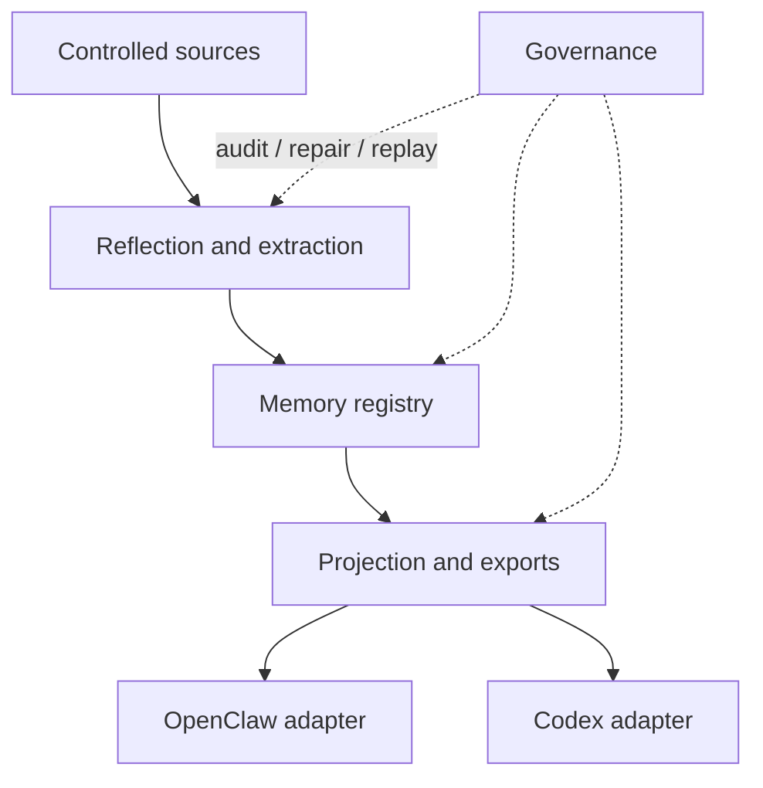
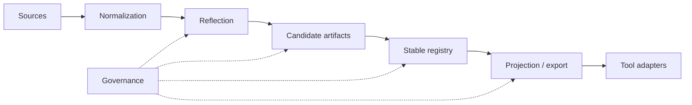

# Architecture

[English](architecture.md) | [中文](architecture.zh-CN.md)

## Purpose and Scope

This page is the durable architecture wrapper for the repo. It summarizes the stable system shape and points to deeper module documents without turning into a session log.

`Unified Memory Core` is the shared-memory product layer. The current repo also ships the OpenClaw-facing runtime adapter `unified-memory-core` and a first-class Codex adapter path.

## System Context

Stable boundaries:

- product core owns source ingestion, reflection, registry, projection, and governance
- adapters own consumer-specific retrieval, assembly, and export consumption
- governance remains cross-cutting and should keep artifacts repairable and replayable

## Current Flagship Tracks

At this point the repo has two top-priority milestone tracks:

1. `self-learning`
2. `context optimization`

The second track is now first-class. It is not just an adapter polish item.

From the roadmap perspective, it now lives inside a new umbrella stage:

- `Stage 11: Context Minor GC And Codex Integration`

That boundary matters:

- Stage 6 / 7 / 9 remain completed historical OpenClaw-side themes
- `Stage 11` owns only the remaining context / Minor GC work
- the most important new item is the `Codex` bridge, not reopening OpenClaw-side baseline design

Context optimization currently means several coordinated architecture surfaces:

- durable-source slimming and budgeted assembly
  - [reference/unified-memory-core/architecture/context-slimming-and-budgeted-assembly.md](reference/unified-memory-core/architecture/context-slimming-and-budgeted-assembly.md)
- `Context Minor GC`
  - [reference/unified-memory-core/architecture/context-minor-gc.md](reference/unified-memory-core/architecture/context-minor-gc.md)
  - it turns hot-path working-set management, task-state carry-forward, `direct / local_complete / full_assembly` routing, and “compat / compact as background-only safety net” into one explicit mainline
- dialogue working-set pruning for long multi-topic sessions
  - [reference/unified-memory-core/architecture/dialogue-working-set-pruning.md](reference/unified-memory-core/architecture/dialogue-working-set-pruning.md)
- plugin-owned `memory + context decision overlay`
  - [reference/unified-memory-core/architecture/plugin-owned-context-decision-overlay.md](reference/unified-memory-core/architecture/plugin-owned-context-decision-overlay.md)

Current state:

- Stage 6 runtime shadow integration is already landed
- Stage 6 remains `default-off` and shadow-only as the measurement surface
- Stage 9 guarded smart-path is also closed, but stays `default-off` / opt-in only
- the public workstream name for this turn-by-turn context path is now `Context Minor GC`
- the new umbrella stage is `Stage 11`: keep the OpenClaw baseline green and bring the same context decision contract into Codex
- the preferred implementation path is no longer an OpenClaw patch first; it is to turn the `memory + context decision` transport / scorecard / guarded seam into a cross-host contract
- the daily-product target is now explicit: normal sessions should stay sustainable through per-turn context management instead of treating compat / compact as a normal hot-path dependency; compat / compact remains only a nightly or background safety net

## Current Product Promises

The architecture should now be reviewed against three user-facing promises:

1. `Light and fast`
   - owned mainly by the OpenClaw adapter, the two context-optimization tracks, and the release / install / hermetic-eval workflows
   - current landed capability: fact-first assembly, runtime working-set shadow instrumentation, release-preflight, and Docker hermetic eval
2. `Smart`
   - owned by the Source System, Reflection System, Memory Registry, and the selective context-decision layer
   - current landed capability: realtime `memory_intent` ingestion, nightly reflection, promotion / decay, and the working-set shadow path
3. `Reassuring`
   - owned by the standalone runtime, CLI / governance tooling, shared contracts, projection layer, registry root policy, and both adapters
   - current landed capability: inspect / audit / replay / repair / rollback flows, one canonical governed memory core, and OpenClaw / Codex consumption paths

## Product North Star And Engineering Translation

> Simple to install, smooth to use, light and fast to run, smart to remember, easy to maintain.

Translated into architecture constraints:

- `light and fast`
  - adapter seams, default config, install size, prompt thickness, main-path latency, and runtime footprint all belong to the same target
  - the desired runtime shape is closer to “`Context Minor GC` plus low-frequency full sweep”: prune the working set continuously during normal use, and reserve compat / compact for low-frequency background safety passes
- `smart`
  - durable memory, realtime learning, working-set pruning, budgeted assembly, and abstention guardrails should reinforce each other instead of drifting apart
- `reassuring`
  - critical behavior stays visible through inspect / audit / replay / rollback / hermetic eval / shared registry surfaces

## Current Strengths And Weak Spots

Looking at the current architecture and evidence surface:

- strengths:
  - the `reassuring` operator surface is already fairly complete
  - the `smart` self-learning backbone is already real
  - context optimization now has explicit boundaries instead of drifting as a report-only idea
- weak spots:
  - `light and fast` first needs a thinner per-turn context package because Stage 6 is still only a measurement layer; manual install wiring and unstable hermetic answer paths are the next problems after that
  - `smart` is still shadow-first rather than a default experience
  - `reassuring` still needs stronger Codex / multi-instance product evidence

So the architecture-level guardrails now matter most in three ways:

1. finish context loading optimization as a formal mainline instead of leaving it as scattered shadow evidence
   - one exit signal should be that long daily conversations can usually continue without needing compat / compact as the normal escape hatch
2. do not let `smart` degrade into more rules and heavier call chains
3. do not let stronger capability break the `light and fast` promise; install simplification still matters, but it should not outrank context optimization right now
4. do not leave the `reassuring` shared-core story at boundary design without stronger product proof

## Module Inventory

| Module | Responsibility | Key Interfaces |
| --- | --- | --- |
| Source System | controlled ingestion, normalization, replayable source artifacts | [src/unified-memory-core/source-system.js](../src/unified-memory-core/source-system.js) |
| Reflection System | candidate extraction, daily reflection, learning preparation | [src/unified-memory-core/reflection-system.js](../src/unified-memory-core/reflection-system.js), [src/unified-memory-core/daily-reflection.js](../src/unified-memory-core/daily-reflection.js) |
| Memory Registry | source, candidate, stable artifacts and decision trail | [src/unified-memory-core/memory-registry.js](../src/unified-memory-core/memory-registry.js) |
| Projection System | export shaping, visibility filtering, consumer projections | [src/unified-memory-core/projection-system.js](../src/unified-memory-core/projection-system.js) |
| Governance System | audit, repair, replay, diff, regression surfaces | [src/unified-memory-core/governance-system.js](../src/unified-memory-core/governance-system.js) |
| OpenClaw Adapter | OpenClaw-specific retrieval policy and context assembly | [src/openclaw-adapter.js](../src/openclaw-adapter.js) |
| Codex Adapter | Codex-facing memory projection and compatibility path | [src/codex-adapter.js](../src/codex-adapter.js) |

Official module ownership and file boundaries live in [module-map.md](module-map.md).

## Core Flow

## Interfaces and Contracts

The most important stable contracts are:

- shared artifact and namespace contracts: [src/unified-memory-core/contracts.js](../src/unified-memory-core/contracts.js)
- OpenClaw-facing runtime boundary: [src/openclaw-adapter.js](../src/openclaw-adapter.js)
- Codex-facing runtime boundary: [src/codex-adapter.js](../src/codex-adapter.js)
- standalone runtime and CLI boundary: [src/unified-memory-core/standalone-runtime.js](../src/unified-memory-core/standalone-runtime.js), [scripts/unified-memory-core-cli.js](../scripts/unified-memory-core-cli.js)

## State and Data Model

The durable artifact stack is:

- source artifacts
- candidate artifacts
- stable artifacts
- projection/export artifacts
- governance findings and repair actions

This keeps the system traceable and allows replay or repair instead of silent mutation.

## Operational Concerns

- `local-first` execution remains the current baseline
- contracts should stay `network-ready`, not `network-required`
- governance outputs must stay readable enough to support promotion and smoke-gate decisions
- adapters should not absorb product-core logic that belongs in the shared modules
- context-decision logic should not drift into a growing hardcoded rule table; the preferred next direction is a bounded LLM-led decision surface with explicit hard safety guardrails

## Tradeoffs and Non-Goals

- this repo does not try to replace OpenClaw builtin long memory end to end
- current durable docs summarize the stable shape; live status belongs in `.codex/*`
- future shared-service or runtime-API phases stay deferred until the current product baseline is hardened

## Related ADRs

- [ADR index](adr/README.md)
- [Top-level system architecture](workstreams/system/architecture.md)
- [Detailed architecture map](reference/unified-memory-core/architecture/README.md)
- [Deployment topology](reference/unified-memory-core/deployment-topology.md)
