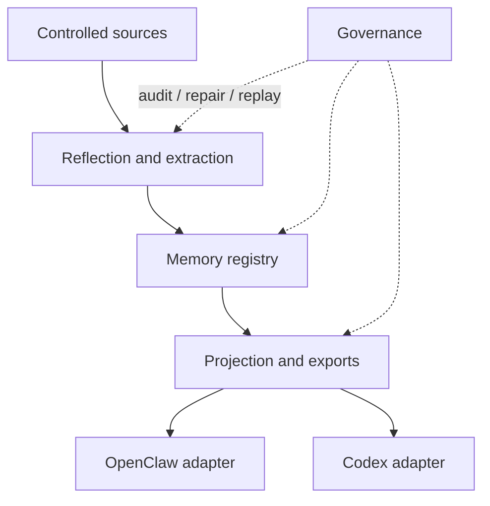
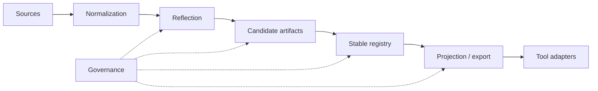

# Architecture

[English](architecture.md) | [中文](architecture.zh-CN.md)

## Purpose and Scope

This page is the durable architecture wrapper for the repo. It summarizes the stable system shape and points to deeper module documents without turning into a session log.

`Unified Memory Core` is the shared-memory product layer. The current repo also ships the OpenClaw-facing runtime adapter `unified-memory-core` and a first-class Codex adapter path.

## System Context

Stable boundaries:

- product core owns source ingestion, reflection, registry, projection, and governance
- adapters own consumer-specific retrieval, assembly, and export consumption
- governance remains cross-cutting and should keep artifacts repairable and replayable

## Module Inventory

| Module | Responsibility | Key Interfaces |
| --- | --- | --- |
| Source System | controlled ingestion, normalization, replayable source artifacts | [src/unified-memory-core/source-system.js](../src/unified-memory-core/source-system.js) |
| Reflection System | candidate extraction, daily reflection, learning preparation | [src/unified-memory-core/reflection-system.js](../src/unified-memory-core/reflection-system.js), [src/unified-memory-core/daily-reflection.js](../src/unified-memory-core/daily-reflection.js) |
| Memory Registry | source, candidate, stable artifacts and decision trail | [src/unified-memory-core/memory-registry.js](../src/unified-memory-core/memory-registry.js) |
| Projection System | export shaping, visibility filtering, consumer projections | [src/unified-memory-core/projection-system.js](../src/unified-memory-core/projection-system.js) |
| Governance System | audit, repair, replay, diff, regression surfaces | [src/unified-memory-core/governance-system.js](../src/unified-memory-core/governance-system.js) |
| OpenClaw Adapter | OpenClaw-specific retrieval policy and context assembly | [src/openclaw-adapter.js](../src/openclaw-adapter.js) |
| Codex Adapter | Codex-facing memory projection and compatibility path | [src/codex-adapter.js](../src/codex-adapter.js) |

Official module ownership and file boundaries live in [module-map.md](module-map.md).

## Core Flow

## Interfaces and Contracts

The most important stable contracts are:

- shared artifact and namespace contracts: [src/unified-memory-core/contracts.js](../src/unified-memory-core/contracts.js)
- OpenClaw-facing runtime boundary: [src/openclaw-adapter.js](../src/openclaw-adapter.js)
- Codex-facing runtime boundary: [src/codex-adapter.js](../src/codex-adapter.js)
- standalone runtime and CLI boundary: [src/unified-memory-core/standalone-runtime.js](../src/unified-memory-core/standalone-runtime.js), [scripts/unified-memory-core-cli.js](../scripts/unified-memory-core-cli.js)

## State and Data Model

The durable artifact stack is:

- source artifacts
- candidate artifacts
- stable artifacts
- projection/export artifacts
- governance findings and repair actions

This keeps the system traceable and allows replay or repair instead of silent mutation.

## Operational Concerns

- `local-first` execution remains the current baseline
- contracts should stay `network-ready`, not `network-required`
- governance outputs must stay readable enough to support promotion and smoke-gate decisions
- adapters should not absorb product-core logic that belongs in the shared modules

## Tradeoffs and Non-Goals

- this repo does not try to replace OpenClaw builtin long memory end to end
- current durable docs summarize the stable shape; live status belongs in `.codex/*`
- future shared-service or runtime-API phases stay deferred until the current product baseline is hardened

## Related ADRs

- [ADR index](adr/README.md)
- [Top-level system architecture](../system-architecture.md)
- [Detailed architecture map](unified-memory-core/architecture/README.md)
- [Deployment topology](unified-memory-core/deployment-topology.md)
