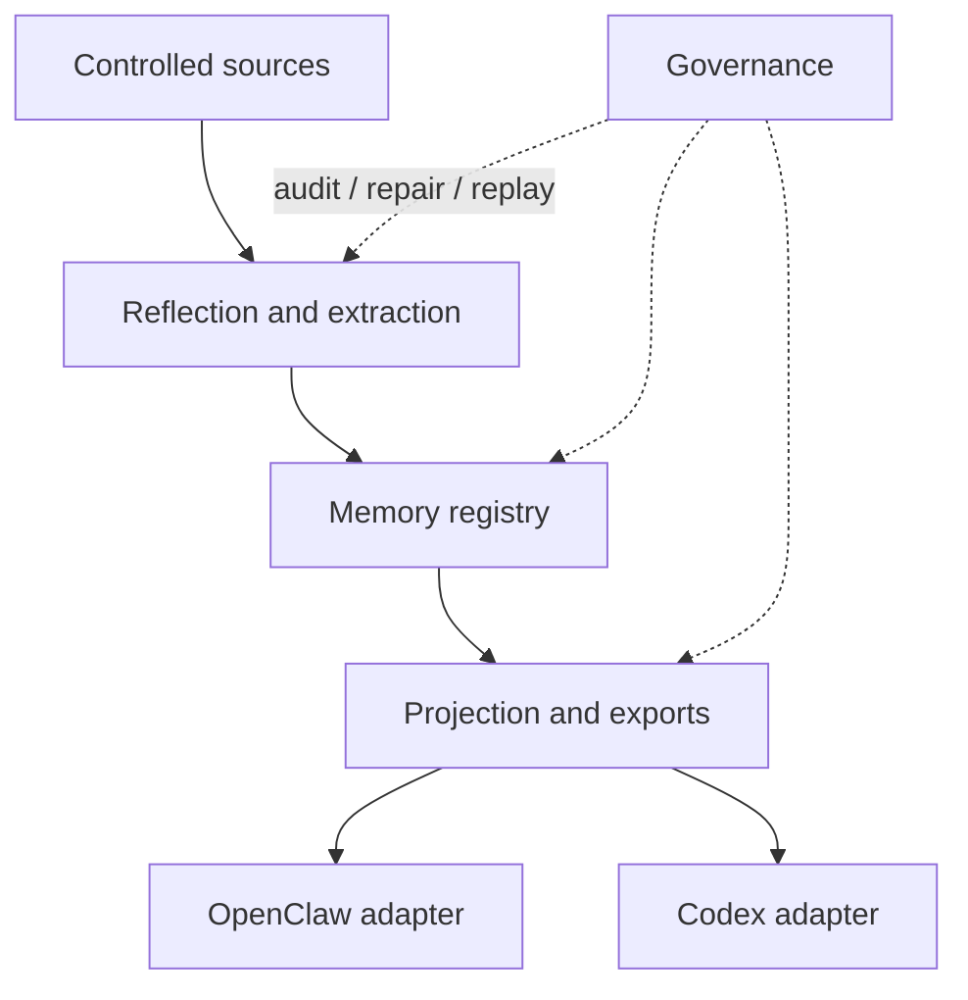
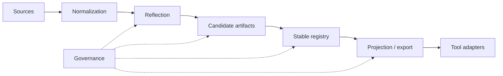

# Architecture

[English](architecture.md) | [中文](architecture.zh-CN.md)

## Purpose and Scope

This page is the durable architecture wrapper for the repo. It summarizes the stable system shape and points to deeper module documents without turning into a session log.

`Unified Memory Core` is the shared-memory product layer. The current repo also ships the OpenClaw-facing runtime adapter `unified-memory-core` and a first-class Codex adapter path.

## System Context

Stable boundaries:

- product core owns source ingestion, reflection, registry, projection, and governance
- adapters own consumer-specific retrieval, assembly, and export consumption
- governance remains cross-cutting and should keep artifacts repairable and replayable

## Current Flagship Tracks

At this point the repo has two top-priority milestone tracks:

1. `self-learning`
2. `context optimization`

The second track is now first-class. It is not just an adapter polish item.

Context optimization currently means two coordinated architecture surfaces:

- durable-source slimming and budgeted assembly
  - [reference/unified-memory-core/architecture/context-slimming-and-budgeted-assembly.md](reference/unified-memory-core/architecture/context-slimming-and-budgeted-assembly.md)
- dialogue working-set pruning for long multi-topic sessions
  - [reference/unified-memory-core/architecture/dialogue-working-set-pruning.md](reference/unified-memory-core/architecture/dialogue-working-set-pruning.md)

Current state:

- Stage 6 runtime shadow integration is already landed
- it remains `default-off` and shadow-only
- the next round is docs-first: clarify the bounded LLM-led decision contract, operator metrics, rollback boundary, and harder A/B design before any default prompt-path change

## Primary Product Value Surfaces

The architecture should now be reviewed against four primary product value surfaces:

1. `On-demand context loading`
   - owned mainly by the OpenClaw adapter plus the two context-optimization architecture tracks
   - current landed capability: fact-first assembly plus runtime working-set shadow instrumentation
2. `Realtime + nightly self-learning`
   - owned by the Source System, Reflection System, Memory Registry, and Governance System
   - current landed capability: realtime `memory_intent` ingestion, nightly reflection, promotion / decay, and governed exports
3. `CLI-governed memory operations`
   - owned mainly by the standalone runtime, CLI entrypoints, and governance tooling
   - current landed capability: add / inspect / audit / repair / replay / migrate flows
4. `Shared memory foundation across OpenClaw, Codex, and future consumers`
   - owned by the shared contracts, projection layer, registry root policy, and both adapters
   - current landed capability: one canonical governed memory core with OpenClaw and Codex consumption paths

These surfaces also carry six non-negotiable product qualities:

- `simple`
  - install, default setup, and first verification should stay straightforward
- `usable`
  - the default workflow should stay understandable without forcing operators into architecture archaeology
- `lightweight`
  - runtime gains should come from sending less context, not from creating a heavier control layer than the problem itself
- `fast enough`
  - context optimization, self-learning, and governance should not make the main path feel slow
- `smart`
  - the system should remember what matters, avoid learning noise, send only the right context, and stay conservative when uncertain
- `maintainable`
  - core behavior should remain inspectable, replayable, repairable, and reversible

## Product North Star And Engineering Translation

> Simple to install, smooth to use, light and fast to run, smart to remember, easy to maintain.

Translated into architecture constraints:

- `simple to install`
  - adapter seams, default config, CLI entrypoints, and package shape should reduce adoption cost
- `smooth to use`
  - default paths come first so users can benefit before learning the full governance model
- `light and fast to run`
  - context thickness, main-path latency, runtime footprint, and install size all belong to the same target
- `smart to remember`
  - durable memory, realtime learning, working-set pruning, budgeted assembly, and abstention guardrails should reinforce each other instead of drifting apart
- `easy to maintain`
  - critical behavior stays visible through inspect / audit / replay / rollback surfaces

## Current Strengths And Weak Spots

Looking at the current architecture and evidence surface:

- strengths:
  - the governance / operator surface is already fairly complete
  - the self-learning lifecycle is already a real backbone
  - context optimization now has explicit boundaries instead of drifting as a report-only idea
- weak spots:
  - `simple` still depends on manual install wiring
  - `fast enough` is not yet strong enough on hermetic answer paths
  - `smart` is still shadow-first rather than a default experience
  - `lightweight` still lacks harder package, startup, and budget constraints
  - `shared foundation` still needs stronger Codex / multi-instance product evidence

So the architecture-level guardrails now matter most in three ways:

1. do not let “smarter” degrade into “more rules and heavier call chains”
2. do not let stronger capability break installation simplicity or main-path speed
3. do not leave the shared-core story at boundary design without stronger product proof

## Module Inventory

| Module | Responsibility | Key Interfaces |
| --- | --- | --- |
| Source System | controlled ingestion, normalization, replayable source artifacts | [src/unified-memory-core/source-system.js](../src/unified-memory-core/source-system.js) |
| Reflection System | candidate extraction, daily reflection, learning preparation | [src/unified-memory-core/reflection-system.js](../src/unified-memory-core/reflection-system.js), [src/unified-memory-core/daily-reflection.js](../src/unified-memory-core/daily-reflection.js) |
| Memory Registry | source, candidate, stable artifacts and decision trail | [src/unified-memory-core/memory-registry.js](../src/unified-memory-core/memory-registry.js) |
| Projection System | export shaping, visibility filtering, consumer projections | [src/unified-memory-core/projection-system.js](../src/unified-memory-core/projection-system.js) |
| Governance System | audit, repair, replay, diff, regression surfaces | [src/unified-memory-core/governance-system.js](../src/unified-memory-core/governance-system.js) |
| OpenClaw Adapter | OpenClaw-specific retrieval policy and context assembly | [src/openclaw-adapter.js](../src/openclaw-adapter.js) |
| Codex Adapter | Codex-facing memory projection and compatibility path | [src/codex-adapter.js](../src/codex-adapter.js) |

Official module ownership and file boundaries live in [module-map.md](module-map.md).

## Core Flow

## Interfaces and Contracts

The most important stable contracts are:

- shared artifact and namespace contracts: [src/unified-memory-core/contracts.js](../src/unified-memory-core/contracts.js)
- OpenClaw-facing runtime boundary: [src/openclaw-adapter.js](../src/openclaw-adapter.js)
- Codex-facing runtime boundary: [src/codex-adapter.js](../src/codex-adapter.js)
- standalone runtime and CLI boundary: [src/unified-memory-core/standalone-runtime.js](../src/unified-memory-core/standalone-runtime.js), [scripts/unified-memory-core-cli.js](../scripts/unified-memory-core-cli.js)

## State and Data Model

The durable artifact stack is:

- source artifacts
- candidate artifacts
- stable artifacts
- projection/export artifacts
- governance findings and repair actions

This keeps the system traceable and allows replay or repair instead of silent mutation.

## Operational Concerns

- `local-first` execution remains the current baseline
- contracts should stay `network-ready`, not `network-required`
- governance outputs must stay readable enough to support promotion and smoke-gate decisions
- adapters should not absorb product-core logic that belongs in the shared modules
- context-decision logic should not drift into a growing hardcoded rule table; the preferred next direction is a bounded LLM-led decision surface with explicit hard safety guardrails

## Tradeoffs and Non-Goals

- this repo does not try to replace OpenClaw builtin long memory end to end
- current durable docs summarize the stable shape; live status belongs in `.codex/*`
- future shared-service or runtime-API phases stay deferred until the current product baseline is hardened

## Related ADRs

- [ADR index](adr/README.md)
- [Top-level system architecture](workstreams/system/architecture.md)
- [Detailed architecture map](reference/unified-memory-core/architecture/README.md)
- [Deployment topology](reference/unified-memory-core/deployment-topology.md)
