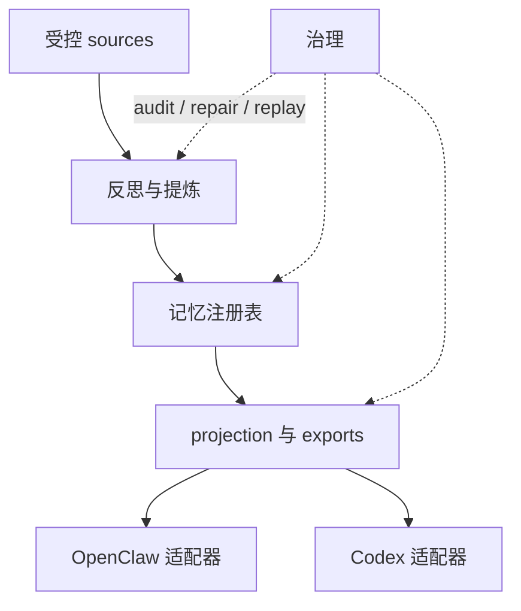
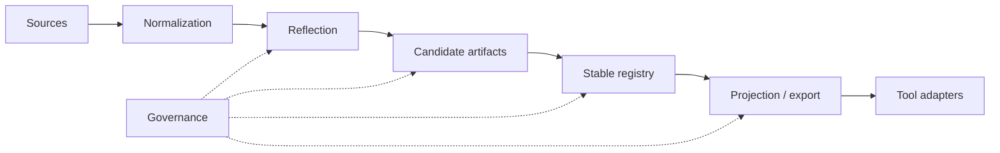

# 架构

[English](architecture.md) | [中文](architecture.zh-CN.md)

## 目的与范围

这份文档是仓库的稳定架构包装页。它只总结稳定系统形状，并把读者引向更深的模块文档，不承担会话级状态记录。

`Unified Memory Core` 是共享记忆产品层；当前仓库同时提供 OpenClaw 侧运行时适配器 `unified-memory-core`，以及一条一等的 Codex 适配路径。

## 系统上下文

稳定边界是：

- 产品主干负责 source ingestion、reflection、registry、projection、governance
- 适配器负责面向具体消费者的 retrieval、assembly 和 export consumption
- governance 是横切层，职责是保证 artifacts 可追踪、可修复、可 replay

## 当前旗舰主线

到当前这个阶段，仓库其实已经有两条最高优先级的里程碑主线：

1. `self-learning`
2. `context 优化`

第二条现在已经是一等主线，不再只是 adapter 内的局部修补。

从路线图角度，这条线现在已经不是“当前大阶段”，而是 maintenance 里的长期优化主线之一：

- `Stage 11` 已完成
- `Stage 12` 已完成
- 当前仓库状态是 `post-stage12-product-maintenance`

这个边界要明确：

- Stage 6 / 7 / 9 这些 OpenClaw 侧主题保持“已完成”的历史状态
- `Stage 11` 已经把 `Context Minor GC` 的能力和 OpenClaw host-visible 收益一起收口
- `Stage 12` 已经把 realtime memory-intent productization 收口
- 当前主线不再是“补某个未完成 stage”，而是守住 maintenance / release / operator proof baseline

`context 优化` 当前明确分成几条互补的架构面：

- durable source 的瘦身与预算化组装
  - [reference/unified-memory-core/architecture/context-slimming-and-budgeted-assembly.zh-CN.md](reference/unified-memory-core/architecture/context-slimming-and-budgeted-assembly.zh-CN.md)
- `Context Minor GC`
  - [reference/unified-memory-core/architecture/context-minor-gc.zh-CN.md](reference/unified-memory-core/architecture/context-minor-gc.zh-CN.md)
  - 它把热路径上的 working-set 管理、task-state carry-forward、`direct / local_complete / full_assembly` 路由，以及“compat / compact 只做后台保底”收成一条统一主线
- 长多话题会话里的 dialogue working-set pruning
  - [reference/unified-memory-core/architecture/dialogue-working-set-pruning.zh-CN.md](reference/unified-memory-core/architecture/dialogue-working-set-pruning.zh-CN.md)
- 插件内自托管 `memory + context decision overlay`
  - [reference/unified-memory-core/architecture/plugin-owned-context-decision-overlay.zh-CN.md](reference/unified-memory-core/architecture/plugin-owned-context-decision-overlay.zh-CN.md)

当前状态：

- Stage 6 runtime shadow integration 已经落地
- Stage 6 继续保持 `default-off` 和 shadow-only，作为测量面
- Stage 9 guarded smart-path 已收口；maintenance 中 OpenClaw 默认开启，shadow 继续保持 `default-off`
- 这条逐轮 context 优化主线，对外工作名现在统一收成 `Context Minor GC`
- `Stage 11` 不再是当前 blocker；它已经关闭，并转入长期优化线
- 当前最新状态不是某个新 stage 正在执行，而是 `post-stage12-product-maintenance`
- 当前推荐实施线不是修改 OpenClaw，而是优先把 `memory + context decision` 的 decision transport / scorecard / guarded seam 做成跨宿主一致契约
- 日常产品目标已经明确：平时尽量靠逐轮 context 管理保持可持续，不把 compat / compact 当成日常热路径依赖；compat / compact 只保留为夜间或后台 safety net

## 当前产品承诺与架构映射

当前架构应该直接服务 3 个用户承诺：

1. `轻快`
   - 主要落在 OpenClaw adapter、context 优化两条架构线，以及 release / install / hermetic eval 工作流
   - 当前已落地能力：fact-first assembly、runtime working-set shadow instrumentation、release-preflight、Docker hermetic eval
2. `聪明`
   - 主要落在 Source System、Reflection System、Memory Registry，以及 context 优化的 selective decision 层
   - 当前已落地能力：realtime `memory_intent` ingestion、nightly reflection、promotion / decay、working-set shadow path
3. `省心`
   - 主要落在 standalone runtime、CLI / governance tooling、shared contracts、projection layer、registry root policy 和两条 adapter 路径
   - 当前已落地能力：inspect / audit / replay / repair / rollback、canonical governed memory core、OpenClaw / Codex consumption path

## 产品北极星与工程解释

> 装得简单，用得顺手，跑得轻快，记得聪明，维护省心。

把这句话翻成架构约束，统一就是 3 点：

- `轻快`
  - adapter 接线、默认配置、CLI 首次验证、包体、主路径 latency、prompt thickness、runtime cost 都属于同一个目标面
  - 运行形态更接近“`Context Minor GC` + 低频 full sweep”：平时按轮裁剪 working set，夜间或后台才允许 compat / compact 做低频保底
- `聪明`
  - durable memory、realtime learning、working-set pruning、budgeted assembly、abstention guardrail 要协同，而不是各自为战
- `省心`
  - 所有关键行为都要留在 inspect / audit / replay / rollback / hermetic eval / shared registry 的 operator surface 里

## 当前强项与薄弱点

按当前架构和证据面看：

- 强项：
  - `省心` 相关的 governance / operator surface 已经较完整
  - `聪明` 的 self-learning 主干已经形成
  - context 优化边界已经明确，不再漂移成 report-only 想法
- 薄弱点：
  - `轻快` 当前最先要补的是每轮 context package 仍然偏厚，而且 Stage 6 还停留在 shadow measurement；安装接线手工和 hermetic answer path 不稳，则是紧随其后的问题
  - `聪明` 还停留在 shadow-first，不是默认体验
  - `省心` 里的共享底座仍缺 Codex / 多实例的更强产品证据

所以架构层接下来最需要守住的是：

1. 先把 context loading optimization 做成正式主线，不要让它继续停在零散 shadow 报告
   - 退出标准之一应是：正常长对话尽量不需要靠 compat / compact 才能继续
2. 不让“更聪明”退化成“更多规则、更重调用”
3. 不让“更强能力”破坏主路径速度；install 简化要继续做，但当前不应排在 context optimization 之前
4. 不让 shared-core 叙事只停留在边界设计，缺少真实产品证明

## 模块清单

| 模块 | 职责 | 关键接口 |
| --- | --- | --- |
| Source System | 受控 ingestion、normalization、replayable source artifacts | [src/unified-memory-core/source-system.js](../src/unified-memory-core/source-system.js) |
| Reflection System | candidate 提炼、daily reflection、后续学习入口 | [src/unified-memory-core/reflection-system.js](../src/unified-memory-core/reflection-system.js)、[src/unified-memory-core/daily-reflection.js](../src/unified-memory-core/daily-reflection.js) |
| Memory Registry | source、candidate、stable artifacts 与 decision trail | [src/unified-memory-core/memory-registry.js](../src/unified-memory-core/memory-registry.js) |
| Projection System | export shaping、visibility filtering、consumer projection | [src/unified-memory-core/projection-system.js](../src/unified-memory-core/projection-system.js) |
| Governance System | audit、repair、replay、diff、回归面 | [src/unified-memory-core/governance-system.js](../src/unified-memory-core/governance-system.js) |
| OpenClaw Adapter | OpenClaw 专属 retrieval policy 与 context assembly | [src/openclaw-adapter.js](../src/openclaw-adapter.js) |
| Codex Adapter | Codex 侧记忆投影与兼容路径 | [src/codex-adapter.js](../src/codex-adapter.js) |

官方模块边界和文件归属，以 [module-map.zh-CN.md](module-map.zh-CN.md) 为准。

## 核心流程

## 接口与契约

最关键的稳定契约是：

- 共享 artifact / namespace 契约：[src/unified-memory-core/contracts.js](../src/unified-memory-core/contracts.js)
- OpenClaw 运行时边界：[src/openclaw-adapter.js](../src/openclaw-adapter.js)
- Codex 运行时边界：[src/codex-adapter.js](../src/codex-adapter.js)
- standalone runtime 与 CLI 边界：[src/unified-memory-core/standalone-runtime.js](../src/unified-memory-core/standalone-runtime.js)、[scripts/unified-memory-core-cli.js](../scripts/unified-memory-core-cli.js)

## 状态与数据模型

当前稳定 artifact 栈是：

- source artifacts
- candidate artifacts
- stable artifacts
- projection / export artifacts
- governance findings 与 repair actions

这样设计的目的，是让系统可以 replay 和 repair，而不是静默修改。

## 运维关注点

- 当前 baseline 仍然坚持 `local-first`
- 契约设计保持 `network-ready`，但不是 `network-required`
- governance 输出必须足够可读，才能支撑 promotion 和 smoke-gate 决策
- 适配器不应吸收本该属于产品主干的逻辑
- context decision 逻辑不应该继续漂移成越来越大的硬编码规则表；下一轮更合理的方向是 bounded 的 LLM-led decision surface，加显式的硬安全 guardrails

## 取舍与非目标

- 这个仓库不试图彻底替代 OpenClaw 内置长期记忆
- 稳定文档只负责稳定形状；实时状态放在 `.codex/*`
- shared-service / runtime-API 等后续阶段，在当前产品 baseline 更稳之前都保持延后

## 相关 ADR

- [ADR 索引](adr/README.zh-CN.md)
- [顶层系统架构](workstreams/system/architecture.md)
- [详细架构地图](reference/unified-memory-core/architecture/README.md)
- [部署拓扑](reference/unified-memory-core/deployment-topology.md)
