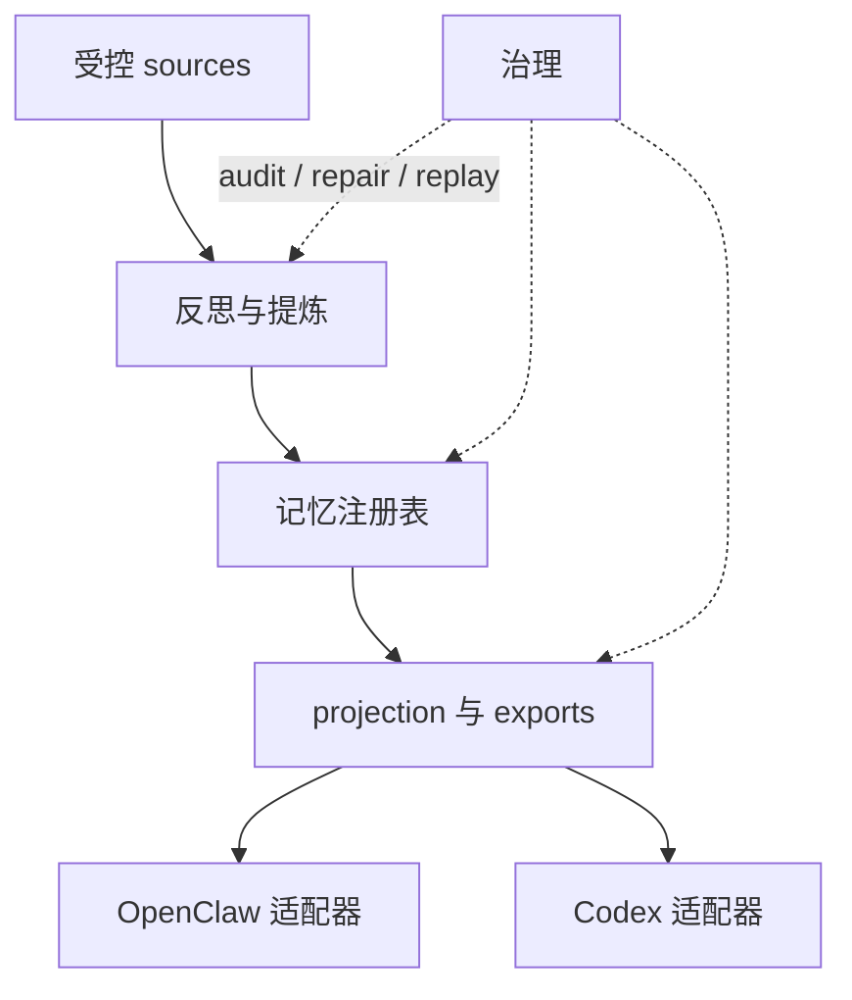
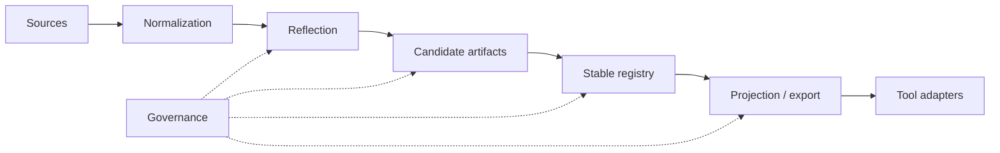

# 架构

[English](architecture.md) | [中文](architecture.zh-CN.md)

## 目的与范围

这份文档是仓库的稳定架构包装页。它只总结稳定系统形状，并把读者引向更深的模块文档，不承担会话级状态记录。

`Unified Memory Core` 是共享记忆产品层；当前仓库同时提供 OpenClaw 侧运行时适配器 `unified-memory-core`，以及一条一等的 Codex 适配路径。

## 系统上下文

稳定边界是：

- 产品主干负责 source ingestion、reflection、registry、projection、governance
- 适配器负责面向具体消费者的 retrieval、assembly 和 export consumption
- governance 是横切层，职责是保证 artifacts 可追踪、可修复、可 replay

## 当前旗舰主线

到当前这个阶段，仓库其实已经有两条最高优先级的里程碑主线：

1. `self-learning`
2. `context 优化`

第二条现在已经是一等主线，不再只是 adapter 内的局部修补。

`context 优化` 当前明确分成两条互补的架构面：

- durable source 的瘦身与预算化组装
  - [reference/unified-memory-core/architecture/context-slimming-and-budgeted-assembly.zh-CN.md](reference/unified-memory-core/architecture/context-slimming-and-budgeted-assembly.zh-CN.md)
- 长多话题会话里的 dialogue working-set pruning
  - [reference/unified-memory-core/architecture/dialogue-working-set-pruning.zh-CN.md](reference/unified-memory-core/architecture/dialogue-working-set-pruning.zh-CN.md)

当前状态：

- Stage 6 runtime shadow integration 已经落地
- 继续保持 `default-off` 和 shadow-only
- 下一轮要先做 docs-first：先把 bounded LLM-led decision contract、operator metrics、rollback boundary 和 harder A/B 设计写清楚，再讨论任何默认 prompt-path 改动

## 当前产品卖点与架构映射

当前架构应该直接映射到四个主要卖点：

1. `按需加载 context`
   - 主要落在 OpenClaw adapter 和两条 context 优化架构线上
   - 当前已落地能力：fact-first assembly + runtime working-set shadow instrumentation
2. `realtime + nightly self-learning`
   - 主要落在 Source System、Reflection System、Memory Registry 和 Governance System
   - 当前已落地能力：realtime `memory_intent` ingestion、nightly reflection、promotion / decay 和 governed exports
3. `可用 CLI 管理的记忆系统`
   - 主要落在 standalone runtime、CLI 入口和 governance tooling
   - 当前已落地能力：add / inspect / audit / repair / replay / migrate 这一整组 operator 流程
4. `跨 OpenClaw / Codex / 后续消费者的共享记忆底座`
   - 主要落在 shared contracts、projection layer、registry root policy 和两条 adapter 路径
   - 当前已落地能力：一套 canonical governed memory core，同时具备 OpenClaw 与 Codex 的消费路径

这些卖点还要同时满足六条产品品质要求：

- `简单`
  - 安装、默认配置、首次验证都必须足够直观
- `好用`
  - 默认工作流必须容易理解，不能逼着 operator 去做架构考古
- `轻量`
  - runtime 的收益应该来自“少给 context”，而不是长出一个比问题本身更重的控制层
- `够快`
  - context 优化、自学习和治理都不能把主路径拖慢到用户明显有感
- `聪明`
  - 该记的记住，不该记的不乱记；该给的 context 才给；不确定时宁可收敛
- `易维护`
  - 核心行为必须保持可 inspect、可 replay、可 repair、可 rollback

## 产品北极星与工程解释

> 装得简单，用得顺手，跑得轻快，记得聪明，维护省心。

把这句话翻成架构约束，分别是：

- `装得简单`
  - adapter 接线、默认配置、CLI 入口、安装包结构要优先减少接入成本
- `用得顺手`
  - 默认路径优先，用户不需要先理解复杂治理模型才能得到收益
- `跑得轻快`
  - context thickness、主路径 latency、运行时负担、安装包体积都属于同一个目标面
- `记得聪明`
  - durable memory、realtime learning、working-set pruning、budgeted assembly、abstention guardrail 要协同，而不是各自为战
- `维护省心`
  - 所有关键行为都要留在 inspect / audit / replay / rollback 的 operator surface 里

## 当前强项与薄弱点

按当前架构和证据面看：

- 强项：
  - governance / operator surface 已经较完整
  - self-learning lifecycle 已经形成主干
  - context 优化的边界已经明确，不再漂移成 report-only 想法
- 薄弱点：
  - `简单` 仍然更多依赖人工安装和人工接线
  - `够快` 还没有在 hermetic answer path 上形成足够强的默认保证
  - `聪明` 还停留在 shadow-first，不是默认体验
  - `轻量` 还缺少更硬的包体、启动、预算约束
  - `共享底座` 还缺少 Codex / 多实例的更强产品证据

所以架构层接下来最需要守住的是：

1. 不让“更聪明”退化成“更多规则、更重调用”
2. 不让“更强能力”破坏安装简单和主路径速度
3. 不让 shared-core 叙事只停留在边界设计，缺少真实产品证明

## 模块清单

| 模块 | 职责 | 关键接口 |
| --- | --- | --- |
| Source System | 受控 ingestion、normalization、replayable source artifacts | [src/unified-memory-core/source-system.js](../src/unified-memory-core/source-system.js) |
| Reflection System | candidate 提炼、daily reflection、后续学习入口 | [src/unified-memory-core/reflection-system.js](../src/unified-memory-core/reflection-system.js)、[src/unified-memory-core/daily-reflection.js](../src/unified-memory-core/daily-reflection.js) |
| Memory Registry | source、candidate、stable artifacts 与 decision trail | [src/unified-memory-core/memory-registry.js](../src/unified-memory-core/memory-registry.js) |
| Projection System | export shaping、visibility filtering、consumer projection | [src/unified-memory-core/projection-system.js](../src/unified-memory-core/projection-system.js) |
| Governance System | audit、repair、replay、diff、回归面 | [src/unified-memory-core/governance-system.js](../src/unified-memory-core/governance-system.js) |
| OpenClaw Adapter | OpenClaw 专属 retrieval policy 与 context assembly | [src/openclaw-adapter.js](../src/openclaw-adapter.js) |
| Codex Adapter | Codex 侧记忆投影与兼容路径 | [src/codex-adapter.js](../src/codex-adapter.js) |

官方模块边界和文件归属，以 [module-map.zh-CN.md](module-map.zh-CN.md) 为准。

## 核心流程

## 接口与契约

最关键的稳定契约是：

- 共享 artifact / namespace 契约：[src/unified-memory-core/contracts.js](../src/unified-memory-core/contracts.js)
- OpenClaw 运行时边界：[src/openclaw-adapter.js](../src/openclaw-adapter.js)
- Codex 运行时边界：[src/codex-adapter.js](../src/codex-adapter.js)
- standalone runtime 与 CLI 边界：[src/unified-memory-core/standalone-runtime.js](../src/unified-memory-core/standalone-runtime.js)、[scripts/unified-memory-core-cli.js](../scripts/unified-memory-core-cli.js)

## 状态与数据模型

当前稳定 artifact 栈是：

- source artifacts
- candidate artifacts
- stable artifacts
- projection / export artifacts
- governance findings 与 repair actions

这样设计的目的，是让系统可以 replay 和 repair，而不是静默修改。

## 运维关注点

- 当前 baseline 仍然坚持 `local-first`
- 契约设计保持 `network-ready`，但不是 `network-required`
- governance 输出必须足够可读，才能支撑 promotion 和 smoke-gate 决策
- 适配器不应吸收本该属于产品主干的逻辑
- context decision 逻辑不应该继续漂移成越来越大的硬编码规则表；下一轮更合理的方向是 bounded 的 LLM-led decision surface，加显式的硬安全 guardrails

## 取舍与非目标

- 这个仓库不试图彻底替代 OpenClaw 内置长期记忆
- 稳定文档只负责稳定形状；实时状态放在 `.codex/*`
- shared-service / runtime-API 等后续阶段，在当前产品 baseline 更稳之前都保持延后

## 相关 ADR

- [ADR 索引](adr/README.zh-CN.md)
- [顶层系统架构](workstreams/system/architecture.md)
- [详细架构地图](reference/unified-memory-core/architecture/README.md)
- [部署拓扑](reference/unified-memory-core/deployment-topology.md)
