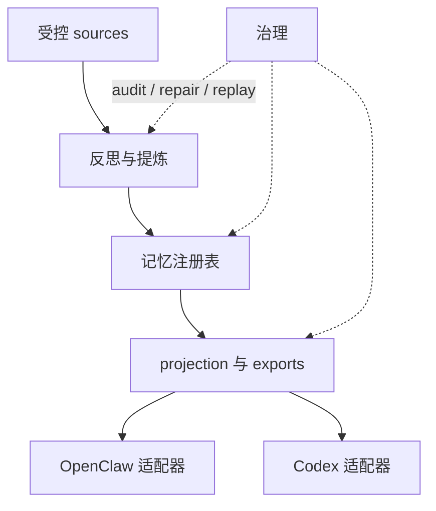
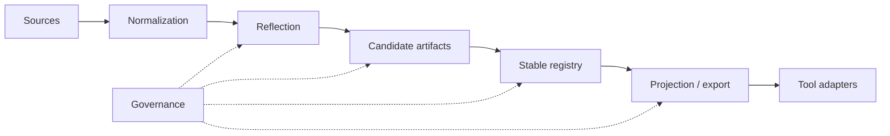

# 架构

[English](architecture.md) | [中文](architecture.zh-CN.md)

## 目的与范围

这份文档是仓库的稳定架构包装页。它只总结稳定系统形状，并把读者引向更深的模块文档，不承担会话级状态记录。

`Unified Memory Core` 是共享记忆产品层；当前仓库同时提供 OpenClaw 侧运行时适配器 `unified-memory-core`，以及一条一等的 Codex 适配路径。

## 系统上下文

稳定边界是：

- 产品主干负责 source ingestion、reflection、registry、projection、governance
- 适配器负责面向具体消费者的 retrieval、assembly 和 export consumption
- governance 是横切层，职责是保证 artifacts 可追踪、可修复、可 replay

## 模块清单

| 模块 | 职责 | 关键接口 |
| --- | --- | --- |
| Source System | 受控 ingestion、normalization、replayable source artifacts | [src/unified-memory-core/source-system.js](../src/unified-memory-core/source-system.js) |
| Reflection System | candidate 提炼、daily reflection、后续学习入口 | [src/unified-memory-core/reflection-system.js](../src/unified-memory-core/reflection-system.js)、[src/unified-memory-core/daily-reflection.js](../src/unified-memory-core/daily-reflection.js) |
| Memory Registry | source、candidate、stable artifacts 与 decision trail | [src/unified-memory-core/memory-registry.js](../src/unified-memory-core/memory-registry.js) |
| Projection System | export shaping、visibility filtering、consumer projection | [src/unified-memory-core/projection-system.js](../src/unified-memory-core/projection-system.js) |
| Governance System | audit、repair、replay、diff、回归面 | [src/unified-memory-core/governance-system.js](../src/unified-memory-core/governance-system.js) |
| OpenClaw Adapter | OpenClaw 专属 retrieval policy 与 context assembly | [src/openclaw-adapter.js](../src/openclaw-adapter.js) |
| Codex Adapter | Codex 侧记忆投影与兼容路径 | [src/codex-adapter.js](../src/codex-adapter.js) |

官方模块边界和文件归属，以 [module-map.zh-CN.md](module-map.zh-CN.md) 为准。

## 核心流程

## 接口与契约

最关键的稳定契约是：

- 共享 artifact / namespace 契约：[src/unified-memory-core/contracts.js](../src/unified-memory-core/contracts.js)
- OpenClaw 运行时边界：[src/openclaw-adapter.js](../src/openclaw-adapter.js)
- Codex 运行时边界：[src/codex-adapter.js](../src/codex-adapter.js)
- standalone runtime 与 CLI 边界：[src/unified-memory-core/standalone-runtime.js](../src/unified-memory-core/standalone-runtime.js)、[scripts/unified-memory-core-cli.js](../scripts/unified-memory-core-cli.js)

## 状态与数据模型

当前稳定 artifact 栈是：

- source artifacts
- candidate artifacts
- stable artifacts
- projection / export artifacts
- governance findings 与 repair actions

这样设计的目的，是让系统可以 replay 和 repair，而不是静默修改。

## 运维关注点

- 当前 baseline 仍然坚持 `local-first`
- 契约设计保持 `network-ready`，但不是 `network-required`
- governance 输出必须足够可读，才能支撑 promotion 和 smoke-gate 决策
- 适配器不应吸收本该属于产品主干的逻辑

## 取舍与非目标

- 这个仓库不试图彻底替代 OpenClaw 内置长期记忆
- 稳定文档只负责稳定形状；实时状态放在 `.codex/*`
- shared-service / runtime-API 等后续阶段，在当前产品 baseline 更稳之前都保持延后

## 相关 ADR

- [ADR 索引](adr/README.zh-CN.md)
- [顶层系统架构](../system-architecture.md)
- [详细架构地图](unified-memory-core/architecture/README.md)
- [部署拓扑](unified-memory-core/deployment-topology.md)
