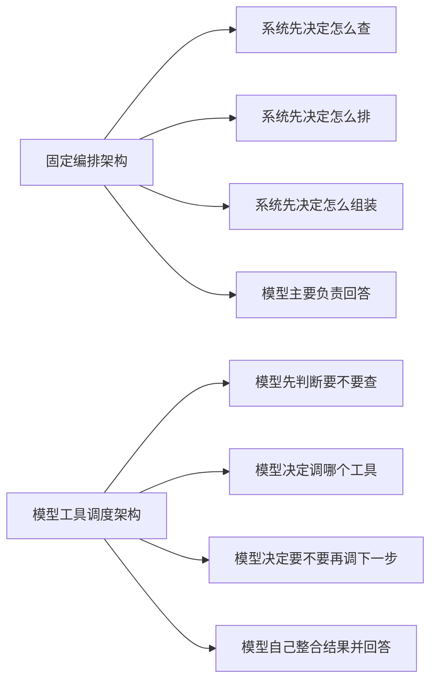
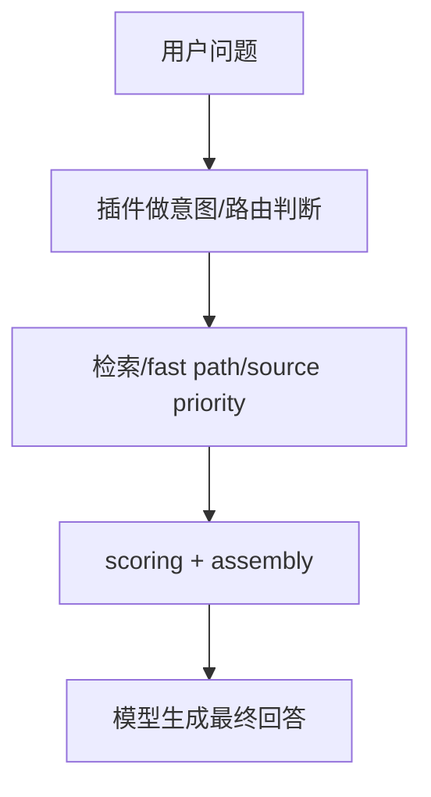
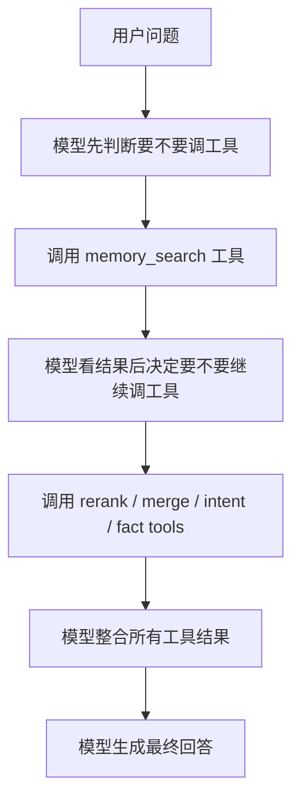

# Memory Search：固定编排架构 vs 模型工具调度架构

## 为什么写这份文档

`memory search` 后续到底该走哪种架构，是一个很关键的分叉点。

现在主要有两条路：

1. **固定编排架构**
   - 系统/插件先把检索、路由、排序、组装编排好
   - 大模型主要负责最终回答

2. **模型工具调度架构**
   - 把 `memory_search`、意图判断、后处理都做成工具
   - 由大模型在运行时决定调哪个工具、按什么顺序调

这份文档就是专门解释这两条路线的区别。

## 一图看懂

## 1. 固定编排架构是什么

这就是我们现在主路径更接近的方式。

它的典型链路是：

特点：

- 控制权在系统/插件手里
- 链路更固定
- 性能更可预测
- 更适合做 baseline、smoke、perf、governance

## 2. 模型工具调度架构是什么

这就是你刚才提的思路。

它的典型链路是：

特点：

- 控制权在模型手里
- 链路更灵活
- 泛化潜力更强
- 但延迟、成本、稳定性更难控

## 3. 两者最核心的区别

### A. 控制权

- 固定编排：
  - 控制权在系统
- 工具调度：
  - 控制权在模型

### B. 性能

- 固定编排：
  - 通常可以做到 `0` 次新增 LLM 调用
  - 或最多 `1` 次可选 LLM
- 工具调度：
  - 很容易膨胀成多轮工具调用 + 多轮 LLM 决策

### C. 准确性

- 固定编排：
  - 高频核心问题更稳
  - 复杂长尾问题没那么灵活
- 工具调度：
  - 长尾问题更可能灵活处理
  - 但也更容易行为不稳定

### D. 测试与治理

- 固定编排：
  - 更容易做 smoke / perf / regression / governance
- 工具调度：
  - 需要额外测试：
    - 模型为什么调这个工具
    - 为什么这次调 1 次、下次调 3 次
    - 为什么这次不调工具直接回答

## 4. 放到当前项目里，差别是什么

当前项目的诉求不是单纯“尽量聪明”，而是同时要：

- 性能受控
- 尽量准确
- 可治理
- 可回归
- 能长期维护

所以放到当前阶段，两个方案的差异很直接：

### 固定编排架构更适合当前阶段

因为它更符合当前目标：

- 稳
- 快
- 好测
- 好治理

### 工具调度架构更适合后续作为补充层

它不是没价值，而是更适合：

- 复杂 query
- 长尾 query
- 默认规则识别不了的 query

也就是说，它更适合成为：

**例外路径 / 增强层**

而不是现在就替代主架构。

## 5. 为什么这和 LLM 调用次数强相关

这是最关键的一点。

用户的真实诉求是：

- 不要影响性能
- 又要尽量准确

这两个目标本来就有张力。

而工具调度架构，会天然把系统往这边推：

所以后面必须明确一条约束：

- 最好：`0` 次新增 LLM 调用
- 次优：`1` 次，可配置
- 最差：多次 LLM 调用链

## 6. 当前推荐路线

### 主路线

继续走：

- 固定编排架构
- fact-first retrieval
- fast path
- retrieval policy
- 输入形态优化

### 补充路线

预留一条未来可能的增强路径：

- 当某些 query 的规则判断置信度很低时
- 才允许：
  - 单次 LLM intent fallback
  - 或单次 LLM tool-routing

但必须满足：

- 默认关闭
- 可配置
- 有 perf 基线
- 有专项测试

## 7. 最终判断

如果只问一句：

> 后面 `memory search` 主架构应该选哪条？

我现在的建议是：

**主架构继续用固定编排。**

原因不是“模型工具调度不行”，而是：

- 它更适合当前项目的阶段
- 更符合性能诉求
- 更容易治理
- 更容易做长期回归保护

而模型工具调度架构，更适合以后作为：

**受控的、单次 LLM 的增强层**

而不是现在就直接替代主路径。
