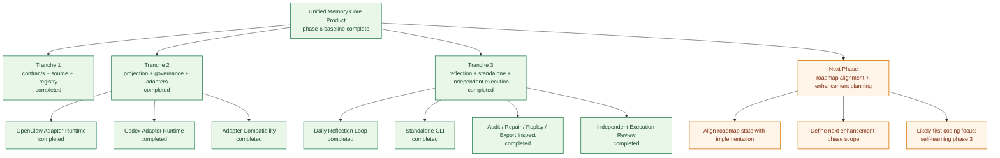
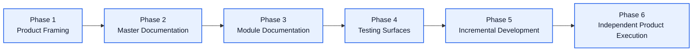
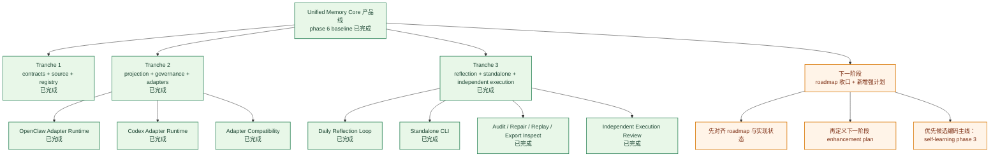
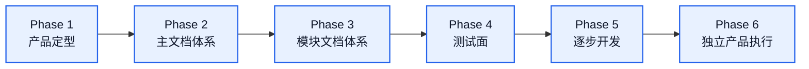

# Unified Memory Core Roadmap

[English](#english) | [中文](#中文)

## English

## Final Target

`Unified Memory Core` is the official shared-memory product for:

- OpenClaw
- Codex
- future tools

It should become:

- a governed shared memory foundation
- a separable long-term product
- a multi-adapter system with explicit namespaces and visibility control

## Current Phase

Status: `phase 6 / current baseline complete`

What is happening now:

- product naming and boundary alignment are complete
- module architecture docs, roadmaps, blueprints, and testing surfaces are complete
- tranche 1 implementation is complete:
  - shared contracts
  - Source System MVP
  - Memory Registry MVP
  - contract / registry tests
- tranche 2 implementation is complete:
  - Projection System MVP
  - Governance System MVP
  - OpenClaw adapter runtime
  - Codex adapter runtime
  - adapter compatibility tests
- tranche 3 implementation is complete:
  - Reflection System MVP
  - daily reflection loop baseline
  - standalone CLI and command surface
  - independent execution review
- the current local-first, network-ready baseline is closed

## Progress Map

## Program Roadmap

### Phase 1: Product Framing

Goal:

- confirm product name
- confirm adapter model
- confirm first-class module split
- confirm repo incubation strategy

### Phase 2: Master Documentation

Goal:

- finalize top-level architecture
- finalize master roadmap
- finalize future repo layout
- record overall implementation order

### Phase 3: Module Documentation

Goal:

- create sub-architecture docs
- create module roadmaps
- create module blueprints
- create module todo pages

### Phase 4: Testing Surfaces

Goal:

- create module case matrix
- define regression surfaces
- define artifact validation surfaces
- define adapter compatibility checks

### Phase 5: Incremental Development

Goal:

- develop modules in sequence
- start with contracts and source model
- keep docs and testing aligned from day one

### Phase 6: Independent Product Execution

Goal:

- continue executing the independent product direction from the current main branch
- preserve old plugin-first shape through branch snapshot when needed
- keep adapters and core evolving under one product roadmap

## First-Class Module Tracks

1. `Source System`
2. `Reflection System`
3. `Memory Registry`
4. `Projection System`
5. `Governance System`
6. `OpenClaw Adapter`
7. `Codex Adapter`

## 中文

## 最终目标

`Unified Memory Core` 是面向：

- OpenClaw
- Codex
- 后续其他工具

的正式共享记忆产品。

它最终要成为：

- 一套受治理的共享记忆底座
- 一个可独立拆分的长期产品
- 一个具备显式 namespace 和可见性控制的多 adapter 系统

## 当前阶段

状态：`phase 6 / 当前 baseline 已完成`

当前正在做：

- 产品命名和边界对齐已完成
- 模块架构文档、roadmap、blueprint、testing surfaces 已完成
- tranche 1 实现已完成：
  - shared contracts
  - Source System MVP
  - Memory Registry MVP
  - contract / registry tests
- tranche 2 实现已完成：
  - Projection System MVP
  - Governance System MVP
  - OpenClaw adapter runtime
  - Codex adapter runtime
  - adapter compatibility tests
- tranche 3 实现已完成：
  - Reflection System MVP
  - daily reflection loop baseline
  - standalone CLI 与命令面
  - independent execution review
- 当前这条 local-first、network-ready 的 baseline 已经闭环

## 进展图

## 项目路线图

### Phase 1：产品定型

目标：

- 确认正式产品名
- 确认 adapter 模型
- 确认一等模块拆分
- 确认仓内孵化策略

### Phase 2：主文档体系

目标：

- 定稿顶层架构
- 定稿主 roadmap
- 定稿开发总计划
- 定稿未来仓库结构
- 记录总体实施顺序

### Phase 3：模块文档体系

目标：

- 建立子架构文档
- 建立模块 roadmap
- 建立模块 blueprint
- 建立模块 todo

### Phase 4：测试面

目标：

- 建立模块用例矩阵
- 定义回归面
- 定义 artifact 校验面
- 定义 adapter 兼容性检查

### Phase 5：逐步开发

目标：

- 按模块顺序推进开发
- 从 contracts 和 source model 开始
- 从第一天起保持文档和测试同步

### Phase 6：独立产品执行

目标：

- 在当前主干上持续执行独立产品方向
- 通过分支快照保留旧的 plugin-first 形态
- 让 core 与 adapters 在同一产品 roadmap 下持续演进

## 一等模块主线

1. `Source System`
2. `Reflection System`
3. `Memory Registry`
4. `Projection System`
5. `Governance System`
6. `OpenClaw Adapter`
7. `Codex Adapter`
