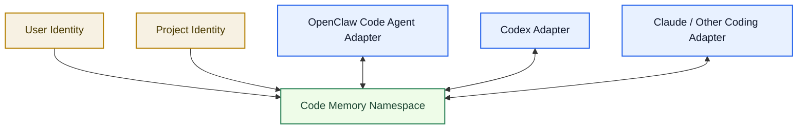
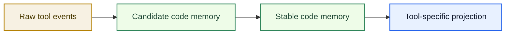
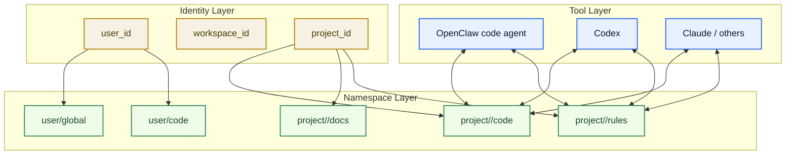
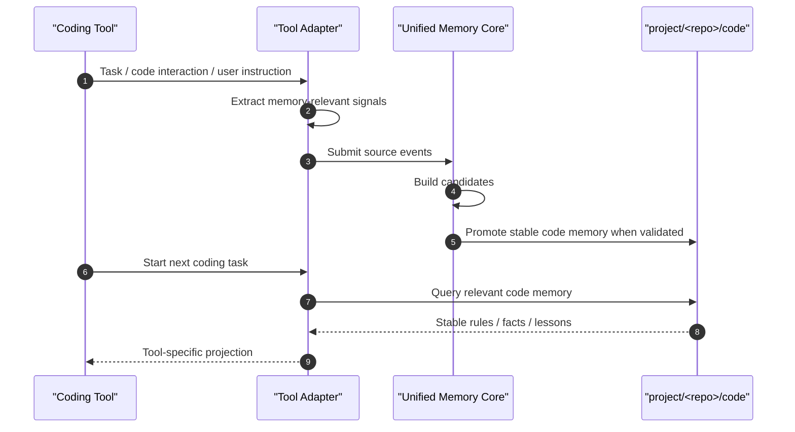
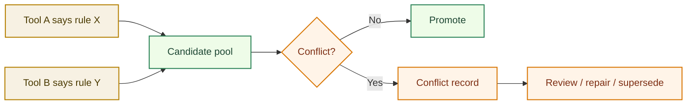
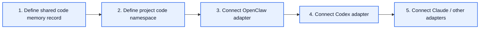

# Code Memory Binding Architecture

[English](code-memory-binding-architecture.md) | [中文](code-memory-binding-architecture.zh-CN.md)

## Purpose

This document focuses on one specific architecture question:

`how should OpenClaw code agent, Codex, and future coding tools share the same code memory safely?`

The goal is not to merge all tools into one runtime.

The goal is to let multiple tools read and write the same governed `code memory namespace` through a shared memory core.

## Core Idea

The binding target is not:

- one process
- one prompt
- one session

The binding target is:

- the same `user identity`
- the same `project identity`
- the same `code memory namespace`
- the same `record / export protocol`

## One Diagram



## What Should Be Shared

The shared code memory should mostly contain stable engineering signals such as:

- project rules
- coding constraints
- repo-specific conventions
- stable implementation preferences
- recurring testing expectations
- recurring deployment expectations
- stable engineering lessons learned

Examples:

- `do not hardcode`
- `update docs when adding new functionality`
- `new functionality must include tests`
- `runtime changes require test + local deploy`
- `manual file edits must use apply_patch`

## What Should Not Be Shared Directly

These should not be shared as stable code memory by default:

- raw scratchpad thinking
- temporary frustration or emotion
- tool-private hidden reasoning
- one-off speculation
- unreviewed session notes

## Memory Layering



## Binding Dimensions

The binding should happen across four dimensions:

1. `user`
2. `workspace / project`
3. `namespace`
4. `visibility / permissions`

## Binding Model



## Recommended Shared Namespace

For coding collaboration, the most important shared namespace is:

`project/<repo>/code`

This allows:

- OpenClaw code agent to write coding rules and stable implementation lessons
- Codex to read and reinforce those same rules
- future tools to consume the same stable engineering memory

## Read / Write Flow



## Adapter Responsibilities

### OpenClaw Code Agent Adapter

Should:

- extract coding-related rules from OpenClaw sessions
- write candidate events into the shared memory core
- read project code memory before task execution
- consume memory as OpenClaw-specific context hints

### Codex Adapter

Should:

- extract coding-related constraints from Codex work
- write candidate events into the shared memory core
- read project code memory before planning / editing
- consume memory as Codex-specific task guidance

### Future Claude Adapter

Should:

- use the same protocol
- respect the same namespace and permission model
- project outputs in a Claude-appropriate way

## Conflict Handling

If tools produce different conclusions, the system should not overwrite silently.



## Visibility and Safety

Not every memory item should be visible to every tool.

Recommended controls:

- `source_tool`
- `project_scope`
- `namespace`
- `visibility_scope`
- `confidence`
- `promotion_status`

This allows:

- shared code memory where appropriate
- isolated tool-local memory where necessary

## Minimal Record Shape

```json
{
  "id": "code-rule-001",
  "userId": "user-redcreen",
  "projectId": "unified-memory-core",
  "namespace": "project/unified-memory-core/code",
  "sourceTool": "codex",
  "type": "stable_rule",
  "statement": "Do not hardcode implementation details.",
  "confidence": 0.96,
  "status": "stable",
  "visibility": "shared-code-tools"
}
```

## Recommended Rollout Order



## Decision Summary

Yes, this architecture can let:

- OpenClaw code agent
- Codex
- Claude
- future coding tools

share the same stable coding memory.

But the sharing should be implemented as:

`shared code memory namespace through a governed memory core`

not:

`all tools dumping raw context into one flat storage pool`
