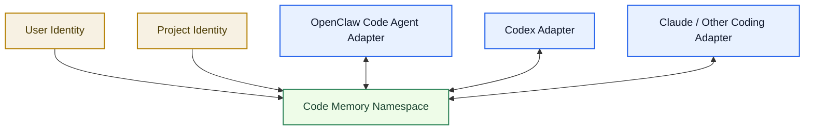
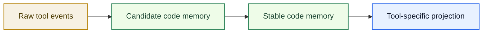
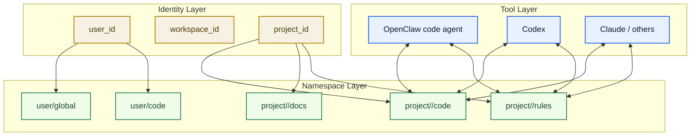
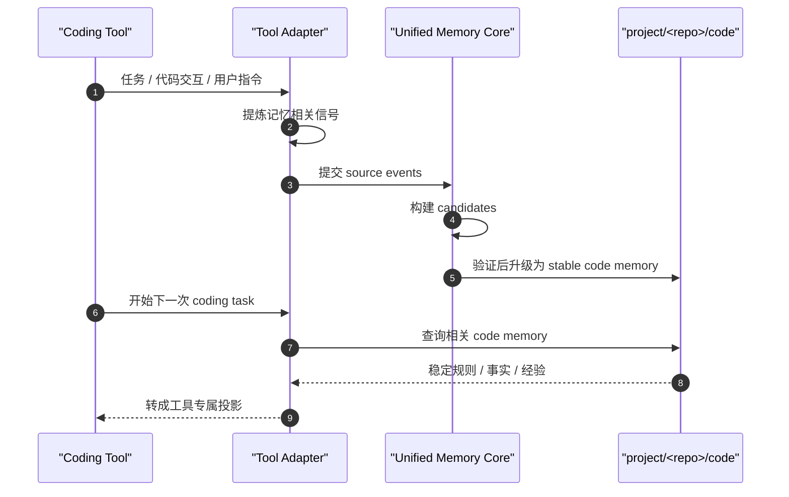
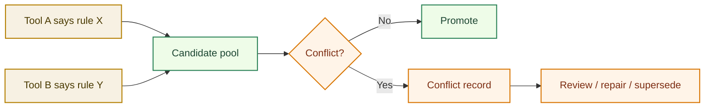
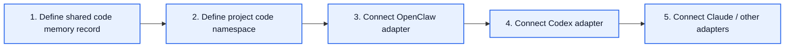

# Code Memory Binding Architecture

[English](code-memory-binding-architecture.md) | [中文](code-memory-binding-architecture.zh-CN.md)

## 文档目的

这份文档只聚焦一个具体问题：

`OpenClaw code agent、Codex 以及后续其他 coding tool，应该怎样安全地共享同一套 code memory？`

目标不是把所有工具并成一个 runtime。

目标是让多个工具通过同一个统一记忆底座，共享同一个受治理的 `code memory namespace`。

## 核心思路

真正被绑定的对象不是：

- 一个进程
- 一个 prompt
- 一个 session

真正被绑定的是：

- 同一个 `user identity`
- 同一个 `project identity`
- 同一个 `code memory namespace`
- 同一个 `record / export protocol`

## 一图看懂



## 什么应该共享

共享的 code memory 应主要放这些稳定工程信号：

- 项目规则
- 编码约束
- 仓库约定
- 稳定实现偏好
- 反复出现的测试要求
- 反复出现的部署要求
- 稳定的工程经验

例如：

- `不要硬编码`
- `有新功能要同步更新文档`
- `新功能必须补测试`
- `运行时代码改动后要测试并本地部署`
- `手工编辑必须用 apply_patch`

## 什么不应该直接共享

默认不应该直接变成 stable code memory 的包括：

- 原始 scratchpad
- 临时情绪
- 工具私有隐藏推理
- 一次性猜测
- 未治理的会话笔记

## 记忆分层



## 绑定维度

这个绑定建议落在 4 个维度上：

1. `user`
2. `workspace / project`
3. `namespace`
4. `visibility / permissions`

## 绑定模型



## 推荐的共享命名空间

对于 coding 协作，最关键的共享命名空间应该是：

`project/<repo>/code`

这样就能做到：

- OpenClaw code agent 写入代码规则和稳定经验
- Codex 读取并继续强化同一套规则
- 后续其他工具继续消费同一个项目的工程记忆

## 读写流程



## Adapter 的职责

### OpenClaw Code Agent Adapter

应负责：

- 从 OpenClaw 会话中提炼 coding 相关规则
- 将 candidate events 写入统一记忆底座
- 在任务执行前读取项目 code memory
- 把记忆转成 OpenClaw 专属上下文提示

### Codex Adapter

应负责：

- 从 Codex 工作流中提炼 coding 相关约束
- 将 candidate events 写入统一记忆底座
- 在 plan / edit 前读取项目 code memory
- 把记忆转成 Codex 专属任务提示

### Future Claude Adapter

应负责：

- 使用同一协议
- 遵守同一 namespace 和权限模型
- 以适合 Claude 的方式消费投影结果

## 冲突处理

如果不同工具产出不同结论，系统不能静默覆盖。



## 可见性与安全边界

不是每条记忆都应该对每个工具可见。

建议至少有这些控制字段：

- `source_tool`
- `project_scope`
- `namespace`
- `visibility_scope`
- `confidence`
- `promotion_status`

这样才能做到：

- 该共享的 code memory 可以共享
- 该隔离的 tool-local memory 仍然可隔离

## 最小记录形态

```json
{
  "id": "code-rule-001",
  "userId": "user-redcreen",
  "projectId": "unified-memory-core",
  "namespace": "project/unified-memory-core/code",
  "sourceTool": "codex",
  "type": "stable_rule",
  "statement": "Do not hardcode implementation details.",
  "confidence": 0.96,
  "status": "stable",
  "visibility": "shared-code-tools"
}
```

## 建议的接入顺序



## 结论

是的，这套架构可以让：

- OpenClaw code agent
- Codex
- Claude
- 未来其他 coding tools

共享同一套稳定的 coding memory。

但共享方式应该是：

`通过受治理的统一记忆底座，共享 code memory namespace`

而不是：

`所有工具把原始上下文直接丢进一个平铺存储池`
