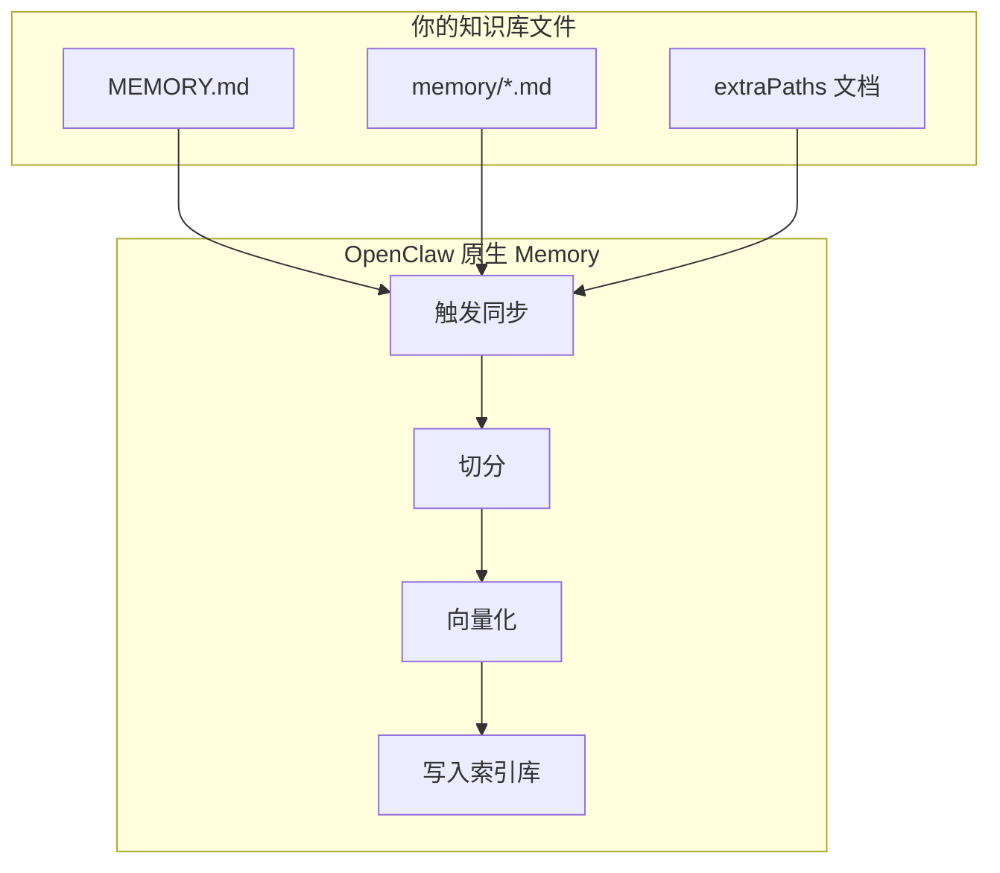
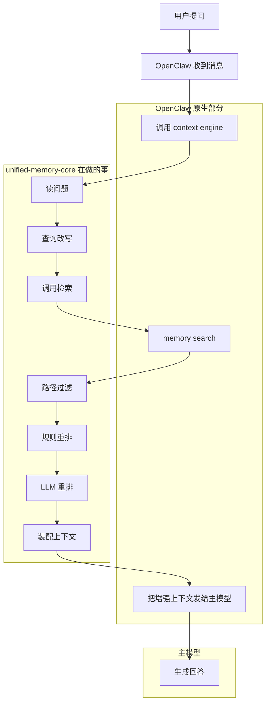
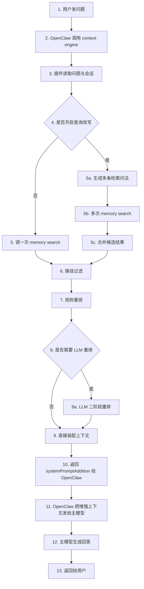
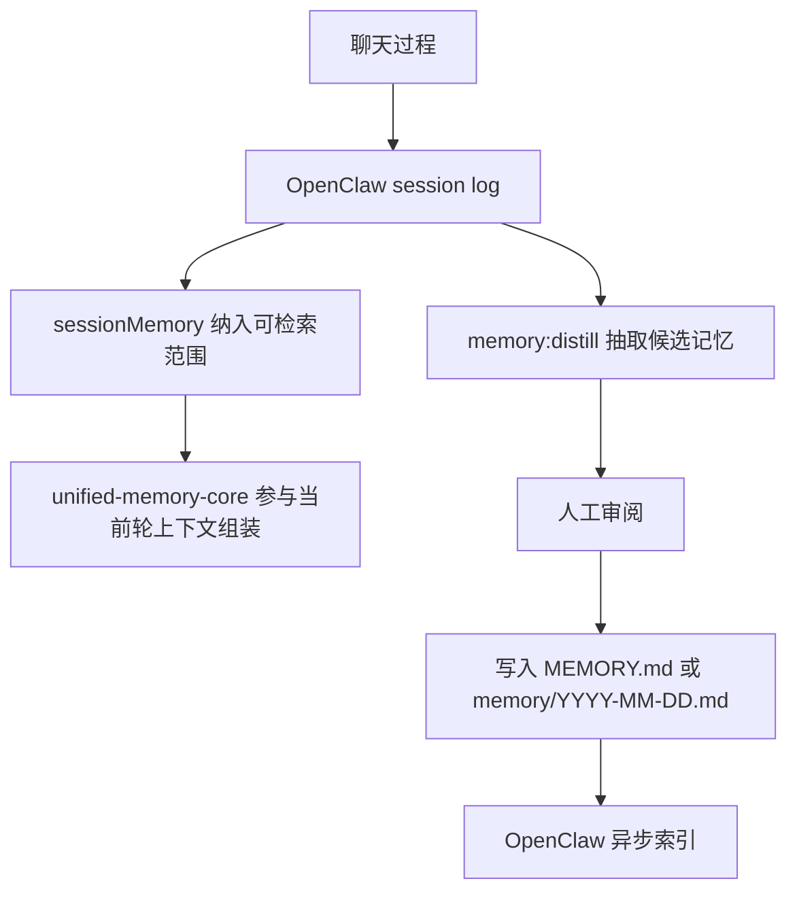

[English](how-unified-memory-core-works.md) | [中文](how-unified-memory-core-works.zh-CN.md)

# Unified Memory Core 是怎么工作的

## 这份文档讲什么
这份文档用尽量简单的方式说明两件事：

1. `unified-memory-core` 平时是怎么工作的
2. 它嵌进 OpenClaw 之后，一条消息会经过什么调用链路

如果你只想先记住一句话：

> OpenClaw 内置 Memory 负责“存和找”，`unified-memory-core` 负责“这一轮怎么更好地喂给模型”。

---

## 先用一个生活化比喻

你可以把整套系统理解成这样：

- `Workspace / MEMORY.md / memory/`：资料库
- OpenClaw Memory：图书馆检索系统
- `unified-memory-core`：备课助手
- 主模型：真正回答你的那个人

也就是：

- 资料先被放进库里
- OpenClaw 先把相关资料找出来
- `unified-memory-core` 再决定哪些最该放到当前桌面上
- 最后模型基于“当前桌面上的资料”回答

---

## 先分清两条完全不同的流程

最容易误解的点就是：

- **建索引** 是异步后台流程
- **回答一条消息** 是实时在线流程

它们不是一条串起来的同步链路。

### 图 1：异步索引链路

这条链路主要是 **OpenClaw 原生 Memory** 在做，`unified-memory-core` 不负责建索引。



这张图表达的是：

- 文档先被存进长期记忆目录
- OpenClaw 在后台异步处理它们
- 最后生成一个可搜索的记忆索引

这里还没有进入“回答某个问题”的阶段。

### 图 2：实时问答链路

这条链路才是一条消息进来时真正发生的事情。



这张图里要特别注意：

- `memory search` 能力本身属于 **OpenClaw**
- 调用这个能力、拿到结果后继续过滤/重排/装配，属于 **unified-memory-core**
- 最终把增强后的上下文发给主模型，再次属于 **OpenClaw**

一句话拆分职责：

- **OpenClaw**：存、索引、检索、发给模型
- **unified-memory-core**：决定这一轮“检索结果里哪些最该进上下文”

---

## 先说 OpenClaw 原生部分

### 1. 记忆放在哪里

这套长期记忆主要来自这些地方：

- `MEMORY.md`
- `memory/*.md`
- `extraPaths` 指向的 Markdown 文档

你现在这套知识库目录大概就是：

```text
长记忆/
├── MEMORY.md
├── memory/
├── openclaw-memory-vs-lossless.md
├── unified-memory-core-config.md
└── 其他专题文档...
```

### 2. OpenClaw 原生 Memory 做什么

它主要负责：

- 给这些 Markdown 建索引
- 把文本转成 embedding
- 支持 `memory search`
- 在需要时把相关片段找出来

它最擅长的是：

- 存得住
- 搜得到

但它还没有替你解决一个关键问题：

> 找到的内容里，哪几个最该进入“这一轮”的上下文？

这就是 `unified-memory-core` 要补上的层。

---

## `unified-memory-core` 自己做什么

### 它不是另一个记忆库

它不负责：

- 替代 `MEMORY.md`
- 替代 `memory search`
- 自己再发明一套长期存储

它负责的是：

- 读取当前问题
- 从已有记忆库召回候选内容
- 过滤噪音
- 重新排序
- 控制长度
- 把最有用的片段装进当前轮上下文

所以它本质上是一个：

> `context engine`

---

## 一条消息进来之后，到底怎么走

### 第一步：用户提问

比如你问：

`为什么已经有长记忆了，还要这个上下文插件？`

### 第二步：OpenClaw 把问题交给 `context engine`

因为现在 `openclaw.json` 里已经把：

```json5
plugins.slots.contextEngine = "unified-memory-core"
```

所以这条消息会先经过 `unified-memory-core`。

### 第三步：提取当前问题

插件先做的不是回答，而是先弄清楚：

- 当前问题是什么
- 当前会话最近几条消息是什么
- 当前 agent 是谁

### 第四步：查询改写

如果开启了查询改写，它不会只拿你原句去搜。

例如：

`为什么已经有长记忆了，还要这个上下文插件？`

可能会被改写成几种相近检索问法，再分别去召回。

这样做的目的：

- 提高换说法时的命中率
- 降低“你写的是 A，提问说的是 B”带来的漏召回

### 第五步：调用 OpenClaw Memory Search

插件会调用 OpenClaw 的记忆检索，而不是自己乱扫文件。

也就是会走类似这条链路：

```text
query -> memory search -> 返回候选片段
```

候选片段通常会带：

- 文件路径
- 行号范围
- 原始相关分
- 片段内容

### 第六步：路径过滤

召回回来的东西不一定都该给模型看。

比如这些通常属于噪音：

- 插件自己的源码目录
- `node_modules`
- `.git`
- 某些工程性文件

所以插件会先做一层过滤，避免把“工程实现细节”误当成“用户长期记忆”。

### 第七步：规则重排

这一层是整个插件最核心的部分之一。

它不会只看向量分，还会结合一些规则：

- 是不是 `MEMORY.md`
- 是不是 `memory/` 里的近期记录
- 是不是专题文档
- 问题里有没有关键词命中
- 文档有没有结构化摘要
- 是否更接近当前意图

例如：

- 问长期规则类问题时，`MEMORY.md` 更容易被提上来
- 问配置类问题时，配置说明文档会比 `MEMORY.md` 更优先
- 问“今天做了什么”时，近期 `memory/*.md` 权重更高

### 第八步：二阶段 LLM 重排

这层目前是可选的。

意思是：

- 第一轮先用规则筛出一批 top 候选
- 如果这些候选太接近，再让模型做第二次判断

这层的作用是：

- 让复杂语义判断更稳
- 但又不把每次检索都变成高成本流程

### 第九步：上下文装配

筛完之后，插件不会把所有内容都塞进 prompt。

它还会继续做：

- 去重
- 限制同一路径重复片段数
- 控制总长度
- 只保留最值得进入当前轮的片段

最后这些片段会被拼成：

`systemPromptAddition`

这就是最终给主模型补上的那块“长期记忆上下文”。

### 第十步：主模型回答

主模型看到的就不只是你这句提问，而是：

- 当前问题
- 最近对话
- `unified-memory-core` 筛过的一小批长期记忆片段

所以回答会更容易表现出：

- 记得你之前说过什么
- 记得你的规则和偏好
- 记得项目背景
- 记得近期过程结论

---

## 再看一张更详细的在线调用链路图

下面这张图只描述：

- 一条消息已经进来了
- 索引库已经提前建好了
- 当前这条消息怎么实时走完整条链路

它不描述后台建索引过程。



---

## 为什么不是直接把这些逻辑都塞进 `memorySearch`

因为 `memorySearch` 和 `unified-memory-core` 解决的是两层不同的问题。

### `memorySearch` 的职责

它更像检索引擎，负责：

- 建索引
- 向量化
- 语义召回
- 返回候选片段

它回答的是：

> 哪些内容“可能相关”？

### `unified-memory-core` 的职责

它更像上下文编排器，负责：

- 当前问题到底是什么意图
- 长期规则和近期过程谁优先
- 配置类问题要不要优先配置文档
- 哪些片段该去掉
- 这一轮到底放多少内容进 prompt

它回答的是：

> 这一轮最终应该把哪几段放到模型面前？

### 为什么不直接塞进 `memorySearch`

如果把这些都硬塞进 `memorySearch`，会有几个问题：

- 检索层和上下文层会混在一起
- 很难单独做 A/B 对比
- 很难独立测试“开插件”和“关插件”的差别
- 后面做查询改写、规则重排、LLM rerank 会越来越难维护

所以更合理的分层是：

- `memorySearch`：检索层
- `unified-memory-core`：编排层

### 它和 Lossless 的区别

如果再说得更直白一点：

- `unified-memory-core` 更偏：**已有长期记忆怎么更好进入当前上下文**
- `Lossless` 更偏：**当前会话过程本身别丢，并且以后还能回收再用**

也就是：

- 我现在做的重点是：`把已经存在的记忆用得更好`
- Lossless 更强调：`把对话过程本身也变成重要记忆来源`

所以 Lossless 往往会更重视：

- 用户刚刚说过但还没写进文件的偏好
- 讨论过程中形成的新结论
- 长对话里容易在 compaction 后消失的细节

这也是为什么它会强调记录完整对话过程。

---

## 会不会出现“查两次甚至查很多次”的问题

会有这个风险，但要把几种情况分开看。

### 情况 1：正常单次召回

如果不开查询改写，通常是一条问题只做一次 `memory search`。

也就是：

```text
问题 -> memory search -> 候选结果 -> 重排与装配
```

### 情况 2：查询改写带来的多次召回

如果开启查询改写，一个问题会被改写成几种相近问法。

例如：

`为什么已经有长记忆了，还要这个上下文插件？`

可能会拆成几种问法去查，所以会变成：

```text
问题
-> 改写 1 -> memory search
-> 改写 2 -> memory search
-> 改写 3 -> memory search
-> 合并结果
-> 重排与装配
```

这确实比单次检索更贵，但这是“用更多召回换更稳命中”的设计，不是两套系统无意义地重复做同一件事。

### 情况 3：宿主未来也自己查一遍

这是更值得警惕的情况。

如果未来 OpenClaw 宿主某一层已经做过记忆召回，而插件又自己再查一遍，那就会变成真正的重复查询。

也就是：

```text
宿主先查一次
插件再查一次
```

这种重复会带来：

- 更慢
- 更多 token / IO 开销
- 逻辑边界更不清楚

### 现在的真实状态

现在这套里，主要的“多次查”来自：

- 查询改写导致的多次同源召回

而不是：

- 两个完全独立的搜索系统互相重复查

所以它更准确的描述是：

> 现在可能有“一次问题，多次 memory search”，但这些多次调用都还是围绕同一个 OpenClaw Memory 检索层展开的。

### 后面怎么收敛

更理想的未来状态应该是：

1. 宿主如果已经给了候选结果，插件优先消费宿主结果
2. 只有宿主没给候选时，插件才自己补查
3. 查询改写也做成可控速度档位

也就是尽量收敛到：

```text
优先复用已有召回结果
不够时再补查
```

一句话总结这一段：

> 现在的多次查询主要是“查询改写带来的多路召回”；后面要继续优化成“尽量复用宿主已召回结果，减少重复查询”。

---

## 对话里的重要信息为什么会丢

现实里很常见的情况是：

- 用户在对话里说了一个重要偏好
- 或者这次讨论里形成了一个关键决定
- 但它还没来得及写进 `MEMORY.md` / `memory/*.md`

这时就会出现：

- 当前会话里它存在
- 过几轮之后它不一定还能稳定被找回

问题不是“OpenClaw 完全没有会话记录”，而是：

> 对话里的重要信息，默认不一定会被稳定转成长期记忆资产。

---

## 现在怎么补这个问题

OpenClaw 现成就有两块能力可以直接利用：

### 1. Automatic memory flush

OpenClaw 在 compaction 前会做一次静默 memory flush。

它的作用是：

- 在上下文压缩前
- 尽量把重要事实写进 memory files

这块默认就是开的，所以它已经在帮你减少“长对话压缩时的信息丢失”。

### 2. Session memory search

这块默认是关闭的，但可以显式打开。

打开后：

- 会话日志也会被异步索引
- `memory_search` 不只搜 `MEMORY.md` / `memory/*.md`
- 也可以搜当前 agent 的 session transcript

这能补上：

- 对话里已经出现
- 但还没正式沉淀进记忆文件

的那一部分信息。

---

## 我们现在已经怎么配置了

为了补“对话里的重要信息没有进入长期记忆”这个问题，现在 `main` agent 已经开启了：

```json5
memorySearch: {
  sources: ["memory", "sessions"],
  experimental: { sessionMemory: true }
}
```

并且把 session 增量同步阈值调得更积极了一点：

```json5
sync: {
  sessions: {
    deltaBytes: 20000,
    deltaMessages: 10
  }
}
```

这意味着：

- 对话过程本身现在也会进入可检索范围
- 不必等很久才被索引
- 后面 `unified-memory-core` 在组装上下文时，也更有机会拿到这些“刚在对话里出现的重要信息”

---

## 这还不等于终极方案

现在这一步解决的是：

- 对话内容能被搜到

但还没完全解决：

- 哪些对话内容值得升级成长期稳定记忆

更理想的下一步应该是：

1. 让 session transcript 先作为“可检索记忆来源”
2. 再加一层“重要信息提炼”
3. 把真正稳定的结论沉淀进 `MEMORY.md` 或 `memory/*.md`

也就是：

```text
对话日志
-> 先可检索
-> 再筛重要结论
-> 最后沉淀成正式长期记忆
```

所以这一步不是终点，但已经把最关键的缺口先补上了：

> 对话里出现的重要信息，不再只能困在会话里，而是开始进入可搜索的长期记忆范围。

---

## 打开和关闭插件，差别到底是什么

这个我们已经做过正式对比测试。

结论非常直接：

- **开启插件**：长期记忆片段会被主动装配进当前轮上下文
- **关闭插件**：这层上下文装配完全消失

当前实测里：

- 开启时：`8/8` 个测试问题都有长期记忆片段进入上下文
- 关闭时：`0/8` 个测试问题有长期记忆片段进入上下文

可以理解成：

- 开启：模型答题前，桌上已经摆好了几份相关资料
- 关闭：模型只能靠默认上下文和自己现有记忆去回答

对应详细报告见：

- `reports/unified-memory-core-enabled-vs-disabled-report.md`

---

## 为什么它不是“重复造一个 Lossless”

更准确地说，这个插件现在做的事就是把：

- 查询改写
- 规则重排
- 路径过滤
- 二阶段重排
- 上下文装配

这几件事收成一个清晰、可测、可维护的上下文层。

所以它不是单纯“再做一个记忆功能”，而是把原本分散的上下文处理逻辑，收成一个明确的产品能力。

---

## 你可以怎么理解这套工作方式

最简化理解：

### 没有插件时

```text
问题 -> 主模型
```

或者最多是：

```text
问题 -> OpenClaw 原生默认上下文 -> 主模型
```

### 有插件时

```text
问题
-> 查询改写
-> 记忆召回
-> 过滤
-> 重排
-> 上下文装配
-> 主模型
```

差别不在“有没有大模型”，而在：

> 回答前，多了一层专门帮你整理长期记忆的上下文编排器。

---

## 这套方式的优点

- 不替换 OpenClaw 原生能力
- 复用已有 Memory 系统
- 结构清晰，容易持续迭代
- 可以单独做测试和对比
- 可以逐步增强，不需要一次做得很重

---

## 当前边界

这套系统也不是万能的，当前还有几个边界：

- 最终回答仍然会受主模型状态影响
- 当前会话历史仍可能影响回答风格
- 如果知识库文档写得太乱，再好的重排也会受限
- 实时 CLI 回归比较慢，因为它走的是真实链路

但即便如此，它已经足够稳定地证明一件事：

> `unified-memory-core` 的价值，不是再造长期记忆，而是把长期记忆稳定地转成当前轮真正可用的上下文。

---

## 一句话总结

如果要用最简单的话说：

> OpenClaw Memory 负责“把东西记住并找出来”，`unified-memory-core` 负责“把最该看的那几段，在这一轮摆到模型面前”。

---

## 当前默认排序原则

现在这套系统的默认排序原则已经明确收敛成：

1. **相关性第一**
2. **最近 session 第二**
3. **`MEMORY.md` 保底**

这句话的真实含义不是“最近的永远优先”，而是：

- 如果最近 session 里的内容和当前问题强相关，它应该优先进入 context
- 但如果问题本质上在问长期稳定偏好、长期规则、长期背景，那么 `MEMORY.md` 不能被近期过程噪音压下去

也就是：

```text
相关性优先
+ 最近相关内容优先
+ 长期规则保底
```

这个原则现在已经进入第一阶段重排逻辑，而不是只停留在口头约定。

---

## 对话里的重要信息，怎么补进长期记忆

这个问题不能只靠“当前轮上下文组装”解决，因为上下文组装解决的是：

- 这一轮怎么回答更好

但它不自动等于：

- 对话里的重要信息已经变成正式长期记忆

所以现在更合理的链路要分两层。

### 第一层：先让对话内容可被检索

这层主要依赖 OpenClaw 自己的 Memory 能力。

现在 `main` agent 已经打开了：

- `memorySearch.sources = ["memory", "sessions"]`
- `memorySearch.experimental.sessionMemory = true`

意思是：

- `MEMORY.md / memory/*.md / extraPaths` 还是正式长期记忆来源
- 同时，`main` 的 session transcript 也开始进入 Memory 的扫描范围

这一层的目标是：

> 先别让重要对话只躺在原始日志里，至少要进入“可被检索”的范围。

### 第二层：再把可检索对话提炼成正式长期记忆

这层不能粗暴自动化，因为原始聊天里有很多噪音：

- 口头回执
- 路径和命令
- 上下文依赖句
- 只在当时成立的临时表达

所以仓库里现在加了一个候选提炼命令：

```bash
npm run memory:distill
```

它会从最近的 `main` agent 会话里抽出两类候选：

- 建议进入 `MEMORY.md` 的长期规则候选
- 建议进入 `memory/YYYY-MM-DD.md` 的每日记忆候选

输出文件：

- [conversation-memory-candidates.md](conversation-memory-candidates.md)

### 现在更准确的完整链路



这条链路里：

- **OpenClaw** 负责日志、Memory、索引、检索
- **unified-memory-core** 负责当前轮上下文编排
- **memory:distill** 负责把聊天里像“记忆”的内容先抽出来

### 当前真实状态

已经做完的：

- `main` 已开启 `sessionMemory`
- 最近 session 已进入扫描范围
- 仓库里已加入 `memory:distill`
- 已生成第一版候选记忆报告

还在继续验证的：

- `sessions` 什么时候完整进入主索引库
- 哪些候选适合自动沉淀，哪些必须人工审阅

### 这件事的底线原则

现在我们不是要“把所有聊天都存起来”，而是在做更稳的一条路：

> 先让对话可检索，再把真正重要的内容提炼并沉淀成正式长期记忆。
