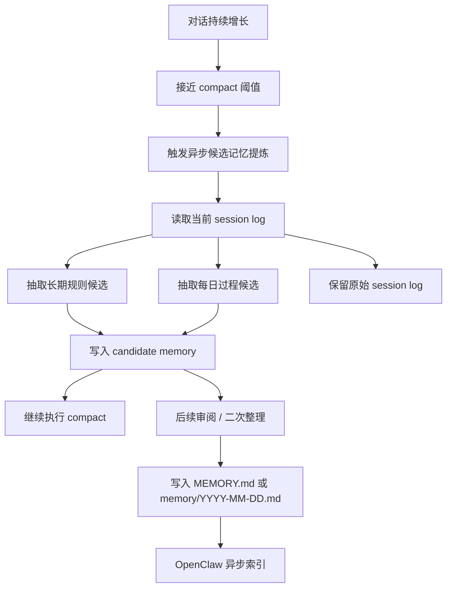
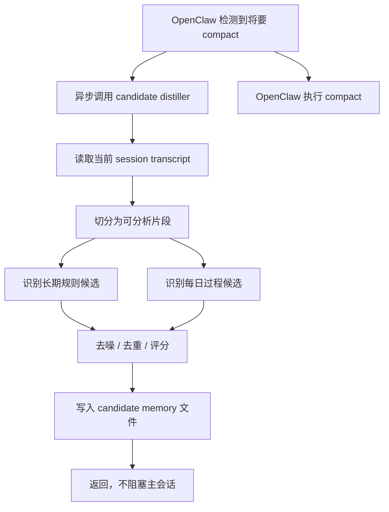

[English](pre-compaction-memory-distillation-design.md) | [中文](pre-compaction-memory-distillation-design.zh-CN.md)

# Compact 前对话记忆沉淀方案

## 这份文档回答什么问题

这份文档要解决的是：

> 对话里明明经常出现重要信息，为什么没有稳定变成长记忆？  
> 能不能在 `context compact` 之前，用一次异步整理，把真正重要的信息保下来？

结论先说：

**可以，而且这是当前最合理的主方案之一。**

原因是：

- 不需要每轮都做，开销更低
- `compact` 前信息最完整，丢失风险最低
- 可以保留 `session log` 作为原始底稿，后续还能重新分析
- 可以先产出“候选记忆”，而不是粗暴直接写入正式长期记忆

---

## 问题是什么

现在真实系统里，记忆其实分成了 3 层：

1. **当前轮上下文**
   解决“这一轮模型看到了什么”

2. **session log**
   解决“原始对话有没有被保留下来”

3. **正式长期记忆**
   解决“以后还能不能稳定被检索和复用”

当前痛点就在于：

- 很多重要信息只存在于 `session log`
- `context engine` 能让当前轮更聪明，但不自动等于“正式沉淀”
- 如果等 compaction 之后再整理，很多细节已经被压缩掉了

所以核心问题不是“OpenClaw 有没有日志”，而是：

> **对话里有价值的信息，什么时候、以什么形式，从日志升级成长期记忆？**

---

## 为什么选在 compact 之前

### 1. 这时信息最完整

`compact` 之前，原始对话还在，包含：

- 用户原话
- 助手给出的结论
- 多轮协商形成的稳定偏好
- 阶段性决策

一旦进入 compaction，很多细节会被压缩成更短摘要。

所以从“尽量减少信息丢失”的角度，最佳窗口就是：

**接近 compact，但还没 compact 的时候。**

### 2. 不需要每轮都做

如果每轮都提炼记忆，会有几个问题：

- 开销高
- 大多数轮次其实没有值得沉淀的新信息
- 噪音很多
- 容易把“过程性表达”误写成长期规则

而 `compact` 前做一次异步整理，更像：

> 会话到一个阶段了，先把重要内容拎出来，再压缩历史上下文。

### 3. 这和 compaction 的职责天然相邻

compaction 本来就在处理：

- 旧上下文太长
- 需要压缩
- 需要减少历史负担

那在进入压缩前，先做一次“记忆提炼”，逻辑上非常自然。

---

## 为什么必须保留 session log

这是这套方案里非常重要的一点。

`session log` 不能被候选记忆替代，它本身就有价值：

- 候选提炼逻辑以后会变，旧日志还能重跑新策略
- 某些信息当下看不重要，后面回看可能很重要
- 提炼有误时，可以回到原始上下文复核
- 未来如果要做更强的 LLM 记忆整理，也必须有原始材料

所以正确分层不是：

```text
聊天 -> 直接写 MEMORY.md
```

而应该是：

```text
聊天 -> session log -> 候选记忆 -> 正式长期记忆
```

一句话：

> `session log` 是原始底稿，不该被省略。

---

## 目标方案

### 总体目标

我们不是要“把所有聊天自动塞进长期记忆”，而是要做一条更稳的链路：

1. 保留原始对话
2. 在 `compact` 前异步抽取候选记忆
3. 把候选记忆分层
4. 后续再决定哪些升级成正式长期记忆

---

## 首要原则

### 1. 优先保留用户事实，不要把事实硬编码成助手策略

这是这条链路后面要一直遵守的第一原则。

例如：

- 用户原话：`我爱吃牛排`

更好的记忆表达应该优先是：

- `用户爱吃牛排`

而不是直接改写成：

- `以后聊吃饭、订餐、选餐厅，我会默认把牛排放进优先选项里`

原因是：

- 前者是**稳定事实**
- 后者是**助手策略推导**
- 事实比策略更通用、更可复用、更不容易过拟合

所以后面无论做：

- session-memory 提炼
- candidate memory 生成
- 双格式存储
- 正式长期记忆升级

都应该优先保留：

- 用户主体事实
- 用户明确偏好
- 用户稳定背景

只有在需要单独记录工作规则时，才额外记录助手侧策略，而不是拿策略替代事实。

---

## 整体流程图



这张图里有两个关键点：

- **session log 继续保留**
- **compact 前先写 candidate memory，不直接写正式长期记忆**

---

## 分层设计

### 第 1 层：session log

这是原始事实层。

特点：

- 不做人工提炼
- 保留完整上下文
- 是之后重新分析的基础

### 第 2 层：candidate memory

这是本方案新增的关键层。

建议形式：

- `memory/candidates/YYYY-MM-DD/<session-id>.md`
  或
- 插件自己的 `reports/` / `artifacts/` 目录里先存

这一层保存的是：

- 候选长期规则
- 候选阶段结论
- 候选项目进展
- 候选用户偏好

但它们还**不是正式长期记忆**。

### 第 3 层：正式长期记忆

最终进入：

- `MEMORY.md`
- `memory/YYYY-MM-DD.md`

这一层才是之后稳定检索的正式记忆来源。

---

## 和当前 context 排序策略的关系

这条候选记忆沉淀链路，后面会和当前 context 组装共用同一套优先级原则：

1. **相关性第一**
2. **最近 session 第二**
3. **`MEMORY.md` 保底**

也就是说：

- 最近 session 里的候选记忆，不会因为“近”就自动压过一切
- 只有在和当前问题强相关时，近期内容才应该前排
- 对于长期偏好、稳定规则、长期背景类问题，`MEMORY.md` 仍然要保底

这能避免一个常见问题：

> 刚聊过的过程性内容，压过真正稳定的重要规则。

---

## 触发时机设计

第一版建议只做这几个触发点：

### 触发点 A：compact 前

这是主触发点，也是这份方案的核心。

优点：

- 信息完整
- 时机稳定
- 成本可控

### 触发点 B：会话结束 / reset 前

如果某轮没有触发 compact，但会话结束了，也值得补一次。

### 触发点 C：显式阶段完成

例如：

- 完成一个项目阶段
- 完成一组调试
- 明确形成一个结论

这种可以作为后续增强点，不建议第一版就做太重。

---

## 第一版的最小可行方案

第一版不要直接做全自动写入正式记忆。

第一版应该只做：

1. 在 `compact` 前异步触发
2. 读取当前 session 的最近窗口
3. 抽取候选长期规则和候选每日结论
4. 写入 candidate memory 文件
5. 不阻塞主链路

也就是说，第一版目标不是：

- 自动完美记忆

而是：

- **先把原本会丢的东西，在 compact 前稳定拎出来**

---

## 详细调用链路



这张图强调的是：

- **异步**
- **不阻塞**
- **先写候选层**

---

## 为什么不直接自动写 MEMORY.md

因为风险太高。

聊天内容里天然包含：

- 临时说法
- 未确认结论
- 过程性废话
- 被后续推翻的判断

如果一上来就自动写 `MEMORY.md`，很容易把长期记忆污染掉。

所以更合理的升级路径是：

```text
session log
-> candidate memory
-> 审阅 / 再提炼
-> 正式长期记忆
```

---

## 这套方案会不会丢失信息

### 会比现在少很多

因为在 `compact` 前整理，已经比 `compact` 后再整理稳得多。

### 但不是 100% 零丢失

因为任何“提炼”都有判断误差。

所以真正的保险来自 3 层兜底：

1. `session log` 保留原始内容
2. `candidate memory` 保留 compact 前提炼结果
3. `MEMORY.md / memory/*.md` 保留最终正式沉淀

只要这三层都在，整体风险就可控。

---

## 我们接下来开发什么

### 第一阶段

目标：

- 把“compact 前异步候选提炼”做出来

具体做法：

1. 给 distiller 明确输入格式
2. 定义 candidate memory 文件格式
3. 接入 compact 前触发点
4. 保证不阻塞主链路

### 第二阶段

目标：

- 提升候选质量

具体做法：

1. 更强的去噪
2. 多轮合并判断
3. 长期规则 vs 每日记忆更细粒度分类

### 第三阶段

目标：

- 半自动升级为正式长期记忆

具体做法：

1. candidate -> review -> promote
2. 审阅后写入 `MEMORY.md`
3. 审阅后写入 `memory/YYYY-MM-DD.md`

---

## 一句话总结

如果只记一件事，就记这个：

> 最合理的做法不是“每轮都提炼记忆”，而是“在 compact 之前异步提炼候选记忆，同时保留 session log 作为原始底稿，再把真正重要的内容升级成正式长期记忆”。
