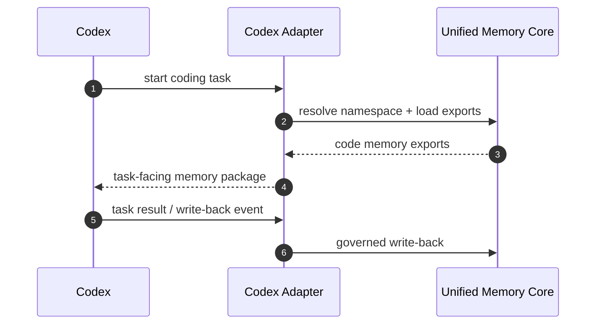
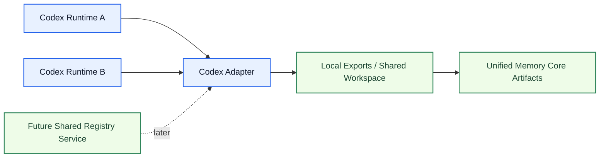

# Codex Adapter Architecture

[English](codex-adapter.md) | [中文](codex-adapter.zh-CN.md)

## Purpose

`Codex Adapter` lets Codex consume and contribute governed shared memory through `Unified Memory Core`.

Its main target is:

`shared code memory with explicit project / user / namespace binding`

Related documents:

- [../deployment-topology.md](../deployment-topology.md)
- [../../code-memory-binding-architecture.md](../../code-memory-binding-architecture.md)

## What It Owns

- code-memory namespace binding
- Codex-facing export projection rules
- Codex read-before-task flow
- Codex write-back event mapping
- multi-runtime-safe code-memory binding rules

## What It Does Not Own

- shared artifact truth
- source ingestion
- OpenClaw-specific behavior

## Core Responsibilities

1. map user + project + namespace
2. load shared code memory before coding tasks
3. write back governed events after coding tasks
4. stay compatible with standalone and embedded execution paths
5. keep the adapter usable across one-host and future multi-host deployments

## Core Flow

## Runtime Modes

The adapter should support:

1. `single-runtime local mode`
2. `multi-runtime shared-workspace mode`

It should be prepared for:

3. `shared-registry multi-host mode`

## Network-Ready Boundaries

The adapter should not assume:

- Codex is the only consumer
- one project maps to one active runtime
- write-back is always single-threaded

So the binding layer must preserve:

- stable project / workspace / user mapping
- namespace-scoped export reads
- explicit write-back event schemas
- serialized governed writes by namespace

## Cross-Tool Sharing Notes

The adapter should be able to share one code-memory namespace with:

- OpenClaw code agents
- future Claude adapters
- standalone CLI jobs

without directly coupling runtime internals across tools.

## Required Boundaries

The adapter must keep separate:

- Codex task runtime
- shared memory contracts
- write-back governance rules

## Initial Build Boundary

The first implementation wave should support:

1. code-memory namespace model
2. read-before-task contract
3. write-after-task event contract
4. adapter compatibility tests
5. multi-runtime-safe write-back rules in local-first mode

## Done Definition

This module is ready for implementation when:

- code memory binding is explicit
- read/write contract is explicit
- project/user binding rules are explicit
- adapter test surfaces are defined
- cross-tool and future networked deployment boundaries are explicit
