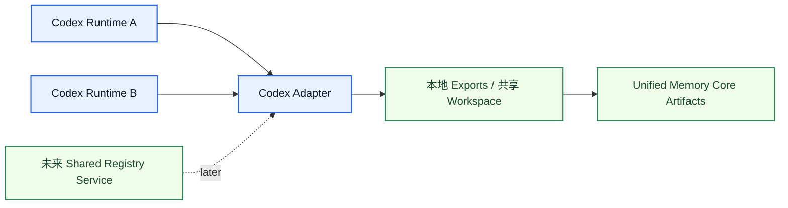

# Codex Adapter Architecture

[English](codex-adapter.md) | [中文](codex-adapter.zh-CN.md)

## 目的

`Codex Adapter` 负责让 Codex 通过 `Unified Memory Core` 消费和回写受治理的共享记忆。

它最核心的目标是：

`建立带 project / user / namespace 绑定的共享 code memory`

相关文档：

- [../deployment-topology.md](../deployment-topology.md)
- [../../code-memory-binding-architecture.md](../../code-memory-binding-architecture.md)

## 它负责什么

- code-memory namespace binding
- Codex-facing export projection rules
- Codex read-before-task flow
- Codex write-back event mapping
- 面向多 runtime 的 code-memory binding 规则

## 它不负责什么

- shared artifact truth
- source ingestion
- OpenClaw-specific behavior

## 核心职责

1. 绑定 user + project + namespace
2. 在 coding task 前加载 shared code memory
3. 在 coding task 后回写治理过的事件
4. 当 task-result metadata 提供结构化字段时，通过 `writeAfterTask(...)` 发出 governed accepted-action 证据
5. 当主模型同轮返回结构化 `memory_extraction` 时，通过 `writeAfterTask(...)` 发出实时 governed conversation-rule intake
6. 同时兼容 standalone 和 embedded 两条执行路径
7. 保持在单机与未来多主机场景下都可用

## 主流程

```mermaid
sequenceDiagram
    autonumber
    participant Codex
    participant Adapter as Codex Adapter
    participant Core as Unified Memory Core

    Codex->>Adapter: 开始 coding task
    Adapter->>Core: 解析 namespace 并加载 exports
    Core-->>Adapter: 返回 code memory exports
    Adapter-->>Codex: 返回 task-facing memory package
    Codex->>Adapter: 回传 task result / write-back event
    Adapter->>Core: 执行 governed write-back + 可选 accepted-action intake

## Accepted-Action Hook 边界

Codex adapter 现在有一条显式的写侧学习接缝：

- `writeAfterTask(...)` 仍会发出原来的 governed manual write-back event
- 同一个调用在 task-result metadata 带有显式 accepted-action 字段时，也会发出结构化 `accepted_action` 证据
- promotion 仍然受 reflection 和 lifecycle 规则治理，而不是 adapter-local 硬编码
```

## Reply + Memory-Extraction 边界

Codex adapter 现在还有第二条更轻量的写侧学习接缝：

- 同一轮主模型输出除了 `user_visible_reply`，还可以返回隐藏的 `memory_extraction`
- `writeAfterTask(...)` 在 `should_write_memory=true` 时会立即发出 governed source ingest，而不是等 nightly self-learning 补捞
- 当前实现已经把这条信号收口成正式 `memory_intent` source type，并显式保留 category / durability / confidence / admission_route / structured_rule
- 这条入口的目标是补上“普通对话显式规则”缺失的实时入口，而不是替代 `accepted_action`

相关设计详见：

- [realtime-memory-intent-ingestion.zh-CN.md](realtime-memory-intent-ingestion.zh-CN.md)

## 运行模式

这个 adapter 应支持：

1. `single-runtime local mode`
2. `multi-runtime shared-workspace mode`

并为后续：

3. `shared-registry multi-host mode`

保留演进空间。



## 面向网络演进的边界

这个 adapter 不应该假设：

- Codex 是唯一 consumer
- 一个 project 同时只会有一个 runtime
- write-back 永远是单线程

所以 binding 层必须保留：

- 稳定的 project / workspace / user mapping
- 以 namespace 为单位的 export reads
- 显式 write-back event schema
- 按 namespace 串行化的 governed writes

## 跨工具共享说明

这个 adapter 应能和下面这些消费者共享同一个 code-memory namespace：

- OpenClaw code agents
- 后续 Claude adapters
- standalone CLI jobs

但不能把这些工具的 runtime internals 直接绑死。

## 必须守住的边界

这个 adapter 必须清楚分开：

- Codex task runtime
- shared memory contracts
- write-back governance rules

## 第一阶段实现边界

第一批实现建议先支持：

1. code-memory namespace model
2. read-before-task contract
3. write-after-task event contract
4. adapter compatibility tests
5. local-first 模式下 multi-runtime-safe 的写回规则

## 完成标准

这个模块进入可开发状态的标准是：

- code memory binding 已明确
- read/write contract 已明确
- project/user binding rules 已明确
- adapter test surfaces 已定义
- 跨工具与未来网络化部署边界已明确
