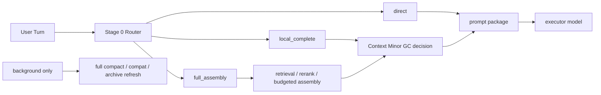

# Context Minor GC

[English](context-minor-gc.md) | [中文](context-minor-gc.zh-CN.md)

## Purpose

This document turns the per-turn context optimization line into one explicit program name:

- `Context Minor GC`

It is not a new stage plan. It is the convergence page that explains the already-completed Stage 6 / Stage 7 / Step 108 / Stage 9 chain:

- what is already done
- what is still left
- which document to read first

Related documents:

- [context-slimming-and-budgeted-assembly.md](context-slimming-and-budgeted-assembly.md)
- [dialogue-working-set-pruning.md](dialogue-working-set-pruning.md)
- [plugin-owned-context-decision-overlay.md](plugin-owned-context-decision-overlay.md)
- [../development-plan.md](../development-plan.md)
- [../../../roadmap.md](../../../roadmap.md)

## Current Status

Read this section first.

| Item | Current State |
| --- | --- |
| Stage 6 shadow runtime | completed; still `default-off` + shadow-only |
| Stage 7 / Step 108 | completed; decision transport runs without modifying OpenClaw core |
| Stage 7 / `104` harder eval matrix | completed; live matrix `6 / 6` |
| Stage 9 guarded smart path | completed; still `default-off` / opt-in only |
| `Context Minor GC` itself | closed; no longer the current blocker |
| What is not finished | broader default active-path rollout and more aggressive router / task-state expansions remain future enhancements |

Short version:

`Context Minor GC` already completed the “can run, can be measured, can roll back, can close out” loop.
It was not widened into the default path, but that is a deliberate product boundary, not an unfinished closeout.

## Reading Order

If you only want to understand Minor GC progress and what remains, read in this order:

1. this page
2. [Stage 7 / Step 108 closeout](../../../../reports/generated/stage7-step108-context-minor-gc-closeout-2026-04-18.md)
3. [Stage 7 `Context Minor GC` closeout](../../../../reports/generated/stage7-context-minor-gc-closeout-2026-04-18.md)
4. [Stage 9 closeout](../../../../reports/generated/stage9-guarded-smart-path-closeout-2026-04-18.md)
5. [development plan](../development-plan.md)

## Short Conclusion

The `GC` here is not literal memory destruction. It means:

- reclaim raw context that no longer deserves prompt space on the hot path
- keep archive refresh / full compact / compat as low-frequency background safety nets

The goal is not to make the system compact more often. The goal is the opposite:

- keep normal long sessions alive without depending on `compact / compat`
- rely on lighter per-turn context management instead

What is already true now:

- `Context Minor GC` is the right public name for this workstream
- under the “do not modify OpenClaw host code” constraint, this route is already unblocked and closed
- `compact / compat` stays nightly or background-only

## Naming Definition

| Term | Meaning Here | What It Is Not |
| --- | --- | --- |
| `Context Minor GC` | lightweight per-turn reclamation and reshaping of the next-turn prompt working set | not permanent log deletion and not durable-memory deletion |
| `Full Compact / Compat` | low-frequency nightly or background cleanup, summarization, archiving, and safety fallback | not the default day-to-day survival mechanism |
| `Task State` | current task, open loops, unresolved constraints, carry-forward pins | not one ever-growing chat summary |
| `Thread Capsule` | archived topic summary, topic archive, or semantic pin that left the hot path | not a replacement for durable memory |

## Why The GC Analogy Helps

The analogy is useful because it:

1. separates per-turn hot-path pruning from low-frequency background cleanup
2. keeps the system focused on `minor` instead of jumping to `full compact` under pressure
3. forces `task state` to become a first-class layer instead of hiding inside bloated summaries
4. compresses the product goal into one sentence: normal sessions should survive through Context Minor GC, while compact / compat stays in the background

Hard boundary:

- this is an analogy for working-set management only
- not an analogy for destroying objects
- raw turns may leave the prompt while the session log stays
- durable-memory governance still belongs to a different lifecycle

## Layer Mapping

| Concept Layer | UMC Mapping | Current Status |
| --- | --- | --- |
| `L0 Hot Window` | recent raw turns / active working set | landed; Stage 6 / 7 / 9 all have evidence |
| `L1 Warm Topic Cache` | task-state ledger / current-topic summary / carry-forward pins | can still become more structured, but is no longer a Minor GC closeout blocker |
| `L2 Cold Topic Archive` | thread capsules / archived topic summaries | direction is valid; future enhancement, not a current blocker |
| `L3 Durable Memory` | governed registry / stable cards / rule cards | landed |
| `Minor GC` | per-turn working-set pruning + bounded local completion | closed; kept bounded and `default-off` |
| `Full Compact` | nightly or background compat / compact / archive refresh | kept as low-frequency safety net |

## What The Hot Path Should Look Like

The long-term target is still:

- `direct`
- `local_complete`
- `full_assembly`



Important:

- this is the long-term target shape
- it is not required for the already-finished Minor GC closeout
- router / task-state expansion is a future enhancement queue item

## The Former Main Blocker Is Closed

The hard blocker used to be transport and seam stability:

```text
OpenClaw run
  -> contextEngine.assemble()
     -> captureDialogueWorkingSetShadow()
        -> runWorkingSetShadowDecision()
           -> runtime.subagent.run()
              -> requires gateway request scope
              -> throw
```

That blocker is now closed through the plugin-owned decision runner:

- decision transport no longer depends on host `runtime.subagent`
- Step 108 is closed
- OpenClaw core no longer needs a forced change for this line

So the question “can Minor GC run without modifying OpenClaw core?” is already answered: yes.

## Adopted Shape

The current landed shape is:

- `Context Minor GC` owns the hot-path working-set control plane
- `plugin-owned context decision overlay` unties decision transport from the host seam
- `guarded smart path` provides a very narrow opt-in user benefit
- `compact / compat` stays in the background

## Evidence

This route is backed by closeout evidence:

- Stage 6 runtime shadow replay: `16 / 16`
- Stage 6 runtime shadow average reduction ratio: `0.4368`
- Stage 7 scorecard: captured `16 / 16`
- Stage 7 average raw reduction ratio: `0.4191`
- Stage 7 / Step 108 hermetic gateway: `5 / 5` captured
- Stage 7 / Step 108 local service smoke: `3 / 3` captured
- Stage 7 / `104` harder live matrix: `6 / 6`
- Stage 9 guarded live A/B: baseline `4 / 4`, guarded `4 / 4`
- Stage 9 guarded applied: `2 / 4`
- Stage 9 activation matched: `4 / 4`
- Stage 9 false activations: `0`
- Stage 9 missed activations: `0`

Meaning:

- the Minor GC direction is already stable
- the hardest “no OpenClaw core modification” transport question is already stable
- what remains is product-boundary work and future enhancement work, not closeout work

## What Still Remains

What remains should no longer be written as “finish Minor GC closeout”.

The real remaining work is:

1. keep the `Context Minor GC` operator scorecard green
2. keep the guarded seam `default-off` / opt-in only
3. only reopen these items under a new explicit product objective:
   - `task-state ledger + session cache`
   - `Stage 0 Router`
   - broader default-path rollout

## Final Verdict

The precise current verdict is:

- `Context Minor GC` is closed
- broader default active-path rollout is not opened
- `compact / compat` stays a low-frequency background fallback

In other words:

Minor GC is done.
What is not done is the decision to widen it into default user-facing behavior, and that belongs to a later product decision, not this closeout.
