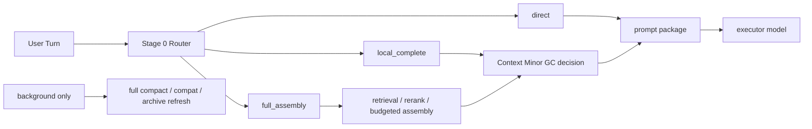

# Context Minor GC

[English](context-minor-gc.md) | [中文](context-minor-gc.zh-CN.md)

## Purpose

This document turns the per-turn context-optimization work into one explicit program name:

- `Context Minor GC`

It is the convergence note produced after reviewing the external `Compact GC` analogy together with the current Stage 6 / 7 / 9 UMC evidence.

Related documents:

- [context-slimming-and-budgeted-assembly.md](context-slimming-and-budgeted-assembly.md)
- [dialogue-working-set-pruning.md](dialogue-working-set-pruning.md)
- [plugin-owned-context-decision-overlay.md](plugin-owned-context-decision-overlay.md)
- [../development-plan.md](../development-plan.md)
- [../../../roadmap.md](../../../roadmap.md)

## Short Conclusion

`Context Minor GC` is a viable name for the current mainline, and the overall direction is feasible.

The `GC` here is not literal memory destruction. It means:

- reclaim raw context that no longer deserves next-turn prompt space on the hot path
- keep archive refresh / full compact / compat safety nets as low-frequency background work

The goal is not to make the system compact more often. The goal is the opposite:

- normal long sessions should avoid depending on `compact / compat`
- lighter per-turn context management should keep the session alive by default

If the constraint remains “do not modify OpenClaw host code”, the most reasonable route is:

- keep OpenClaw as the host shell
- let the UMC plugin self-host `memory + context decision`
- make `Context Minor GC` the hot-path control plane
- keep `compact / compat` as nightly or background-only safety nets

## Naming Definition

| Term | Meaning Here | What It Is Not |
| --- | --- | --- |
| `Context Minor GC` | lightweight per-turn reclamation and reshaping of the next-turn prompt working set | not permanent log deletion and not durable-memory deletion |
| `Full Compact / Compat` | low-frequency nightly or background cleanup, summarization, archiving, and safety fallback | not the default day-to-day survival mechanism |
| `Task State` | current task, open loops, unresolved constraints, carry-forward pins | not one ever-growing chat summary |
| `Thread Capsule` | archived topic summary, topic archive, or semantic pin that left the hot path | not a replacement for durable memory |

## Why The GC Analogy Helps

The analogy is useful for four reasons:

1. It separates hot-path per-turn reclamation from low-frequency background cleanup.  
2. It reminds us that the normal path should do `minor`, not jump to `full compact` whenever pressure rises.  
3. It forces `task state` to become a first-class layer instead of hiding inside bloated summaries.  
4. It compresses the product goal into one sharper sentence:  
   `normal sessions should survive through Context Minor GC, while compact / compat stays in the background.`

The analogy also has a hard boundary:

- it is only an analogy for working-set management
- it is not an analogy for destroying objects
- raw turns may leave the prompt, but the session log remains
- durable-memory governance, promotion, and decay still belong to a different lifecycle

## Layer Mapping

The cleaner mapping from the external `Compact GC` idea to the current UMC architecture is:

| Concept Layer | UMC Mapping | Current Status |
| --- | --- | --- |
| `L0 Hot Window` | recent raw turns / active working set | shadow / guarded evidence already exists |
| `L1 Warm Topic Cache` | task-state ledger / current-topic summary / carry-forward pins | still needs to be separated more clearly from chat-summary style state |
| `L2 Cold Topic Archive` | thread capsules / archived topic summaries | pins / capsules direction exists, but is not yet a first-class hot-path component |
| `L3 Durable Memory` | governed registry / stable cards / rule cards | already landed |
| `Minor GC` | per-turn working-set pruning + local completion | direction is validated, but not yet a default user-visible gain |
| `Full Compact` | nightly or background compat / compact / archive refresh | should stay available, but only as a low-frequency safety net |

## What The Hot Path Should Look Like

`Context Minor GC` should not mean “run one full compact step on every request”.

It should first go through a lightweight Stage 0 Router:

- `direct`
  - the topic is clearly continuous, task state is simple, and the working set is already light enough
- `local_complete`
  - no full retrieval is needed, but one bounded minor-gc decision is still useful
- `full_assembly`
  - full retrieval / rerank / budgeted assembly / minor-gc coordination is required



The key idea in this picture is:

- `minor gc` is the hot-path control plane
- `full compact` is background work
- they are not the same operation

## Why It Is Not Fully Unblocked Yet

The evidence already shows that the blocker is no longer “can the LLM judge topic / working set?”

The current failure is transport and seam related:

```text
OpenClaw run
  -> contextEngine.assemble()
     -> captureDialogueWorkingSetShadow()
        -> runWorkingSetShadowDecision()
           -> runtime.subagent.run()
              -> requires gateway request scope
              -> throw
```

That means:

- `Context Minor GC` wants to enter the real hot path
- but the current decision transport is still tied to host `runtime.subagent`
- and that seam is not reliably available inside `contextEngine.assemble()`

That is why:

- we should not keep piling on more rules
- we should not assume that merely moving to a higher hook will solve it
- and we need to treat the transport problem as its own architecture slice

## Recommended Shape

The steadier current recommendation is:

- let `Context Minor GC` own the hot-path working-set control plane
- let the `plugin-owned context decision overlay` untie decision transport from the host seam

The target call stack should become:

```text
OpenClaw run
  -> UMC contextEngine.assemble()
     -> routeContextAssembly()
        -> direct | local_complete | full_assembly
     -> pluginOwnedDecisionRunner.run()
     -> session cache / task-state ledger / capsules
     -> assemble prompt package
```

The boundaries matter:

- `dialogue-working-set-pruning`
  - defines how raw turns leave the next-turn prompt
- `plugin-owned-context-decision-overlay`
  - solves how decision transport stops depending on host `subagent`
- `context-slimming-and-budgeted-assembly`
  - controls how durable-source artifacts enter under budget

In other words:

> `Context Minor GC` does not replace those three documents. It turns them into one unified, communicable, executable mainline.

## Relationship To Existing Documents

| Document | Place Inside `Context Minor GC` |
| --- | --- |
| [context-slimming-and-budgeted-assembly.md](context-slimming-and-budgeted-assembly.md) | durable-source half: answers “which memory artifacts should enter?” |
| [dialogue-working-set-pruning.md](dialogue-working-set-pruning.md) | hot-session raw-turn half: answers “which recent raw turns can leave?” |
| [plugin-owned-context-decision-overlay.md](plugin-owned-context-decision-overlay.md) | transport / seam half: answers “how to run this without modifying OpenClaw?” |

## Feasibility

This route is no longer speculative. It already has concrete evidence behind it:

- Stage 6 runtime shadow replay: `16 / 16`
- runtime shadow average reduction ratio: `0.4368`
- Stage 7 scorecard: captured `16 / 16`
- Stage 7 average raw reduction ratio: `0.4191`
- Stage 9 guarded A/B: baseline `5 / 5`, guarded `5 / 5`

These numbers imply:

- the `Context Minor GC` direction is sound
- working-set decision itself is not the impossible part
- the remaining gaps are transport, router, and task-state structure, not another wave of hardcoded rules

Using the earlier implementation estimate, the engineering size still looks like:

- minimal spike: `500-800 LOC`
- first usable version: `900-1400 LOC`

## What Should Happen Next

Given the current constraints, the most reasonable order is:

1. implement the plugin-owned `decision runner`
2. add `task-state ledger + session cache`
3. land the `Stage 0 Router`
   - `direct`
   - `local_complete`
   - `full_assembly`
4. only then consider widening the guarded path beyond a very narrow opt-in surface

Under that sequence:

- `compact / compat` still exists
- but it stops being the default hot path
- `Context Minor GC` becomes the first survival mechanism for everyday long sessions

## Final Verdict

The overall direction is feasible, and it is now worth naming it formally:

- `Context Minor GC`

The real reason is not that the analogy sounds nice. The reason is that it locks the product goal:

- normal sessions survive through per-turn context management
- compat / compact stays low-frequency and background-only

If we keep the “do not modify OpenClaw” constraint, the preferred implementation path for `Context Minor GC` should remain:

- `plugin-owned memory + context decision overlay`

instead of betting the mainline on the host seam again.
