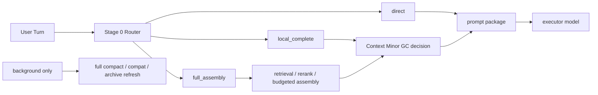

# Context Minor GC

[English](context-minor-gc.md) | [中文](context-minor-gc.zh-CN.md)

## Purpose

This document turns the per-turn context optimization line into one explicit program name:

- `Context Minor GC`

It also makes two status changes explicit:

- `Stage 11: Context Minor GC And Codex Integration` is now formally closed
- `Context Minor GC` is no longer only a “can run” capability line; it remains one of the ongoing main optimization tracks for `light-and-fast / prompt thickness / answer latency / operator simplicity`

So this page no longer answers “what is still unfinished inside Minor GC?”
It now answers:

1. what `Context Minor GC` actually finished
2. why its core capability can now be treated as closed
3. how it differs from `compact / compat`
4. why this line remains an ongoing optimization track even after closeout

Related documents:

- [context-slimming-and-budgeted-assembly.md](context-slimming-and-budgeted-assembly.md)
- [dialogue-working-set-pruning.md](dialogue-working-set-pruning.md)
- [plugin-owned-context-decision-overlay.md](plugin-owned-context-decision-overlay.md)
- [../development-plan.md](../development-plan.md)
- [../../../roadmap.md](../../../roadmap.md)

## Current Status

Read this section first.

| Item | Current State |
| --- | --- |
| Stage 6 shadow runtime | completed; stays `default-off` + shadow-only |
| Stage 7 / Step 108 | completed; decision transport runs without modifying OpenClaw core |
| Stage 7 / `104` harder eval matrix | completed; live matrix `6 / 6` |
| Stage 9 guarded smart path | completed; stays `default-off` / opt-in only |
| Codex Context Minor GC live matrix | completed; `4 / 4` |
| `Context Minor GC` core capability | closed |
| Stage 11 | completed; OpenClaw host-visible closeout is now covered |
| Next separate stage | `Stage 12: Realtime Memory Intent Productization` |

Short version:

`Context Minor GC` now completed the “can run, can be measured, can roll back” loop across both OpenClaw and Codex; and on the OpenClaw side the host-visible closeout bar is now met, so `Stage 11` is closed.

## Why This Line Now Deserves Top Billing
The final closeout bar for `Stage 11` was:

1. the full GC path is usable
2. users can feel a clear and stable benefit
3. rollback boundaries remain explicit

Current result:

| Bar | Final Result |
| --- | --- |
| GC is usable | OpenClaw + Codex both consume the same decision contract / shadow / guarded seam |
| User benefit is visible | in the OpenClaw long-session Docker threshold A/B, baseline stays above the compact-proxy danger line after the topic switch while guarded pulls post-switch prompt size back below threshold without manual `compact` |
| Rollback boundary stays explicit | guarded remains `default-off` / opt-in only |

The decisive new evidence is no longer just “the reduction ratio looks good.”
It is a host-visible A/B that is much closer to real product feel:

- baseline enters the compact-proxy danger zone early in one long dense topic and stays thick even after a topic switch
- guarded, on the same continuous long conversation, pulls the actual LLM prompt back below threshold after the switch
- the whole probe runs without manual `compact`

That makes `Context Minor GC` more than an internal algorithm success. It is now a user-facing “stay alive longer without compact” capability.

## Reading Order

If you only want to understand Minor GC progress and the final answer, read in this order:

1. this page
2. [Stage 7 / Step 108 closeout](../../../../reports/generated/stage7-step108-context-minor-gc-closeout-2026-04-18.md)
3. [Stage 7 `Context Minor GC` closeout](../../../../reports/generated/stage7-context-minor-gc-closeout-2026-04-18.md)
4. [Stage 9 closeout](../../../../reports/generated/stage9-guarded-smart-path-closeout-2026-04-18.md)
5. [Codex Context Minor GC Live Matrix](../../../../reports/generated/codex-context-minor-gc-live-2026-04-18/report.md)
6. [Stage 11 closeout report](../../../../reports/generated/stage11-context-minor-gc-and-codex-integration-closeout-2026-04-18.md)
7. [OpenClaw Near-Compaction Threshold Docker A/B](../../../../reports/generated/openclaw-guarded-session-probe-threshold-docker-2026-04-19.md)

## Short Conclusion

The `GC` here is not literal memory destruction. It means:

- reclaim raw context that no longer deserves prompt space on the hot path
- keep archive refresh / full compact / compat as low-frequency background safety nets

The goal is not to compact more often. It is the opposite:

- normal long sessions should not depend on `compact / compat`
- lighter per-turn context management should keep them alive

## Naming Definition

| Term | Meaning Here | What It Is Not |
| --- | --- | --- |
| `Context Minor GC` | lightweight per-turn reclamation and reshaping of the next-turn prompt working set | not permanent log deletion and not durable-memory deletion |
| `Full Compact / Compat` | low-frequency nightly or background cleanup, summarization, archiving, and safety fallback | not the default day-to-day survival mechanism |
| `Task State` | current task, open loops, unresolved constraints, carry-forward pins | not one ever-growing chat summary |
| `Thread Capsule` | archived topic summary, topic archive, or semantic pin that left the hot path | not a replacement for durable memory |

## Why The GC Analogy Helps

The analogy is useful because it:

1. separates per-turn hot-path pruning from low-frequency background cleanup
2. keeps the system focused on `minor` instead of jumping to `full compact` under pressure
3. forces `task state` to become a first-class layer instead of hiding inside bloated summaries
4. compresses the product goal into one sentence:
   `normal sessions should survive through Context Minor GC while compact / compat stays in the background`

## Layer Mapping

| Concept Layer | UMC Mapping | Current Status |
| --- | --- | --- |
| `L0 Hot Window` | recent raw turns / active working set | landed |
| `L1 Warm Topic Cache` | task-state ledger / current-topic summary / carry-forward pins | can still evolve, but no longer blocks closeout |
| `L2 Cold Topic Archive` | thread capsules / archived topic summaries | valid future enhancement |
| `L3 Durable Memory` | governed registry / stable cards / rule cards | landed |
| `Minor GC` | per-turn working-set pruning + bounded local completion | closed |
| `Full Compact` | nightly or background compat / compact / archive refresh | retained as low-frequency safety net |

## What The Hot Path Should Look Like

The long-term target is still:

- `direct`
- `local_complete`
- `full_assembly`



Important:

- this is the long-term target shape
- it is not required for the already-finished closeout
- router / task-state expansion is still future work

## The Former Main Blocker Is Closed

The hard blocker used to be decision transport and seam stability:

```text
OpenClaw run
  -> contextEngine.assemble()
     -> captureDialogueWorkingSetShadow()
        -> runWorkingSetShadowDecision()
           -> runtime.subagent.run()
              -> requires gateway request scope
              -> throw
```

That blocker is now closed through the plugin-owned decision runner:

- decision transport no longer depends on host `runtime.subagent`
- Step 108 is closed
- OpenClaw core does not need a forced change for this line

So the question “can Minor GC run without modifying OpenClaw core?” is already answered:
yes.

## Adopted Shape

The landed shape is:

- `Context Minor GC` owns the hot-path working-set control plane
- `plugin-owned context decision overlay` unties decision transport from the host seam
- `guarded smart path` provides a very narrow opt-in user gain
- `compact / compat` stays in the background

## Evidence

This route now has formal closeout evidence:

- Stage 6 runtime shadow replay: `16 / 16`
- Stage 7 scorecard: captured `16 / 16`
- Stage 7 / Step 108 hermetic gateway: `5 / 5`
- Stage 7 / Step 108 local service smoke: `3 / 3`
- Stage 7 / `104` harder live matrix: `6 / 6`
- Stage 9 guarded live A/B: baseline `4 / 4`, guarded `4 / 4`
- Stage 9 guarded applied: `2 / 4`
- Codex live matrix: baseline `4 / 4`, minor-gc `4 / 4`
- Codex guarded applied: `2`
- Codex applied-only prompt reduction ratio: `0.2939`

Together these numbers mean:

- the Minor GC direction is stable
- the OpenClaw side is no longer a blocker
- the Codex bridge is no longer a blocker
- the OpenClaw-side user value of “less dependence on compact during longer sessions” is now explicitly proven

One especially product-facing proof surface now matters:

- [OpenClaw Near-Compaction Threshold Docker A/B](../../../../reports/generated/openclaw-guarded-session-probe-threshold-docker-2026-04-19.md)
  - baseline first threshold cross turn: `3`
  - baseline postSwitchMin: `18039`
  - guarded postSwitchMin: `13186`
  - guarded postSwitch savings vs baseline: `0.269`
  - `compactAvoidedByGuarded: true`

## What Still Remains

`Stage 11` is closed, but this line does not stop here.

The more accurate framing is that `Context Minor GC` remains one of the ongoing optimization tracks, with the focus no longer on “can it work at all?” but on continued improvement of:

1. switch-turn and high-pressure long-session answer latency
2. prompt rebound after a topic switch
3. operator/debug clarity
4. keeping the OpenClaw and Codex scorecards, matrices, and guarded boundary green over time

## Final Judgment

The shortest judgment is:

- `Context Minor GC` as a core capability is done
- `Stage 11` as the “capability + user-visible experience” umbrella is also done
- this line continues as a long-running optimization track, but it no longer blocks `Stage 12`
