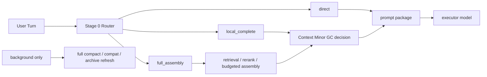

# Context Minor GC

[English](context-minor-gc.md) | [中文](context-minor-gc.zh-CN.md)

## 目的

这份文档把“逐轮 context 优化”正式收成一个对外可沟通、对内可执行的工作名：

- `Context Minor GC`

它是在复盘外部 `Compact GC` 思路、结合当前 `Unified Memory Core` 的 Stage 6 / 7 / 9 证据后，对现有设计做的一次收敛说明。

相关文档：

- [context-slimming-and-budgeted-assembly.zh-CN.md](context-slimming-and-budgeted-assembly.zh-CN.md)
- [dialogue-working-set-pruning.zh-CN.md](dialogue-working-set-pruning.zh-CN.md)
- [plugin-owned-context-decision-overlay.zh-CN.md](plugin-owned-context-decision-overlay.zh-CN.md)
- [../development-plan.zh-CN.md](../development-plan.zh-CN.md)
- [../../../roadmap.zh-CN.md](../../../roadmap.zh-CN.md)

## 最短结论

`Context Minor GC` 可以作为当前这条主线的正式工作名，而且总体思路是可行的。

这里的 `GC` 不是字面意义上的“销毁记忆”，而是：

- 在热路径上，逐轮回收已经不该继续占用 prompt 的 raw context
- 在后台，低频做 archive refresh / full compact / compat safety net

它的目标不是让系统“更频繁 compact”，而是反过来：

- 让日常长对话尽量不需要依赖 `compact / compat`
- 靠更轻的逐轮 context 管理，让会话自己持续下去

如果保持“不修改 OpenClaw 宿主”这个约束，那么当前最合理的落地路线就是：

- OpenClaw 继续当宿主外壳
- UMC 插件自托管 `memory + context decision`
- `Context Minor GC` 作为热路径控制面
- `compact / compat` 只留在夜间或后台

## 命名定义

| 术语 | 在这里的意思 | 不是什么 |
| --- | --- | --- |
| `Context Minor GC` | 每轮对“下一轮 prompt 工作集”做轻量回收和重组 | 不是永久删除日志，也不是删长期记忆 |
| `Full Compact / Compat` | 夜间或后台的低频整理、汇总、归档、安全兜底 | 不是日常热路径的默认续命机制 |
| `Task State` | 当前任务、open loop、未完成约束、carry-forward pins | 不是一份越来越大的聊天摘要 |
| `Thread Capsule` | 已切出热路径的话题摘要、topic archive、语义 pin | 不是 durable memory 的替代品 |

## 为什么用 GC 类比

这个类比的价值主要有 4 个：

1. 它能把“热路径逐轮裁剪”和“后台低频整理”明确拆开。  
2. 它能提醒我们：日常路径应该优先做 `minor`，而不是一遇到压力就 `full compact`。  
3. 它能迫使系统把 `task state` 和“聊天摘要”分开，不再靠一份越来越厚的 summary 续命。  
4. 它能帮助产品目标对齐到一句更清楚的话：  
   `平时靠 Context Minor GC 维持长对话，compact / compat 只做后台保底。`

这个类比也有边界：

- 它只类比“工作集管理”
- 不类比“对象真实回收”
- raw turns 可以离开 prompt，但 session log 仍保留
- durable memory 的治理、promotion、decay 还是另一套生命周期

## 分层映射

把外部 `Compact GC` 思路映射到当前 UMC，更合理的对应关系是：

| 概念层 | UMC 对应层 | 当前状态 |
| --- | --- | --- |
| `L0 Hot Window` | recent raw turns / active working set | 已有 shadow / guarded path 和 replay 证据 |
| `L1 Warm Topic Cache` | task-state ledger / current topic summary / carry-forward pins | 还需要从“聊天摘要”中进一步剥离成显式结构层 |
| `L2 Cold Topic Archive` | thread capsules / archived topic summaries | 已有 pins / capsules 方向，但还没成为正式热路径组件 |
| `L3 Durable Memory` | governed registry / stable cards / rule cards | 已落地 |
| `Minor GC` | 每轮 working-set pruning + local completion | 已验证方向，尚未成为默认用户收益 |
| `Full Compact` | 夜间或后台 compat / compact / archive refresh | 应继续保留，但只做低频 safety net |

## 当前热路径应该长什么样

`Context Minor GC` 最理想的热路径，不应该是“所有请求都走一次完整 compact”。

它应该先经过一个很轻的 Stage 0 Router：

- `direct`
  - 当前话题连续、任务状态简单、working set 本身够轻
- `local_complete`
  - 不需要完整 retrieval，但要做一次 bounded minor-gc decision
- `full_assembly`
  - 需要完整 retrieval / rerank / budgeted assembly / minor-gc coordination



这张图里真正的重点是：

- `minor gc` 是热路径控制面
- `full compact` 是后台工作
- 两者不是一回事

## 当前为什么还没完全打通

当前已经证明，问题不在“LLM 会不会判断 topic / working set”，而在调用 seam。

现在的失败调用栈本质上是：

```text
OpenClaw run
  -> contextEngine.assemble()
     -> captureDialogueWorkingSetShadow()
        -> runWorkingSetShadowDecision()
           -> runtime.subagent.run()
              -> requires gateway request scope
              -> throw
```

也就是说：

- `Context Minor GC` 想进真实热路径
- 但当前 decision transport 还绑在宿主 `runtime.subagent`
- 这条 seam 在 `contextEngine.assemble()` 里并不稳定可用

这也是为什么：

- 不能只继续堆规则
- 也不能继续假设“高层 hook 再往上挪一层就够了”
- 而必须把 transport 问题单独拆出来

## 推荐实现形态

当前更稳的推荐形态是：

- `Context Minor GC` 负责热路径 working-set control plane
- `plugin-owned context decision overlay` 负责把 decision transport 从宿主 seam 上解开

目标调用栈应该收成：

```text
OpenClaw run
  -> UMC contextEngine.assemble()
     -> routeContextAssembly()
        -> direct | local_complete | full_assembly
     -> pluginOwnedDecisionRunner.run()
     -> session cache / task-state ledger / capsules
     -> assemble prompt package
```

这里的模块边界很关键：

- `dialogue-working-set-pruning`
  - 定义 raw turns 怎样离开下一轮 prompt
- `plugin-owned-context-decision-overlay`
  - 解决 decision transport 不再依赖宿主 `subagent`
- `context-slimming-and-budgeted-assembly`
  - 控制 durable-source 如何按预算进场

换句话说：

> `Context Minor GC` 不是替代这三份文档，而是把它们收成一个对外可理解、对内可执行的统一主线。

## 与现有文档的关系

| 文档 | 在 `Context Minor GC` 里的位置 |
| --- | --- |
| [context-slimming-and-budgeted-assembly.zh-CN.md](context-slimming-and-budgeted-assembly.zh-CN.md) | durable-source 半边：回答“哪些记忆产物该进来” |
| [dialogue-working-set-pruning.zh-CN.md](dialogue-working-set-pruning.zh-CN.md) | hot-session raw-turn 半边：回答“哪些近期原始轮次可以出去” |
| [plugin-owned-context-decision-overlay.zh-CN.md](plugin-owned-context-decision-overlay.zh-CN.md) | transport / seam 半边：回答“怎样不改 OpenClaw 也能把这条链路跑通” |

## 可行性判断

这条路线现在不是空想，而是已经有一部分证据：

- Stage 6 runtime shadow replay：`16 / 16`
- runtime shadow average reduction ratio：`0.4368`
- Stage 7 scorecard：captured `16 / 16`
- Stage 7 average raw reduction ratio：`0.4191`
- Stage 9 guarded A/B：baseline `5 / 5`、guarded `5 / 5`

这些数字说明：

- `Context Minor GC` 方向本身是对的
- working-set decision 不是不可做
- 当前主要缺口是 transport、router、task-state 结构层，而不是再多写一堆规则

如果按之前已经估过的工程量来算，这条线大致还是：

- 最小 spike：`500-800 LOC`
- 第一版可用：`900-1400 LOC`

## 下一步应该做什么

按照当前约束，最合理的顺序是：

1. 先实现插件内自托管 `decision runner`
2. 再补 `task-state ledger + session cache`
3. 再落 `Stage 0 Router`
   - `direct`
   - `local_complete`
   - `full_assembly`
4. 最后才考虑把 guarded path 从极窄 opt-in 往前推进

在这条顺序下：

- `compact / compat` 仍然存在
- 但它们不再是默认热路径
- `Context Minor GC` 才是日常长对话的第一生存机制

## 最终判断

这条思路总体可行，而且现在值得正式命名成：

- `Context Minor GC`

最关键的原因不是“GC 类比很好听”，而是它把目标钉死了：

- 平时靠逐轮 context 管理维持长对话
- compat / compact 只做低频后台保底

如果后续继续按“不改 OpenClaw”的路线走，那么 `Context Minor GC` 的首选实现方式仍然应该是：

- `plugin-owned memory + context decision overlay`

而不是继续把希望押在宿主 seam 上。
