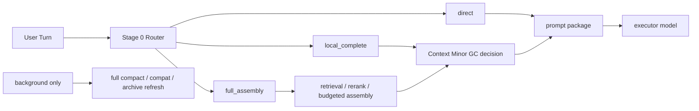

# Context Minor GC

[English](context-minor-gc.md) | [中文](context-minor-gc.zh-CN.md)

## 目的

这份文档把“逐轮 context 优化”正式收成一个对外可沟通、对内可执行的工作名：

- `Context Minor GC`

它不是新的阶段计划，而是把已经完成的 Stage 6 / Stage 7 / Step 108 / Stage 9 收成一条统一主线，并明确：

- 它已经完成到哪
- 现在还剩什么
- 应该按什么顺序阅读相关文档

相关文档：

- [context-slimming-and-budgeted-assembly.zh-CN.md](context-slimming-and-budgeted-assembly.zh-CN.md)
- [dialogue-working-set-pruning.zh-CN.md](dialogue-working-set-pruning.zh-CN.md)
- [plugin-owned-context-decision-overlay.zh-CN.md](plugin-owned-context-decision-overlay.zh-CN.md)
- [../development-plan.zh-CN.md](../development-plan.zh-CN.md)
- [../../../roadmap.zh-CN.md](../../../roadmap.zh-CN.md)

## 当前状态

先看这一节，不要先去翻旧报告。

| 项目 | 当前状态 |
| --- | --- |
| Stage 6 shadow runtime | 已完成，保持 `default-off` + shadow-only |
| Stage 7 / Step 108 | 已完成，不改 OpenClaw core 也能跑通 decision transport |
| Stage 7 / `104` harder eval matrix | 已完成，live matrix `6 / 6` |
| Stage 9 guarded smart path | 已完成，但继续保持 `default-off` / opt-in only |
| `Context Minor GC` 本身 | 已收口，不再是当前 blocker |
| 当前未完成的不是它本身 | 默认 active-path 用户收益、后续更激进的 router / task-state 扩展，仍然是未来增强队列 |

一句话：

`Context Minor GC` 这条线已经完成“可跑、可测、可回退、可收口”。
它没有被推进成默认路径，但那是产品边界，不是“还没做完”。

## 阅读顺序

如果你现在只想看清 `Minor GC` 的进展和后续工作，按这个顺序看：

1. 当前这页
   先看概念边界、已完成项、未完成项。
2. [Stage 7 / Step 108 收口报告](../../../../reports/generated/stage7-step108-context-minor-gc-closeout-2026-04-18.zh-CN.md)
   看“不改 OpenClaw core，怎么把 decision transport 打通”。
3. [Stage 7 `Context Minor GC` 收口报告](../../../../reports/generated/stage7-context-minor-gc-closeout-2026-04-18.zh-CN.md)
   看 `Minor GC` 为什么已经能正式关闭。
4. [Stage 9 收口报告](../../../../reports/generated/stage9-guarded-smart-path-closeout-2026-04-18.zh-CN.md)
   看 guarded smart path 为什么也已经关闭，但仍然保持 `default-off`。
5. [开发计划](../development-plan.zh-CN.md)
   看 `Minor GC` 收口后，仓库真正排队的下一条工作是什么。

## 最短结论

这里的 `GC` 不是字面意义上的“销毁记忆”，而是：

- 在热路径上，逐轮回收已经不该继续占用 prompt 的 raw context
- 在后台，低频做 archive refresh / full compact / compat safety net

它的目标不是让系统“更频繁 compact”，而是反过来：

- 让日常长对话尽量不需要依赖 `compact / compat`
- 靠更轻的逐轮 context 管理，让会话自己持续下去

当前已经成立的结论是：

- `Context Minor GC` 可以作为这条主线的正式工作名
- 在“不修改 OpenClaw 宿主”的约束下，这条路已经打通并收口
- `compact / compat` 继续只保留为夜间或后台 safety net

## 命名定义

| 术语 | 在这里的意思 | 不是什么 |
| --- | --- | --- |
| `Context Minor GC` | 每轮对“下一轮 prompt 工作集”做轻量回收和重组 | 不是永久删除日志，也不是删长期记忆 |
| `Full Compact / Compat` | 夜间或后台的低频整理、汇总、归档、安全兜底 | 不是日常热路径的默认续命机制 |
| `Task State` | 当前任务、open loop、未完成约束、carry-forward pins | 不是一份越来越大的聊天摘要 |
| `Thread Capsule` | 已切出热路径的话题摘要、topic archive、语义 pin | 不是 durable memory 的替代品 |

## 为什么用 GC 类比

这个类比的价值主要有 4 个：

1. 它能把“热路径逐轮裁剪”和“后台低频整理”明确拆开。  
2. 它能提醒我们：日常路径应该优先做 `minor`，而不是一遇到压力就 `full compact`。  
3. 它能迫使系统把 `task state` 和“聊天摘要”分开，不再靠一份越来越厚的 summary 续命。  
4. 它能把产品目标压成一句更清楚的话：
   `平时靠 Context Minor GC 维持长对话，compact / compat 只做后台保底。`

这个类比也有边界：

- 它只类比“工作集管理”
- 不类比“对象真实回收”
- raw turns 可以离开 prompt，但 session log 仍保留
- durable memory 的治理、promotion、decay 还是另一套生命周期

## 分层映射

把外部 `Compact GC` 思路映射到当前 UMC，更合理的对应关系是：

| 概念层 | UMC 对应层 | 当前状态 |
| --- | --- | --- |
| `L0 Hot Window` | recent raw turns / active working set | 已落地；Stage 6 / Stage 7 / Stage 9 都已有证据 |
| `L1 Warm Topic Cache` | task-state ledger / current topic summary / carry-forward pins | 仍可继续结构化，但已经不是 `Minor GC` 收口 blocker |
| `L2 Cold Topic Archive` | thread capsules / archived topic summaries | 方向成立；未来可增强，不影响当前 closeout |
| `L3 Durable Memory` | governed registry / stable cards / rule cards | 已落地 |
| `Minor GC` | 每轮 working-set pruning + bounded local completion | 已收口；保持 `default-off` / bounded rollout |
| `Full Compact` | 夜间或后台 compat / compact / archive refresh | 继续保留，但只做低频 safety net |

## 热路径应该长什么样

`Context Minor GC` 最理想的热路径，不应该是“所有请求都走一次完整 compact”。

长期更合理的目标形态仍然是：

- `direct`
  - 当前话题连续、任务状态简单、working set 本身够轻
- `local_complete`
  - 不需要完整 retrieval，但要做一次 bounded minor-gc decision
- `full_assembly`
  - 需要完整 retrieval / rerank / budgeted assembly / minor-gc coordination



注意：

- 这张图描述的是**长期理想形态**
- 不是说 `Stage 0 Router` 已经成为当前 closeout 的必需项
- 当前 closeout 已经完成；router / task-state 结构层属于未来增强，不是必须补完才算 Minor GC 完成

## 曾经的主要 blocker，现在已关闭

此前真正卡住的不是“LLM 会不会判断 topic / working set”，而是调用 seam。

当时的失败调用栈是：

```text
OpenClaw run
  -> contextEngine.assemble()
     -> captureDialogueWorkingSetShadow()
        -> runWorkingSetShadowDecision()
           -> runtime.subagent.run()
              -> requires gateway request scope
              -> throw
```

这个问题现在已经通过 `plugin-owned decision runner` 关闭：

- `Context Minor GC` 的 decision transport 不再依赖宿主 `runtime.subagent`
- `Step 108` 已经正式关闭
- OpenClaw core 不需要为这条链路再补一个强制改动

所以现在不该再继续问：

- `Minor GC` 能不能在不改 OpenClaw 的前提下跑通

这个问题已经有了明确答案：**能，而且已经收口。**

## 当前采用的实现形态

当前更稳、也已经落地的形态是：

- `Context Minor GC` 负责热路径 working-set control plane
- `plugin-owned context decision overlay` 负责把 decision transport 从宿主 seam 上解开
- `guarded smart path` 提供极窄的 opt-in 用户收益
- `compact / compat` 继续只留在夜间或后台

它对应的调用栈已经收成：

```text
OpenClaw run
  -> UMC contextEngine.assemble()
     -> routeContextAssembly()
        -> direct | local_complete | full_assembly
     -> pluginOwnedDecisionRunner.run()
     -> shadow / guarded decision
     -> assemble prompt package
```

这里的模块边界是：

- `dialogue-working-set-pruning`
  - 定义 raw turns 怎样离开下一轮 prompt
- `plugin-owned-context-decision-overlay`
  - 解决 decision transport 不再依赖宿主 `subagent`
- `context-slimming-and-budgeted-assembly`
  - 控制 durable-source 如何按预算进场

## 与现有文档的关系

| 文档 | 在 `Context Minor GC` 里的位置 |
| --- | --- |
| [context-slimming-and-budgeted-assembly.zh-CN.md](context-slimming-and-budgeted-assembly.zh-CN.md) | durable-source 半边：回答“哪些记忆产物该进来” |
| [dialogue-working-set-pruning.zh-CN.md](dialogue-working-set-pruning.zh-CN.md) | hot-session raw-turn 半边：回答“哪些近期原始轮次可以出去” |
| [plugin-owned-context-decision-overlay.zh-CN.md](plugin-owned-context-decision-overlay.zh-CN.md) | transport / seam 半边：回答“怎样不改 OpenClaw 也能把这条链路跑通” |

## 已有证据

这条路线现在不是方向判断，而是已经有正式 closeout 证据：

- Stage 6 runtime shadow replay：`16 / 16`
- Stage 6 runtime shadow average reduction ratio：`0.4368`
- Stage 7 scorecard：captured `16 / 16`
- Stage 7 average raw reduction ratio：`0.4191`
- Stage 7 / Step 108 hermetic gateway：`5 / 5` captured
- Stage 7 / Step 108 本机 service smoke：`3 / 3` captured
- Stage 7 / `104` harder live matrix：`6 / 6`
- Stage 9 guarded live A/B：baseline `4 / 4`、guarded `4 / 4`
- Stage 9 guarded applied：`2 / 4`
- Stage 9 activation matched：`4 / 4`
- Stage 9 false activations：`0`
- Stage 9 missed activations：`0`

这些数字的意思是：

- `Context Minor GC` 方向本身已经站稳
- 最困难的“不改 OpenClaw core 还能不能打通 transport”也已经站稳
- `Minor GC` 现在剩下的不是收口问题，而是产品边界和后续增强问题

## 现在还剩什么

剩下的工作，不应该再写成“继续做 Minor GC 收口”。

真正剩下的是：

1. 保持 `Context Minor GC` operator scorecard 长期为绿
2. 保持 guarded seam `default-off` / opt-in only
3. 只有在新的显式产品目标出现时，才重新打开以下增强项：
   - `task-state ledger + session cache`
   - `Stage 0 Router`
   - 更宽的 default-path rollout

所以如果你现在在看 roadmap / plan：

- 不要再把 Stage 7 / Step 108 / Stage 9 当成“正在进行”
- 它们都已经是**历史已收口链路**
- 当前真正的“下一步”已经切到别的切片了

## 最终判断

这条思路总体可行，而且当前状态可以压成一句更准确的话：

- `Context Minor GC` 已收口
- 默认 active-path 推广还没有开启
- `compact / compat` 继续只做低频后台保底

也就是说：

`Minor GC` 已经做完。
现在还没做的是“要不要把它进一步扩大成默认用户收益”，这属于下一轮产品决策，不属于本轮收口。
