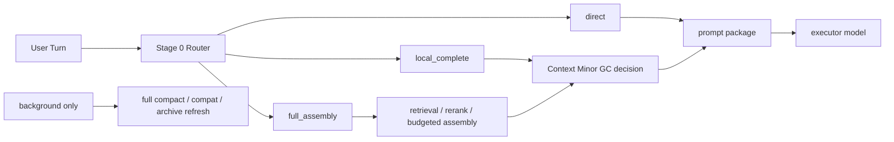

# Context Minor GC

[English](context-minor-gc.md) | [中文](context-minor-gc.zh-CN.md)

## 目的

这份文档把“逐轮 context 优化”正式收成一个对外可沟通、对内可执行的工作名：

- `Context Minor GC`

同时明确一件事：

- `Stage 11: Context Minor GC And Codex Integration` 现在已经关闭

所以这份文档不再回答“Minor GC 还没做完什么”，而是回答：

1. `Context Minor GC` 到底做完了什么
2. 为什么现在可以视为已收口
3. 它和 `compact / compat` 的边界是什么
4. 后续新工作为什么已经切到别的阶段

相关文档：

- [context-slimming-and-budgeted-assembly.zh-CN.md](context-slimming-and-budgeted-assembly.zh-CN.md)
- [dialogue-working-set-pruning.zh-CN.md](dialogue-working-set-pruning.zh-CN.md)
- [plugin-owned-context-decision-overlay.zh-CN.md](plugin-owned-context-decision-overlay.zh-CN.md)
- [../development-plan.zh-CN.md](../development-plan.zh-CN.md)
- [../../../roadmap.zh-CN.md](../../../roadmap.zh-CN.md)

## 当前状态

先看这一节，不要先翻旧报告。

| 项目 | 当前状态 |
| --- | --- |
| Stage 6 shadow runtime | 已完成；保持 `default-off` + shadow-only |
| Stage 7 / Step 108 | 已完成；不改 OpenClaw core 也能跑通 decision transport |
| Stage 7 / `104` harder eval matrix | 已完成；live matrix `6 / 6` |
| Stage 9 guarded smart path | 已完成；继续保持 `default-off` / opt-in only |
| Codex Context Minor GC live matrix | 已完成；`4 / 4` |
| `Context Minor GC` | 已收口 |
| Stage 11 | 已完成 |
| 当前最新阶段 | `Stage 12: Realtime Memory Intent Productization` |

一句话：

`Context Minor GC` 现在已经在 OpenClaw + Codex 两侧完成“可跑、可测、可回退、可收口”的闭环。

## Stage 11 为什么能关闭

`Stage 11` 的关闭标准现在很简单：

1. 整个 GC 可用
2. 用户端有明显收益
3. rollback boundary 仍然清楚

对应结果：

| 标准 | 当前结果 |
| --- | --- |
| GC 可用 | OpenClaw + Codex 都能消费同一套 decision contract / shadow / guarded seam |
| 用户收益 | OpenClaw 正例上 average package reduction ratio `0.4657`；Codex 正例上 prompt reduction ratio `0.4355` / `0.1522` |
| rollback boundary 清楚 | guarded 继续保持 `default-off` / opt-in only |

所以 `Stage 11` 现在已经关闭，不再是当前开发阶段。

## 阅读顺序

如果你现在只想看清 `Minor GC` 的进展和结论，按这个顺序看：

1. 当前这页
2. [Stage 7 / Step 108 收口报告](../../../../reports/generated/stage7-step108-context-minor-gc-closeout-2026-04-18.zh-CN.md)
3. [Stage 7 `Context Minor GC` 收口报告](../../../../reports/generated/stage7-context-minor-gc-closeout-2026-04-18.zh-CN.md)
4. [Stage 9 收口报告](../../../../reports/generated/stage9-guarded-smart-path-closeout-2026-04-18.zh-CN.md)
5. [Codex Context Minor GC Live Matrix](../../../../reports/generated/codex-context-minor-gc-live-2026-04-18/report.md)
6. [Stage 11 收口报告](../../../../reports/generated/stage11-context-minor-gc-and-codex-integration-closeout-2026-04-18.zh-CN.md)

## 最短结论

这里的 `GC` 不是字面意义上的“销毁记忆”，而是：

- 在热路径上，逐轮回收已经不该继续占用 prompt 的 raw context
- 在后台，低频做 archive refresh / full compact / compat safety net

目标不是让系统“更频繁 compact”，而是反过来：

- 让日常长对话尽量不需要依赖 `compact / compat`
- 靠更轻的逐轮 context 管理，让会话自己持续下去

## 命名定义

| 术语 | 在这里的意思 | 不是什么 |
| --- | --- | --- |
| `Context Minor GC` | 每轮对“下一轮 prompt 工作集”做轻量回收和重组 | 不是永久删除日志，也不是删长期记忆 |
| `Full Compact / Compat` | 夜间或后台的低频整理、汇总、归档、安全兜底 | 不是日常热路径的默认续命机制 |
| `Task State` | 当前任务、open loop、未完成约束、carry-forward pins | 不是一份越来越大的聊天摘要 |
| `Thread Capsule` | 已切出热路径的话题摘要、topic archive、语义 pin | 不是 durable memory 的替代品 |

## 为什么用 GC 类比

这个类比的价值主要有 4 个：

1. 它把“热路径逐轮裁剪”和“后台低频整理”明确拆开。
2. 它提醒我们：日常路径应该优先做 `minor`，而不是一遇到压力就 `full compact`。
3. 它迫使系统把 `task state` 和聊天摘要分开，不再靠一份越来越厚的 summary 续命。
4. 它把产品目标压成一句话：
   `平时靠 Context Minor GC 维持长对话，compact / compat 只做后台保底。`

## 分层映射

| 概念层 | UMC 对应层 | 当前状态 |
| --- | --- | --- |
| `L0 Hot Window` | recent raw turns / active working set | 已落地 |
| `L1 Warm Topic Cache` | task-state ledger / current topic summary / carry-forward pins | 可继续增强，但已不是 closeout blocker |
| `L2 Cold Topic Archive` | thread capsules / archived topic summaries | 方向成立，属于未来增强 |
| `L3 Durable Memory` | governed registry / stable cards / rule cards | 已落地 |
| `Minor GC` | 每轮 working-set pruning + bounded local completion | 已收口 |
| `Full Compact` | 夜间或后台 compat / compact / archive refresh | 继续保留，但只做低频 safety net |

## 热路径应该长什么样

长期更合理的目标形态仍然是：

- `direct`
- `local_complete`
- `full_assembly`



注意：

- 这张图描述的是长期理想形态
- 不是说 `Stage 0 Router` 已经成为当前 closeout 的必需项
- router / task-state 结构层仍然属于未来增强

## 曾经的主要 blocker，现在已关闭

此前真正卡住的是 decision transport seam：

```text
OpenClaw run
  -> contextEngine.assemble()
     -> captureDialogueWorkingSetShadow()
        -> runWorkingSetShadowDecision()
           -> runtime.subagent.run()
              -> requires gateway request scope
              -> throw
```

这个问题现在已经通过 `plugin-owned decision runner` 关闭：

- decision transport 不再依赖宿主 `runtime.subagent`
- `Step 108` 已正式关闭
- OpenClaw core 不需要为了这条链路再补一个强制改动

所以现在不该再问：

- `Minor GC` 能不能在不改 OpenClaw 的前提下跑通

答案已经是：**能，而且已经收口。**

## 当前采用的实现形态

当前稳定形态是：

- `Context Minor GC` 负责热路径 working-set control plane
- `plugin-owned context decision overlay` 负责把 decision transport 从宿主 seam 上解开
- `guarded smart path` 提供极窄的 opt-in 用户收益
- `compact / compat` 继续只留在夜间或后台

## 证据

这条路线现在有正式收口证据：

- Stage 6 runtime shadow replay：`16 / 16`
- Stage 7 scorecard：captured `16 / 16`
- Stage 7 / Step 108 hermetic gateway：`5 / 5`
- Stage 7 / Step 108 本机 service smoke：`3 / 3`
- Stage 7 / `104` harder live matrix：`6 / 6`
- Stage 9 guarded live A/B：baseline `4 / 4`，guarded `4 / 4`
- Stage 9 guarded applied：`2 / 4`
- Codex live matrix：baseline `4 / 4`，minor-gc `4 / 4`
- Codex guarded applied：`2`
- Codex applied-only prompt reduction ratio：`0.2939`

这些数字一起说明：

- `Context Minor GC` 方向本身已经站稳
- OpenClaw 侧 `Minor GC` 已经不是 blocker
- Codex 侧 bridge 也已经不是 blocker
- `Stage 11` 可以关闭

## 还剩什么

剩下的工作，不应该再写成“继续做 Minor GC 收口”。

更准确的说法是：

1. 持续保持 OpenClaw / Codex 两侧 `Context Minor GC` operator scorecard 为绿
2. 继续保持 guarded seam `default-off` / opt-in only
3. 当前真正的新主线切到 `Stage 12`：realtime memory intent productization

## 最终判断

最短判断是：

- `Context Minor GC` 作为能力，已经做完
- `Stage 11` 作为总阶段，也已经做完
- 它现在进入维护态，不再是当前最新大阶段
