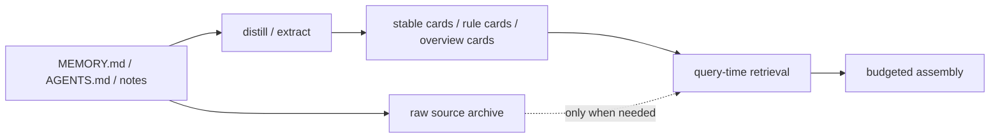
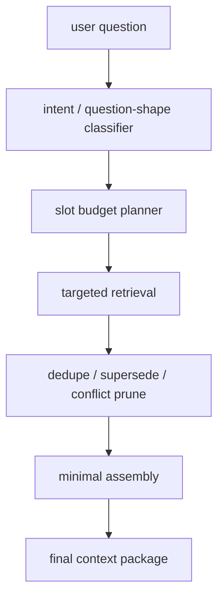

# Context Slimming And Budgeted Assembly

[English](context-slimming-and-budgeted-assembly.md) | [中文](context-slimming-and-budgeted-assembly.zh-CN.md)

## Purpose

This document answers two now-primary engineering questions:

1. Should `MEMORY.md`, `AGENTS.md`, and project notes keep entering host context in their raw form?
2. Even if memory recall is stronger, why does `openclaw` still slow down as context grows, and what should change?

The goal here is not to argue that recall is already “good enough”. The goal is to define the next architecture step:

- keep storage rich
- keep per-turn context sparse
- let only highly relevant information reach the model

Related documents:

- [openclaw-adapter.md](openclaw-adapter.md)
- [dialogue-working-set-pruning.md](dialogue-working-set-pruning.md)
- [execution-modes.md](execution-modes.md)
- [../testing/main-path-performance-plan.md](../testing/main-path-performance-plan.md)
- [../../../../reports/generated/unified-memory-core-full-regression-and-memory-improvement-2026-04-15.md](../../../../reports/generated/unified-memory-core-full-regression-and-memory-improvement-2026-04-15.md)

## Short Answer

### 1. `MEMORY.md` / `AGENTS.md` should be slimmed as prompt inputs, not crudely deleted

The right move is not:

- deleting long-term knowledge
- or forcing users to maintain an unnaturally tiny `MEMORY.md`

The right move is:

- treat static documents as **memory sources**
- consume only:
  - distilled stable cards
  - rule summaries
  - minimal supporting snippets

### 2. Per-turn context assembly should become budgeted

The next architecture should not be:

- retrieve more
- then try to compress later

It should be:

- identify what the question shape actually needs
- allocate slots and budgets first
- assemble the smallest correct context package

## Product Value Placement

This document is one half of the first product value:

- `on-demand context loading instead of flat prompt stuffing`

The current capability already exists in partial form:

- fact-first context assembly is already the product baseline
- retrieval / assembly fast paths are already stable enough to stop being the main bottleneck
- Stage 6 runtime shadow instrumentation is already landed on the hot-session side

What is missing is not proof that context matters. What is missing is the next selective policy layer that can turn those capabilities into a clearer product advantage over builtin flat-context behavior.

## Why This Matters Now

The current evidence already shows:

- plugin-side retrieval / assembly fast paths are still fast
- the slow path lives more in host answer-level execution, raw transport noise, and bloated prompt/context surfaces
- after `100` live A/B cases, direct answer-level uplift is still modest, which means retrieval quality alone is not enough

So the product question is no longer just:

> can Memory Core retrieve better?

It is also:

> can Memory Core decide to send much less?

## Current Measurable State

This proposal is grounded in the current evidence:

- isolated local answer-level formal gate: `12 / 12`
- deeper answer-level watch: `14 / 18`
- retrieval-heavy benchmark: `262 / 262`
- `100` live A/B cases after history cleanup: current `100 / 100`, legacy `99 / 100`, `1` UMC-only, `0` builtin-only, `0` shared failures
- main-path perf baseline:
  - retrieval / assembly avg `16ms`
  - raw transport avg `8061ms`
  - answer-level avg `11200ms`

These numbers imply:

- core retrieval is no longer the biggest current bottleneck
- host answer-level execution and context thickness deserve higher priority
- “retrieve more” alone will have diminishing returns

## Current Planning State

This architecture is no longer only a report conclusion. Its Stage 6 runtime shadow instrumentation is now landed as a `default-off`, shadow-only path:

- roadmap pointer: [../../../roadmap.md](../../../roadmap.md)
- development-plan pointer: [../development-plan.md](../development-plan.md)
- working-set validation package: [../../../../reports/generated/dialogue-working-set-validation-2026-04-16.md](../../../../reports/generated/dialogue-working-set-validation-2026-04-16.md)
- runtime shadow replay: [../../../../reports/generated/dialogue-working-set-runtime-shadow-2026-04-16.md](../../../../reports/generated/dialogue-working-set-runtime-shadow-2026-04-16.md)
- Stage 6 closeout report: [../../../../reports/generated/dialogue-working-set-stage6-2026-04-16.md](../../../../reports/generated/dialogue-working-set-stage6-2026-04-16.md)

The current decision is:

- start with a docs-first, review-gated Stage 6
- the first runtime slice is now landed as `default-off` shadow instrumentation
- keep final prompt mutation explicitly deferred
- use the shadow path to prove real-session `relation / evict / pins / reduction ratio` before any active-path cutover is discussed

In other words:

- this document still owns durable-source slimming and budgeted assembly
- but the immediate runtime slice starts with `dialogue working-set pruning` in shadow mode, not with a direct assembly cutover

## Non-Goals

This proposal does **not** currently try to:

- delete durable memory sources or encourage users to erase long-term knowledge “for speed”
- pretend that raw transport failures such as `missing_json_payload` or `empty_results` can be solved by assembly alone
- replace the retrieval / governance workstream; it raises “send less after retrieval” to the same priority
- depend on an unbounded LLM-only control loop on the main path; the preferred next shape is a bounded structured decision contract with hard runtime guardrails and cheap heuristics only as admission / fallback
- require users to immediately rewrite every `MEMORY.md` or `AGENTS.md`; distill + default-off raw-doc policy should solve most of the problem first

## Boundary With Dialogue Working-Set Pruning

This document is about slimming durable-source consumption and budgeting assembly.

It is not the whole answer to long multi-topic chats.

When the same session changes topic multiple times, even a good durable-memory assembly may still carry too many old raw turns. That narrower problem is handled by:

- [dialogue-working-set-pruning.md](dialogue-working-set-pruning.md)

Use the split this way:

- `context slimming and budgeted assembly`
  - decides which durable artifacts enter the final package
- `dialogue working-set pruning`
  - decides which raw recent turns can leave the next-turn prompt without deleting the log

## Core Principles

### 1. Storage can stay rich; prompts must stay sparse

Long-lived memory can keep growing.

Final prompts should not grow proportionally with it.

## Daily Runtime Goal

This track is not trying to make `compact / compat` more frequent.

The better target is:

- keep normal sessions sustainable through per-turn context slimming, budgeted assembly, and working-set management
- keep `compact / compat` only as a nightly or background safety net

If you want an engineering analogy, it is closer to:

- incremental reclamation during normal use
- a lower-frequency full sweep later

But the “reclamation” here only affects the prompt working set and context package. It does not delete durable memory sources.

### 2. Documents are memory sources, not default prompt payloads

`MEMORY.md`, `AGENTS.md`, and notes should remain:

- indexable
- auditable
- distillable

But they should stop being default raw prompt blocks.

### 3. Question shape should drive assembly

The system should first ask:

- is this identity, preference, rule, current-state, history, cross-source, or negative/unknown?

Then decide:

- which slots are needed
- how many snippets each slot is allowed

### 4. Default to single-card answers

Many fact questions should default to:

- one answer card
- optionally one support snippet

Multi-snippet assembly should be reserved for:

- cross-source
- conflict
- current-vs-history
- explicit “how do you know?” requests

### 5. Explanations must not compete equally with answers

Background and reasoning text should default to lower priority than the answer itself.

## Proposal 1: Static-Document Slimming

### Goal

Move `MEMORY.md`, `AGENTS.md`, and notes from:

- prompt-facing raw docs

to:

- indexed, distilled, selectively consumed sources

### Target Shape

### Recommended Layers

- Raw Doc Layer: archive, audit, re-distill, source navigation
- Distilled Memory Layer: stable fact cards, durable rule cards, project overviews, agent policy cards
- Reference-on-demand Layer: raw snippets only for explanation, source navigation, or explicit evidence requests

### `MEMORY.md`

`MEMORY.md` should remain the durable source of:

- stable preferences
- identity facts
- long-lived rules
- fixed background

But it should stop carrying prompt-facing responsibility for:

- long reasoning
- execution history
- mixed-topic paragraphs
- “just in case” background dumps

### `AGENTS.md`

`AGENTS.md` should move toward:

- a minimal boot manifest for startup-critical constraints

instead of:

- a full handbook that the host drags around constantly

### Migration Principle For Existing Docs

Do not start by forcing a large manual migration.

The more realistic order is:

1. keep existing `MEMORY.md` / `AGENTS.md` / notes as sources
2. add distill / boot-manifest / default-off raw-doc policy in the product
3. only then guide users to split unusually bloated docs where the new reports show clear payoff

That means:

- fix consumption first
- then refine storage habits

## Proposal 2: Budgeted Context Assembly

### Core Idea

Final context should stop being “top-N relevant things glued together”.

It should become:

1. classify question shape
2. allocate slots and budgets
3. retrieve for those slots
4. prune by supersede / conflict / duplication
5. assemble the smallest correct package

### Suggested Pipeline

### Suggested Slots

- Answer Slot: default `1`
- Support Slot: default `0-2`
- Rule Slot: default `0-1`
- Conflict Slot: default `0-1`
- Raw Doc Slot: default `0`, opt-in only

### Expected Result

Most ordinary fact questions should end up with:

- one answer card
- one supporting snippet
- maybe one rule card

not:

- a large `MEMORY.md` section
- notes
- session summaries
- extra explanations

## Query-Type Strategies

- Identity / Preference / Rule: single-card by default
- Current-state: one current card, optionally one superseded/old-state explanation
- History: one history card plus one time anchor
- Cross-source: one answer plus one or two real supporting sources
- Negative / Unknown: minimal or empty supporting context to protect abstention behavior

## New Governance Constructs

### 1. Boot Manifest

Add compact boot-facing artifacts such as:

- `boot-manifest`
- `agent-boot-card`
- `project-overview-card`

### 2. Assembly Budget Policy

Define explicit per-query-type rules for:

- max snippets
- source quotas
- raw doc opt-in
- explanation eligibility

### 3. Context Slimming Report

Track:

- average selected snippets
- average prompt token estimate
- raw doc injection rate
- latency by question type

If thickness is not measured, it will not stay down.

## Recommended Implementation Order

### Phase 1: document-layer slimming design

- formalize source-vs-prompt boundaries for `MEMORY.md`, `AGENTS.md`, and notes
- define boot-manifest and distilled-card outputs
- make raw-doc prompt inclusion default-off

### Phase 2: budgeted assembly

- add question-shape-driven slot budgets
- add source quotas
- add raw-doc opt-in

### Phase 2.5: dialogue working-set shadowing

- treat this as the first Stage 6 runtime slice after the docs-first review gate passes
- add multi-topic shadow evaluation for `continue / branch / switch / resolve`
- define the minimum shadow contract: `relation / evict / pins / reduction ratio`
- prove guarded soft eviction before touching production prompt assembly
- keep this isolated from durable-memory governance until the shadow report is stable

### Phase 3: new baselines

- context token estimate
- selected snippet count
- raw doc injection rate
- answer-level latency
- answer correctness

### Phase 4: A/B validation

Compare:

1. current assembly
2. slimmed, budgeted assembly

Measure:

- latency reduction
- no regression on harder cases
- reduction in builtin-only regressions and shared failures

## Recommended Rollout Strategy

This should not ship as one big cutover.

Recommended order:

### Step 1: report-only / shadow mode

Do not change final assembly yet. First add reporting for:

- selected snippet count
- token estimate
- raw-doc injection rate
- context thickness by question type
- working-set shadow fields: `relation / evict / pins / reduction ratio`

Measure the real current distribution before changing policy.

This stage should remain:

- `default-off`
- rollback-friendly
- non-mutating for the final prompt path

### Step 2: raw-doc default-off for stable fact queries

Disable raw-doc prompt injection by default first for:

- identity
- preference
- rule
- negative / unknown

These are the easiest places to prove that distilled cards are enough.

### Step 3: slot budgets for current/history/conflict

Then extend budgeted assembly into:

- current-state
- history
- conflict
- cross-source

Here the goal is not “less at any cost”, but “less while still preserving the right explanation boundary”.

### Step 4: promote only after gates stay green

Only promote the slim path to default after these stay green:

- `12 / 12` formal gate
- retrieval-heavy benchmark
- context-thickness baseline
- deeper watch / A-B do not materially regress
- runtime shadow telemetry on real sessions remains green long enough to justify an active-path experiment

## Rollback Strategy

This work must support rollback by design.

Minimum requirements:

- raw-doc default-off should remain policy-driven, not hard-coded without escape hatches
- slot budget planning should be able to fall back by question type
- any slimming rule should be reversible back to the prior selection logic and token budget

Otherwise maintainers will not be able to separate “retrieval got worse” from “assembly got too thin”.

## Acceptance Criteria

This work cannot be judged by “it feels faster”.

At minimum it should satisfy all of:

1. correctness does not regress
   - the isolated local answer-level formal gate stays `12 / 12`
   - the retrieval-heavy formal gate stays fully green

2. context thickness measurably drops
   - average selected snippets on the pilot slice goes down
   - prompt token estimate on the pilot slice shows visible reduction
   - raw-doc injection rate drops materially

3. the slow path does not get worse
   - answer-level latency should not systematically regress because the pruning logic becomes more complex
   - raw transport watchlist failures must not be misread as assembly regressions

4. harder cases are not quietly harmed
   - builtin-only regression count must not increase
   - shared-fail cases must not spread because the context became too thin

If the result is only “shorter but easier to miss”, the design failed.

## Recommendation

If the question is whether this work should happen now, the answer is:

- yes
- and it is no longer an optional optimization

The next product value should not be only:

- better retrieval

It should also be:

- better refusal to over-send context

The immediate execution boundary is now narrower than the full architecture:

- keep the landed runtime shadow instrumentation `default-off` and shadow-only
- use that telemetry surface while reviewing the bounded LLM-led decision contract, operator metrics, and harder A/B work
- postpone any active prompt mutation until the shadow gate proves out on real sessions
