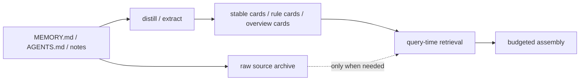
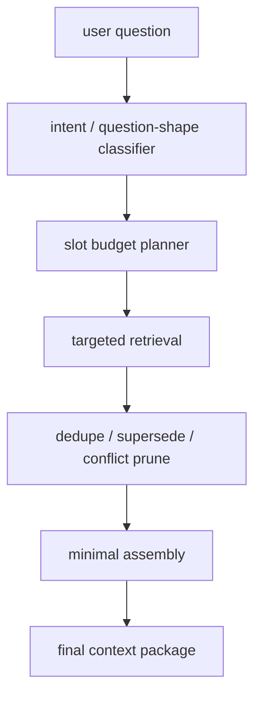

# Context Slimming And Budgeted Assembly

[English](context-slimming-and-budgeted-assembly.md) | [中文](context-slimming-and-budgeted-assembly.zh-CN.md)

## Purpose

This document answers two now-primary engineering questions:

1. Should `MEMORY.md`, `AGENTS.md`, and project notes keep entering host context in their raw form?
2. Even if memory recall is stronger, why does `openclaw` still slow down as context grows, and what should change?

The goal here is not to argue that recall is already “good enough”. The goal is to define the next architecture step:

- keep storage rich
- keep per-turn context sparse
- let only highly relevant information reach the model

## Short Answer

### 1. `MEMORY.md` / `AGENTS.md` should be slimmed as prompt inputs, not crudely deleted

The right move is not:

- deleting long-term knowledge
- or forcing users to maintain an unnaturally tiny `MEMORY.md`

The right move is:

- treat static documents as **memory sources**
- consume only:
  - distilled stable cards
  - rule summaries
  - minimal supporting snippets

### 2. Per-turn context assembly should become budgeted

The next architecture should not be:

- retrieve more
- then try to compress later

It should be:

- identify what the question shape actually needs
- allocate slots and budgets first
- assemble the smallest correct context package

## Why This Matters Now

The current evidence already shows:

- plugin-side retrieval / assembly fast paths are still fast
- the slow path lives more in host answer-level execution, raw transport noise, and bloated prompt/context surfaces
- after `100` live A/B cases, direct answer-level uplift is still modest, which means retrieval quality alone is not enough

So the product question is no longer just:

> can Memory Core retrieve better?

It is also:

> can Memory Core decide to send much less?

## Core Principles

### 1. Storage can stay rich; prompts must stay sparse

Long-lived memory can keep growing.

Final prompts should not grow proportionally with it.

### 2. Documents are memory sources, not default prompt payloads

`MEMORY.md`, `AGENTS.md`, and notes should remain:

- indexable
- auditable
- distillable

But they should stop being default raw prompt blocks.

### 3. Question shape should drive assembly

The system should first ask:

- is this identity, preference, rule, current-state, history, cross-source, or negative/unknown?

Then decide:

- which slots are needed
- how many snippets each slot is allowed

### 4. Default to single-card answers

Many fact questions should default to:

- one answer card
- optionally one support snippet

Multi-snippet assembly should be reserved for:

- cross-source
- conflict
- current-vs-history
- explicit “how do you know?” requests

### 5. Explanations must not compete equally with answers

Background and reasoning text should default to lower priority than the answer itself.

## Proposal 1: Static-Document Slimming

### Goal

Move `MEMORY.md`, `AGENTS.md`, and notes from:

- prompt-facing raw docs

to:

- indexed, distilled, selectively consumed sources

### Target Shape

### Recommended Layers

- Raw Doc Layer: archive, audit, re-distill, source navigation
- Distilled Memory Layer: stable fact cards, durable rule cards, project overviews, agent policy cards
- Reference-on-demand Layer: raw snippets only for explanation, source navigation, or explicit evidence requests

### `MEMORY.md`

`MEMORY.md` should remain the durable source of:

- stable preferences
- identity facts
- long-lived rules
- fixed background

But it should stop carrying prompt-facing responsibility for:

- long reasoning
- execution history
- mixed-topic paragraphs
- “just in case” background dumps

### `AGENTS.md`

`AGENTS.md` should move toward:

- a minimal boot manifest for startup-critical constraints

instead of:

- a full handbook that the host drags around constantly

## Proposal 2: Budgeted Context Assembly

### Core Idea

Final context should stop being “top-N relevant things glued together”.

It should become:

1. classify question shape
2. allocate slots and budgets
3. retrieve for those slots
4. prune by supersede / conflict / duplication
5. assemble the smallest correct package

### Suggested Pipeline

### Suggested Slots

- Answer Slot: default `1`
- Support Slot: default `0-2`
- Rule Slot: default `0-1`
- Conflict Slot: default `0-1`
- Raw Doc Slot: default `0`, opt-in only

### Expected Result

Most ordinary fact questions should end up with:

- one answer card
- one supporting snippet
- maybe one rule card

not:

- a large `MEMORY.md` section
- notes
- session summaries
- extra explanations

## Query-Type Strategies

- Identity / Preference / Rule: single-card by default
- Current-state: one current card, optionally one superseded/old-state explanation
- History: one history card plus one time anchor
- Cross-source: one answer plus one or two real supporting sources
- Negative / Unknown: minimal or empty supporting context to protect abstention behavior

## New Governance Constructs

### 1. Boot Manifest

Add compact boot-facing artifacts such as:

- `boot-manifest`
- `agent-boot-card`
- `project-overview-card`

### 2. Assembly Budget Policy

Define explicit per-query-type rules for:

- max snippets
- source quotas
- raw doc opt-in
- explanation eligibility

### 3. Context Slimming Report

Track:

- average selected snippets
- average prompt token estimate
- raw doc injection rate
- latency by question type

If thickness is not measured, it will not stay down.

## Recommended Implementation Order

### Phase 1: document-layer slimming design

- formalize source-vs-prompt boundaries for `MEMORY.md`, `AGENTS.md`, and notes
- define boot-manifest and distilled-card outputs
- make raw-doc prompt inclusion default-off

### Phase 2: budgeted assembly

- add question-shape-driven slot budgets
- add source quotas
- add raw-doc opt-in

### Phase 3: new baselines

- context token estimate
- selected snippet count
- raw doc injection rate
- answer-level latency
- answer correctness

### Phase 4: A/B validation

Compare:

1. current assembly
2. slimmed, budgeted assembly

Measure:

- latency reduction
- no regression on harder cases
- reduction in builtin-only regressions and shared failures

## Recommendation

If the question is whether this work should happen now, the answer is:

- yes
- and it is no longer an optional optimization

The next product value should not be only:

- better retrieval

It should also be:

- better refusal to over-send context
