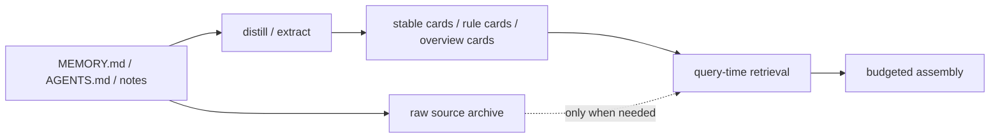
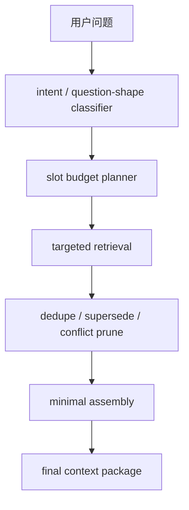

# Context 瘦身与预算化组装

[English](context-slimming-and-budgeted-assembly.md) | [中文](context-slimming-and-budgeted-assembly.zh-CN.md)

## 目的

这份文档专门回答两个已经变成主问题的工程问题：

1. `MEMORY.md`、`AGENTS.md`、项目 notes 这类静态文档，是否应该继续原样进入宿主上下文？
2. 即使记忆召回已经比以前更稳，为什么 `openclaw` 仍然会因为 context 增长过快而变慢？应该怎么改？

这份文档的目标不是证明“记忆能力已经足够好”，而是把下一阶段的优化方向明确成：

- **让存储保持丰富**
- **让每轮 context 尽量瘦**
- **让真正进入模型的上下文只保留当轮高相关信息**

相关文档：

- [openclaw-adapter.zh-CN.md](openclaw-adapter.zh-CN.md)
- [dialogue-working-set-pruning.zh-CN.md](dialogue-working-set-pruning.zh-CN.md)
- [execution-modes.zh-CN.md](execution-modes.zh-CN.md)
- [../testing/main-path-performance-plan.zh-CN.md](../testing/main-path-performance-plan.zh-CN.md)
- [../../../../reports/generated/unified-memory-core-full-regression-and-memory-improvement-2026-04-15.md](../../../../reports/generated/unified-memory-core-full-regression-and-memory-improvement-2026-04-15.md)

## 背景判断

当前已经确认的事实：

- `retrieval / assembly` 插件内部快路径本身已经很快，最近 perf baseline 仍是毫秒级。
- 慢路径主要出现在：
  - 宿主 answer-level 路径
  - raw transport
  - 前置 context / host prompt 过长
  - 插件和宿主共同携带了过多“这轮其实不需要”的静态背景
- `100` 个 live A/B 案例已经证明：`Unified Memory Core` 当前的直接 answer-level 增益还不算大，说明“只是把检索做得更准”还不够，**context 负载本身**也需要作为一级问题来处理。

所以现在不能只问：

> `Memory Core` 能不能召回更多？

还要问：

> 即使能召回，最终到底该把多少东西放进这轮上下文？

## 当前可量化现状

这份设计不是凭体感提出的，它建立在当前已经拿到的证据上：

- isolated local answer-level formal gate：`12 / 12`
- deeper answer-level watch：`14 / 18`
- retrieval-heavy benchmark：`262 / 262`
- history cleanup 之后的 `100` 个 live A/B：current `100 / 100`、legacy `99 / 100`、`1` 个 UMC-only、`0` 个 builtin-only、`0` 个 shared fails
- main-path perf baseline：
  - retrieval / assembly 平均 `16ms`
  - raw transport 平均 `8061ms`
  - answer-level 平均 `11200ms`

这些数字说明：

- 核心 retrieval 已经不是当前最大的瓶颈
- 宿主 answer-level 与上下文厚度更值得优先处理
- 继续只追求“检得更多”，边际收益会越来越低

## 当前规划状态

这条架构已经不只是 report 里的结论，相关的 Stage 6 runtime shadow instrumentation 也已经作为 `default-off` 的 shadow-only 路径落地：

- roadmap 指针：[../../../roadmap.zh-CN.md](../../../roadmap.zh-CN.md)
- development plan 指针：[../development-plan.zh-CN.md](../development-plan.zh-CN.md)
- working-set validation 汇总：[../../../../reports/generated/dialogue-working-set-validation-2026-04-16.md](../../../../reports/generated/dialogue-working-set-validation-2026-04-16.md)
- runtime shadow replay：[../../../../reports/generated/dialogue-working-set-runtime-shadow-2026-04-16.md](../../../../reports/generated/dialogue-working-set-runtime-shadow-2026-04-16.md)
- Stage 6 收口报告：[../../../../reports/generated/dialogue-working-set-stage6-2026-04-16.md](../../../../reports/generated/dialogue-working-set-stage6-2026-04-16.md)

当前明确的决策是：

- 先走 docs-first、review-gated 的 Stage 6
- 第一条 runtime slice 已落成 `default-off` 的 shadow instrumentation
- 正式 prompt mutation 继续显式延后
- 在讨论 active-path cutover 之前，先用 shadow path 证明真实 session 上的 `relation / evict / pins / reduction ratio`

也就是说：

- 这份文档仍然负责 durable-source slimming 和 budgeted assembly 的总体边界
- 但眼前真正先动的 runtime slice，是 `dialogue working-set pruning` 的 shadow mode，而不是直接切 assembly 主路径

## 最短结论

### 1. 应该瘦身 `MEMORY.md` / `AGENTS.md`，但不是简单删内容

正确做法不是：

- 粗暴删掉用户长期信息
- 或要求用户手工维护一份超短版 `MEMORY.md`

正确做法是：

- **把静态文档从“直接注入上下文的原文”降级成“长期记忆源”**
- 在 query-time 只消费：
  - 提炼后的 stable cards
  - 规则摘要
  - 当前问题需要的最小 supporting snippets

也就是说：

- 文档可以继续丰富
- 但每轮上下文不能继续原样塞整段文档

### 2. 每轮 context 组装必须进入“预算化”阶段

下一步的主架构不该是：

- 召回更多
- 然后在 assembly 里再尽量压一压

而应该是：

- 先确定这一轮问题需要哪些信息槽位
- 再按槽位和预算装配 context
- 多余信息默认不进入最终 prompt

## 在产品卖点里的位置

这份文档对应的是第一个核心卖点的一半：

- `按需加载 context，而不是平铺直塞 prompt`

当前并不是“完全从零开始”：

- fact-first context assembly 已经是产品基线
- retrieval / assembly 的快路径已经稳定到“不再是最大瓶颈”
- hot-session 一侧的 Stage 6 runtime shadow instrumentation 也已经落地

现在缺的，不是“证明 context 重要”，而是把这些能力继续收成一层更 selective 的策略，让它在产品层比 builtin 的 flat context 行为更有明确优势。

也就是从：

- `retrieval-first`

转成：

- `question-shape-first, budgeted assembly`

## 日常运行目标

这条线的目标不是把 `compact / compat` 做得更频繁。

更合理的目标是：

- 日常对话靠逐轮的 context slimming、budgeted assembly、working-set 管理维持可持续
- `compact / compat` 只保留为夜间或后台 safety net

如果要借一个工程类比，它更像：

- 平时做增量回收
- 低频再做一次 full sweep

但这里的“回收”只作用于 prompt working set 和 context package，不是删除 durable memory source。

## 非目标

这条方案现在**不**试图做这些事：

- 不删除 durable memory source，也不鼓励用户把长期知识“为了快而删掉”
- 不把 raw transport 的 `missing_json_payload` / `empty_results` 归因成 assembly 可独自修复的问题
- 不取代 retrieval / governance 这条主线，只是把“召回后如何少给”提到同等优先级
- 不把无界的 LLM-only 控制环直接塞进主路径；更合理的下一形态是 bounded、structured 的 decision contract，加显式 runtime guardrails，启发式规则只做 admission / fallback
- 不要求用户今天就重写所有 `MEMORY.md` / `AGENTS.md`；应先通过 distill + default-off prompt policy 解决大部分问题

## 与 Dialogue Working-Set Pruning 的边界

这份文档处理的是 durable source 的消费瘦身，以及 assembly 的预算控制。

但它并不能单独解决“同一段长对话里已经换题很多次，旧 raw turns 仍一直占 prompt”的问题。

那部分更窄的问题，单独放在这里：

- [dialogue-working-set-pruning.zh-CN.md](dialogue-working-set-pruning.zh-CN.md)

两者的分工建议明确成：

- `context slimming and budgeted assembly`
  - 决定哪些 durable artifacts 进入 final package
- `dialogue working-set pruning`
  - 决定哪些近期 raw turns 可以离开下一轮 prompt，但不删除日志

## 为什么这件事现在必须做

如果不做，后面会持续发生这三类问题：

### A. 静态文档越积越大，host 每轮起手越来越重

典型表现：

- `MEMORY.md` 越写越长
- `AGENTS.md` 越写越像总手册
- 项目长期文档和执行规则不断堆积
- 宿主一启动或一进入 agent，就已经背着一大坨“可能有用但这轮其实没用”的背景

这会直接带来：

- prompt 变长
- 模型前置阅读成本变高
- 真正相关内容被稀释

### B. 查询命中对了，但最终上下文仍然太厚

即使 retrieval 是对的，也可能发生：

- 相关 card 命中了
- supporting snippets 命中了
- 但同时又混进：
  - 相近但不必要的规则
  - 同路径的历史解释
  - 旧状态与当前状态并存
  - 过多“解释为什么”的背景

结果是：

- 模型不是没拿到答案
- 而是拿到太多东西，导致读得慢、答得慢、还更容易跑偏

### C. 越强调“记住更多”，越容易让 context 变成垃圾回收失败现场

如果没有预算化规则，长期记忆系统会自然滑向：

- 存得越来越多
- 检得越来越多
- 每轮喂得越来越多

这在产品层是危险的，因为：

- 存储增长是正常的
- 但每轮 prompt 增长不应该线性跟着涨

## 问题拆解

要解决“context 臃肿”，其实要拆成两层。

### 第一层：静态知识怎么存

这里关注的是：

- `MEMORY.md`
- `AGENTS.md`
- 项目 notes
- 长期规则文档

核心问题不是“它们该不该存在”，而是：

> 它们应该以什么形态进入 query-time 消费层？

### 第二层：当轮上下文怎么装

这里关注的是：

- 一个具体问题进来后
- 到底要选哪些内容
- 每类内容能占多少配额
- 什么时候必须只保留一个最小答案卡

这个问题本质上是：

> final context assembly 的预算控制问题

## 架构原则

### 原则 1：存储层可以 rich，prompt 层必须 sparse

允许：

- 存更多事实
- 留更多 history
- 维护更完整的治理文档

但不允许：

- 把这些 rich artifacts 原样等比例推入每轮 prompt

### 原则 2：文档是记忆源，不是默认上下文片段

以后要明确区分：

- `document as source`
- `context snippet as final payload`

`MEMORY.md` / `AGENTS.md` / notes 的正确定位应该是：

- 参与索引
- 参与提炼
- 参与 supporting evidence

但默认不应整段进入 final context。

### 原则 3：先决定问题需要什么，再决定召回什么

query-time 不应再以“能找到多少相关内容”为目标。

应先判断：

- 这是 identity / preference / rule / current-state / history / cross-source / negative 哪一类？

再决定：

- 该类问题最小需要哪些信息槽位

### 原则 4：默认 single-card，只有必要时才 multi-snippet

对于很多事实类问题：

- 一个经过治理的 stable card 就够了

只有在这些情况下才扩容：

- cross-source 需要双证据
- current vs history 需要显式对比
- conflict 需要保留冲突解释
- 用户明确要求“怎么知道的”

### 原则 5：解释信息不能默认和答案信息等重

现在很多 context 膨胀不是因为没有答案，而是因为混进了太多：

- 背景解释
- 历史推理过程
- “为什么选它”的 supporting prose

这些东西应该默认降级，只在需要 explainability 时才升格。

## 方案一：静态文档瘦身架构

### 目标

把 `MEMORY.md`、`AGENTS.md`、notes 这类文档从：

- `prompt-facing raw docs`

改成：

- `index + distill + selective evidence sources`

### 设计

### 建议分层

#### A. Raw Doc Layer

保留原文，用于：

- 审计
- 再提炼
- 需要原文解释时回查

但默认不直接进 prompt。

#### B. Distilled Memory Layer

从原文提炼：

- stable fact cards
- durable rule cards
- project overview cards
- agent policy cards

这个层才是默认 query-time 消费对象。

#### C. Reference-on-demand Layer

只有当用户问题属于：

- 配置文档导航
- “引用哪份文档”
- “给我原文依据”
- “详细解释怎么知道的”

才把 raw doc snippet 带进上下文。

### 对 `MEMORY.md` 的建议

`MEMORY.md` 应该继续存在，但要变成：

- 长期稳定信息的**源文件**

而不是：

- 直接拼进 prompt 的“长背景段落”

建议内容保持：

- 长期偏好
- 身份事实
- 长期规则
- 固定背景

不建议继续让它承担：

- 过程解释
- 执行历史
- 大段 reasoning
- 多个主题搅在一起的长段落

### 对 `AGENTS.md` 的建议

`AGENTS.md` 最容易膨胀，因为它常常同时承载：

- 角色边界
- 工具说明
- 执行原则
- 交付约束
- 风格要求

建议拆成两层：

1. **启动极简版**
   只保留 agent 启动必须知道的硬约束
2. **治理与工作流扩展版**
   留在文档源中，query-time 按需检索

也就是说：

- `AGENTS.md` 未来应该更像 boot manifest
- 而不是 full handbook

### 对用户现有文档的迁移原则

不建议一上来要求用户做大规模手工迁移。

更现实的顺序是：

1. 先承认已有 `MEMORY.md` / `AGENTS.md` / notes 继续作为 source 存在
2. 先在产品层补 distill / boot-manifest / default-off raw doc policy
3. 再根据新报告，指导用户把特别臃肿的文档拆成更适合长期维护的结构

也就是说，**优先改消费层，再改存储习惯**。

## 方案二：预算化 context assembly

### 核心思想

final context 不再只是“把 top-N 候选拼起来”。

而是：

1. 先判断问题类型
2. 再分配预算
3. 再按预算装配最小 context package

### 建议流水线

### 建议的 slot 模型

每轮不再只用统一 token 上限，而是先分槽位：

#### 1. Answer Slot

放最核心答案卡。

默认：

- `1` 条

#### 2. Support Slot

放必要 supporting evidence。

默认：

- `0-2` 条

#### 3. Rule Slot

只有当问题和行为规则相关时才放。

默认：

- `0-1` 条

#### 4. Conflict Slot

只有存在当前值/旧值冲突或来源冲突时才放。

默认：

- `0-1` 条

#### 5. Raw Doc Slot

只给 explain / source navigation 类问题。

默认：

- `0`

### 这样做的结果

多数普通问题最终进入 prompt 的上下文，应该变成：

- `1` 条答案卡
- `1` 条 supporting snippet
- 可能 `1` 条规则卡

而不是：

- 一段 `MEMORY.md`
- 一段 notes
- 一段 session summary
- 再加几条解释

## 查询类型驱动的最小上下文策略

### A. Identity / Preference / Rule

默认：

- single-card
- 不带 raw doc
- 不带 history

### B. Current-state

默认：

- 当前值卡 `1`
- 若存在 supersede，再带旧值解释 `1`
- 明确禁止同级塞入多个旧版本片段

### C. History

默认：

- 历史值卡 `1`
- 时间锚点 `1`
- 不再混入当前值解释，除非问题要求对比

### D. Cross-source

默认：

- 主答案卡 `1`
- 额外支持证据 `1-2`
- 只保留真正补强答案的来源，不做来源大杂烩

### E. Negative / Unknown

默认：

- 如果无稳定证据，尽量不放任何杂项片段
- 直接让模型进入稳定拒答路径

这一类问题如果还塞很多“好像相关”的弱片段，最容易诱发幻觉。

## 建议新增的治理构件

### 1. Boot Manifest

给 `MEMORY.md` / `AGENTS.md` / project docs 增加一层“启动极简摘要”产物：

- `boot-manifest`
- `agent-boot-card`
- `project-overview-card`

这层的目标是：

- 启动快
- prompt 短
- 只承载硬约束

### 2. Assembly Budget Policy

增加一份明确的 assembly budget policy：

- 每类问题最多允许多少条 snippet
- 哪些 source 默认禁入
- 哪些 explainability 内容需要显式请求才开放

### 3. Context Slimming Report

新增专门报告：

- 每轮 average selected snippets
- 每轮 average token estimate
- 按问题类型看 context 厚度
- raw doc 进入 final prompt 的比例

如果不能量化，就很难持续压 context。

## 对现有实现的影响

### 对 `retrieval.js`

不是第一优先改这里。

当前 retrieval 本身已经比较强，问题更多在：

- 召回后没被足够强地裁剪
- supporting evidence 没有显式预算

### 对 `assembly.js`

这是下一阶段最值得动的主层。

应该优先增加：

- question-shape classifier
- slot budget planner
- source-type quotas
- raw doc default-off
- explainability opt-in

### 对 OpenClaw Adapter

adapter 需要从“尽量把有用信息都喂进去”转成：

- “只把这轮最小必要信息喂进去”

也就是说，adapter 的目标函数要改成：

- **最小正确上下文**

而不是：

- **最大相关上下文**

## 推荐 rollout 策略

这条工作不适合一次性全量切换。

建议按 4 步走：

### Step 1: report-only / shadow mode

先不改正式 assembly 结果，只新增报告：

- 当前每轮 selected snippet 数
- token estimate
- raw doc injection rate
- 各问题类型的 context 厚度
- working-set shadow 字段：`relation / evict / pins / reduction ratio`

先拿到真实分布，再决定哪类问题最值得优先瘦身。

这一阶段还必须保持：

- `default-off`
- 易回滚
- 不改正式 prompt path

### Step 2: raw doc default-off for stable fact queries

优先对这些问题默认关闭 raw doc 注入：

- identity
- preference
- rule
- negative / unknown

这些场景最容易通过 stable cards 直接回答，也最不需要长背景。

### Step 3: slot budgets for current/history/conflict

再逐步把预算化扩到更复杂的问题：

- current-state
- history
- conflict
- cross-source

这一步的重点不是“更少”，而是“更少但仍然够解释”。

### Step 4: promote after gates stay green

只有当下面几条都保持绿：

- `12 / 12` formal gate
- retrieval-heavy benchmark
- context thickness baseline
- 更深 watch / A/B 不明显回退
- 真实 session 上的 runtime shadow telemetry 长期为绿，足以支撑 active-path experiment

才把新的 slim assembly 升成默认路径。

## 回滚策略

这条方案必须天然支持回滚。

最低要求：

- raw doc default-off 应该是可配置策略，而不是硬编码死
- slot budget planner 应能按问题类型降级回旧 assembly
- 任何 context 瘦身策略都要能快速切回“旧选择逻辑 + 原 token budget”

否则一旦出现 harder case 漏答，维护者很难快速判断是 retrieval 回退还是 assembly 过瘦。

## 验收标准

这条专项不能只靠“感觉快了”来判定成功。

建议至少同时满足：

1. 正确性不退化
   - isolated local answer-level formal gate 继续保持 `12 / 12`
   - retrieval-heavy formal gate 不掉出当前全绿

2. context 厚度明显下降
   - pilot slice 的 average selected snippets 明显下降
   - pilot slice 的 prompt token estimate 至少有可观察下降
   - raw doc injection rate 显著下降

3. 慢路径没有恶化
   - answer-level 平均耗时不能因为“裁剪逻辑更复杂”反而系统性变慢
   - raw transport watchlist 不得被错误解释成 assembly 回退

4. harder case 不被偷偷伤害
   - builtin-only regression 数不能增加
   - shared-fail case 不能因为上下文更瘦而扩散

如果只能换来“更短但更容易漏答”，这条方案就不算成功。

## 风险与取舍

### 风险 1：context 过瘦，导致证据不足

解决：

- 默认 single-card
- 但对 cross-source / conflict / history 允许扩容

### 风险 2：文档瘦身后，用户担心“是不是记不住了”

解决：

- 强调是 prompt 瘦身，不是存储删减
- raw docs 仍然保留，只是不默认进入 final context

### 风险 3：过度依赖 classifier

解决：

- 把硬安全与 rollback policy 留在 runtime ownership
- 优先做单次 bounded、structured 的 LLM-led decision surface，而不是继续长出越来越大的硬编码规则表
- 启发式规则只做廉价的 admission / fallback，不把它们扩成新的巨型 pseudo-classifier

## 推荐实施顺序

### Phase 1: 文档层瘦身设计

- 明确 `MEMORY.md` / `AGENTS.md` / notes 的 source-vs-prompt 边界
- 定义 boot manifest / distilled cards 产物
- 给 raw docs 改成 default-off prompt policy

### Phase 2: assembly 预算化

- 加 slot budget planner
- 按 query type 分配 budget
- 加 raw doc opt-in

### Phase 2.5: dialogue working-set shadowing

- 这条 slice 已经作为 Stage 6 的第一条 runtime 路径落地
- 多话题 `continue / branch / switch / resolve` shadow 评估已经接入真实 assembled session
- 当前最小 shadow contract 固定为：`relation / evict / pins / reduction ratio`
- 在真正改生产 prompt assembly 之前，继续用它证明 guarded soft eviction 可行
- 这一层继续与 durable-memory governance 隔离，等更长时间的 real-session telemetry 稳定后再讨论并线

### Phase 3: 新基线测试

新增专项指标：

- context token estimate
- selected snippet count
- raw doc injection rate
- answer-level latency 对比
- answer correctness 对比

### Phase 4: A/B 验证

对比：

1. 当前 assembly
2. 瘦身 + 预算化 assembly

重点看：

- answer-level latency 是否下降
- harder case 准确率是否不降反升
- builtin-only regression / shared fails 是否减少

## 当前建议

如果要回答“这两件事现在该不该做”，我的答案是：

- **应该做**
- 而且它们已经不是“优化项”，而是下一阶段的主架构工作

更直接一点：

- 只继续提升召回，而不处理 context 臃肿，收益会越来越低
- `Unified Memory Core` 下一阶段的真正价值，不该只是“更会找”，还应该是“更会少给”

当前真正的执行边界比完整架构更窄：

- 继续保持已落地的 runtime shadow instrumentation 为 `default-off` 和 shadow-only
- 用这条 telemetry surface 去复核 bounded LLM-led decision contract、operator metrics 与 harder A/B
- active prompt mutation 必须等 shadow gate 在真实 session 上证明成立后再谈
