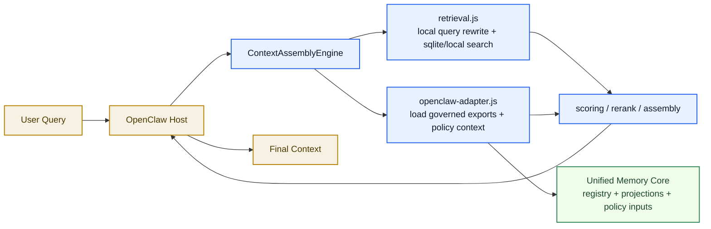
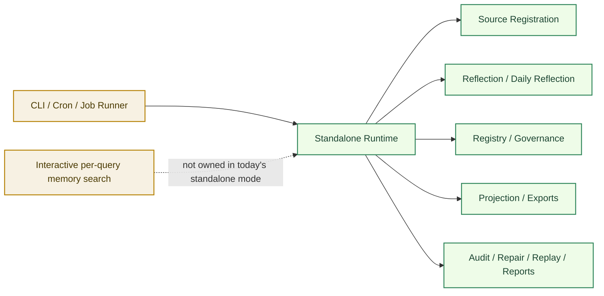
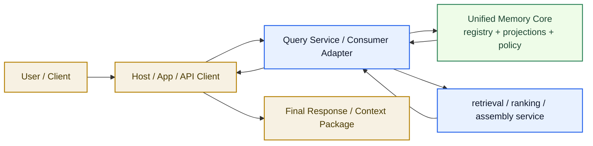

# Execution Modes And Memory Search Boundary

[English](execution-modes.md) | [中文](execution-modes.zh-CN.md)

## Purpose

This document explains one confusing but important boundary:

`if Unified Memory Core can run independently, who is responsible for memory search?`

The short answer is:

- the core product can already run independently
- but interactive query-time retrieval and assembly still belong to a consumer layer
- today that consumer layer is mainly the OpenClaw adapter
- later it could be a dedicated runtime API or another host adapter

This document is the best place to understand:

- current embedded execution
- today's standalone core mode
- a possible later service mode

## Short Answer

`Unified Memory Core` is now independent as a **memory core**, not yet as a **full standalone chat host or online query service**.

That means:

- independent today:
  - source ingestion
  - registry updates
  - reflection
  - governance
  - export building
  - audit / repair / replay
- still consumer-owned today:
  - turn-by-turn query trigger
  - retrieval orchestration for a live conversation
  - final context assembly for a specific host runtime

## The Three Layers

There are three different layers that people often collapse into one phrase called `memory search`.

### 1. Host Layer

This is the user-facing runtime.

Examples:

- OpenClaw host
- a future web app
- a future API client

It owns:

- user session lifecycle
- request / response loop
- UI or chat entrypoint

### 2. Consumer / Adapter Layer

This layer decides how a live query consumes memory.

Examples:

- OpenClaw adapter
- a future service-side query adapter
- a future standalone interactive client

It owns:

- query-time retrieval orchestration
- candidate merging
- consumer-specific scoring and assembly behavior
- host-facing context package shape

### 3. Core Product Layer

This is `Unified Memory Core` itself.

It owns:

- contracts
- source ingestion
- reflection
- registry
- governance
- projections / exports
- standalone maintenance and review flows

It does **not** require OpenClaw host participation to do those jobs.

## Why The Boundary Feels Confusing

The phrase `memory search` is overloaded.

People use it to mean two different things:

1. the broader memory system that produces and governs durable artifacts
2. the live, per-query retrieval step that happens during a conversation

`Unified Memory Core` now owns the first one fully.
The second one is still owned by whichever consumer is currently serving the live query.

## Mode 1: Current Embedded / OpenClaw Mode

This is the runtime you are using today when `Unified Memory Core` is installed as an OpenClaw `contextEngine`.

### What Owns Memory Search Here

In this mode:

- OpenClaw host owns the live session trigger
- `ContextAssemblyEngine` orchestrates retrieval and assembly
- `retrieval.js` performs local retrieval work
- `openclaw-adapter.js` loads governed exports and policy signals
- `Unified Memory Core` provides the governed memory truth and export layer

So the live `memory search` path is **not owned by the core alone**.
It is shared across:

- host
- adapter / assembly layer
- core exports

## Mode 2: Today's Standalone Core Mode

This is what `independent operation` means today.

The core can run without OpenClaw host, but it is running as a memory product, not as a live chat retrieval host.

### What Changed

When the core runs standalone today, it still handles:

- memory ingestion
- learning lifecycle
- governance
- export generation
- operational validation

But it does **not automatically become**:

- a chat host
- a live query router
- a runtime API server

So if you ask:

`after independence, who performs the original per-turn memory search?`

The answer is:

`whoever acts as the live consumer`

Today, that is still mainly the OpenClaw adapter.

## Mode 3: Later Service Mode

This mode is not implemented yet.

It is the natural later stage if the product grows from a standalone core into a standalone online query service.

### What Would Own Memory Search There

In a future service mode:

- the host could be a web app, API, or another runtime
- the query service / consumer adapter would own live retrieval orchestration
- `Unified Memory Core` would still own durable memory truth and exports

This is why the current docs say:

- standalone mode exists now
- runtime API / service mode is still deferred

## Responsibility Matrix

| Capability | Current OpenClaw Mode | Today's Standalone Core | Later Service Mode |
| --- | --- | --- | --- |
| user session lifecycle | OpenClaw host | external runner only | service host / client |
| source ingestion | core | core | core |
| reflection / learning lifecycle | core | core | core |
| registry / governance | core | core | core |
| projections / exports | core | core | core |
| per-query retrieval trigger | OpenClaw host | not present by default | service host / query layer |
| live retrieval orchestration | adapter / engine | not present by default | query service / consumer adapter |
| final context assembly | adapter / engine | not present by default | query service / consumer adapter |
| runtime API server | not used | not implemented | possible later |

## Decision Rule

Use this rule whenever the boundary feels blurry:

- if the job is about durable memory truth, learning, governance, or exports, it belongs to the core
- if the job is about a live query in a specific consumer runtime, it belongs to the consumer / adapter layer
- if the job is about user sessions or UI, it belongs to the host

## Most Important Takeaway

`Independent execution` does not mean:

`the core has already become its own full chat host`

It means:

`the memory product can operate independently, while live memory-search behavior still needs a consumer layer`

Today that consumer layer is mainly OpenClaw.
Later it could be another adapter or a dedicated service layer.

## Related Documents

- [standalone-mode.md](standalone-mode.md)
- [openclaw-adapter.md](openclaw-adapter.md)
- [independent-execution.md](independent-execution.md)
- [../deployment-topology.md](../deployment-topology.md)
- [../runtime-api-prerequisites.md](../runtime-api-prerequisites.md)
