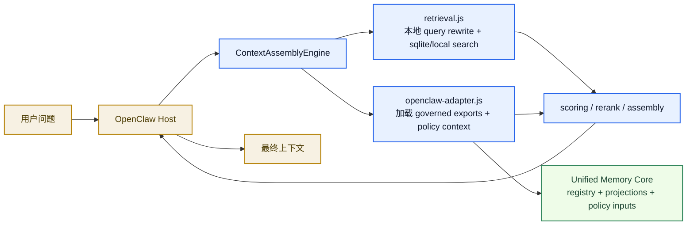
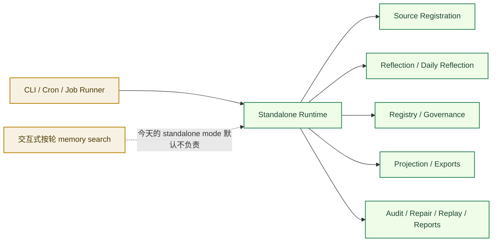
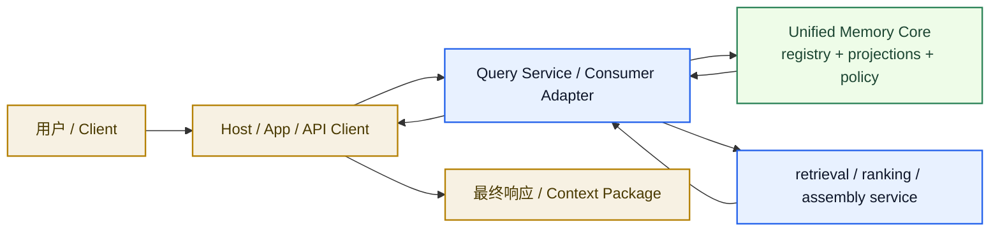

# 执行模式与 Memory Search 边界

[English](execution-modes.md) | [中文](execution-modes.zh-CN.md)

## 目的

这份文档专门解释一个很容易混淆、但又非常关键的边界：

`如果 Unified Memory Core 已经可以独立运行，那 memory search 到底谁负责？`

短答案是：

- 核心产品层已经可以独立运行
- 但交互式、按轮触发的 query-time retrieval / assembly 仍然属于 consumer 层
- 今天这个 consumer 层主要还是 OpenClaw adapter
- 未来也可以换成独立 runtime API 或别的 host adapter

如果你想一眼看懂下面三件事，这份文档就是主入口：

- 当前嵌入式执行
- 今天的 standalone core mode
- 未来可能的 service mode

## 最短答案

`Unified Memory Core` 现在已经是**独立记忆核心**，但还不是**完整独立聊天宿主或在线 query 服务**。

这意味着：

- 今天已经独立的部分：
  - source ingestion
  - registry update
  - reflection
  - governance
  - export build
  - audit / repair / replay
- 今天仍然属于 consumer 的部分：
  - 每轮 query 的触发
  - 面向 live conversation 的 retrieval orchestration
  - 面向特定宿主的 final context assembly

## 三层模型

大家经常把很多不同东西都叫成 `memory search`，但实际上这里至少有三层。

### 1. Host Layer

这是用户真正接触到的运行时。

例子：

- OpenClaw host
- 未来的 web app
- 未来的 API client

它负责：

- 用户 session 生命周期
- request / response 主循环
- UI 或聊天入口

### 2. Consumer / Adapter Layer

这一层决定“一个 live query 怎么消费 memory”。

例子：

- OpenClaw adapter
- 未来 service-side query adapter
- 未来 standalone interactive client

它负责：

- query-time retrieval orchestration
- candidate merge
- consumer-specific scoring / assembly
- 宿主可消费的 context package 形态

### 3. Core Product Layer

这一层才是 `Unified Memory Core` 本体。

它负责：

- contracts
- source ingestion
- reflection
- registry
- governance
- projections / exports
- standalone maintenance / review flows

这些能力本身已经不再依赖 OpenClaw host。

## 为什么这个边界容易混

因为 `memory search` 这个说法被拿来指代两种不同东西：

1. 更宽泛的记忆系统，用来生成和治理 durable artifacts
2. 在聊天当下，围绕某一个 query 做的实时 retrieval 步骤

`Unified Memory Core` 现在已经完整拥有第一种。
第二种则仍然由“当前正在服务 live query 的 consumer”负责。

## 模式 1：当前嵌入式 / OpenClaw 模式

这是你今天实际在用的模式：`Unified Memory Core` 作为 OpenClaw 的 `contextEngine` 运行。

### 这里的 Memory Search 谁负责

在这个模式下：

- OpenClaw host 负责 live session trigger
- `ContextAssemblyEngine` 负责编排 retrieval / assembly
- `retrieval.js` 做本地检索
- `openclaw-adapter.js` 加载 governed exports 和 policy signals
- `Unified Memory Core` 提供受治理记忆真相和 export 层

所以 live `memory search` **不是核心层单独负责的**。
它实际上横跨了：

- host
- adapter / assembly layer
- core export layer

## 模式 2：今天的 Standalone Core Mode

这才是今天“独立运行”的真实含义。

核心层可以不依赖 OpenClaw host 运行，但它是以“记忆产品”身份运行，而不是以“聊天检索宿主”身份运行。

### 这里到底改变了什么

核心层在今天的 standalone mode 里，仍然负责：

- memory ingestion
- learning lifecycle
- governance
- export generation
- 运维验证

但它**不会自动变成**：

- 聊天宿主
- live query router
- runtime API server

所以如果你问：

`独立之后，原来每轮对话里的 memory search 谁做？`

答案就是：

`谁在充当 live consumer，谁来做`

今天这个 live consumer 主要还是 OpenClaw adapter。

## 模式 3：未来的 Service Mode

这个模式现在还没有实现。

但如果未来产品从 standalone core 继续演进成独立在线 query 服务，它最自然的形态大概是这样：

### 那时 Memory Search 谁负责

到了未来 service mode：

- host 可以是 web app、API 或别的 runtime
- query service / consumer adapter 负责 live retrieval orchestration
- `Unified Memory Core` 仍然负责 durable memory truth 和 exports

这也就是为什么当前文档一直强调：

- standalone mode 现在已经有了
- runtime API / service mode 仍然明确延后

## 职责对照表

| 能力 | 当前 OpenClaw 模式 | 今天的 Standalone Core | 未来 Service Mode |
| --- | --- | --- | --- |
| user session lifecycle | OpenClaw host | 外部 runner | service host / client |
| source ingestion | core | core | core |
| reflection / learning lifecycle | core | core | core |
| registry / governance | core | core | core |
| projections / exports | core | core | core |
| per-query retrieval trigger | OpenClaw host | 默认不存在 | service host / query layer |
| live retrieval orchestration | adapter / engine | 默认不存在 | query service / consumer adapter |
| final context assembly | adapter / engine | 默认不存在 | query service / consumer adapter |
| runtime API server | 不使用 | 未实现 | 未来可能实现 |

## 判断规则

当你又开始觉得边界模糊时，用这个规则判断：

- 如果这件事是 durable memory truth、learning、governance、exports，它属于 core
- 如果这件事是围绕某个 live query 在特定 consumer 里发生的，它属于 consumer / adapter
- 如果这件事是用户 session 或 UI，它属于 host

## 最关键的一句

`Independent execution` 不等于：

`核心层已经变成一个完整聊天宿主`

它真正代表的是：

`记忆产品本身已经可以独立运行，但 live memory-search 行为仍然需要一个 consumer 层`

今天这个 consumer 层主要还是 OpenClaw。
未来也可以是别的 adapter，或者一个独立 service layer。

## 相关文档

- [standalone-mode.zh-CN.md](standalone-mode.zh-CN.md)
- [openclaw-adapter.zh-CN.md](openclaw-adapter.zh-CN.md)
- [independent-execution.zh-CN.md](independent-execution.zh-CN.md)
- [../deployment-topology.zh-CN.md](../deployment-topology.zh-CN.md)
- [../runtime-api-prerequisites.zh-CN.md](../runtime-api-prerequisites.zh-CN.md)
