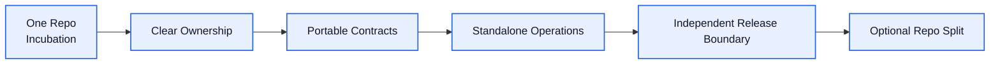

# Independent Execution Architecture

[English](independent-execution.md) | [中文](independent-execution.zh-CN.md)

## Purpose

`Independent Execution` defines how `Unified Memory Core` should become structurally ready to operate as an independent product.

It focuses on:

- adapter/core ownership clarity
- repo split readiness
- release boundary clarity
- long-term execution without plugin-first coupling

Related documents:

- [../repo-layout.md](../repo-layout.md)
- [../development-plan.md](../development-plan.md)
- [../ownership-map.md](../ownership-map.md)
- [../release-boundary.md](../release-boundary.md)
- [../migration-checklist.md](../migration-checklist.md)
- [../../../architecture.md](../../../architecture.md)

## What It Owns

- split-readiness criteria
- repo ownership boundary
- product-vs-adapter release boundary
- migration path documentation

## What It Does Not Own

- day-one runtime API implementation
- adapter-specific runtime logic
- source / registry / projection internals

## Core Goal

Turn separation into:

`an operational choice instead of a future architecture rewrite`

## Readiness Model

## Required Readiness Signals

1. contracts are not adapter-private
2. artifacts are portable
3. standalone operations are available
4. adapter boundaries are explicit
5. documentation maps the split path clearly

## Initial Build Boundary

The first implementation wave should support:

1. split-readiness checklist
2. ownership map
3. release-boundary note
4. migration checklist draft

## Done Definition

This module is ready for implementation when:

- core/adapters ownership is explicit
- split-readiness criteria are explicit
- release planning assumptions are explicit
- repo layout already reflects the future product shape
