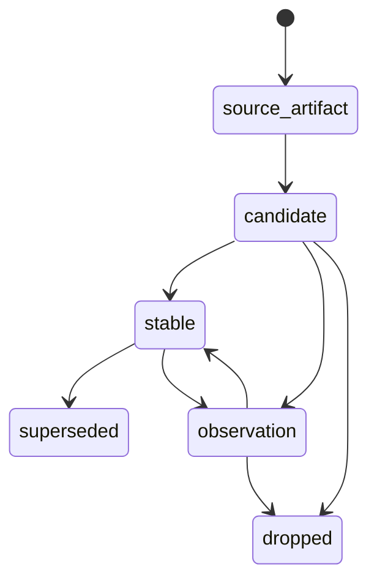

# Memory Registry Architecture

[English](memory-registry.md) | [中文](memory-registry.zh-CN.md)

## Purpose

`Memory Registry` is the persistence and lifecycle center of `Unified Memory Core`.

It owns the transition from:

- source artifacts
- candidate artifacts
- stable artifacts
- superseded / dropped records

## What It Owns

- artifact storage model
- lifecycle state transitions
- decision trail
- conflict records
- superseded records

## What It Does Not Own

- source extraction
- reflection logic
- tool-specific export shapes
- governance report rendering

## Lifecycle Model

## Main Record Families

1. source artifacts
2. candidate artifacts
3. stable artifacts
4. decision records
5. conflict records
6. superseded records

## Required Fields

Every persisted record should have:

- `record_id`
- `record_type`
- `state`
- `namespace`
- `visibility`
- `evidence_refs`
- `created_at`
- `updated_at`

## Decision Trail

The registry must preserve:

- why a record was promoted
- why a record was rejected
- what replaced it
- which export version consumed it

## Dependency Rules

- consumes from `Source System` and `Reflection System`
- serves `Projection System` and `Governance System`
- should remain adapter-neutral

## Initial Build Boundary

The first implementation wave should support:

1. candidate persistence
2. stable persistence
3. promotion / decay state transitions
4. conflict tracking basics

## Done Definition

This module is ready for implementation when:

- lifecycle states are explicit
- record families are explicit
- decision trail is explicit
- registry query surfaces are defined
