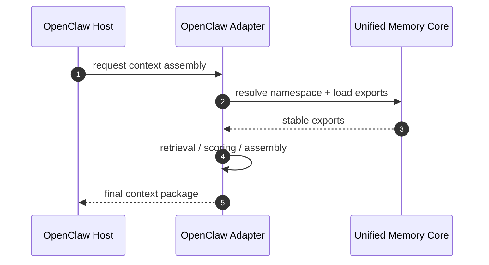
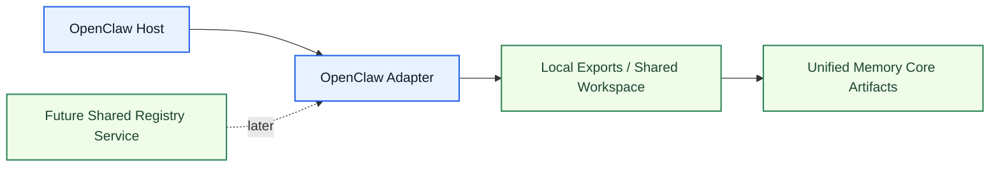

# OpenClaw Adapter Architecture

[English](openclaw-adapter.md) | [中文](openclaw-adapter.zh-CN.md)

## Purpose

`OpenClaw Adapter` consumes `Unified Memory Core` exports for OpenClaw retrieval and context assembly.

It is the boundary between:

- product-level shared memory
- OpenClaw-specific runtime behavior

Related documents:

- [../deployment-topology.md](../deployment-topology.md)
- [../../code-memory-binding-architecture.md](../../code-memory-binding-architecture.md)

## What It Owns

- OpenClaw namespace mapping
- OpenClaw export consumption
- OpenClaw-specific retrieval / assembly hooks
- OpenClaw accepted-action runtime hook
- OpenClaw ordinary-conversation memory-intent runtime hook
- adapter-side compatibility rules
- OpenClaw multi-agent runtime coordination rules

## What It Does Not Own

- shared artifact truth
- source ingestion
- generic export building

## Core Responsibilities

1. map OpenClaw sessions to product namespaces
2. consume relevant product exports
3. merge adapter logic with host retrieval paths when needed
4. emit governed accepted-action evidence from async OpenClaw runtime hooks when structured tool results are present
5. connect durable ordinary-conversation signals into governed `memory_intent`
6. keep behavior regression-protected
7. stay compatible with local-first and future shared-service deployments

## Core Flow

## Runtime Modes

The adapter should support two early runtime modes:

1. `local adapter mode`
2. `shared-workspace adapter mode`

It should remain compatible with a later:

3. `shared-registry service mode`

## Network-Ready Boundaries

The adapter should not assume:

- one host only
- one OpenClaw process only
- one agent only

So the adapter boundary must preserve:

- explicit namespace resolution
- deterministic export loading
- visibility-aware artifact selection
- serialized write-back for adapter-emitted events

## Multi-Agent Notes

For `one OpenClaw with multiple agents`, the recommended rule is:

- share one governed namespace resolver
- allow concurrent reads
- serialize adapter-side writes by namespace
- keep agent-local scratch state outside governed exports

## Accepted-Action Hook Boundary

The OpenClaw adapter now owns one write-side integration seam:

- async `after_tool_call`
- only when a tool result includes an explicit structured accepted-action payload
- registry writes, reflection, and promotion stay inside `Unified Memory Core`, not inside host-local scratch logic

It intentionally does not use:

- sync `tool_result_persist` for registry writes
- implicit inference from arbitrary successful tool results

## Ordinary-Conversation Hook Boundary

The OpenClaw adapter now also owns one ordinary-conversation write seam:

- async `agent_end`
- only the latest user / assistant turn is consumed
- a bounded classifier maps ordinary conversation into governed `memory_intent`
- durable rule / tool routing / user profile fact flow into normal reflection / promotion
- session-only constraints stay in observation
- one-off instructions are skipped instead of being turned into long-term memory

This path is intentionally conservative:

- it does not add another LLM call
- it does not require OpenClaw replies to emit hidden JSON today
- instead it uses adapter-side deterministic classification to connect ordinary conversation to the formal `memory_intent` contract

That means:

- OpenClaw ordinary conversation now has a governed realtime ingest path
- but the stronger “same inference returns structured `should_write_memory`” design remains primarily on the Codex path and as a future OpenClaw evolution

## Host Canary Design

To verify the real host end-to-end path instead of only unit tests or direct hook invocation, the adapter now includes one dedicated canary tool:

- `umc_emit_accepted_action_canary`

Its boundary is intentional:

- not registered by default
- registered only when `openclawAdapter.debug.canaryTool = true`
- used only for host verification, not for normal memory retrieval, assembly, or nightly flow

Why it exists:

- `unified-memory-core` is not itself a business tool
- but proving that a real OpenClaw tool execution automatically triggers `after_tool_call` and writes governed `accepted_action` evidence into the canonical registry requires one controlled, repeatable, non-invasive tool sample
- the earlier dependency on an external tool for live canaries has now been removed; UMC owns this verification path directly

## What Is Verified Now

This adapter slice is now verified at the real-host level, not just as design intent:

1. OpenClaw loads `unified-memory-core v0.3.0`
2. when debug mode is enabled, the host tool list includes `umc_emit_accepted_action_canary`
3. a real `openclaw agent --local` run can call that tool
4. the host really emits async `after_tool_call`
5. the canonical registry automatically receives the `accepted_action` source and reflection outputs
6. once debug mode is disabled, the tool disappears from the normal host tool list again

Readable report:

- [../../../../reports/generated/openclaw-accepted-action-canary-2026-04-15.md](../../../../reports/generated/openclaw-accepted-action-canary-2026-04-15.md)

This host canary produced:

- source artifact: written
- reflection outputs: `outcome_artifact` candidates
- promotion: `0`

`promoted=0` is correct here, not a failure. The canary intentionally emits one-off outcomes rather than reusable target facts, so governance should keep them in observation.

## Is This Slice Done

If "done" means:

- OpenClaw async `after_tool_call` integration exists
- structured `accepted_action` governed intake works
- the path is proven on the real host end-to-end
- live canary verification no longer depends on an external project tool

then this slice can now be treated as complete.

If "done" means the whole OpenClaw / benchmark / performance line, then no. Remaining work still includes:

- larger answer-level benchmark expansion
- stronger Chinese coverage
- continued transport-watchlist isolation
- main-path performance optimization

So what is complete here is the adapter write-side accepted-action host-verification slice, not the entire project roadmap.

## Required Boundaries

The adapter must keep separate:

- host runtime behavior
- product artifacts
- adapter-side heuristics

## Initial Build Boundary

The first implementation wave should support:

1. namespace mapping
2. export consumption contract
3. retrieval / assembly integration
4. adapter compatibility tests
5. multi-agent-safe read/write rules in local-first mode

## Done Definition

This module is ready for implementation when:

- OpenClaw boundary is explicit
- export consumption contract is explicit
- namespace mapping rules are explicit
- adapter test surfaces are defined
- local-first and shared-workspace deployment rules are explicit
