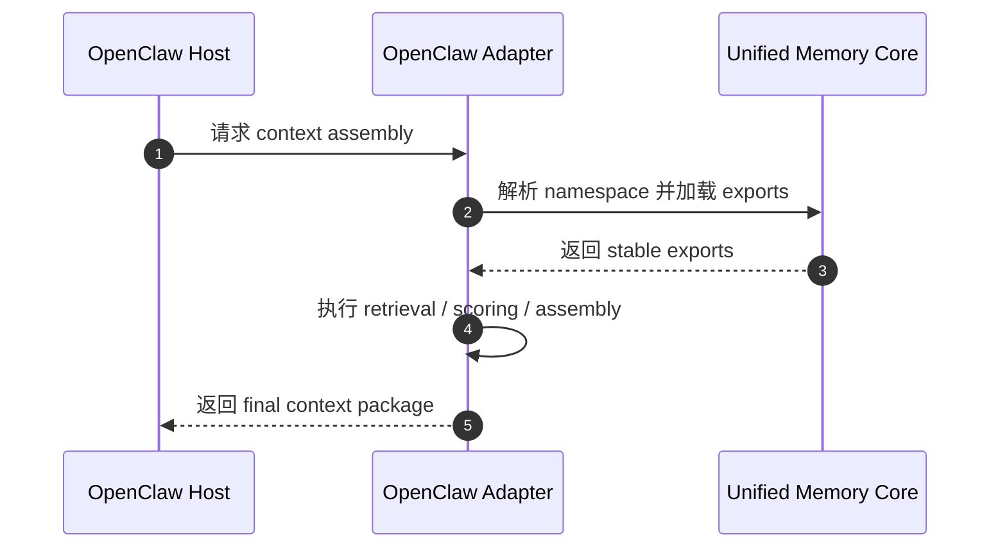
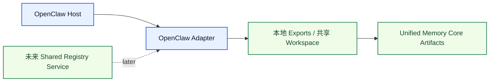

# OpenClaw Adapter Architecture

[English](openclaw-adapter.md) | [中文](openclaw-adapter.zh-CN.md)

## 目的

`OpenClaw Adapter` 负责把 `Unified Memory Core` 的 exports 接进 OpenClaw 的 retrieval 和 context assembly。

它是下面两层之间的边界：

- 产品级共享记忆
- OpenClaw 专属运行时行为

相关文档：

- [../deployment-topology.md](../deployment-topology.md)
- [../../code-memory-binding-architecture.md](../../code-memory-binding-architecture.md)

## 它负责什么

- OpenClaw namespace mapping
- OpenClaw export consumption
- OpenClaw-specific retrieval / assembly hooks
- OpenClaw accepted-action runtime hook
- adapter-side compatibility rules
- OpenClaw 多 agent 运行时协调规则

## 它不负责什么

- shared artifact truth
- source ingestion
- generic export building

## 核心职责

1. 把 OpenClaw session 映射到产品 namespace
2. 消费相关产品 exports
3. 在需要时把 adapter 逻辑和宿主 retrieval 路径结合起来
4. 当结构化 tool result 出现时，通过异步 OpenClaw runtime hook 发出 governed accepted-action 证据
5. 保持行为有 regression 保护
6. 同时兼容 local-first 与后续 shared-service 演进

## 主流程

## 运行模式

这个 adapter 的前期实现应支持两种运行模式：

1. `local adapter mode`
2. `shared-workspace adapter mode`

同时要保持对后续：

3. `shared-registry service mode`

的兼容性。

## 面向网络演进的边界

这个 adapter 不应该假设：

- 只有一个 host
- 只有一个 OpenClaw 进程
- 只有一个 agent

所以 adapter 边界必须保留：

- 显式 namespace resolution
- 可重复的 export loading
- 带 visibility 的 artifact 选择
- 对 adapter 回写事件做按 namespace 串行化

## 多 Agent 说明

对于 `一个 OpenClaw 下多个 agent`，推荐规则是：

- 共用一套受治理的 namespace resolver
- 允许并发读取
- adapter 侧写入按 namespace 串行化
- agent 本地 scratch state 不进入 governed exports

## Accepted-Action Hook 边界

OpenClaw adapter 现在拥有一条写侧接缝：

- 异步 `after_tool_call`
- 只有当 tool result 里带有显式结构化 accepted-action payload 时才触发
- registry 写入、reflection 和 promotion 仍然留在 `Unified Memory Core` 内部，不回退到宿主本地 scratch 逻辑

它有意不做这些事：

- 不把同步 `tool_result_persist` 当作 registry 写入口
- 不对任意“成功工具结果”做隐式推断

## Host Canary 设计

为了验证真正的宿主端到端链路，而不是只做单元测试或直接调用 hook runtime，adapter 现在带有一条专用 canary 工具：

- `umc_emit_accepted_action_canary`

这条工具的设计边界是：

- 默认不注册
- 只有 `openclawAdapter.debug.canaryTool = true` 时才注册
- 只用于 host verification，不参与日常记忆检索、assembly 或 nightly 流程

它存在的原因是：

- `unified-memory-core` 自己不是业务工具
- 但要证明真实 OpenClaw 工具执行之后，`after_tool_call` 能自动把结构化 `accepted_action` 写进 canonical registry，就必须有一条受控、可重复、不会污染别的项目的最小工具样本
- 之前依赖外部工具做 live canary 的方式已经被替换掉，这条验证现在由 UMC 自己承担

## 当前已验证到哪一步

这条 adapter 专项现在已经完成到“真实宿主已实证”的程度，而不是只停留在设计或测试替身：

1. OpenClaw 已加载 `unified-memory-core v0.2.1`
2. debug 开关打开时，宿主工具列表中会出现 `umc_emit_accepted_action_canary`
3. 通过真实 `openclaw agent --local` 调用了这条工具
4. 宿主真实触发了异步 `after_tool_call`
5. canonical registry 自动新增了 `accepted_action` source 和 reflection 产物
6. debug 开关关闭后，这条工具又会从正常宿主工具列表中消失

相关可读报告：

- [../../../../reports/generated/openclaw-accepted-action-canary-2026-04-15.md](../../../../reports/generated/openclaw-accepted-action-canary-2026-04-15.md)

这次 host canary 的结果是：

- source artifact：写入成功
- reflection：产出了 `outcome_artifact` candidates
- promotion：`0`

这里 `promoted=0` 是正确行为，不是失败。因为这次 canary 故意只产出一次性 outcome，不产出可复用 target fact，所以按治理策略应保持 observation。

## 这个专项是否已经完成

如果“这个专项”指的是：

- OpenClaw async `after_tool_call` 接入
- 结构化 `accepted_action` governed intake
- 宿主真实端到端可验证
- 不再依赖外部项目工具做 live canary

那这条专项现在可以认为已经完成。

如果指的是整个 OpenClaw / benchmark / performance 主线，则还没有结束。后续仍然存在：

- 更大规模 answer-level benchmark 扩面
- 中文覆盖继续提高
- transport watchlist 持续隔离
- main-path perf 优化

也就是说，这次完成的是 adapter 写侧 accepted-action host verification 这一条子线，不是整个项目所有后续工作的结束。

## 必须守住的边界

这个 adapter 必须清楚分开：

- host runtime behavior
- product artifacts
- adapter-side heuristics

## 第一阶段实现边界

第一批实现建议先支持：

1. namespace mapping
2. export consumption contract
3. retrieval / assembly integration
4. adapter compatibility tests
5. local-first 模式下的 multi-agent-safe 读写规则

## 完成标准

这个模块进入可开发状态的标准是：

- OpenClaw boundary 已明确
- export consumption contract 已明确
- namespace mapping rules 已明确
- adapter test surfaces 已定义
- local-first 与 shared-workspace 部署规则已明确
