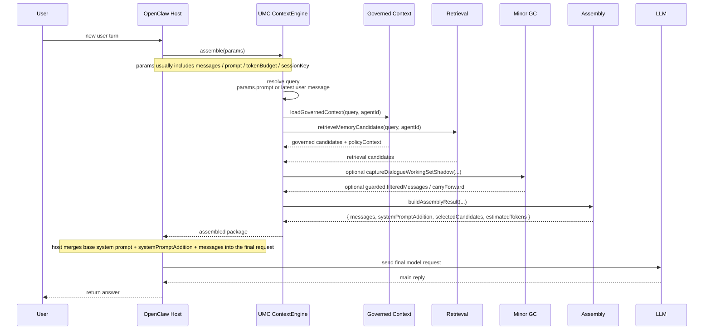
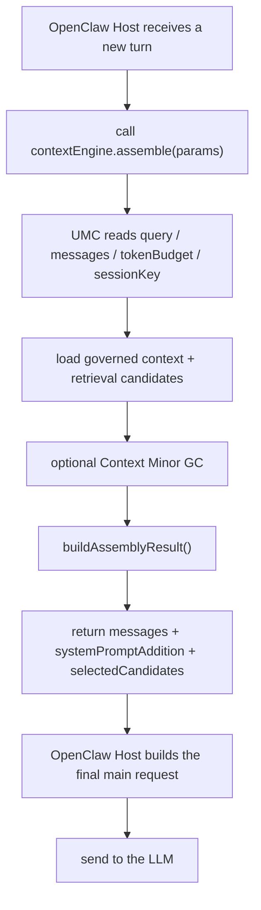

# OpenClaw Prompt Injection Flow

[English](openclaw-prompt-injection-flow.md) | [中文](openclaw-prompt-injection-flow.zh-CN.md)

## Purpose

This document answers one question:

`Which layer in OpenClaw actually assembles the UMC prompt package, and how does that package finally reach the LLM?`

## Short Answer

- `UMC` does **not** send the final main-reply request to the LLM by itself.
- `UMC` acts as the OpenClaw `contextEngine` and assembles the context package for the current turn inside `assemble()`.
- That package mainly includes:
  - preserved `messages`
  - `systemPromptAddition`
  - selected memory candidates in `selectedCandidates`
- The component that actually sends the final request to the model is the **OpenClaw host main reply path**, not UMC itself.

## Layer Placement

UMC is attached to OpenClaw in two major layers:

1. the `contextEngine` layer
   - registration: [../../../../src/plugin/index.js](../../../../src/plugin/index.js)
   - entry: `api.registerContextEngine("unified-memory-core", () => engine);`
   - main logic: [../../../../src/engine.js](../../../../src/engine.js)

2. the runtime hook layer
   - `before_agent_start`
   - `agent_end`
   - `after_tool_call`
   - this layer is mainly for **writing memory**, not for assembling the main prompt package

So the main prompt injection path is **`contextEngine.assemble()`**, not the hooks.

## Main-Reply Sequence

## What `assemble()` Actually Does

The entry is [../../../../src/engine.js](../../../../src/engine.js).

It roughly does five things:

1. resolve the current query
2. load governed context and retrieval candidates
3. optionally run `Context Minor GC`
4. call `buildAssemblyResult(...)`
5. return the assembled package to the host

## What The Final Prompt Package Contains

`buildAssemblyResult(...)` lives in [../../../../src/assembly.js](../../../../src/assembly.js).

The final package contains at least:

### 1. `messages`

These are the final kept dialogue messages.

- they come from `params.messages`
- they are trimmed by `trimMessagesToBudget(...)`
- recent messages are preserved first

### 2. `systemPromptAddition`

This is the extra context block injected by UMC.

It usually contains:

- recalled long-memory context
- governed policy guidance
- query-specific guardrails

### 3. `selectedCandidates`

These are the memory fragments actually selected for the turn.

They are usually rendered into the recalled-context section inside `systemPromptAddition`, rather than sent as a separate model field.

### 4. `estimatedTokens`

This is UMC's token estimate for the assembled package.

## Does It Include The Latest Message?

**Usually yes.**

- `assemble()` normally uses `params.messages`
- `trimMessagesToBudget(...)` preserves recent messages first
- if guarded applies, the latest user turn is still protected

## One Important Boundary

If the host passes only:

- `params.prompt`

but does **not** also include that latest turn inside:

- `params.messages`

then:

- UMC can still use the `prompt` for query / retrieval / GC decision
- but the returned `messages` may not automatically contain that latest turn

So the safer host contract is:

`the latest user input should appear in both params.prompt and params.messages`

## A Simpler Layer View

## The Key Boundary

- **UMC decides what context the turn should carry**
- **the OpenClaw host decides how that package is finally sent to the model**
