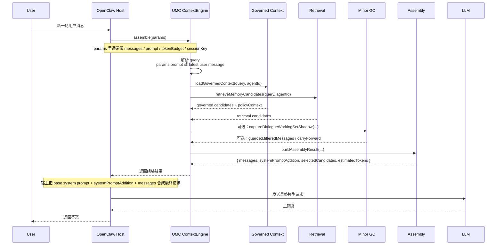
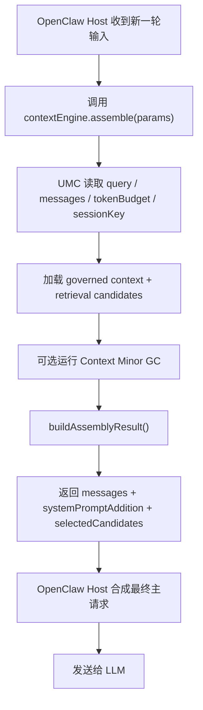

# OpenClaw Prompt 注入链路

[English](openclaw-prompt-injection-flow.md) | [中文](openclaw-prompt-injection-flow.zh-CN.md)

## 目的

这份文档只回答一个问题：

`UMC 在 OpenClaw 里到底在哪一层组装 prompt 包，以及这个包最后是怎么进到 LLM 的？`

## 最短结论

- `UMC` 自己**不直接发最终主回复请求**给 LLM。
- `UMC` 作为 OpenClaw 的 `contextEngine`，负责在 `assemble()` 里**组装这一轮要给模型的上下文包**。
- 这个上下文包主要包括：
  - 保留下来的 `messages`
  - `systemPromptAddition`
  - 选中的记忆候选 `selectedCandidates`
- 真正把这些内容送进模型的是 **OpenClaw 宿主自己的主回复执行链路**，不是 UMC 自己。

## 所在层级

UMC 在 OpenClaw 里主要挂两层：

1. `contextEngine` 层
   - 注册位置：[../../../../src/plugin/index.js](../../../../src/plugin/index.js)
   - 入口：`api.registerContextEngine("unified-memory-core", () => engine);`
   - 主逻辑：[../../../../src/engine.js](../../../../src/engine.js)

2. runtime hook 层
   - `before_agent_start`
   - `agent_end`
   - `after_tool_call`
   - 这层主要负责**写记忆**，不是组 prompt 主包。

所以，**prompt 注入主干在 `contextEngine.assemble()`，不是在 hooks。**

## 一次主回复的大致时序

## `assemble()` 实际做了什么

入口在 [../../../../src/engine.js](../../../../src/engine.js) 的 `assemble(params)`。

大致分 5 步：

1. 取当前查询
   - `const query = params.prompt || extractLatestUserPrompt(params.messages);`
2. 加载两类记忆候选
   - `loadGovernedContext(...)`
   - `retrieveMemoryCandidates(...)`
3. 可选跑 `Context Minor GC`
   - 命中 guarded 时会把原始 `params.messages` 换成 `guarded.filteredMessages`
4. 调 `buildAssemblyResult(...)`
   - 真正做 message budget 裁剪、candidate filtering、path diversity、chunk selection、`systemPromptAddition` 生成
5. 把组好的包返回给宿主

## 最终 prompt 包里都有什么

`buildAssemblyResult(...)` 在 [../../../../src/assembly.js](../../../../src/assembly.js)。

最终主包至少包含：

### 1. `messages`

这是最终保留下来的对话消息。

- 来自 `params.messages`
- 会经过 `trimMessagesToBudget(...)`
- 但会优先保留最近消息

### 2. `systemPromptAddition`

这是 UMC 注入给模型的额外上下文块。

通常包括：

- recalled long-memory context
- governed policy guidance
- query-specific guardrail

### 3. `selectedCandidates`

这是这轮真正入选的记忆片段。

它们通常不会作为独立 API 字段直接发给模型，而是被展开进 `systemPromptAddition` 的 recalled context 区块里。

### 4. `estimatedTokens`

这是 UMC 对这次组装结果的 token 估算，方便 scorecard / budget / diagnostics 使用。

## 最新 message 包含不包含

**通常包含。**

原因：

- `assemble()` 默认直接拿 `params.messages`
- `trimMessagesToBudget(...)` 会优先保留最近消息
- guarded 生效时，最新用户消息仍然是受保护的，不会被当成旧前缀裁掉

## 一个边界要注意

如果宿主只传了：

- `params.prompt`

却**没有**把这条最新输入同步放进：

- `params.messages`

那会出现一种分离：

- UMC 仍然能用这条 `prompt` 做 query / retrieval / GC decision
- 但最终返回的 `messages` 不一定自动带上这条最新输入

所以更稳的宿主契约应该是：

`最新用户输入既出现在 params.prompt，也出现在 params.messages`

## 更直白的分层图

## 关键边界

- **UMC 决定“这一轮该带什么上下文”**
- **OpenClaw 宿主决定“怎么把这包上下文真正发给模型”**
