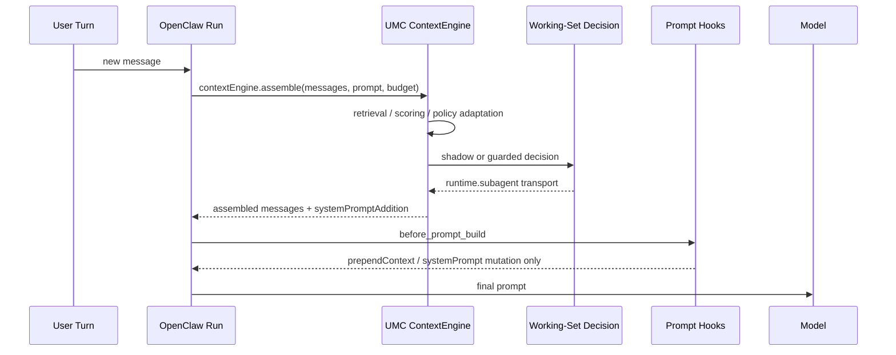
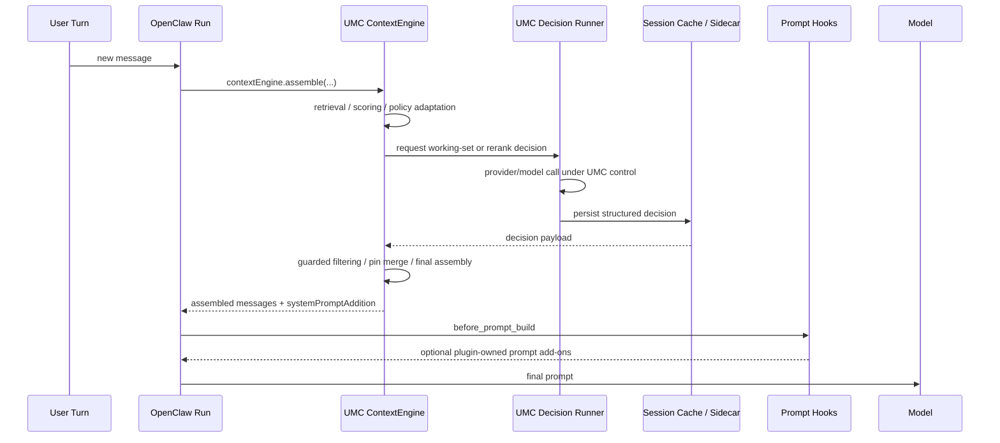

# Plugin-Owned Context Decision Overlay

[English](plugin-owned-context-decision-overlay.md) | [中文](plugin-owned-context-decision-overlay.zh-CN.md)

## Purpose

This document answers one blocker that is now explicit:

- can `Unified Memory Core` keep moving the `memory + context decision` chain into the plugin layer **without modifying OpenClaw**?
- if yes, how much should move?
- why do we now need an integration-point review before pushing further runtime work?

Related documents:

- [dialogue-working-set-pruning.md](dialogue-working-set-pruning.md)
- [context-slimming-and-budgeted-assembly.md](context-slimming-and-budgeted-assembly.md)
- [../development-plan.md](../development-plan.md)
- [../../../roadmap.md](../../../roadmap.md)
- [../../../../reports/generated/openclaw-gateway-context-optimization-2026-04-17.md](../../../../reports/generated/openclaw-gateway-context-optimization-2026-04-17.md)

## Short Conclusion

The preferred path is no longer:

- keep forcing the OpenClaw host seam
- or try to “replace OpenClaw completely”

The preferred path is now:

- **keep OpenClaw as the host shell**
- **move the memory + context decision chain deeper into the UMC plugin**
- **treat host modification only as a fallback**

More concretely:

- OpenClaw keeps session, tool loop, gateway, channel, and agent lifecycle ownership
- UMC owns retrieval, rerank, working-set decision, guarded assembly, pins / capsules / telemetry

## Why This Review Had To Happen First

The passive part of this blocker is not that the algorithm “later failed”.

The problem is that the original proposal did not lock four things early enough:

- call order
- what data each hook receives
- what each hook may mutate
- whether runtime helpers require gateway request scope

So the outcome was:

- the Stage 6 / 7 / 9 direction was still valid
- but only real OpenClaw live soak proved that the current working-set decision transport was bound to a host seam that is not reliably available

This doc therefore adds a formal architecture rule:

> any design that depends on host runtime helpers must pass an `integration-point preflight` before the runtime slice is accepted.

## Where The Current Runtime Actually Fails

`ContextAssemblyEngine` already owns most of the read path:

- governed retrieval
- heuristic scoring
- optional rerank
- dialogue working-set shadow / guarded path
- final assembly

The host-coupled parts are mainly:

- `working-set decision`
- `rerank`

Both still go through `runtime.subagent`.

Real OpenClaw live soak already proved that this transport cannot be assumed to be available from the `contextEngine.assemble()` path.

## Current Call Order

### Runtime Sequence Today



Key implications:

- `contextEngine.assemble()` runs before `before_prompt_build`
- so a higher hook is not a full upstream replacement for the current failure point
- by the time the working-set decision starts inside the engine, the host seam problem is already in play

### Current Failure Call Stack

```text
OpenClaw run
  -> contextEngine.assemble()
     -> captureDialogueWorkingSetShadow()
        -> runWorkingSetShadowDecision()
           -> runtime.subagent.run()
              -> plugin runtime subagent dispatch
                 -> requires gateway request scope
                 -> throw: "Plugin runtime subagent methods are only available during a gateway request."
```

This is a transport / host seam problem, not an algorithm problem.

## OpenClaw Extension Surface Review

The currently relevant extension points fall into three groups.

### 1. Context engine

This is still the main UMC entry point.

Pros:

- can replace or filter messages directly
- can perform retrieval / assembly directly
- sits closest to the final context package

Cons:

- if it depends on host-specific runtime helpers, it hits host seam issues earliest

### 2. Typed hooks

The most relevant hooks for context optimization are:

- `before_model_resolve`
- `before_prompt_build`
- `before_agent_start`
- `before_agent_reply`

Current review conclusion:

- `before_model_resolve`
  - too early
  - prompt only, no messages
  - good for model / provider selection, not working-set pruning
- `before_prompt_build`
  - receives messages
  - but is still a prompt-mutation seam
  - not a full replacement for message filtering and final assembly
- `before_agent_start`
  - legacy compatibility seam
  - should not become the new center of this design
- `before_agent_reply`
  - too high
  - if used too broadly, the plugin becomes half a host

So:

- higher hooks remain useful as support seams
- but they are **not enough** to fully replace the current memory + context decision chain

### 3. Higher-capability registration surfaces

OpenClaw plugins also expose:

- `registerGatewayMethod`
- `registerHttpRoute`
- `registerService`
- `registerTool`

These surfaces are enough to support:

- a plugin-owned decision runner
- sidecar session cache
- a plugin-owned bridge / operator surface

That is why a plugin-owned overlay is feasible in practice rather than only theoretically attractive.

## Why “Just Move One Hook Higher” Is Not Enough

The current review is now fairly clear:

1. `before_prompt_build` can access `messages`
   - but it is still not a full replacement for `contextEngine.assemble()`
2. What must still be controlled is:
   - raw turn filtering
   - pin / capsule carry-forward
   - guarded filtered message sets
   - final assembly coordination
3. Those remain more natural inside the context engine
4. Therefore the real thing to replace is not “which hook”
   - but **the decision transport inside the engine**

In other words:

- the issue is not merely that the current call site is “too low”
- the issue is that the decision transport is still tied to the host `subagent` runtime

## Recommended Architecture

### Definition

The recommended path is:

- **plugin-owned memory + context decision overlay**

This does not mean:

- replacing OpenClaw end to end

It means:

- moving only the memory / rerank / context decision chain into UMC ownership

### New Runtime Sequence



### Boundary

UMC continues to own:

- retrieval
- rerank
- working-set decision
- guarded filtering
- pin / capsule carry-forward
- telemetry / scorecard / replay artifacts

OpenClaw continues to own:

- session log
- tool loop
- gateway / transport
- agent lifecycle
- outbound / channel host responsibilities

## Why This Is Better Than Patching OpenClaw

Under the current constraint set, this path is more stable because:

1. it does not require maintaining an OpenClaw fork
2. it avoids treating non-promised internal host seams as the primary dependency
3. future OpenClaw upgrades should hit public plugin surfaces first, not a host patch
4. it is also easier to reuse later for Codex

## Size Estimate

This is not a rewrite from zero.

Reusable assets already exist:

- [../../../../src/dialogue-working-set.js](../../../../src/dialogue-working-set.js)
- [../../../../src/dialogue-working-set-shadow.js](../../../../src/dialogue-working-set-shadow.js)
- [../../../../src/dialogue-working-set-guarded.js](../../../../src/dialogue-working-set-guarded.js)
- [../../../../src/dialogue-working-set-scorecard.js](../../../../src/dialogue-working-set-scorecard.js)
- [../../../../src/dialogue-working-set-llm.js](../../../../src/dialogue-working-set-llm.js)
- [../../../../test/dialogue-working-set.test.js](../../../../test/dialogue-working-set.test.js)
- [../../../../test/dialogue-working-set-shadow.test.js](../../../../test/dialogue-working-set-shadow.test.js)
- [../../../../test/engine-dialogue-working-set-shadow.test.js](../../../../test/engine-dialogue-working-set-shadow.test.js)

The strongly host-coupled pieces remain concentrated in:

- [../../../../src/dialogue-working-set-runtime-shadow.js](../../../../src/dialogue-working-set-runtime-shadow.js)
- [../../../../src/rerank.js](../../../../src/rerank.js)

Given the current repo shape:

- minimal spike: `500-800 LOC`
  - replace only the working-set decision transport
- first usable version: `900-1400 LOC`
  - decision runner + cache + engine integration + config + tests
- full read-path self-hosting: `1500-2300 LOC`
  - then move rerank to the same runner

## Why This Is Not Ideal, But Still Best Under Current Constraints

The ideal state would still be:

- the host exposes one stable, explicit, well-supported runtime decision seam

But under the explicit “do not modify OpenClaw” constraint, that path is off the table.

So the best path is no longer the ideal path. It is the best constrained path:

- no host fork
- no betting on unstabilized internal seams
- no turning the plugin into a second host
- only moving the memory + context decision chain into UMC ownership

## Retrospective: What Should Have Been Checked In The Earliest Proposal

This became reactive not because implementation was too slow, but because the host integration points were not verified early enough.

Any future host-dependent design should lock this checklist before the runtime slice begins:

1. call order
   - does custom logic run before or after prompt build?
2. input surface
   - are full `messages` available?
   - is session / run / workspace context available?
3. output surface
   - may the seam replace messages?
   - or only mutate prompt / system prompt?
4. runtime helper constraints
   - does it depend on request scope?
   - is that stable across local / gateway / Docker?
5. failure downgrade
   - if transport fails, does the path fall back cleanly?
6. hermetic preflight
   - can an isolated spike prove the seam before the Stage-level work starts?

This should now become a durable architecture rule, not just a verbal lesson.

## Recommended Execution Order

1. close the architecture direction docs-first
   - make the preferred path explicit as a plugin-owned overlay
2. implement a minimal spike
   - working-set decision transport no longer depends on `runtime.subagent`
3. move rerank only after that succeeds
4. keep Stage 9 `default-off` / opt-in only
5. discuss default user gain only after live telemetry turns green again

## Current Decision

The formal decision now is:

- **do not treat OpenClaw modification as the primary path**
- **prefer a plugin-owned memory + context decision overlay first**
- **treat host modification as fallback only**

