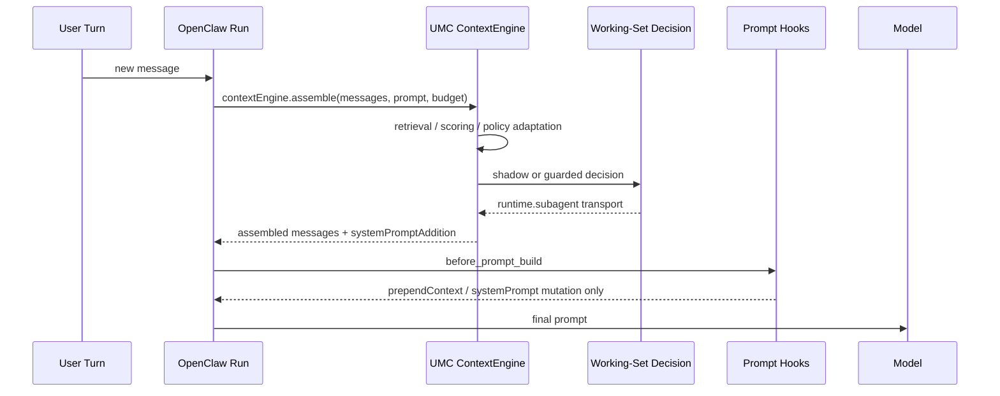
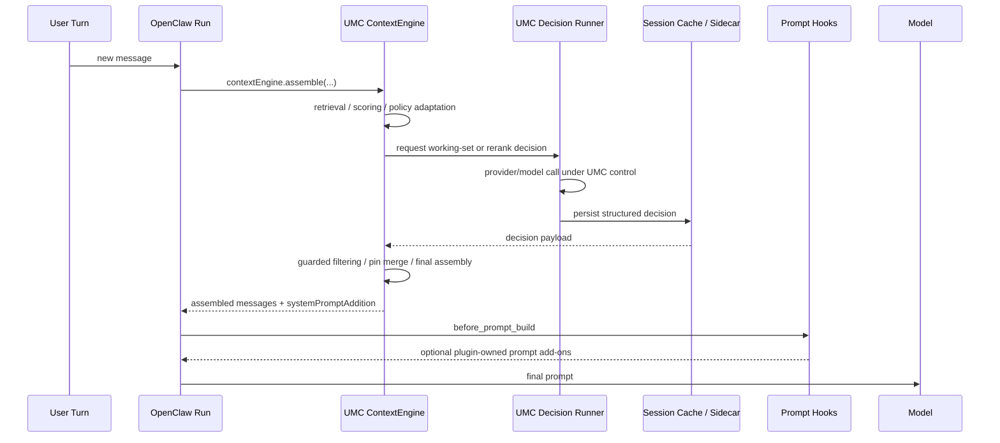

# 插件内自托管 Context Decision Overlay

[English](plugin-owned-context-decision-overlay.md) | [中文](plugin-owned-context-decision-overlay.zh-CN.md)

## 目的

这份文档专门回答一个现在已经变成主 blocker 的问题：

- 在 **不修改 OpenClaw 宿主** 的前提下，`Unified Memory Core` 能否继续把 `记忆 + context 决策` 这条链路往插件内收？
- 如果能，应该收多大范围？
- 为什么这次要先做接入点评审，而不是继续靠运行时试错？

相关文档：

- [dialogue-working-set-pruning.zh-CN.md](dialogue-working-set-pruning.zh-CN.md)
- [context-slimming-and-budgeted-assembly.zh-CN.md](context-slimming-and-budgeted-assembly.zh-CN.md)
- [../development-plan.zh-CN.md](../development-plan.zh-CN.md)
- [../../../roadmap.zh-CN.md](../../../roadmap.zh-CN.md)
- [../../../../reports/generated/openclaw-gateway-context-optimization-2026-04-17.md](../../../../reports/generated/openclaw-gateway-context-optimization-2026-04-17.md)

## 最短结论

当前推荐路径不是：

- 继续硬顶 OpenClaw 宿主 seam
- 也不是把 OpenClaw 全部“屏蔽掉”

当前推荐路径是：

- **OpenClaw 继续当宿主外壳**
- **UMC 插件把 memory + context decision 这条链路尽量自托管**
- **宿主改动只保留为 fallback，不作为当前主路径**

更具体地说：

- OpenClaw 继续负责 session、tool loop、gateway、channel、agent 主执行
- UMC 负责 retrieval、rerank、working-set decision、guarded assembly、pins / capsules / telemetry

## 为什么这次必须先做接入点评审

这次 live soak 暴露出来的被动点，不是“算法后来才失败”，而是：

- 最早方案阶段，没有先把 **调用顺序**
- **hook 能拿到什么输入**
- **hook 能改什么输出**
- **runtime helper 是否要求 gateway request scope**

这四件事锁死。

结果就是：

- Stage 6 / 7 / 9 的方向本身没有错
- 但直到真实 OpenClaw live soak 才确认：当前 working-set decision transport 依赖的宿主 seam 并不稳定可用

所以这份文档除了给出新方案，也把一个架构纪律写死：

> 以后凡是涉及宿主运行时能力的设计，必须先做 `integration-point preflight`，再做 runtime slice。

## 这次实际卡在哪里

当前 UMC 的 `ContextAssemblyEngine` 已经把主要读链路接进来了：

- governed retrieval
- heuristic scoring
- optional rerank
- dialogue working-set shadow / guarded path
- final assembly

问题出在：

- `working-set decision`
- `rerank`

这两个 LLM 决策节点，现在都还走 `runtime.subagent`。

而真实 OpenClaw live soak 已经证明，这条调用链并不总能在 `contextEngine.assemble()` 这条路径上拿到可用的 runtime request scope。

## 当前调用时序

### 运行中的实际顺序



关键点：

- `contextEngine.assemble()` 先于 `before_prompt_build`
- 所以高层 hook 不是当前失败点的上游替代物
- 当前 working-set decision 在 engine 内部已经开始运行时，宿主 seam 问题就已经触发了

### 当前失败点的调用栈视图

```text
OpenClaw run
  -> contextEngine.assemble()
     -> captureDialogueWorkingSetShadow()
        -> runWorkingSetShadowDecision()
           -> runtime.subagent.run()
              -> plugin runtime subagent dispatch
                 -> requires gateway request scope
                 -> throw: "Plugin runtime subagent methods are only available during a gateway request."
```

这个失败模式和算法本身无关，而是 transport / host seam 问题。

## OpenClaw 扩展机制复盘

当前已确认的扩展面大致可分 3 类。

### 1. Context engine

这是 UMC 现在的主接入点。

优点：

- 能直接改消息列表
- 能直接做 retrieval / assembly
- 离最终 prompt package 最近

缺点：

- 一旦这里需要调用宿主特定 runtime helper，就会最早撞到 host seam

### 2. Typed hooks

对 context optimization 最相关的是：

- `before_model_resolve`
- `before_prompt_build`
- `before_agent_start`
- `before_agent_reply`

当前复盘结论：

- `before_model_resolve`
  - 太早
  - 只有 prompt，没有 messages
  - 适合 model / provider 决策，不适合 working-set 剪裁
- `before_prompt_build`
  - 能拿到 messages
  - 但只适合 prompt mutation
  - 不适合替代 context engine 的消息过滤与重组
- `before_agent_start`
  - 属于 legacy 兼容面
  - 不应该再作为这条主线的新核心 seam
- `before_agent_reply`
  - 层级太高
  - 一旦接管太多，就会把插件做成半个宿主

所以：

- 更高层 hook **值得辅助使用**
- 但 **不足以完整替代** 当前 memory + context 决策链

### 3. 更高能力注册面

OpenClaw 插件还提供：

- `registerGatewayMethod`
- `registerHttpRoute`
- `registerService`
- `registerTool`

这些能力足以支撑：

- 插件自带 decision runner
- sidecar session cache
- plugin-owned bridge / operator surface

这也是为什么“插件内自托管 overlay”是现实可行的，而不是纯理论方案。

## 为什么“只把 hook 提高一级”还不够

这次 review 后，结论已经比较明确：

1. `before_prompt_build` 虽然能拿到 `messages`
   - 但它不是一个替代 `contextEngine.assemble()` 的完整装配层
2. 当前真正需要控制的是：
   - raw turns 过滤
   - pins / capsules 注入
   - guarded filtered message set
   - final assembly coordination
3. 这些事情继续放在 context engine 更合理
4. 所以真正要换的不是 “哪个 hook”
   - 而是 **engine 内部的 decision transport**

换句话说：

- 问题不是“调用位置太低”
- 而是“决策 transport 还绑在宿主 subagent runtime 上”

## 推荐方案

### 方案定义

推荐把当前路径收成：

- **plugin-owned memory + context decision overlay**

意思不是：

- 全面接管 OpenClaw

而是：

- 只把 memory / rerank / context decision 这条链路收进 UMC

### 新调用时序



### 这个方案的边界

UMC 继续自托管：

- retrieval
- rerank
- working-set decision
- guarded filtering
- pin / capsule carry-forward
- telemetry / scorecard / replay artifacts

OpenClaw 继续负责：

- session log
- tool loop
- gateway / transport
- agent run lifecycle
- outbound / channel 宿主职责

## 为什么这条路比“改 OpenClaw”更合适

在当前约束下，这条路更稳，因为：

1. 不要求维护 OpenClaw fork
2. 不把宿主内部未承诺稳定的 seam 继续当主依赖
3. 后续 OpenClaw 升级时，主要冲击会留在公开插件面，而不是 host patch
4. 这条路径也更利于未来给 Codex 复用

## 代码量预估

这不是从零重写。

现有可复用资产已经很多：

- [../../../../src/dialogue-working-set.js](../../../../src/dialogue-working-set.js)
- [../../../../src/dialogue-working-set-shadow.js](../../../../src/dialogue-working-set-shadow.js)
- [../../../../src/dialogue-working-set-guarded.js](../../../../src/dialogue-working-set-guarded.js)
- [../../../../src/dialogue-working-set-scorecard.js](../../../../src/dialogue-working-set-scorecard.js)
- [../../../../src/dialogue-working-set-llm.js](../../../../src/dialogue-working-set-llm.js)
- [../../../../test/dialogue-working-set.test.js](../../../../test/dialogue-working-set.test.js)
- [../../../../test/dialogue-working-set-shadow.test.js](../../../../test/dialogue-working-set-shadow.test.js)
- [../../../../test/engine-dialogue-working-set-shadow.test.js](../../../../test/engine-dialogue-working-set-shadow.test.js)

真正强绑定宿主 runtime.subagent 的部分，主要集中在：

- [../../../../src/dialogue-working-set-runtime-shadow.js](../../../../src/dialogue-working-set-runtime-shadow.js)
- [../../../../src/rerank.js](../../../../src/rerank.js)

按当前 repo 规模估算：

- 最小 spike：`500-800 LOC`
  - 只替换 working-set decision transport
- 第一版可用：`900-1400 LOC`
  - decision runner + cache + engine integration + config + tests
- 完整读链路自托管：`1500-2300 LOC`
  - 再把 rerank 也切进同一 runner

## 为什么这不是最理想，但仍是当前最优

最理想的状态当然是：

- 宿主直接把稳定、完整、可承诺的 runtime decision seam 开出来

但在当前明确“不改 OpenClaw”的前提下，这个选项不成立。

所以当前最优不再是“理想最优”，而是“约束下最优”：

- 不 fork 宿主
- 不赌未承诺的内部 seam
- 不把插件做成半个 agent 宿主
- 只把 memory + context decision 链收进 UMC

## 事后复盘：最早方案阶段应该先确认什么

这次被动，核心不是因为实现慢，而是因为最早评审时没有先把宿主接入点核清。

以后类似设计，方案阶段必须先确认这份清单：

1. 调用顺序
   - 自定义逻辑到底发生在 prompt build 前还是后
2. 输入面
   - 能否拿到完整 `messages`
   - 能否拿到 session / run / workspace 上下文
3. 输出面
   - 能否改 messages
   - 还是只能改 prompt / system prompt
4. runtime helper 约束
   - 是否依赖 request scope
   - local / gateway / Docker 下是否一致
5. 失败降级
   - transport 失败时是否能自然回退到稳定路径
6. hermetic 预演
   - 在进入 Stage 级工作之前，能否先做 isolated spike

这一条现在应该变成正式架构约束，而不是经验口头约束。

## 当前推荐执行顺序

1. 先做 `docs-first` 架构收口
   - 把 preferred path 明确写成 plugin-owned overlay
2. 再做最小 spike
   - working-set decision transport 不再依赖 `runtime.subagent`
3. 成功后再并 rerank
4. 继续保持 Stage 9 为 `default-off` / opt-in only
5. 直到真实 live telemetry 重新变绿，再讨论 default user gain

## 当前决策

当前正式决策是：

- **不把修改 OpenClaw 当作主路径**
- **优先尝试插件内自托管 memory + context decision overlay**
- **宿主改动只作为 fallback，不作为当前推荐实施线**

