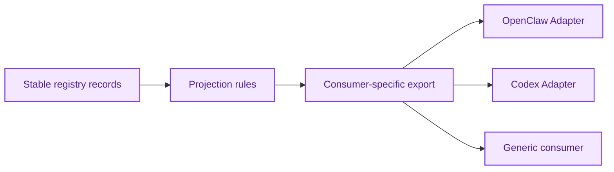

# Projection System Architecture

[English](projection-system.md) | [中文](projection-system.zh-CN.md)

## Purpose

`Projection System` turns stable registry records into deterministic exports for adapters and external consumers.

It answers:

`given governed artifacts, what should a specific consumer receive?`

## What It Owns

- export builders
- consumer-specific projection rules
- export versioning
- policy projection

## What It Does Not Own

- artifact truth
- promotion decisions
- adapter runtime logic

## Core Outputs

1. OpenClaw exports
2. Codex exports
3. generic JSON artifacts
4. future API-ready response shapes

## Projection Rules

Projection must respect:

- namespace
- visibility
- confidence / state
- consumer type
- export version

## Core Flow

## Dependency Rules

- consumes only governed records from `Memory Registry`
- may read constraints from `Governance System`
- must not depend on host runtime behavior

## Initial Build Boundary

The first implementation wave should support:

1. OpenClaw export artifact
2. Codex export artifact
3. generic export contract
4. export version tagging

## Done Definition

This module is ready for implementation when:

- export contracts are explicit
- consumer differences are documented
- versioning rules are documented
- testable deterministic projection is possible
