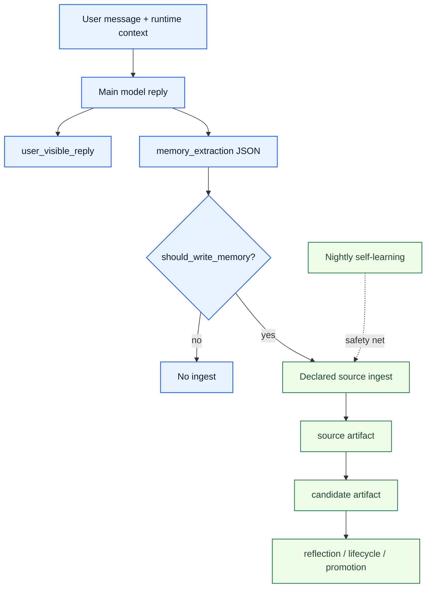

# Realtime Memory-Intent Ingestion Architecture

[English](realtime-memory-intent-ingestion.md) | [中文](realtime-memory-intent-ingestion.zh-CN.md)

## Goal

Connect `user_visible_reply + structured memory_extraction` into a real-time, governed ingest path so ordinary conversation rules no longer depend on nightly self-learning to reach the registry.

This design closes three gaps:

1. explicit long-lived rules, tool-routing preferences, and durable user preferences should not stop at session transcripts
2. nightly self-learning should become a safety net, not the only ordinary-conversation path into long-term memory
3. memory-intent detection should primarily use the main model's in-turn semantic judgment instead of hardcoded keyword compression

## Problem Statement

Current live behavior now proves three separate things:

- the agent can remember a rule inside the current session and immediately act on it
- the Codex path can already write governed realtime memory through structured `memory_extraction`
- OpenClaw ordinary conversation now also has a governed realtime path, but the current landing seam is deterministic `agent_end` classification rather than “hidden JSON from the same reply inference”

That leads to:

- obvious future-behavior rules waiting until nightly before they are even eligible for learning
- nightly still dropping clear rules because it runs once per day and applies hardcoded compression first
- an asymmetry where `accepted_action` has governed real-time intake, but conversation rules still rely on after-the-fact distillation

## Core Direction

The recommended approach is not "add one more LLM call for every message".

It is:

`return hidden structured memory_extraction from the same main-model inference that produces the normal reply`

The runtime only shows `user_visible_reply` to the user and separately consumes the structured field to decide whether a real-time source ingest should happen.

## Design Principles

1. reply generation and memory extraction share the same main-model inference
2. `memory_extraction` is an ingest decision surface, not a direct stable-promotion surface
3. nightly self-learning remains, but as a recovery and drift-check layer
4. hardcoded rules stay as guardrails, not the primary detector
5. the schema must explicitly separate durable, session, and none
6. replay cases must exist before broader runtime rollout

## Minimal Output Contract

The main model should return at least:

```json
{
  "user_visible_reply": "Understood. When you send a Xiaohongshu link in the future, I will prefer capture_xiaohongshu_note.",
  "memory_extraction": {
    "should_write_memory": true,
    "category": "tool_routing_preference",
    "durability": "durable",
    "confidence": 0.98,
    "summary": "User wants Xiaohongshu links handled with capture_xiaohongshu_note in future conversations.",
    "structured_rule": {
      "trigger": {
        "content_kind": "xiaohongshu_link",
        "domains": ["xhslink.com", "xiaohongshu.com"]
      },
      "action": {
        "tool": "capture_xiaohongshu_note"
      }
    }
  }
}
```

Current minimum category surface:

- `none`
- `task_instruction`
- `session_constraint`
- `durable_rule`
- `tool_routing_preference`
- `user_profile_fact`

## System Layering



## Relationship To Existing Paths

### accepted_action

- keep the existing real-time governed `accepted_action` intake
- it still fits structured events where the user accepted an action and execution succeeded
- `memory_extraction` does not replace `accepted_action`; it covers explicit ordinary-conversation rules

### nightly self-learning

- keep it
- use it to recover missed signals
- use it for drift review, repeated-signal aggregation, and historical backfill
- stop treating it as the only path for explicit conversation rules

## Current Minimal Runtime Seam

The current formal runtime seam now has two concrete landings:

1. `src/codex-adapter.js` -> `writeAfterTask(...)`
2. `src/plugin/ordinary-conversation-memory-hook.js` -> OpenClaw `agent_end`

They share one `memory_intent` contract:

- the Codex path accepts `memoryExtraction` / `memory_extraction`
- the OpenClaw ordinary-conversation path maps bounded categories into the same `memory_intent` source shape
- when the decision is equivalent to `should_write_memory=true`, emit a governed `memory_intent` source immediately
- the `memory_intent` contract now explicitly carries category, durability, confidence, admission_route, and structured_rule
- reflection routes durable rule/profile cases into promotable candidates while session/task-local cases stay in observation
- promotion still flows through reflection and lifecycle governance instead of adapter-local stable writes

The purpose of this minimum loop is not perfect modeling.

It is:

`remove the structural gap where explicit rules must wait for nightly and may still be dropped`

## Risks And Guardrails

### Risk 1: over-memory

If the model marks too many ordinary task instructions as durable memory, the registry becomes noisy.

Guardrails:

- explicit `none / task_instruction / session_constraint / durable` separation
- only ingest when `should_write_memory=true`
- expand replay boundaries before expanding live rollout

### Risk 2: session rules promoted as durable

For example, "use Chinese replies for this session" should not become a long-term preference.

Guardrails:

- keep `durability = session` in the schema
- runtime can route session-scoped items separately, or first-version rollout can ingest durable items only

### Risk 3: output drift

If the output schema drifts, runtime consumption becomes unreliable.

Guardrails:

- use explicit JSON schema or tool-call schema
- freeze confusing cases in replay coverage

## Replay Baseline

This round already established a memory-intent replay suite covering:

- durable tool routing preference
- one-off task instruction
- session reply-style constraint
- no-memory small talk
- durable user profile fact
- durable reusable workflow rule
- session-scoped tool routing rule

Relevant files:

- [../../../../evals/memory-intent-replay-cases.json](../../../../evals/memory-intent-replay-cases.json)
- [../../../../scripts/eval-memory-intent-replay.js](../../../../scripts/eval-memory-intent-replay.js)
- [../../../../test/memory-intent-replay-cases.test.js](../../../../test/memory-intent-replay-cases.test.js)

## Rollout Order

1. freeze the replay contract and category surface
2. let runtime consume `memory_extraction` and ingest it in real time
3. decide whether `session_constraint` needs a separate admission route
4. only then add richer reflection, dedupe, supersede, and negative-path policy

## Current Status

The repo has already completed five foundational pieces:

- the replay regression surface exists
- `memory_intent` is now a formal source type and shared contract
- the Codex adapter `writeAfterTask(...)` path can already consume structured `memory_extraction` and write governed `source + reflection + promotion` records in real time
- the OpenClaw adapter ordinary-conversation `agent_end` hook can already route durable ordinary signals into the same governed lifecycle
- `npm run verify:memory-intent` now acts as the formal gate for this slice

`Stage 12` now also has one formal maintainer proof entrypoint:

- `npm run umc:stage12`

That one command closes the productization surface by checking:

1. a fresh `memory-intent` formal gate pass
2. ordinary-conversation strict Docker closeout
3. accepted-action host canary evidence
4. aligned operator/docs surface

Closeout evidence:

- [../../../../reports/generated/stage12-realtime-memory-intent-productization-closeout-2026-04-19.md](../../../../reports/generated/stage12-realtime-memory-intent-productization-closeout-2026-04-19.md)
- [../../../../reports/generated/openclaw-ordinary-conversation-memory-intent-closeout-2026-04-17.md](../../../../reports/generated/openclaw-ordinary-conversation-memory-intent-closeout-2026-04-17.md)
- [../../../../reports/generated/openclaw-accepted-action-canary-2026-04-15.md](../../../../reports/generated/openclaw-accepted-action-canary-2026-04-15.md)

Important boundary:

- the Codex path already implements “same inference returns structured memory_extraction”
- the OpenClaw path does not yet expose that stronger shape; today it lands first through deterministic hook classification into the same governed contract

The next step is no longer to debate the contract itself.

It is:

`keep this formal contract green as a maintenance-era product surface, and only open a later stage under a new explicit product goal`
