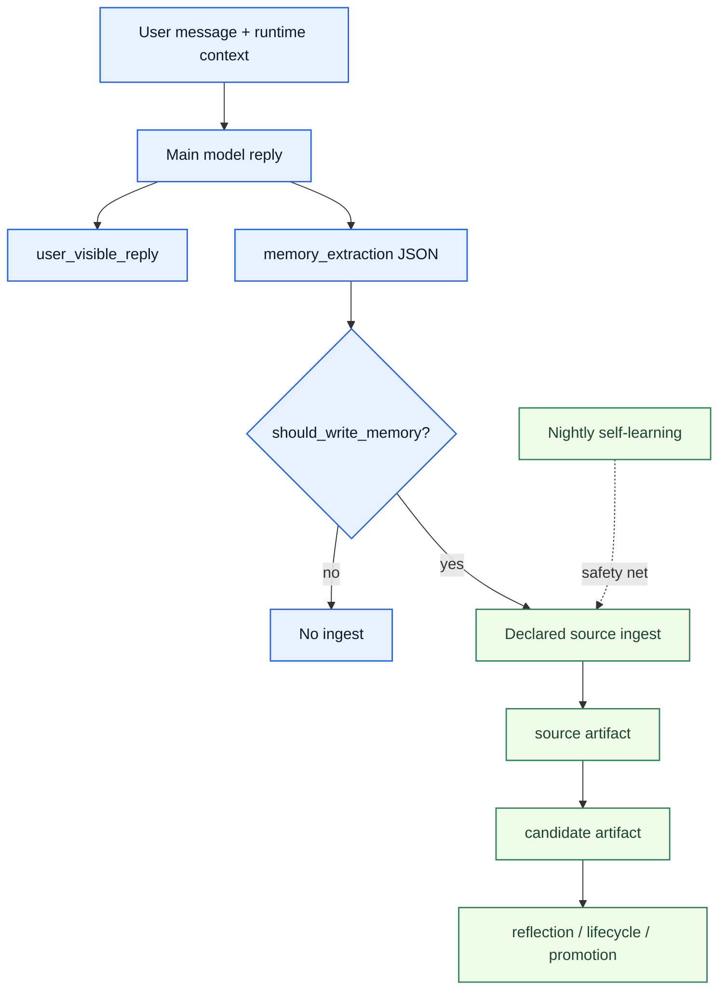

# Realtime Memory-Intent Ingestion Architecture

[English](realtime-memory-intent-ingestion.md) | [中文](realtime-memory-intent-ingestion.zh-CN.md)

## 目标

把“主回复 + 结构化 `memory_extraction`”接成一条实时、受治理、可回放的 ingest 入口，避免普通会话只能依赖 nightly self-learning 才有机会进入 registry。

这条设计主要解决三件事：

1. 显式长期规则、工具路由偏好、用户稳定偏好不应只停留在 session transcript。
2. nightly self-learning 只能做补捞，不能继续充当普通会话进入长期记忆的唯一入口。
3. 记忆意图识别不应主要依赖硬编码词表和压缩规则，而应优先利用主模型在同轮上下文里的语义判断。

## 问题定义

当前 live 行为已经证明三件事：

- agent 可以在当前会话中记住一条规则，并马上按它执行。
- Codex 路径已经可以通过同轮结构化 `memory_extraction` 直接实时进入 UMC registry。
- OpenClaw 普通对话现在也已经接上了实时 governed intake，但当前落点是 `agent_end` 上的 deterministic classification，不是“主回复同轮隐藏 JSON”。

这带来的问题是：

- 明显的 future-behavior rule 可能直到 nightly 才被处理。
- nightly 只跑一次，并且前面有硬编码压缩，所以显式规则仍然可能漏掉。
- `accepted_action` 已经有实时 governed intake，而 conversation rule 还停留在事后提炼，系统面不对称。

## 核心方向

推荐方向不是“每条消息再补一次额外 LLM 调用”，而是：

`在正常主回复同一次模型推理里，顺带返回隐藏的结构化 memory_extraction`

runtime 只把 `user_visible_reply` 展示给用户，同时消费结构化字段判断是否需要实时写入 source ingest。

## 设计原则

1. 主回复与记忆抽取共用同一次主模型推理。
2. `memory_extraction` 是治理入口，不是直接 stable promote。
3. nightly self-learning 保留，但退回补捞和 drift 检查角色。
4. 硬编码规则只做 guardrail，不再做主判定器。
5. schema 必须显式区分 durable、session 和 none，避免把当前任务指令误记成长期规则。
6. replay cases 必须先于 runtime rollout 建起来。

## 最小输出契约

推荐主模型输出至少包含：

```json
{
  "user_visible_reply": "记住了。以后收到小红书链接时，我会优先使用 capture_xiaohongshu_note 来处理。",
  "memory_extraction": {
    "should_write_memory": true,
    "category": "tool_routing_preference",
    "durability": "durable",
    "confidence": 0.98,
    "summary": "User wants Xiaohongshu links handled with capture_xiaohongshu_note in future conversations.",
    "structured_rule": {
      "trigger": {
        "content_kind": "xiaohongshu_link",
        "domains": ["xhslink.com", "xiaohongshu.com"]
      },
      "action": {
        "tool": "capture_xiaohongshu_note"
      }
    }
  }
}
```

当前最小分类面：

- `none`
- `task_instruction`
- `session_constraint`
- `durable_rule`
- `tool_routing_preference`
- `user_profile_fact`

## 系统分层



## 与现有入口的关系

### accepted_action

- 保留现有 `accepted_action` 实时 governed intake。
- 它仍然适用于“用户接受了某个动作，且 runtime 执行成功”的结构化事件。
- `memory_extraction` 不替代 `accepted_action`，而是补上“普通对话显式规则”这条入口。

### nightly self-learning

- 继续存在。
- 用于补捞未被实时入口捕获的信号。
- 用于做 drift review、重复证据聚合、压缩后的历史补提炼。
- 不再承担“普通会话显式规则唯一入口”角色。

## 当前最小 runtime 落点

当前正式 runtime 落点已经有两条：

1. `src/codex-adapter.js` 的 `writeAfterTask(...)`
2. `src/plugin/ordinary-conversation-memory-hook.js` 的 OpenClaw `agent_end` hook

它们共享同一份 `memory_intent` contract：

- Codex 输入新增 `memoryExtraction` / `memory_extraction`
- OpenClaw ordinary conversation 则在 `agent_end` 上把 bounded categories 映射成 `memory_intent`
- 当判断结果等价于 `should_write_memory=true` 时，立即发出一条 `memory_intent` source ingest
- `memory_intent` contract 现在显式包含 category、durability、confidence、admission_route、structured_rule
- reflection 会根据 admission route 把 durable rule/profile 走 candidate，session / task-local 走 observation
- promotion 继续通过 reflection + lifecycle 治理，而不是 adapter-local 直写 stable

这条最小闭环的目的不是一次性完美建模，而是：

`先消除“显式规则只能等 nightly，还可能漏掉”的结构性缺口`

## 风险与 guardrail

### 风险 1：过记

如果模型把大量普通任务指令也当成 durable memory，会污染 registry。

约束：

- 明确区分 `none / task_instruction / session_constraint / durable`
- 只对 `should_write_memory=true` 的输出做 ingest
- 先用 replay cases 扩充分界面，再扩大 live rollout

### 风险 2：session 规则误入 durable

例如“这个会话里都用中文回复”不应该变成长期偏好。

约束：

- schema 中必须显式保留 `durability = session`
- runtime 可以先记录为 session-scoped candidate，或在第一版只 ingest durable 项

### 风险 3：结构漂移

如果输出 schema 不稳，runtime 侧就无法可靠消费。

约束：

- 使用显式 JSON schema / tool-call schema
- 通过 replay suite 固定高混淆案例

## Replay 基线

这一轮已经建立了 memory-intent replay 回归面，覆盖：

- durable tool routing preference
- one-off task instruction
- session reply-style constraint
- no-memory small talk
- durable user profile fact
- durable reusable workflow rule
- session-scoped tool routing rule

相关文件：

- [../../../../evals/memory-intent-replay-cases.json](../../../../evals/memory-intent-replay-cases.json)
- [../../../../scripts/eval-memory-intent-replay.js](../../../../scripts/eval-memory-intent-replay.js)
- [../../../../test/memory-intent-replay-cases.test.js](../../../../test/memory-intent-replay-cases.test.js)

## rollout 顺序

1. 先固定 replay contract 和分类面。
2. 再让 runtime 能消费 `memory_extraction` 并实时 ingest。
3. 再决定是否把 `session_constraint` 做成单独 admission route。
4. 最后再考虑 richer reflection、dedupe、supersede、negative-path policy。

## 当前状态

当前仓库已经完成五件基础工作：

- replay 回归面已经建立
- `memory_intent` 已成为正式 source type 和共享 contract
- Codex adapter 的 `writeAfterTask(...)` 已能消费结构化 `memory_extraction` 并实时写入 governed `source + reflection + promotion`
- OpenClaw adapter 的 ordinary-conversation `agent_end` hook 已能把 durable ordinary signals 接入同一条 governed lifecycle
- `npm run verify:memory-intent` 已成为这条 slice 的正式 gate

同时，`Stage 12` 现在已经有一条正式的维护者 proof 入口：

- `npm run umc:stage12`

它把 4 件事收成同一条 closeout surface：

1. fresh `memory-intent` formal gate
2. ordinary-conversation strict Docker closeout
3. accepted-action host canary
4. operator surface / docs contract 已经对齐

对应 closeout 证据：

- [../../../../reports/generated/stage12-realtime-memory-intent-productization-closeout-2026-04-19.zh-CN.md](../../../../reports/generated/stage12-realtime-memory-intent-productization-closeout-2026-04-19.zh-CN.md)
- [../../../../reports/generated/openclaw-ordinary-conversation-memory-intent-closeout-2026-04-17.md](../../../../reports/generated/openclaw-ordinary-conversation-memory-intent-closeout-2026-04-17.md)
- [../../../../reports/generated/openclaw-accepted-action-canary-2026-04-15.md](../../../../reports/generated/openclaw-accepted-action-canary-2026-04-15.md)

同时也要清楚边界：

- Codex 路径已经实现了“主回复同一次推理顺带返回结构化 memory_extraction”
- OpenClaw 当前普通对话路径还没有走到这一步，而是先通过 deterministic hook 落到同一份 `memory_intent` contract

下一步不再是补 contract 本身，而是回到更上层的主线：

`继续把这条正式 contract 作为维护态产品面守住，并只在新的明确产品目标下再开启后续阶段`
