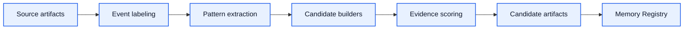

# Reflection System Architecture

[English](reflection-system.md) | [中文](reflection-system.zh-CN.md)

## 目的

`Reflection System` 负责把 normalized source artifacts 转成受治理的 memory / learning candidates。

它回答的是：

`哪些内容值得被系统当成“应该学习、观察或考虑升级”的对象？`

## 它负责什么

- event labeling
- pattern extraction
- candidate builders
- evidence scoring
- reflection run outputs

## 它不负责什么

- raw source ingestion
- stable artifact persistence
- export projection
- 最终治理审批

## 反思原则

1. 结构化，不自由发挥
2. 基于证据，不脑补
3. 可审阅，不隐藏
4. 默认可降级，不默认永久化

## 主流程

## 主要 candidate 类型

- `stable_fact_candidate`
- `stable_preference_candidate`
- `stable_rule_candidate`
- `habit_signal_candidate`
- `behavior_pattern_candidate`
- `observation_candidate`
- `open_question_candidate`

## 反思问题集

这个系统应该稳定回答这些问题：

- 哪些内容今天被明确强化了？
- 哪些内容今天重复出现了？
- 哪些内容今天再次得到验证？
- 哪些内容仍然不确定？
- 哪些内容制造了噪音？
- 哪些内容值得进入 promotion review？

## 输入契约

它消费：

- normalized source artifacts
- source scope / visibility metadata
- 可选的历史 registry state 作为比较基线

## 输出契约

它产出：

- candidate artifacts
- scoring metadata
- evidence references
- reflection run summary

## 依赖规则

- 依赖 `Source System`
- 向 `Memory Registry` 写入
- 不应该依赖 adapter 专属行为

## 第一阶段实现边界

第一批实现建议先支持：

1. event labeling contract
2. 基础 candidate builders
3. evidence scoring inputs
4. reflection run report shape

## 完成标准

这个模块进入可开发状态的标准是：

- candidate taxonomy 已冻结
- evidence inputs 已文档化
- reflection questions 已明确
- outputs 可测试、可回放
