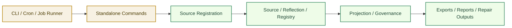

# Standalone Mode Architecture

[English](standalone-mode.md) | [中文](standalone-mode.zh-CN.md)

## Purpose

`Standalone Mode` defines how `Unified Memory Core` should run without requiring OpenClaw host participation.

It covers:

- CLI-driven execution
- scheduled job execution
- controlled source ingestion
- export / audit / repair operations outside adapters

Related documents:

- [../deployment-topology.md](../deployment-topology.md)
- [../../self-learning-architecture.md](../../self-learning-architecture.md)
- [../development-plan.md](../development-plan.md)

## What It Owns

- CLI-facing execution boundary
- scheduled-job-friendly entrypoints
- source registration commands
- export / audit / repair command contracts

## What It Does Not Own

- OpenClaw runtime behavior
- Codex runtime behavior
- adapter-specific projection logic
- runtime API service implementation

## Core Goal

Make the product usable as:

`a local-first, host-independent memory system that can ingest, reflect, export, and govern artifacts from the command line`

## Core Flow

## Command Families

The first stable command families should be:

1. `source add / list / inspect`
2. `reflect run / inspect`
3. `export build / inspect`
4. `govern audit / repair / replay`

## Boundary Rules

Standalone mode should:

- reuse the same contracts as embedded mode
- write the same governed artifacts
- avoid hidden runtime-only state
- stay compatible with future shared-registry service evolution

## Initial Build Boundary

The first implementation wave should support:

1. source registration
2. dry-run reflection
3. deterministic export build
4. audit / repair inspection commands

## Done Definition

This module is ready for implementation when:

- command families are explicit
- input / output contracts are explicit
- scheduled-job execution assumptions are explicit
- standalone outputs match governed artifact contracts
