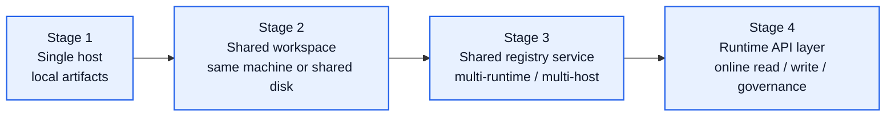
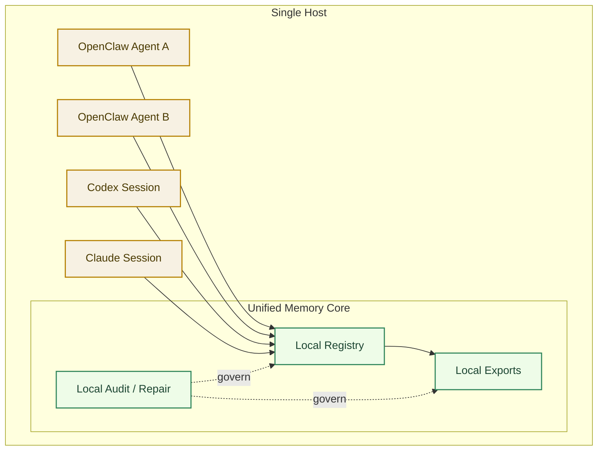
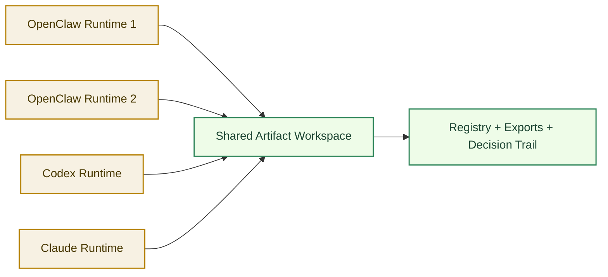
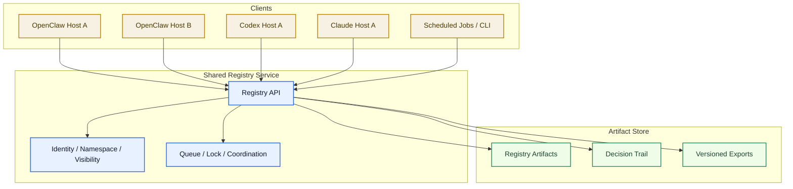
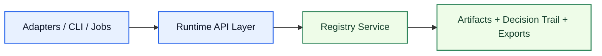
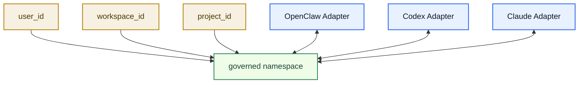

# Unified Memory Core Deployment Topology

[English](deployment-topology.md) | [中文](deployment-topology.zh-CN.md)

## Purpose

This document explains how `Unified Memory Core` should be used across:

- one OpenClaw with multiple agents
- multiple OpenClaw runtimes
- multiple Codex runtimes
- multiple Claude or future tool runtimes

It answers one practical question:

`when is local artifact sharing enough, and when do we need a real network architecture?`

Related documents:

- [../../architecture.md](../../architecture.md)
- [../../workstreams/system/architecture.md](../../workstreams/system/architecture.md)
- [../code-memory-binding-architecture.md](../code-memory-binding-architecture.md)
- [development-plan.md](development-plan.md)

## Short Answer

Recommended direction:

1. start with `local artifact mode`
2. keep identity / namespace / export contracts stable from day one
3. add a shared registry service only when multiple runtimes need cross-host coordination
4. add runtime API later as a product phase, not as day-one scope

So:

- `network architecture` is **not required on day one**
- but `network-ready contracts` are required on day one

## Deployment Evolution

## Stage 1: Single Host, Multiple Agents

This is the first recommended deployment shape.

Typical examples:

- one OpenClaw runtime with multiple agents
- one Codex runtime with multiple work sessions
- one local Claude workflow with one shared project workspace

Recommended design:

- one local artifact store
- one local registry directory
- one namespace resolver
- one lock / write-serialization rule

When this is enough:

- all runtimes live on one machine
- artifacts can be shared by file system
- write frequency is modest
- conflict handling can be serialized locally

## Stage 2: Multiple Runtimes, Shared Workspace

This stage still avoids a full network service.

Typical examples:

- multiple OpenClaw instances on the same machine
- one OpenClaw and one Codex process sharing one repo workspace
- multiple local tools using one shared project memory directory

Recommended design:

- shared artifact directory
- explicit project / workspace binding
- file locks or append-only journal
- replayable decision trail

When this is enough:

- runtimes are still trusted and close to each other
- latency is not a product requirement
- offline-first behavior is preferred
- repair and replay can still be file-driven

## Stage 3: Shared Registry Service

This is the first stage where a true network architecture becomes necessary.

Typical examples:

- multiple machines need one governed memory space
- one OpenClaw host and one Codex host are on different machines
- background learning jobs run remotely
- multiple developers or users consume one central memory product

Recommended design:

- keep artifacts as the system of record
- add a registry service for coordination
- add service-side identity, namespace, and visibility enforcement
- keep exports deterministic and versioned

When this is necessary:

- multiple hosts need shared read / write
- concurrent updates become common
- visibility scope cannot rely on local trust
- tool adapters must coordinate through one source of truth

## Stage 4: Runtime API Layer

This is a later product phase.

It should not replace artifacts as the governed source of truth.

It should sit on top of the registry and exports to provide:

- online query
- online write-back
- remote audit / repair actions
- adapter-friendly service integration

## Binding Model

Multiple runtimes should never be “hard-bound” directly to each other.

They should bind through four shared dimensions:

1. `user_id`
2. `workspace_id`
3. `project_id`
4. `namespace`

## What Should Be Shared

Recommended shared memory domains:

- stable code rules
- project constraints
- long-term coding preferences
- validated lessons and governance results
- stable facts that affect implementation behavior

Recommended non-shared or weakly shared domains:

- temporary scratchpads
- one-off emotional signals
- unvalidated candidate conclusions
- tool-private hidden prompts

## Concurrency Rules

Even in local mode, multi-runtime operation needs explicit write rules.

Minimum rules:

1. append-only decision trail
2. deterministic artifact ids
3. one writer lock per namespace or artifact family
4. optimistic read, serialized write
5. repair operations must produce new decisions, not destructive overwrites

## Visibility Rules

Multi-tool sharing does not mean everything is globally visible.

Each artifact should carry:

- `namespace`
- `visibility`
- `source_tool`
- `source_scope`
- `owner`
- `confidence`
- `version`

This is the minimum needed to make OpenClaw, Codex, and Claude share memory safely.

## Recommended Near-Term Decision

For the current product stage:

- build `Stage 1 + Stage 2` first
- make contracts network-ready now
- postpone `Stage 3 + Stage 4` to later roadmap phases

That means:

- no mandatory network service in the first implementation milestone
- yes to multi-runtime-safe contracts from the beginning
