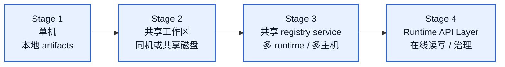
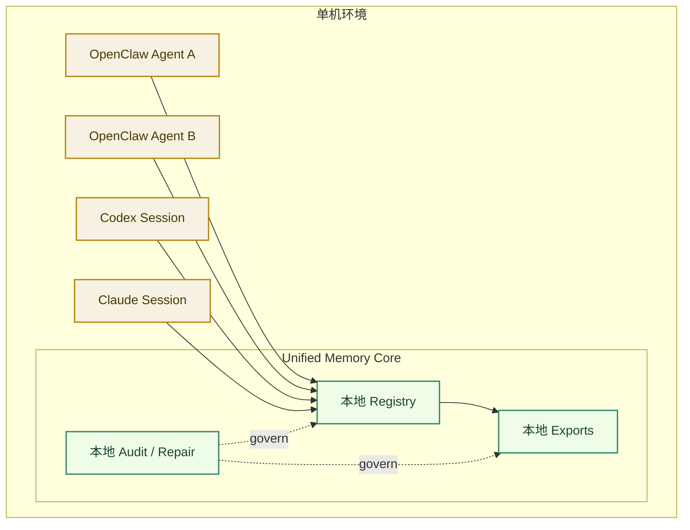
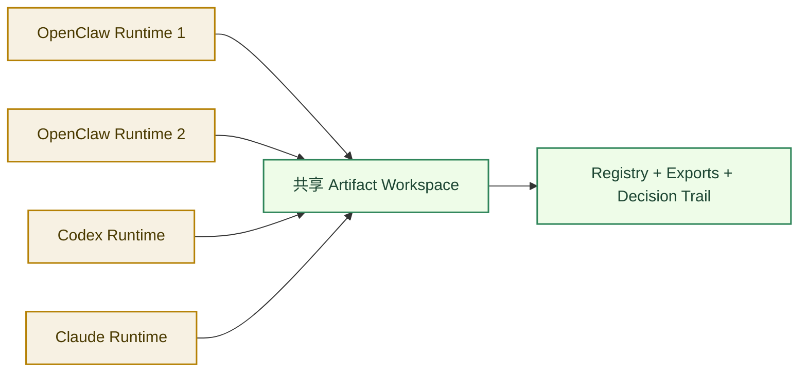
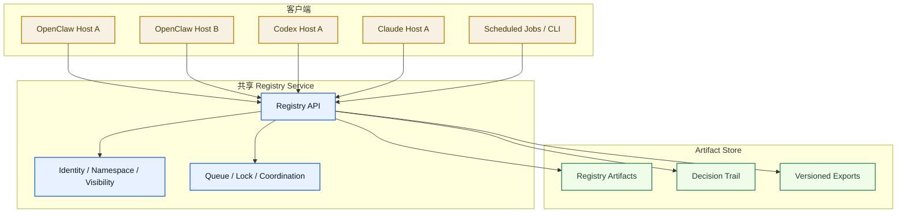
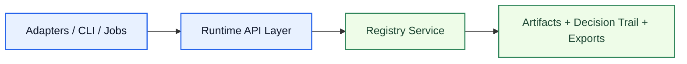
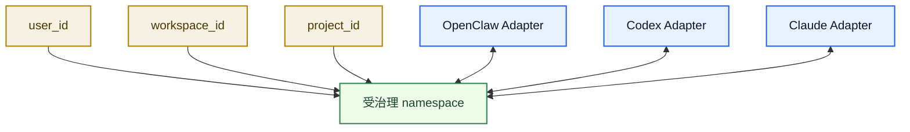

# Unified Memory Core Deployment Topology

[English](deployment-topology.md) | [中文](deployment-topology.zh-CN.md)

## 目的

这份文档专门说明 `Unified Memory Core` 在下面几种场景里应该怎么使用：

- 一个 OpenClaw 下多个 agent
- 多个 OpenClaw runtime
- 多个 Codex runtime
- 多个 Claude 或未来其他工具 runtime

它回答的是一个很实际的问题：

`什么时候本地 artifact 共享就够了，什么时候需要真正的网络架构？`

相关文档：

- [../../architecture.zh-CN.md](../../architecture.zh-CN.md)
- [../../workstreams/system/architecture.zh-CN.md](../../workstreams/system/architecture.zh-CN.md)
- [../code-memory-binding-architecture.zh-CN.md](../code-memory-binding-architecture.zh-CN.md)
- [development-plan.zh-CN.md](development-plan.zh-CN.md)

## 短答案

推荐方向是：

1. 先从 `local artifact mode` 起步
2. 从第一天就把 identity / namespace / export contracts 设计稳定
3. 只有在多个 runtime 需要跨主机协同时，再引入 shared registry service
4. runtime API 放到后续产品阶段，不作为第一天范围

所以结论是：

- `网络架构` **不是第一天必需**
- 但 `面向网络演进的 contracts` 第一阶段就必须有

## 部署演进路径

## Stage 1：单机，多 agent

这是第一阶段最推荐的部署形态。

典型场景：

- 一个 OpenClaw runtime 下多个 agent
- 一个 Codex runtime 下多个工作 session
- 一个本地 Claude 工作流共享一个项目工作区

推荐设计：

- 一套本地 artifact store
- 一套本地 registry 目录
- 一套 namespace resolver
- 一套 lock / write-serialization 规则

这种形态什么时候够用：

- 所有 runtime 都在同一台机器上
- artifacts 可以直接通过文件系统共享
- 写入频率还不高
- 冲突可以通过本地串行化规则控制

## Stage 2：多 runtime，共享工作区

这个阶段仍然尽量不引入完整网络服务。

典型场景：

- 同一台机器上有多个 OpenClaw 实例
- 一个 OpenClaw 进程和一个 Codex 进程共享同一个仓库工作区
- 多个本地工具共享同一个项目记忆目录

推荐设计：

- 共享 artifact 目录
- 显式 project / workspace binding
- file lock 或 append-only journal
- 可回放 decision trail

这种形态什么时候够用：

- runtime 之间仍然处于可信、近距离协作环境
- 低延迟网络访问还不是产品刚需
- 更希望保留 offline-first
- repair 和 replay 仍然可以围绕文件工件展开

## Stage 3：共享 Registry Service

这是第一阶段真正需要网络架构的时候。

典型场景：

- 多台机器需要共享同一套治理记忆空间
- OpenClaw host 和 Codex host 分别在不同机器上
- 后台 learning jobs 需要远程跑
- 多个开发者或多个用户需要消费同一个中心化记忆产品

推荐设计：

- 继续让 artifacts 作为 system of record
- 新增 registry service 负责协调
- 在服务侧统一执行 identity / namespace / visibility
- 继续让 exports 保持 deterministic 和 versioned

什么时候需要它：

- 多主机共享读写变成常态
- 并发写入开始频繁
- 可见性范围不能再依赖本地信任
- 各 adapter 需要围绕一个 source of truth 协同

## Stage 4：Runtime API Layer

这是后续产品阶段。

它不应该替代 artifacts 作为治理真相源。

更合理的位置是建立在 registry 和 exports 之上，提供：

- online query
- online write-back
- remote audit / repair
- 更适合 adapter 的服务化接入

## 绑定模型

多个 runtime 之间不应该彼此“硬绑定”。

它们应该通过下面 4 个共享维度绑定：

1. `user_id`
2. `workspace_id`
3. `project_id`
4. `namespace`

## 应该共享什么

建议共享的记忆域：

- stable code rules
- project constraints
- long-term coding preferences
- validated lessons
- 会影响实现行为的稳定事实

建议不直接共享，或只弱共享的域：

- 临时 scratchpad
- 一次性情绪信号
- 未验证 candidate 结论
- 工具私有 hidden prompts

## 并发规则

即便是本地模式，多 runtime 运行也需要显式写规则。

最小规则建议：

1. append-only decision trail
2. deterministic artifact ids
3. 每个 namespace 或 artifact family 一把 writer lock
4. optimistic read, serialized write
5. repair 操作产出新的 decision，而不是 destructive overwrite

## 可见性规则

多工具共享不代表所有内容全局可见。

每条 artifact 至少要带：

- `namespace`
- `visibility`
- `source_tool`
- `source_scope`
- `owner`
- `confidence`
- `version`

这是让 OpenClaw、Codex、Claude 安全共享记忆的最低要求。

## 当前阶段的推荐决策

对当前产品阶段，建议这样落：

- 先做 `Stage 1 + Stage 2`
- 现在就把 contracts 设计成 network-ready
- 把 `Stage 3 + Stage 4` 放进后续 roadmap

也就是说：

- 第一阶段实现里不强制要求网络服务
- 但第一阶段就要避免把 contracts 写成只能单机场景使用
