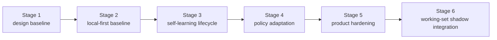

# Roadmap

[English](roadmap.md) | [中文](roadmap.zh-CN.md)

## Scope

This page is the stable roadmap wrapper for the repo. It shows milestone order and current program direction without replacing the live execution control surface.

For live work state, read:

- [../.codex/status.md](../.codex/status.md)
- [../.codex/module-dashboard.md](../.codex/module-dashboard.md)

For detailed queues, read:

- [project workstream roadmap](workstreams/project/roadmap.md)
- [unified-memory-core/development-plan.md](reference/unified-memory-core/development-plan.md)

## Current Program Snapshot

This block is here to answer "where did the `200+` case program actually land?" without forcing a jump back to the control surface.

- Program: `execute-200-case-benchmark-and-answer-path-triage`
- Status: `completed`
- Runnable matrix: `392` cases
- Chinese coverage: `211 / 392 = 53.83%`
- Natural Chinese cases: `24` (`12` retrieval + `12` answer-level)
- Retrieval-heavy formal gate: `250 / 250`
- Isolated local answer-level formal gate: `12 / 12` (`6 / 12` zh-bearing inside the formal gate)
- Live answer-level A/B: `100` real cases, current `100 / 100`, legacy `99 / 100`, `1` Memory Core-only win, `0` builtin-only wins, and `0` shared failures
- Natural-Chinese representative retrieval slice: `5 / 5`
- Natural-Chinese representative answer-level slice: `6 / 6`
- Raw transport watchlist: `3 / 8 raw ok`; the rest are `4` `missing_json_payload` failures and `1` `empty_results`
- Main-path perf baseline: retrieval / assembly `16ms`; raw transport `8061ms`; isolated local answer-level `11200ms`
- Interpretation: the `200+` case buildout, natural-Chinese hardening, watchlist classification, perf-baseline refresh, and the first answer-level gate expansion from `6/6` to `12/12` are complete; the builtin-only regression and the shared-fail history cases are now closed, so the next phase is no longer “finish old cleanup” but “turn per-turn context optimization into the explicit mainline”

Supporting evidence:

- [../.codex/status.md](../.codex/status.md)
- [../.codex/plan.md](../.codex/plan.md)
- [generated/openclaw-cli-memory-eval-program-2026-04-14.md](../reports/generated/openclaw-cli-memory-eval-program-2026-04-14.md)
- [generated/openclaw-natural-chinese-watch-and-perf-2026-04-15.md](../reports/generated/openclaw-natural-chinese-watch-and-perf-2026-04-15.md)
- [generated/openclaw-answer-level-gate-expansion-2026-04-15.md](../reports/generated/openclaw-answer-level-gate-expansion-2026-04-15.md)

## Dialogue Working-Set Runtime Snapshot

This block tracks the completed Stage 6 runtime shadow integration.

- Program: `dialogue-working-set-shadow-runtime`
- Status: `completed / shadow-only`
- Runtime shadow replay: `16 / 16`
- Runtime shadow replay average reduction ratio: `0.4368`
- Runtime answer A/B: baseline `5 / 5`, shadow `5 / 5`
- Runtime answer A/B shadow-only wins: `0`
- Runtime answer A/B average prompt reduction ratio: `0.0114`
- Interpretation: runtime shadow integration is now the durable measurement surface, but active prompt mutation remains deferred

Supporting evidence:

- [generated/dialogue-working-set-pruning-feasibility-2026-04-16.md](../reports/generated/dialogue-working-set-pruning-feasibility-2026-04-16.md)
- [generated/dialogue-working-set-shadow-replay-2026-04-16.md](../reports/generated/dialogue-working-set-shadow-replay-2026-04-16.md)
- [generated/dialogue-working-set-answer-ab-2026-04-16.md](../reports/generated/dialogue-working-set-answer-ab-2026-04-16.md)
- [generated/dialogue-working-set-adversarial-2026-04-16.md](../reports/generated/dialogue-working-set-adversarial-2026-04-16.md)
- [generated/dialogue-working-set-validation-2026-04-16.md](../reports/generated/dialogue-working-set-validation-2026-04-16.md)
- [generated/dialogue-working-set-runtime-shadow-2026-04-16.md](../reports/generated/dialogue-working-set-runtime-shadow-2026-04-16.md)
- [generated/dialogue-working-set-runtime-answer-ab-2026-04-16.md](../reports/generated/dialogue-working-set-runtime-answer-ab-2026-04-16.md)
- [generated/dialogue-working-set-runtime-shadow-summary-2026-04-16.md](../reports/generated/dialogue-working-set-runtime-shadow-summary-2026-04-16.md)
- [generated/dialogue-working-set-stage6-2026-04-16.md](../reports/generated/dialogue-working-set-stage6-2026-04-16.md)

## Current Review Verdict

- Completed:
  - Stage 6 `dialogue working-set shadow integration` is landed in runtime and remains `default-off` + shadow-only
  - the shared-fail Chinese history cleanup is closed
  - the official-image Docker hermetic eval path is now reusable
- Planned:
  - run a docs-first review so roadmap, development plan, architecture docs, and `.codex/*` all describe the same “per-turn context optimization” recovery point
  - define the bounded LLM-led context decision contract, operator metrics, and rollback boundary
  - then redesign the harder live A/B around `cross-source`, `conflict`, `multi-step history`, and denser natural-Chinese prompts
- Explicitly not planned right now:
  - no default active prompt mutation
  - no builtin memory behavior changes
  - no continued growth of large hardcoded rule tables to mimic context decisions

## Primary Product Values And Milestone Mapping

| Product Value | What Is Already Landed | Current Evidence Surface | Next Milestone |
| --- | --- | --- | --- |
| On-demand context loading | fact-first assembly, durable-source slimming design, runtime working-set shadow instrumentation | runtime shadow replay `16 / 16`, average reduction ratio `0.4368`, runtime answer A/B `5 / 5` vs `5 / 5` | turn this into a harder builtin-comparison context-thickness / latency gate |
| Realtime + nightly self-learning | realtime `memory_intent` ingestion, nightly self-learning default-on, governed promotion / decay | ordinary-conversation host-live A/B current `38 / 40`, legacy `21 / 40`, `18` UMC-only wins | remove timeout-heavy blind spots and convert more harder cases into clean UMC-only wins |
| CLI-governed memory operations | add / inspect / audit / repair / replay / export / migrate surfaces, release-preflight | shipped CLI flows and regression-protected verification stack | keep the operator surface readable, replayable, and release-grade |
| Shared memory foundation | shared contracts, canonical registry root, OpenClaw adapter, Codex adapter | stable architecture boundary and cross-host consumption path | keep the shared-core contract stable while the context-optimization layer evolves |

These milestones should keep six product qualities visible as constraints:

- `simple`
  - installation and first-use setup should stay low-friction even as capability grows
- `usable`
  - new capability should reduce operator friction instead of increasing config and review overhead
- `lightweight`
  - new runtime logic should lower prompt thickness while keeping install and runtime footprint under control
- `fast enough`
  - latency and day-to-day responsiveness must stay part of the target, not be traded away for a more complex decision layer
- `smart`
  - the next round should feel more selective and better judged, not just more rule-heavy or call-heavy
- `maintainable`
  - rollout, rollback, replay, and audit surfaces should stay easier to operate, not harder

## Product North Star

> Simple to install, smooth to use, light and fast to run, smart to remember, easy to maintain.

At roadmap level this means:

- `simple to install`
  - adoption cost and default-config complexity remain first-class targets
- `smooth to use`
  - the next phase cannot optimize only for “more powerful”; it also has to improve the default feel
- `light and fast to run`
  - context thickness, latency, package size, and runtime footprint stay inside milestone evaluation
- `smart to remember`
  - retrieval, learning, working-set pruning, and budgeted assembly must improve together as one evidence surface
- `easy to maintain`
  - hermetic / Docker eval, rollback boundaries, and operator metrics remain first-class constraints

## Current Gap Review

The roadmap should make the current distance from the north star explicit:

- already relatively strong:
  - `easy to maintain`
  - the `self-learning` backbone
  - `context optimization` as a formal mainline
- currently weakest:
  - `simple`: install / bootstrap / verify still asks too much manual setup
  - `fast enough`: the hermetic ordinary-conversation write path is still timeout-heavy
  - `smart`: working-set optimization is validated but not yet a default user-visible gain
  - `lightweight`: package, startup, and default runtime budgets are not yet enforced as hard targets
  - `shared foundation`: Codex / multi-instance product evidence still trails OpenClaw

That makes the next priority order explicit:

1. simplify install / bootstrap / verify
2. reduce hermetic timeout and latency pressure
3. move from shadow-only to a narrow guarded smart path
4. turn lightweight goals into explicit budgets
5. strengthen shared-foundation evidence across OpenClaw and Codex

## Now / Next / Later

| Horizon | Focus | Exit Signal |
| --- | --- | --- |
| Now | shift from docs-first review into north-star gap closure: simplify adoption first, then improve speed, then advance the smart path | roadmap, development plan, architecture docs, and `.codex/*` all point at the same gap-driven priority order |
| Next | define the bounded LLM-led context decision contract, operator metrics, and rollback boundary, while turning install / timeout / lightweight into formal gates | the next harder-case design carries explicit prompt-thickness / reduction / latency / rollback metrics, with install / latency / budget thresholds made explicit too |
| Later | discuss any guarded active-path experiment only after a longer real-session soak | shadow telemetry stays green long enough and the promotion / rollback gate is operator-ready |

## Current Execution Focus

The current roadmap horizon also maps to the concrete next execution work:

1. keep Stage 6 runtime shadow integration `default-off` and shadow-only
2. complete the docs-first review so durable-source slimming, working-set pruning, and harder live A/B sit inside one explicit recovery point
3. continue treating active prompt mutation as explicitly out of the default path until rollback boundaries and operator metrics are clear
4. use the runtime export artifacts and the Docker hermetic eval path as the new replayable operator evidence surface

When resuming work:

- use `92` in [reference/unified-memory-core/development-plan.md](reference/unified-memory-core/development-plan.md) for the current execution order
- use [../.codex/plan.md](../.codex/plan.md) and [../.codex/status.md](../.codex/status.md) for the live state

## Milestones

| Milestone | Status | Goal | Depends On | Exit Criteria |
| --- | --- | --- | --- | --- |
| [Stage 1: design baseline](reference/unified-memory-core/development-plan.md#stage-1-design-and-documentation-baseline) | completed | freeze product naming, boundaries, and document stack | none | architecture, module boundaries, and testing surfaces are aligned |
| [Stage 2: local-first baseline](reference/unified-memory-core/development-plan.md#stage-2-local-first-implementation-baseline) | completed | ship one governed local-first end-to-end baseline | Stage 1 | core modules, adapters, standalone CLI, and governance all run |
| [Stage 3: self-learning lifecycle baseline](reference/unified-memory-core/development-plan.md#stage-3-self-learning-lifecycle-baseline) | completed | turn the already-implemented reflection baseline into an explicit lifecycle with promotion, decay, and learning-specific governance | Stage 2 | promotion / decay expectations, learning governance, OpenClaw validation, and local governed loop are all implemented and regression-protected |
| [Stage 4: policy adaptation](reference/unified-memory-core/development-plan.md#stage-4-policy-adaptation-and-multi-consumer-use) | completed | let governed learning outputs influence consumer behavior | Stage 3 | one reversible policy-adaptation loop is proven |
| [Stage 5: product hardening](reference/unified-memory-core/development-plan.md#stage-5-product-hardening-and-independent-operation) | completed | validate split-ready and independent-product operation | Stage 4 | release boundary, reproducibility, maintenance workflows, and split rehearsal are all CLI-verifiable |
| [Stage 6: dialogue working-set shadow integration](reference/unified-memory-core/development-plan.md#stage-6-dialogue-working-set-shadow-integration) | completed | validate and instrument hot-session working-set pruning in runtime shadow mode before any active prompt cutover | Stage 5 | runtime shadow telemetry is now landed default-off, replayable exports exist, and answer-level replay stays green enough to keep the feature shadow-only |

## Milestone Flow

## Risks and Dependencies

- the current roadmap should not drift away from `.codex/status.md` and `.codex/plan.md`
- `todo.md` should remain personal scratch space, not a competing status source
- the next dependency is no longer Stage 5 implementation; it is keeping release-preflight and deployment evidence stable over time
- registry-root cutover policy remains an operator follow-up, not hidden Stage 5 contract work
- Stage 4 and Stage 5 reports must stay readable while any later service-mode discussion remains deferred
- the primary post-Stage-5 work is now evaluation-driven optimization, so the roadmap and `.codex/plan.md` must keep case expansion, A/B comparison, answer-level regression, transport watchlists, and performance planning visible
- active prompt mutation remains explicitly deferred until runtime shadow telemetry proves the working-set path on real sessions
- if the next round adds context-decision experiments, it should prefer a bounded LLM-led contract instead of growing a wider hardcoded rule table
