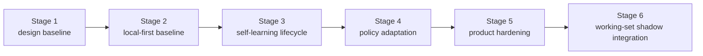

# Roadmap

[English](roadmap.md) | [中文](roadmap.zh-CN.md)

## Scope

This page is the stable roadmap wrapper for the repo. It shows milestone order and current program direction without replacing the live execution control surface.

For live work state, read:

- [../.codex/status.md](../.codex/status.md)
- [../.codex/module-dashboard.md](../.codex/module-dashboard.md)

For detailed queues, read:

- [project workstream roadmap](workstreams/project/roadmap.md)
- [unified-memory-core/development-plan.md](reference/unified-memory-core/development-plan.md)

## Current Program Snapshot

This block is here to answer "where did the `200+` case program actually land?" without forcing a jump back to the control surface.

- Program: `execute-200-case-benchmark-and-answer-path-triage`
- Status: `completed`
- Runnable matrix: `392` cases
- Chinese coverage: `211 / 392 = 53.83%`
- Natural Chinese cases: `24` (`12` retrieval + `12` answer-level)
- Retrieval-heavy formal gate: `250 / 250`
- Isolated local answer-level formal gate: `12 / 12` (`6 / 12` zh-bearing inside the formal gate)
- Live answer-level A/B: `100` real cases, `97` shared wins, `1` Memory Core-only win, `0` builtin-only wins, and `2` shared failures
- Natural-Chinese representative retrieval slice: `5 / 5`
- Natural-Chinese representative answer-level slice: `6 / 6`
- Raw transport watchlist: `3 / 8 raw ok`; the rest are `4` `missing_json_payload` failures and `1` `empty_results`
- Main-path perf baseline: retrieval / assembly `16ms`; raw transport `8061ms`; isolated local answer-level `11200ms`
- Interpretation: the `200+` case buildout, natural-Chinese hardening, watchlist classification, perf-baseline refresh, and the first answer-level gate expansion from `6/6` to `12/12` are complete; the builtin-only regression has now been removed from the `100`-case live A/B, and the next phase should focus on the remaining shared failures before claiming a broader product lead

Supporting evidence:

- [../.codex/status.md](../.codex/status.md)
- [../.codex/plan.md](../.codex/plan.md)
- [generated/openclaw-cli-memory-eval-program-2026-04-14.md](../reports/generated/openclaw-cli-memory-eval-program-2026-04-14.md)
- [generated/openclaw-natural-chinese-watch-and-perf-2026-04-15.md](../reports/generated/openclaw-natural-chinese-watch-and-perf-2026-04-15.md)
- [generated/openclaw-answer-level-gate-expansion-2026-04-15.md](../reports/generated/openclaw-answer-level-gate-expansion-2026-04-15.md)

## Dialogue Working-Set Validation Snapshot

This block is the docs-first handoff into the next review-gated slice.

- Program: `dialogue-working-set-shadow-validation`
- Status: `validated / review-gated`
- Shadow replay: `9 / 9` checkpoints passed
- Shadow replay average raw reduction ratio: `0.5722`
- Shadow replay average shadow-package reduction ratio: `0.2275`
- Answer A/B: baseline `5 / 5`, shadow `5 / 5`, `0` regressions
- Answer A/B average estimated prompt reduction ratio: `0.0636`
- Adversarial replay: `7 / 7`
- Interpretation: the direction is now strong enough for runtime shadow integration, but not for active prompt cutover

Supporting evidence:

- [generated/dialogue-working-set-pruning-feasibility-2026-04-16.md](../reports/generated/dialogue-working-set-pruning-feasibility-2026-04-16.md)
- [generated/dialogue-working-set-shadow-replay-2026-04-16.md](../reports/generated/dialogue-working-set-shadow-replay-2026-04-16.md)
- [generated/dialogue-working-set-answer-ab-2026-04-16.md](../reports/generated/dialogue-working-set-answer-ab-2026-04-16.md)
- [generated/dialogue-working-set-adversarial-2026-04-16.md](../reports/generated/dialogue-working-set-adversarial-2026-04-16.md)
- [generated/dialogue-working-set-validation-2026-04-16.md](../reports/generated/dialogue-working-set-validation-2026-04-16.md)

## Now / Next / Later

| Horizon | Focus | Exit Signal |
| --- | --- | --- |
| Now | keep the next slice docs-first and review-gated: sync roadmap, development plan, and architecture around `dialogue working-set pruning`, then wait for GitHub review before touching runtime code | the Stage 6 plan is reviewed and approved as the new implementation pointer |
| Next | land a minimal runtime shadow integration that records `relation / evict / pins / reduction ratio` without mutating the final prompt | real-session shadow telemetry stays green and answer-level regressions remain at `0` on the attached replay surface |
| Later | decide whether to promote working-set pruning into active prompt assembly, then reopen the deferred harder A/B and history cleanup work with telemetry attached | shadow telemetry stays green long enough to justify an active-path experiment with an explicit rollback gate |

## Current Execution Focus

The current roadmap horizon also maps to the concrete next execution work:

1. keep the next slice docs-first: make `dialogue working-set pruning` a planned Stage 6 workstream in the roadmap and development plan
2. hold runtime changes until the GitHub review explicitly approves the Stage 6 shadow-integration queue
3. once approved, start only the minimal shadow instrumentation path and keep the final prompt untouched
4. keep the existing history shared-fail cleanup and harder A/B expansion deferred until the shadow telemetry path exists, so later answer-level work can reuse the new measurements

When resuming work:

- use `93` in [reference/unified-memory-core/development-plan.md](reference/unified-memory-core/development-plan.md) for the current execution order
- use [../.codex/plan.md](../.codex/plan.md) and [../.codex/status.md](../.codex/status.md) for the live state

## Milestones

| Milestone | Status | Goal | Depends On | Exit Criteria |
| --- | --- | --- | --- | --- |
| [Stage 1: design baseline](reference/unified-memory-core/development-plan.md#stage-1-design-and-documentation-baseline) | completed | freeze product naming, boundaries, and document stack | none | architecture, module boundaries, and testing surfaces are aligned |
| [Stage 2: local-first baseline](reference/unified-memory-core/development-plan.md#stage-2-local-first-implementation-baseline) | completed | ship one governed local-first end-to-end baseline | Stage 1 | core modules, adapters, standalone CLI, and governance all run |
| [Stage 3: self-learning lifecycle baseline](reference/unified-memory-core/development-plan.md#stage-3-self-learning-lifecycle-baseline) | completed | turn the already-implemented reflection baseline into an explicit lifecycle with promotion, decay, and learning-specific governance | Stage 2 | promotion / decay expectations, learning governance, OpenClaw validation, and local governed loop are all implemented and regression-protected |
| [Stage 4: policy adaptation](reference/unified-memory-core/development-plan.md#stage-4-policy-adaptation-and-multi-consumer-use) | completed | let governed learning outputs influence consumer behavior | Stage 3 | one reversible policy-adaptation loop is proven |
| [Stage 5: product hardening](reference/unified-memory-core/development-plan.md#stage-5-product-hardening-and-independent-operation) | completed | validate split-ready and independent-product operation | Stage 4 | release boundary, reproducibility, maintenance workflows, and split rehearsal are all CLI-verifiable |
| [Stage 6: dialogue working-set shadow integration](reference/unified-memory-core/development-plan.md#stage-6-dialogue-working-set-shadow-integration) | planned | validate and instrument hot-session working-set pruning in runtime shadow mode before any active prompt cutover | Stage 5 | docs-first review passes, runtime shadow telemetry lands default-off, and answer-level regression remains green on the attached replay surface |

## Milestone Flow

## Risks and Dependencies

- the current roadmap should not drift away from `.codex/status.md` and `.codex/plan.md`
- `todo.md` should remain personal scratch space, not a competing status source
- the next dependency is no longer Stage 5 implementation; it is keeping release-preflight and deployment evidence stable over time
- registry-root cutover policy remains an operator follow-up, not hidden Stage 5 contract work
- Stage 4 and Stage 5 reports must stay readable while any later service-mode discussion remains deferred
- the primary post-Stage-5 work is now evaluation-driven optimization, so the roadmap and `.codex/plan.md` must keep case expansion, A/B comparison, answer-level regression, transport watchlists, and performance planning visible
- active prompt mutation remains explicitly deferred until runtime shadow telemetry proves the working-set path on real sessions
