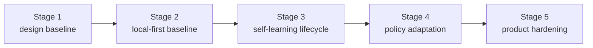

# Roadmap

[English](roadmap.md) | [中文](roadmap.zh-CN.md)

## Scope

This page is the stable roadmap wrapper for the repo. It shows milestone order and current program direction without replacing the live execution control surface.

For live work state, read:

- [../.codex/status.md](../.codex/status.md)
- [../.codex/module-dashboard.md](../.codex/module-dashboard.md)

For detailed queues, read:

- [project workstream roadmap](workstreams/project/roadmap.md)
- [unified-memory-core/development-plan.md](reference/unified-memory-core/development-plan.md)

## Current Program Snapshot

This block is here to answer "where did the `200+` case program actually land?" without forcing a jump back to the control surface.

- Program: `execute-200-case-benchmark-and-answer-path-triage`
- Status: `completed`
- Runnable matrix: `392` cases
- Chinese coverage: `211 / 392 = 53.83%`
- Natural Chinese cases: `24` (`12` retrieval + `12` answer-level)
- Retrieval-heavy formal gate: `250 / 250`
- Isolated local answer-level formal gate: `12 / 12` (`6 / 12` zh-bearing inside the formal gate)
- Natural-Chinese representative retrieval slice: `5 / 5`
- Natural-Chinese representative answer-level slice: `6 / 6`
- Raw transport watchlist: `0 / 8 raw ok`, all isolated as host `missing_json_payload`
- Main-path perf baseline: retrieval / assembly `8ms`; raw transport `8335ms`; isolated local answer-level `24553ms`
- Interpretation: the `200+` case buildout, natural-Chinese hardening, watchlist classification, perf-baseline refresh, and the first answer-level gate expansion from `6/6` to `12/12` are complete; the formal gate itself now carries `6 / 12` zh-bearing cases, and the deeper watch has improved from `7/18` to `14/18`, so the next phase is to clear the remaining four harder failures

Supporting evidence:

- [../.codex/status.md](../.codex/status.md)
- [../.codex/plan.md](../.codex/plan.md)
- [generated/openclaw-cli-memory-eval-program-2026-04-14.md](../reports/generated/openclaw-cli-memory-eval-program-2026-04-14.md)
- [generated/openclaw-natural-chinese-watch-and-perf-2026-04-15.md](../reports/generated/openclaw-natural-chinese-watch-and-perf-2026-04-15.md)
- [generated/openclaw-answer-level-gate-expansion-2026-04-15.md](../reports/generated/openclaw-answer-level-gate-expansion-2026-04-15.md)

## Now / Next / Later

| Horizon | Focus | Exit Signal |
| --- | --- | --- |
| Now | deepen answer-level coverage on top of the new `12/12` isolated local formal gate, the `392`-case matrix, `53.83%` Chinese coverage, and the failure-class transport watchlist | the formal gate is no longer just the old `6` representative samples, and deeper current/history/conflict/cross-source coverage starts entering the gate |
| Next | expand that deeper answer-level gate further before any later runtime API / service-mode discussion | the larger isolated local answer-level gate reruns cleanly without gateway/raw transport noise bleeding back into conclusions |
| Later | discuss runtime API / split-ready evolution only from a stable operator baseline | independent-product evidence stays green after Stage 5 closeout |

## Current Execution Focus

The current roadmap horizon also maps to the concrete next execution work:

1. clear the remaining four harder failures in the deeper answer-level watch
Current progress: the deeper `18`-case watch matrix now lands at `14 / 18`; the remaining open cases are current-editor, cross-source-calls, zh-project, and zh-natural-cross-source-calls.
2. keep the formal gate’s `6 / 12` natural-Chinese share stable instead of slipping back to a mostly-English gate
3. keep gateway/session-lock noise and raw `openclaw memory search` transport instability classified as `missing_json_payload` watchlist evidence, not algorithm regressions
4. rerun release-preflight / perf / A-B after the next deeper-watch fixes, then decide what can be promoted into the next formal gate

When resuming work:

- use `84` in [reference/unified-memory-core/development-plan.md](reference/unified-memory-core/development-plan.md) for the current execution order
- use [../.codex/plan.md](../.codex/plan.md) and [../.codex/status.md](../.codex/status.md) for the live state

## Milestones

| Milestone | Status | Goal | Depends On | Exit Criteria |
| --- | --- | --- | --- | --- |
| [Stage 1: design baseline](reference/unified-memory-core/development-plan.md#stage-1-design-and-documentation-baseline) | completed | freeze product naming, boundaries, and document stack | none | architecture, module boundaries, and testing surfaces are aligned |
| [Stage 2: local-first baseline](reference/unified-memory-core/development-plan.md#stage-2-local-first-implementation-baseline) | completed | ship one governed local-first end-to-end baseline | Stage 1 | core modules, adapters, standalone CLI, and governance all run |
| [Stage 3: self-learning lifecycle baseline](reference/unified-memory-core/development-plan.md#stage-3-self-learning-lifecycle-baseline) | completed | turn the already-implemented reflection baseline into an explicit lifecycle with promotion, decay, and learning-specific governance | Stage 2 | promotion / decay expectations, learning governance, OpenClaw validation, and local governed loop are all implemented and regression-protected |
| [Stage 4: policy adaptation](reference/unified-memory-core/development-plan.md#stage-4-policy-adaptation-and-multi-consumer-use) | completed | let governed learning outputs influence consumer behavior | Stage 3 | one reversible policy-adaptation loop is proven |
| [Stage 5: product hardening](reference/unified-memory-core/development-plan.md#stage-5-product-hardening-and-independent-operation) | completed | validate split-ready and independent-product operation | Stage 4 | release boundary, reproducibility, maintenance workflows, and split rehearsal are all CLI-verifiable |

## Milestone Flow

## Risks and Dependencies

- the current roadmap should not drift away from `.codex/status.md` and `.codex/plan.md`
- `todo.md` should remain personal scratch space, not a competing status source
- the next dependency is no longer Stage 5 implementation; it is keeping release-preflight and deployment evidence stable over time
- registry-root cutover policy remains an operator follow-up, not hidden Stage 5 contract work
- Stage 4 and Stage 5 reports must stay readable while any later service-mode discussion remains deferred
- the primary post-Stage-5 work is now evaluation-driven optimization, so the roadmap and `.codex/plan.md` must keep case expansion, A/B comparison, answer-level regression, transport watchlists, and performance planning visible
