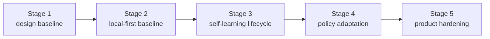

# Roadmap

[English](roadmap.md) | [中文](roadmap.zh-CN.md)

## Scope

This page is the stable roadmap wrapper for the repo. It shows milestone order and current program direction without replacing the live execution control surface.

For live work state, read:

- [../.codex/status.md](../.codex/status.md)
- [../.codex/module-dashboard.md](../.codex/module-dashboard.md)

For detailed queues, read:

- [project workstream roadmap](workstreams/project/roadmap.md)
- [unified-memory-core/development-plan.md](reference/unified-memory-core/development-plan.md)

## Now / Next / Later

| Horizon | Focus | Exit Signal |
| --- | --- | --- |
| Now | keep the current OpenClaw adapter and governance baseline clean while module-view execution continues | stable-fact expansion lands without degrading smoke quality |
| Next | finish the next lifecycle phase for Reflection, Projection, and Registry on top of the already-implemented reflection baseline | promotion / decay / learning-governance surfaces are explicitly named and have validation |
| Later | connect governed learning outputs into consumer policy use and product hardening | policy-input artifacts and independent-product gates are both proven |

## Milestones

| Milestone | Status | Goal | Depends On | Exit Criteria |
| --- | --- | --- | --- | --- |
| [Stage 1: design baseline](reference/unified-memory-core/development-plan.md#stage-1-design-and-documentation-baseline) | completed | freeze product naming, boundaries, and document stack | none | architecture, module boundaries, and testing surfaces are aligned |
| [Stage 2: local-first baseline](reference/unified-memory-core/development-plan.md#stage-2-local-first-implementation-baseline) | completed | ship one governed local-first end-to-end baseline | Stage 1 | core modules, adapters, standalone CLI, and governance all run |
| [Stage 3: self-learning lifecycle baseline](reference/unified-memory-core/development-plan.md#stage-3-self-learning-lifecycle-baseline) | active | turn the already-implemented reflection baseline into an explicit lifecycle with promotion, decay, and learning-specific governance | Stage 2 | promotion / decay expectations and learning-governance rules are explicit and regression-protected |
| [Stage 4: policy adaptation](reference/unified-memory-core/development-plan.md#stage-4-policy-adaptation-and-multi-consumer-use) | later | let governed learning outputs influence consumer behavior | Stage 3 | one reversible policy-adaptation loop is proven |
| [Stage 5: product hardening](reference/unified-memory-core/development-plan.md#stage-5-product-hardening-and-independent-operation) | later | validate split-ready and independent-product operation | Stage 4 | release boundary, reproducibility, and maintenance workflows are stable |

## Milestone Flow

## Risks and Dependencies

- the current roadmap should not drift away from `.codex/status.md` and `.codex/plan.md`
- `todo.md` should remain personal scratch space, not a competing status source
- learning-phase naming is still an open dependency for Reflection, Projection, and Registry work
- smoke and governance surfaces must stay readable while OpenClaw adapter recall quality expands
