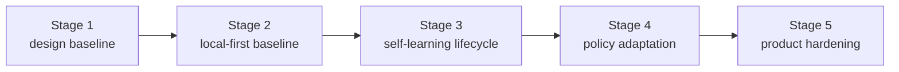

# Roadmap

[English](roadmap.md) | [中文](roadmap.zh-CN.md)

## Scope

This page is the stable roadmap wrapper for the repo. It shows milestone order and current program direction without replacing the live execution control surface.

For live work state, read:

- [../.codex/status.md](../.codex/status.md)
- [../.codex/module-dashboard.md](../.codex/module-dashboard.md)

For detailed queues, read:

- [project workstream roadmap](workstreams/project/roadmap.md)
- [unified-memory-core/development-plan.md](reference/unified-memory-core/development-plan.md)

## Now / Next / Later

| Horizon | Focus | Exit Signal |
| --- | --- | --- |
| Now | separate retrieval, answer-level, and transport evidence; expand the benchmark toward a broader `200` cases; and define a main-path performance plan | the `200`-case coverage plan is explicit, Chinese cases reach `50%` in the next matrix design, transport watch stays separate, and the performance baseline entrypoints are documented |
| Next | use the broader benchmark and the performance baseline to decide the next optimization order before any later runtime API / service-mode discussion | answer-level host-path regressions are explainable, main-path performance baselines are stable, and the broader benchmark stops drifting blindly |
| Later | discuss runtime API / split-ready evolution only from a stable operator baseline | independent-product evidence stays green after Stage 5 closeout |

## Milestones

| Milestone | Status | Goal | Depends On | Exit Criteria |
| --- | --- | --- | --- | --- |
| [Stage 1: design baseline](reference/unified-memory-core/development-plan.md#stage-1-design-and-documentation-baseline) | completed | freeze product naming, boundaries, and document stack | none | architecture, module boundaries, and testing surfaces are aligned |
| [Stage 2: local-first baseline](reference/unified-memory-core/development-plan.md#stage-2-local-first-implementation-baseline) | completed | ship one governed local-first end-to-end baseline | Stage 1 | core modules, adapters, standalone CLI, and governance all run |
| [Stage 3: self-learning lifecycle baseline](reference/unified-memory-core/development-plan.md#stage-3-self-learning-lifecycle-baseline) | completed | turn the already-implemented reflection baseline into an explicit lifecycle with promotion, decay, and learning-specific governance | Stage 2 | promotion / decay expectations, learning governance, OpenClaw validation, and local governed loop are all implemented and regression-protected |
| [Stage 4: policy adaptation](reference/unified-memory-core/development-plan.md#stage-4-policy-adaptation-and-multi-consumer-use) | completed | let governed learning outputs influence consumer behavior | Stage 3 | one reversible policy-adaptation loop is proven |
| [Stage 5: product hardening](reference/unified-memory-core/development-plan.md#stage-5-product-hardening-and-independent-operation) | completed | validate split-ready and independent-product operation | Stage 4 | release boundary, reproducibility, maintenance workflows, and split rehearsal are all CLI-verifiable |

## Milestone Flow

## Risks and Dependencies

- the current roadmap should not drift away from `.codex/status.md` and `.codex/plan.md`
- `todo.md` should remain personal scratch space, not a competing status source
- the next dependency is no longer Stage 5 implementation; it is keeping release-preflight and deployment evidence stable over time
- registry-root cutover policy remains an operator follow-up, not hidden Stage 5 contract work
- Stage 4 and Stage 5 reports must stay readable while any later service-mode discussion remains deferred
- the primary post-Stage-5 work is now evaluation-driven optimization, so the roadmap and `.codex/plan.md` must keep case expansion, A/B comparison, answer-level regression, transport watchlists, and performance planning visible
