# Roadmap

[English](roadmap.md) | [中文](roadmap.zh-CN.md)

## Scope

This page is the stable roadmap wrapper for the repo. It shows milestone order and current program direction without replacing the live execution control surface.

For live work state, read:

- [../.codex/status.md](../.codex/status.md)
- [../.codex/module-dashboard.md](../.codex/module-dashboard.md)

For detailed queues, read:

- [project workstream roadmap](workstreams/project/roadmap.md)
- [unified-memory-core/development-plan.md](reference/unified-memory-core/development-plan.md)

## Current Program Snapshot

This block is here to answer "where did the `200+` case program actually land?" without forcing a jump back to the control surface.

- Program: `execute-200-case-benchmark-and-answer-path-triage`
- Status: `completed`
- Runnable matrix: `392` cases
- Chinese coverage: `211 / 392 = 53.83%`
- Natural Chinese cases: `24` (`12` retrieval + `12` answer-level)
- Retrieval-heavy formal gate: `250 / 250`
- Isolated local answer-level formal gate: `12 / 12` (`6 / 12` zh-bearing inside the formal gate)
- Live answer-level A/B: `100` real cases, current `100 / 100`, legacy `99 / 100`, `1` Memory Core-only win, `0` builtin-only wins, and `0` shared failures
- Natural-Chinese representative retrieval slice: `5 / 5`
- Natural-Chinese representative answer-level slice: `6 / 6`
- Raw transport watchlist: `3 / 8 raw ok`; the rest are `4` `missing_json_payload` failures and `1` `empty_results`
- Main-path perf baseline: retrieval / assembly `16ms`; raw transport `8061ms`; isolated local answer-level `11200ms`
- Interpretation: the `200+` case buildout, natural-Chinese hardening, watchlist classification, perf-baseline refresh, and the first answer-level gate expansion from `6/6` to `12/12` are complete; the builtin-only regression and the shared-fail history cases are now closed, so the next phase is no longer “finish old cleanup” but “turn per-turn context optimization into the explicit mainline”

Supporting evidence:

- [../.codex/status.md](../.codex/status.md)
- [../.codex/plan.md](../.codex/plan.md)
- [generated/openclaw-cli-memory-eval-program-2026-04-14.md](../reports/generated/openclaw-cli-memory-eval-program-2026-04-14.md)
- [generated/openclaw-natural-chinese-watch-and-perf-2026-04-15.md](../reports/generated/openclaw-natural-chinese-watch-and-perf-2026-04-15.md)
- [generated/openclaw-answer-level-gate-expansion-2026-04-15.md](../reports/generated/openclaw-answer-level-gate-expansion-2026-04-15.md)

## Context Minor GC Snapshot

This block tracks how far the `Context Minor GC` mainline has actually landed, including the completed Stage 6 runtime shadow integration and the later Stage 7 / 9 evidence.

- Program alias: `context-minor-gc`
- Stage 6 program: `dialogue-working-set-shadow-runtime`
- Status: `completed / shadow-only`
- Runtime shadow replay: `16 / 16`
- Runtime shadow replay average reduction ratio: `0.4368`
- Runtime answer A/B: baseline `5 / 5`, shadow `5 / 5`
- Runtime answer A/B shadow-only wins: `0`
- Runtime answer A/B average prompt reduction ratio: `0.0114`
- Interpretation: runtime shadow integration is now the durable measurement surface for `Context Minor GC`, but active prompt mutation remains deferred

Supporting evidence:

- [generated/dialogue-working-set-pruning-feasibility-2026-04-16.md](../reports/generated/dialogue-working-set-pruning-feasibility-2026-04-16.md)
- [generated/dialogue-working-set-shadow-replay-2026-04-16.md](../reports/generated/dialogue-working-set-shadow-replay-2026-04-16.md)
- [generated/dialogue-working-set-answer-ab-2026-04-16.md](../reports/generated/dialogue-working-set-answer-ab-2026-04-16.md)
- [generated/dialogue-working-set-adversarial-2026-04-16.md](../reports/generated/dialogue-working-set-adversarial-2026-04-16.md)
- [generated/dialogue-working-set-validation-2026-04-16.md](../reports/generated/dialogue-working-set-validation-2026-04-16.md)
- [generated/dialogue-working-set-runtime-shadow-2026-04-16.md](../reports/generated/dialogue-working-set-runtime-shadow-2026-04-16.md)
- [generated/dialogue-working-set-runtime-answer-ab-2026-04-16.md](../reports/generated/dialogue-working-set-runtime-answer-ab-2026-04-16.md)
- [generated/dialogue-working-set-runtime-shadow-summary-2026-04-16.md](../reports/generated/dialogue-working-set-runtime-shadow-summary-2026-04-16.md)
- [generated/dialogue-working-set-stage6-2026-04-16.md](../reports/generated/dialogue-working-set-stage6-2026-04-16.md)

## Stage 7 / Stage 9 Snapshot

- Stage 7 shadow replay: `15 / 16`
- Stage 7 scorecard: captured `16 / 16`, average raw reduction ratio `0.4191`, average package reduction ratio `0.1151`
- Stage 9 guarded answer A/B: baseline `5 / 5`, shadow `5 / 5`, guarded `5 / 5`
- Stage 9 guarded applied: `2 / 5`
- Stage 9 average guarded prompt reduction ratio: `0.0424`
- OpenClaw gateway live validation: the gateway service is back and a two-turn smoke passes, but `5 / 5` working-set exports still fail on the host runtime seam
- Interpretation: the Stage 7 operator-facing scorecard and the Stage 9 guarded opt-in seam are both landed, but the real OpenClaw live soak now proves the current `Context Minor GC` decision transport is still tied to the host runtime seam; the preferred next path is therefore a plugin-owned memory + context decision overlay rather than direct OpenClaw modification

Supporting evidence:

- [generated/dialogue-working-set-stage7-shadow-2026-04-17.md](../reports/generated/dialogue-working-set-stage7-shadow-2026-04-17.md)
- [generated/dialogue-working-set-scorecard-2026-04-17.md](../reports/generated/dialogue-working-set-scorecard-2026-04-17.md)
- [generated/dialogue-working-set-guarded-answer-ab-2026-04-17.md](../reports/generated/dialogue-working-set-guarded-answer-ab-2026-04-17.md)
- [generated/dialogue-working-set-stage7-stage9-2026-04-17.md](../reports/generated/dialogue-working-set-stage7-stage9-2026-04-17.md)
- [generated/openclaw-gateway-context-optimization-2026-04-17.md](../reports/generated/openclaw-gateway-context-optimization-2026-04-17.md)

## Current Review Verdict

- Completed:
  - Stage 6 `dialogue working-set shadow integration` is landed in runtime and remains `default-off` + shadow-only
  - the shared-fail Chinese history cleanup is closed
  - the official-image Docker hermetic eval path is now reusable
- Planned:
  - make `Context Minor GC / context loading optimization` the first `light and fast` priority instead of putting installation polish first
  - define one unified context-optimization scorecard so `prompt thickness / reduction / retrieval-assembly latency / answer latency / rollback metrics` are judged on one surface
  - then attach the bounded LLM-led context decision contract, operator metrics, rollback boundary, and harder live A/B redesign to that scorecard
  - make “daily sessions should not normally depend on compat / compact, and compat / compact should stay a nightly or background safety net” an explicit milestone goal
- Explicitly not planned right now:
  - no default active prompt mutation
  - no builtin memory behavior changes
  - no continued growth of large hardcoded rule tables to mimic context decisions

## Three User-Facing Promises And Milestone Mapping

| Promise | What Is Already Landed | Current Evidence Surface | Next Milestone |
| --- | --- | --- | --- |
| Light and fast | fact-first assembly, runtime working-set shadow instrumentation, release-preflight, Docker hermetic eval | runtime shadow replay `16 / 16`, average reduction ratio `0.4368`, runtime answer A/B `5 / 5` vs `5 / 5`, ordinary-conversation Docker strict baseline `current=39 / 40`, `legacy=15 / 40`, `UMC-only=24`, `preCaseResetFailed=0` | finish `Context Minor GC / context loading optimization` first by turning context-thickness / reduction / latency into hard gates; keep Docker as the default hermetic A/B surface and move the remaining ordinary-conversation harder misses into targeted follow-up |
| Smart | realtime `memory_intent` ingestion, nightly self-learning, governed promotion / decay, working-set shadow path | ordinary-conversation host-live A/B current `38 / 40`, legacy `21 / 40`, `18` UMC-only wins | move the shadow-first context-decision path toward a bounded guarded narrow user gain and make context optimization feel user-visible |
| Reassuring | add / inspect / audit / repair / replay / rollback, canonical registry root, OpenClaw / Codex adapters | shipped CLI flows and regression-protected verification stack | keep the operator surface readable and replayable while strengthening Codex / multi-instance product evidence |

## Product North Star

> Simple to install, smooth to use, light and fast to run, smart to remember, easy to maintain.

At roadmap level this means:

- `light and fast`
  - adoption cost, default-config complexity, package size, runtime footprint, context thickness, and latency stay inside milestone evaluation
  - this hot-path program is now explicitly named `Context Minor GC`; it should not treat compat / compact as the normal survival mechanism, and continuous context management should keep prompt thickness and latency inside a usable band
- `smart`
  - retrieval, learning, working-set pruning, and budgeted assembly must improve together as one evidence surface
- `reassuring`
  - hermetic / Docker eval, rollback boundaries, operator metrics, and shared registry behavior remain first-class constraints

## Current Gap Review

The roadmap should make the current distance from the north star explicit:

- already relatively strong:
  - `reassuring`
  - the `smart` self-learning backbone
  - `context optimization` as a formal mainline
- currently weakest:
  - `light and fast`: install / bootstrap / verify still asks too much manual setup, and the hermetic ordinary-conversation line still has a residual harder-failure set even after the Docker steady-state closure
  - `smart`: working-set optimization is validated but not yet a default user-visible gain
  - `reassuring`: Codex / multi-instance product evidence still trails OpenClaw

That makes the next priority order explicit:

1. `light and fast / context loading optimization`: make per-turn context thickness, working-set reduction, budgeted assembly, and answer-level latency the mainline
   - this mainline is now explicitly named `Context Minor GC`; the target is not “compact more often”; it is “let long-running daily conversations continue without needing compact as the normal escape hatch”
2. `light and fast / install`: once ordinary-conversation hermetic A/B is closed, shorten install / bootstrap / verify
3. `smart`: keep the bounded guarded smart path narrow and opt-in while making the user-visible gain real
4. `reassuring`: strengthen shared-foundation evidence across OpenClaw and Codex

## Post-Stage-6 Roadmap

Stages 1-6 are complete, but the roadmap cannot stop at “all historical stages are green”. The actual next map is:

| Next Milestone | Status | Why Now | Exit Signal |
| --- | --- | --- | --- |
| Stage 7: context loading optimization closure | `in_progress` | the biggest current product gap is no longer “does the feature exist?” but “is each turn’s context package light enough?”; Stage 6 is still a measurement layer, and this mainline is now externally named `Context Minor GC` | the unified scorecard is fixed and harder replay / Docker / local evidence consistently show a lighter context package without answer-quality damage, and daily long conversations usually no longer need compat / compact as the normal way to keep going |
| Stage 8: ordinary-conversation realtime-write latency closure | `completed` | the Docker ordinary-conversation A/B has been recovered from a blanket timeout wall into a trustworthy strict baseline, while `2/4`-shard `gateway-steady` remains the fast watch lane | the clean Docker path is no longer dominated by large timeout counts and now reports `39 / 40 vs 15 / 40` with `preCaseResetFailed = 0` |
| Stage 9: guarded smart-path promotion | `in_progress` | context loading optimization is still not a user gain if it stays shadow-only forever | a bounded guarded experiment surface has an explicit rollback boundary, operator metrics, and promotion gate, while compat / compact remains a background fallback instead of the default daily path; the preferred next step is to pull the decision transport back into the plugin before deciding whether any host-level fallback is still needed |
| Stage 10: adoption simplification and shared-foundation proof | `planned` | install / bootstrap is still too manual, and Codex / multi-instance product evidence still lags | adoption is shorter and clearer, and the shared-foundation story is proven beyond architecture diagrams |

## Now / Next / Later

| Horizon | Focus | Exit Signal |
| --- | --- | --- |
| Now | keep closing `Stage 7 / Context Minor GC` while holding `Stage 9` at `default-off` / opt-in only: answer “how do we make every turn lighter and faster without hurting quality?” | the unified scorecard, guarded seam, rollback boundary, and operator summary are all landed, but the OpenClaw gateway live soak proves the current decision transport is still blocked by the host runtime seam |
| Next | first implement the plugin-owned `memory + context decision overlay`, so the `Context Minor GC` working-set decision transport no longer depends on the host `subagent` seam, then continue the `Stage 7` closeout while keeping `Stage 9` narrow; ordinary-conversation Docker steady-state remains the default hermetic A/B baseline | the unified scorecard, guarded seam, rollback boundary, and operator summary are stable, and the remaining blocker is narrowed to the plugin-owned decision runner plus targeted Docker follow-up |
| Later | after Stage 7 is stable, decide whether Stage 9 can widen and whether Stage 10 adoption/shared-foundation closure should start | the smart-path promotion gate, rollback boundary, and shared-foundation proof are operator-ready |

## Current Execution Focus

The current roadmap horizon also maps to the concrete next execution work:

1. keep Stage 6 runtime shadow integration `default-off` and shadow-only
2. turn durable-source slimming, working-set pruning, harder live A/B, and the ordinary-conversation Docker rerun into one unified `context optimization scorecard`
3. continue treating active prompt mutation as explicitly out of the default path until rollback boundaries and operator metrics are clear
4. use the runtime export artifacts and the Docker hermetic eval path as the new replayable operator evidence surface
5. do not move install simplification back ahead of context loading optimization while Stage 7 is still open

When resuming work:

- use `101` in [reference/unified-memory-core/development-plan.md](reference/unified-memory-core/development-plan.md) for the current execution order
- use [../.codex/plan.md](../.codex/plan.md) and [../.codex/status.md](../.codex/status.md) for the live state

## Milestones

| Milestone | Status | Goal | Depends On | Exit Criteria |
| --- | --- | --- | --- | --- |
| [Stage 1: design baseline](reference/unified-memory-core/development-plan.md#stage-1-design-and-documentation-baseline) | completed | freeze product naming, boundaries, and document stack | none | architecture, module boundaries, and testing surfaces are aligned |
| [Stage 2: local-first baseline](reference/unified-memory-core/development-plan.md#stage-2-local-first-implementation-baseline) | completed | ship one governed local-first end-to-end baseline | Stage 1 | core modules, adapters, standalone CLI, and governance all run |
| [Stage 3: self-learning lifecycle baseline](reference/unified-memory-core/development-plan.md#stage-3-self-learning-lifecycle-baseline) | completed | turn the already-implemented reflection baseline into an explicit lifecycle with promotion, decay, and learning-specific governance | Stage 2 | promotion / decay expectations, learning governance, OpenClaw validation, and local governed loop are all implemented and regression-protected |
| [Stage 4: policy adaptation](reference/unified-memory-core/development-plan.md#stage-4-policy-adaptation-and-multi-consumer-use) | completed | let governed learning outputs influence consumer behavior | Stage 3 | one reversible policy-adaptation loop is proven |
| [Stage 5: product hardening](reference/unified-memory-core/development-plan.md#stage-5-product-hardening-and-independent-operation) | completed | validate split-ready and independent-product operation | Stage 4 | release boundary, reproducibility, maintenance workflows, and split rehearsal are all CLI-verifiable |
| [Stage 6: dialogue working-set shadow integration](reference/unified-memory-core/development-plan.md#stage-6-dialogue-working-set-shadow-integration) | completed | validate and instrument hot-session working-set pruning in runtime shadow mode before any active prompt cutover | Stage 5 | runtime shadow telemetry is now landed default-off, replayable exports exist, and answer-level replay stays green enough to keep the feature shadow-only |
| [Stage 7: context loading optimization closure](reference/unified-memory-core/development-plan.md#stage-7-context-loading-optimization-closure) | in_progress | make per-turn context loading optimization a formal mainline and formal gate instead of leaving it at shadow findings | Stage 6 | the context-optimization scorecard is stable, harder replay / Docker / local evidence align, and rollout/rollback boundaries are clear |
| [Stage 8: ordinary-conversation realtime-write latency closure](reference/unified-memory-core/development-plan.md#stage-8-ordinary-conversation-realtime-write-latency-closure) | completed | recover the clean Docker write-side answer path into a trustworthy ordinary-conversation strict A/B surface | Stage 7 | the ordinary-conversation hermetic strict baseline now reports `39 / 40 vs 15 / 40` with `preCaseResetFailed = 0` |
| [Stage 9: guarded smart-path promotion](reference/unified-memory-core/development-plan.md#stage-9-guarded-smart-path-promotion) | in_progress | start turning context optimization into real user-facing value without breaking rollback safety | Stage 8 | the bounded opt-in path has a clear promotion gate and an operable rollback path |
| [Stage 10: adoption simplification and shared-foundation proof](reference/unified-memory-core/development-plan.md#stage-10-adoption-simplification-and-shared-foundation-proof) | planned | lift adoption experience and cross-host product proof to the same level as core capability | Stage 9 | install / bootstrap / verify is shorter, and Codex / multi-instance reuse is more concretely proven |

## Milestone Flow

```mermaid
flowchart LR
    A["Stage 1<br/>design baseline"] --> B["Stage 2<br/>local-first baseline"]
    B --> C["Stage 3<br/>self-learning lifecycle"]
    C --> D["Stage 4<br/>policy adaptation"]
    D --> E["Stage 5<br/>product hardening"]
    E --> F["Stage 6<br/>working-set shadow integration"]
    F --> G["Stage 7<br/>context loading optimization"]
    G --> H["Stage 8<br/>realtime-write latency closure"]
    H --> I["Stage 9<br/>guarded smart-path promotion"]
    I --> J["Stage 10<br/>adoption simplification + shared-foundation proof"]
```

## Risks and Dependencies

- the current roadmap should not drift away from `.codex/status.md` and `.codex/plan.md`
- `todo.md` should remain personal scratch space, not a competing status source
- the next dependency is no longer Stage 5 implementation; it is keeping release-preflight and deployment evidence stable over time
- the first mainline is no longer Stage 5 or Stage 6 closeout; it is Stage 7 context loading optimization
- registry-root cutover policy remains an operator follow-up, not hidden Stage 5 contract work
- Stage 4 and Stage 5 reports must stay readable while any later service-mode discussion remains deferred
- the primary post-Stage-5 work is now evaluation-driven optimization, so the roadmap and `.codex/plan.md` must keep case expansion, A/B comparison, answer-level regression, transport watchlists, and performance planning visible
- active prompt mutation remains explicitly deferred until runtime shadow telemetry proves the working-set path on real sessions
- if the next round adds context-decision experiments, it should prefer a bounded LLM-led contract instead of growing a wider hardcoded rule table
- install / bootstrap / verify simplification still matters, but it is now explicitly behind context loading optimization and realtime-write latency closure in the roadmap order
- real OpenClaw live soak now proves the remaining blocker is mainly not the algorithm but the current decision transport still depending on the host subagent / request-scope seam
- this retrospective also hardens one process lesson: integration-point preflight should have happened at proposal time; call order, input/output surface, and runtime-helper constraints should not wait for live soak
