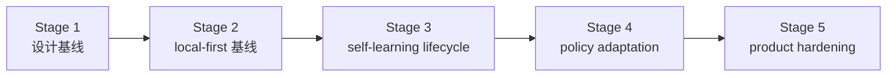

# 路线图

[English](roadmap.md) | [中文](roadmap.zh-CN.md)

## 范围

这份文档是仓库的稳定路线图包装页。它负责说明里程碑顺序和当前项目方向，但不替代实时执行控制面。

实时状态看这里：

- [../.codex/status.md](../.codex/status.md)
- [../.codex/module-dashboard.md](../.codex/module-dashboard.md)

详细执行队列看这里：

- [项目 workstream roadmap](workstreams/project/roadmap.zh-CN.md)
- [unified-memory-core/development-plan.zh-CN.md](reference/unified-memory-core/development-plan.zh-CN.md)

## 当前 / 下一步 / 更后面

| 时间层级 | 重点 | 退出信号 |
| --- | --- | --- |
| 当前 | 把 retrieval、answer-level、transport 三条证据面分开，规划更全面的 `200` case benchmark，并补主链路性能专项计划 | `200` case coverage 规划明确、下一轮矩阵中文案例占比达到 `50%`、transport watchlist 保持独立、性能 baseline 入口已文档化 |
| 下一步 | 用更全面的 benchmark 和性能 baseline 决定下一轮优化顺序，再讨论是否真的打开 runtime API / service-mode | answer-level host-path 回退已可解释、主链路性能 baseline 稳定、benchmark 不再盲目漂移 |
| 更后面 | 只在 operator baseline 稳定后，再讨论 runtime API / split-ready 演进 | Stage 5 收口后的独立产品证据继续保持绿色 |

## 里程碑

| 里程碑 | 状态 | 目标 | 依赖 | 退出条件 |
| --- | --- | --- | --- | --- |
| [Stage 1：设计基线](reference/unified-memory-core/development-plan.zh-CN.md#stage-1-设计与文档基线) | completed | 冻结产品命名、边界和文档栈 | 无 | 架构、模块边界、测试面已经对齐 |
| [Stage 2：local-first 基线](reference/unified-memory-core/development-plan.zh-CN.md#stage-2-local-first-实现基线) | completed | 跑通一条可治理的 local-first 端到端主链 | Stage 1 | 核心模块、适配器、standalone CLI、governance 都可运行 |
| [Stage 3：self-learning lifecycle 基线](reference/unified-memory-core/development-plan.zh-CN.md#stage-3-self-learning-生命周期基线) | completed | 把已经实现的 reflection baseline 收成一条显式生命周期，并补齐 promotion / decay / 学习专项治理 | Stage 2 | promotion / decay、learning governance、OpenClaw validation 和本地 governed loop 都已落地并有回归保护 |
| [Stage 4：policy adaptation](reference/unified-memory-core/development-plan.zh-CN.md#stage-4-policy-adaptation-与多消费者使用) | completed | 让治理后的学习产物影响消费者行为 | Stage 3 | 一条可回退的 policy-adaptation 闭环被证明 |
| [Stage 5：product hardening](reference/unified-memory-core/development-plan.zh-CN.md#stage-5-产品加固与独立运行) | completed | 验证独立产品运行和 split-ready 边界 | Stage 4 | release boundary、可复现性、维护工作流和 split rehearsal 都已经 CLI 可验证 |

## 里程碑流转

## 风险与依赖

- 路线图不能和 `.codex/status.md`、`.codex/plan.md` 漂移
- `todo.md` 应继续只是个人速记，不应成为并行状态源
- 当前的下一依赖不再是 Stage 5 实现，而是让 release-preflight 与 deployment 证据面长期保持稳定
- registry-root cutover policy 仍是 operator follow-up，但不再算隐藏的 Stage 5 contract 工作
- 只要后续 service-mode 讨论继续延后，Stage 4 和 Stage 5 的报告都必须保持可读
- 新的主要工程主线已经转成“评测驱动优化”，所以 roadmap 和 `.codex/plan.md` 必须明确记录案例扩充、A/B 对照、answer-level 回退、transport watchlist 和性能规划，不要再只停留在 Stage 5 收口表述
