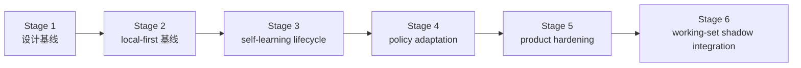

# 路线图

[English](roadmap.md) | [中文](roadmap.zh-CN.md)

## 范围

这份文档是仓库的稳定路线图包装页。它负责说明里程碑顺序和当前项目方向，但不替代实时执行控制面。

实时状态看这里：

- [../.codex/status.md](../.codex/status.md)
- [../.codex/module-dashboard.md](../.codex/module-dashboard.md)

详细执行队列看这里：

- [项目 workstream roadmap](workstreams/project/roadmap.zh-CN.md)
- [unified-memory-core/development-plan.zh-CN.md](reference/unified-memory-core/development-plan.zh-CN.md)

## 当前专项结果快照

这块用于直接回答“`200+` case 专项现在做到哪了”，避免只看主 roadmap 时还要再跳回 control surface。

- 专项名称：`execute-200-case-benchmark-and-answer-path-triage`
- 当前状态：`completed`
- runnable matrix：`392` cases
- 中文占比：`211 / 392 = 53.83%`
- 自然中文案例：`24`（`12` retrieval + `12` answer-level）
- retrieval-heavy formal gate：`250 / 250`
- isolated local answer-level formal gate：`12 / 12`（formal gate 内中文样本 `6 / 12`）
- live answer-level A/B：`100` 个真实案例，current `100 / 100`、legacy `99 / 100`、`1` 个只有 Memory Core 能答对、`0` 个只有内置能答对、`0` 个两边都失败
- 自然中文代表性 retrieval slice：`5 / 5`
- 自然中文代表性 answer-level slice：`6 / 6`
- raw transport watchlist：`3 / 8 raw ok`；其余为 `4` 条 `missing_json_payload` 和 `1` 条 `empty_results`
- main-path perf baseline：retrieval / assembly `16ms`；raw transport `8061ms`；isolated local answer-level `11200ms`
- 当前结论：`200+` case 建设、自然中文补强、transport watchlist failure-class 化、perf baseline 刷新，以及 answer-level formal gate 从 `6/6` 扩到 `12/12` 都已收口；builtin-only regression 与 shared-fail history cases 都已经被移除，下一步不再是补历史尾项，而是把“逐轮 context 优化”收成明确主线，再争取把更多 harder cases 变成 Memory Core 独占胜场

对应证据：

- [../.codex/status.md](../.codex/status.md)
- [../.codex/plan.md](../.codex/plan.md)
- [generated/openclaw-cli-memory-eval-program-2026-04-14.md](../reports/generated/openclaw-cli-memory-eval-program-2026-04-14.md)
- [generated/openclaw-natural-chinese-watch-and-perf-2026-04-15.md](../reports/generated/openclaw-natural-chinese-watch-and-perf-2026-04-15.md)
- [generated/openclaw-answer-level-gate-expansion-2026-04-15.md](../reports/generated/openclaw-answer-level-gate-expansion-2026-04-15.md)

## Dialogue Working-Set Runtime 快照

这块现在记录的是已经完成的 Stage 6 runtime shadow integration。

- 专项名称：`dialogue-working-set-shadow-runtime`
- 当前状态：`completed / shadow-only`
- runtime shadow replay：`16 / 16`
- runtime shadow replay average reduction ratio：`0.4368`
- runtime answer A/B：baseline `5 / 5`，shadow `5 / 5`
- runtime answer A/B shadow-only wins：`0`
- runtime answer A/B average prompt reduction ratio：`0.0114`
- 当前解释：runtime shadow integration 已经成为新的测量面，但 active prompt mutation 继续显式延后

对应证据：

- [generated/dialogue-working-set-pruning-feasibility-2026-04-16.md](../reports/generated/dialogue-working-set-pruning-feasibility-2026-04-16.md)
- [generated/dialogue-working-set-shadow-replay-2026-04-16.md](../reports/generated/dialogue-working-set-shadow-replay-2026-04-16.md)
- [generated/dialogue-working-set-answer-ab-2026-04-16.md](../reports/generated/dialogue-working-set-answer-ab-2026-04-16.md)
- [generated/dialogue-working-set-adversarial-2026-04-16.md](../reports/generated/dialogue-working-set-adversarial-2026-04-16.md)
- [generated/dialogue-working-set-validation-2026-04-16.md](../reports/generated/dialogue-working-set-validation-2026-04-16.md)
- [generated/dialogue-working-set-runtime-shadow-2026-04-16.md](../reports/generated/dialogue-working-set-runtime-shadow-2026-04-16.md)
- [generated/dialogue-working-set-runtime-answer-ab-2026-04-16.md](../reports/generated/dialogue-working-set-runtime-answer-ab-2026-04-16.md)
- [generated/dialogue-working-set-runtime-shadow-summary-2026-04-16.md](../reports/generated/dialogue-working-set-runtime-shadow-summary-2026-04-16.md)
- [generated/dialogue-working-set-stage6-2026-04-16.md](../reports/generated/dialogue-working-set-stage6-2026-04-16.md)

## 当前评审结论

- 已完成：
  - Stage 6 `dialogue working-set shadow integration` 已正式落到 runtime，且继续保持 `default-off`、shadow-only
  - shared-fail 的中文 history cleanup 已收口
  - 官方镜像驱动的 Docker hermetic eval 已可真实复用
- 计划做：
  - 先做 docs-first review，把 roadmap、development plan、架构文档和 `.codex/*` 统一到“逐轮 context 优化”的下一轮口径
  - 先定 bounded LLM-led context decision contract、operator metrics 和 rollback boundary
  - 再做更偏 `cross-source`、`conflict`、`multi-step history` 与高信息密度自然中文的 harder live A/B 设计
- 当前明确不做：
  - 不打开默认 active prompt mutation
  - 不改 builtin memory 行为
  - 不靠继续增加硬编码规则表来模拟 topic / context 决策

## 主要卖点与里程碑映射

| 产品卖点 | 当前已落地能力 | 当前证据面 | 下一里程碑 |
| --- | --- | --- | --- |
| 按需加载 context | fact-first assembly、durable-source slimming 设计、runtime working-set shadow instrumentation | runtime shadow replay `16 / 16`、average reduction ratio `0.4368`、runtime answer A/B `5 / 5` vs `5 / 5` | 把它进一步收口成更难场景里稳定的“对比内置的 context thickness / latency”门禁 |
| realtime + nightly self-learning | realtime `memory_intent` ingestion、默认开启的 nightly self-learning、governed promotion / decay | ordinary-conversation host-live A/B：current `38 / 40`、legacy `21 / 40`、`18` 条 UMC-only wins | 清掉 timeout-heavy 盲区，并把更多 harder case 变成清晰的 UMC-only wins |
| CLI-governed memory operations | add / inspect / audit / repair / replay / export / migrate surfaces、release-preflight | 已发版级 CLI 流程与回归保护验证栈 | 持续保持 operator surface 可读、可 replay、可发版 |
| 共享记忆底座 | shared contracts、canonical registry root、OpenClaw adapter、Codex adapter | 稳定的架构边界与跨宿主消费路径 | 在 context 优化演进时继续守住 shared-core contract 不漂移 |

这些里程碑还要同时满足六条产品品质约束：

- `简单`
  - 安装和首次上手必须继续保持低门槛，不能因为能力增长就把接入流程做复杂
- `好用`
  - 新能力应该减少 operator 摩擦，而不是继续增加配置和 review 负担
- `轻量`
  - 新的 runtime 逻辑要真的降低 prompt thickness，安装包和运行负担也要一起受控
- `够快`
  - latency 和日常操作速度必须一起纳入目标，不能为了更复杂的 decision surface 牺牲明显体感
- `聪明`
  - 下一轮优化要体现为“更会记、更会忘、更会少给”，而不是只多出更多规则和更多调用
- `易维护`
  - rollout、rollback、replay、audit 这些面必须变得更好操作，而不是更难

## 产品北极星

> 装得简单，用得顺手，跑得轻快，记得聪明，维护省心。

roadmap 层的含义是：

- `装得简单`
  - 接入复杂度和默认配置复杂度都要被当成正式目标
- `用得顺手`
  - 下一轮工作不能只做“更强”，还要做“默认体验更自然”
- `跑得轻快`
  - context thickness、latency、包体和运行负担都要进里程碑评估
- `记得聪明`
  - retrieval、learning、working-set pruning、budgeted assembly 的协同质量，必须成为下一轮主证据面
- `维护省心`
  - hermetic / Docker eval、rollback boundary、operator metrics 继续是一等约束

## 当前缺口评估

当前离北极星最近和最远的地方，需要在 roadmap 上写清楚：

- 已经比较稳：
  - `维护省心`
  - `self-learning` 主干
  - `context 优化` 已经成为正式主线
- 当前最薄弱：
  - `简单`：安装 / bootstrap / verify 仍然偏手工
  - `够快`：hermetic 普通对话写记忆路径仍然明显受 timeout 影响
  - `聪明`：working-set 优化还没有变成默认用户收益
  - `轻量`：包体、启动、默认运行负担还没被收成硬预算
  - `共享底座`：Codex / 多实例的产品证据仍弱于 OpenClaw

这意味着下一轮 priority order 应该是：

1. install / bootstrap / verify 简化
2. hermetic timeout / latency 收敛
3. shadow-only 到 guarded opt-in 的聪明路径
4. 轻量预算化
5. 共享底座证据补强

## 当前 / 下一步 / 更后面

| 时间层级 | 重点 | 退出信号 |
| --- | --- | --- |
| 当前 | 以北极星缺口为入口，开始做 gap-driven 收敛：先简化接入，再补速度，再推进聪明路径 | roadmap、development plan、架构文档和 `.codex/*` 已从 docs-first review 切到同一套 gap-driven 优先级 |
| 下一步 | 先定义 bounded LLM-led context decision contract、operator metrics 与 rollback boundary，并把 install / timeout / lightweight 变成正式门禁 | 下一轮 harder case 设计已经显式附带 prompt-thickness / reduction / latency / rollback 指标，同时 install / latency / budget 也有明确阈值 |
| 更后面 | 只有在更长时间的 real-session soak 后，才讨论任何 guarded active-path experiment | shadow telemetry 长期为绿，且 active-path experiment 的 promotion / rollback gate 已可操作 |

## 当前执行重点

主 roadmap 里的“当前”不只是方向，也对应接下来要执行的具体工作：

1. 继续保持 Stage 6 runtime shadow integration 为 `default-off` 和 shadow-only。
2. 先完成 docs-first review，把 durable-source slimming、working-set pruning、harder live A/B 三条线收成一个明确恢复点。
3. 继续把 active prompt mutation 明确排除在默认路径外，直到 rollback boundary 与 operator metrics 足够清楚。
4. 把 runtime export artifacts 和 Docker hermetic eval 一起当成新的 replayable operator evidence surface。

恢复执行时：

- 主顺序看 [reference/unified-memory-core/development-plan.zh-CN.md](reference/unified-memory-core/development-plan.zh-CN.md) 的 `92`
- 实时执行状态看 [../.codex/plan.md](../.codex/plan.md) 和 [../.codex/status.md](../.codex/status.md)

## 里程碑

| 里程碑 | 状态 | 目标 | 依赖 | 退出条件 |
| --- | --- | --- | --- | --- |
| [Stage 1：设计基线](reference/unified-memory-core/development-plan.zh-CN.md#stage-1-设计与文档基线) | completed | 冻结产品命名、边界和文档栈 | 无 | 架构、模块边界、测试面已经对齐 |
| [Stage 2：local-first 基线](reference/unified-memory-core/development-plan.zh-CN.md#stage-2-local-first-实现基线) | completed | 跑通一条可治理的 local-first 端到端主链 | Stage 1 | 核心模块、适配器、standalone CLI、governance 都可运行 |
| [Stage 3：self-learning lifecycle 基线](reference/unified-memory-core/development-plan.zh-CN.md#stage-3-self-learning-生命周期基线) | completed | 把已经实现的 reflection baseline 收成一条显式生命周期，并补齐 promotion / decay / 学习专项治理 | Stage 2 | promotion / decay、learning governance、OpenClaw validation 和本地 governed loop 都已落地并有回归保护 |
| [Stage 4：policy adaptation](reference/unified-memory-core/development-plan.zh-CN.md#stage-4-policy-adaptation-与多消费者使用) | completed | 让治理后的学习产物影响消费者行为 | Stage 3 | 一条可回退的 policy-adaptation 闭环被证明 |
| [Stage 5：product hardening](reference/unified-memory-core/development-plan.zh-CN.md#stage-5-产品加固与独立运行) | completed | 验证独立产品运行和 split-ready 边界 | Stage 4 | release boundary、可复现性、维护工作流和 split rehearsal 都已经 CLI 可验证 |
| [Stage 6：dialogue working-set shadow integration](reference/unified-memory-core/development-plan.zh-CN.md#stage-6-dialogue-working-set-shadow-integration) | completed | 在任何 active prompt cutover 之前，先用 runtime shadow mode 验证热会话 working-set pruning | Stage 5 | runtime shadow telemetry 已经 default-off 落地、replayable exports 已存在，且 answer-level replay 继续足够绿色，支持保持 shadow-only |

## 里程碑流转

## 风险与依赖

- 路线图不能和 `.codex/status.md`、`.codex/plan.md` 漂移
- `todo.md` 应继续只是个人速记，不应成为并行状态源
- 当前的下一依赖不再是 Stage 5 实现，而是让 release-preflight 与 deployment 证据面长期保持稳定
- registry-root cutover policy 仍是 operator follow-up，但不再算隐藏的 Stage 5 contract 工作
- 只要后续 service-mode 讨论继续延后，Stage 4 和 Stage 5 的报告都必须保持可读
- 新的主要工程主线已经转成“评测驱动优化”，所以 roadmap 和 `.codex/plan.md` 必须明确记录案例扩充、A/B 对照、answer-level 回退、transport watchlist 和性能规划，不要再只停留在 Stage 5 收口表述
- active prompt mutation 继续显式延后，直到 runtime shadow telemetry 在真实 session 上长期为绿
- 下一轮如果要做 context decision experiment，应优先走 bounded LLM-led contract，而不是继续扩展越来越大的硬编码规则表
