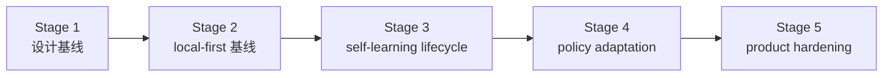

# 路线图

[English](roadmap.md) | [中文](roadmap.zh-CN.md)

## 范围

这份文档是仓库的稳定路线图包装页。它负责说明里程碑顺序和当前项目方向，但不替代实时执行控制面。

实时状态看这里：

- [../.codex/status.md](../.codex/status.md)
- [../.codex/module-dashboard.md](../.codex/module-dashboard.md)

详细执行队列看这里：

- [../project-roadmap.md](workstreams/project/roadmap.md)
- [unified-memory-core/development-plan.md](reference/unified-memory-core/development-plan.md)

## 当前 / 下一步 / 更后面

| 时间层级 | 重点 | 退出信号 |
| --- | --- | --- |
| 当前 | 在模块视角下继续推进 OpenClaw 适配器和治理基线，保持质量稳定 | 稳定事实扩面落地，同时 smoke 质量不退化 |
| 下一步 | 在已经实现的 reflection baseline 之上，完成 Reflection、Projection、Registry 的下一段生命周期 phase | promotion / decay / learning-governance 的边界被明确命名，并且有验证面 |
| 更后面 | 把治理后的学习产物接入 consumer policy use，并推进产品硬化 | policy-input artifacts 与独立产品门禁都被证明可行 |

## 里程碑

| 里程碑 | 状态 | 目标 | 依赖 | 退出条件 |
| --- | --- | --- | --- | --- |
| Stage 1：设计基线 | completed | 冻结产品命名、边界和文档栈 | 无 | 架构、模块边界、测试面已经对齐 |
| Stage 2：local-first 基线 | completed | 跑通一条可治理的 local-first 端到端主链 | Stage 1 | 核心模块、适配器、standalone CLI、governance 都可运行 |
| Stage 3：self-learning lifecycle 基线 | active | 把已经实现的 reflection baseline 收成一条显式的生命周期，补齐 promotion、decay 和学习专项治理 | Stage 2 | promotion / decay 预期与 learning-governance 规则清楚，并且有回归保护 |
| Stage 4：policy adaptation | later | 让治理后的学习产物影响消费者行为 | Stage 3 | 一条可回退的 policy-adaptation 闭环被证明 |
| Stage 5：product hardening | later | 验证独立产品运行和 split-ready 边界 | Stage 4 | release boundary、可复现性、维护工作流趋于稳定 |

## 里程碑流转

## 风险与依赖

- 路线图不能和 `.codex/status.md`、`.codex/plan.md` 漂移
- `todo.md` 应继续只是个人速记，不应成为并行状态源
- Reflection、Projection、Registry 的下一学习 phase 仍然依赖命名和范围收口
- 在继续扩 OpenClaw 适配器 recall 能力时，smoke 与 governance 的输出必须保持可读
